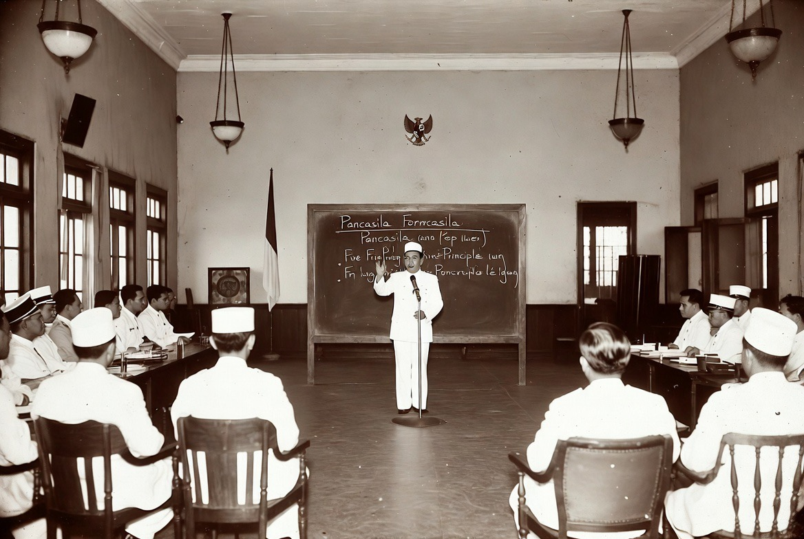

# 1 Juni 1945 & Hari Lahir Pancasila: Ketika Indonesia Mencari Jiwa Sebelum Mencari Negara

*Ilustrasi (pic: Grok AI).*

  
***Negara tanpa jiwa hanya akan menjadi kumpulan gedung dan bendera. Sedangkan bangsa yang memiliki jiwa akan tetap berdiri bahkan ketika diterpa badai sejarah***
  

Hari Lahir Pancasila yang diperingati setiap 1 Juni bukan sekadar perayaan pidato bersejarah. 

Ia menandai momen ketika bangsa Indonesia yang bahkan belum merdeka mulai merumuskan pertanyaan paling mendasar dalam sejarah politik: “Kita ingin menjadi bangsa seperti apa?” 

Dalam sidang BPUPKI pada 1 Juni 1945, Soekarno memperkenalkan konsep Pancasila sebagai dasar filosofis negara Indonesia. Menariknya, Pancasila lahir bukan dari keseragaman, melainkan dari perbedaan yang berhasil dikelola menjadi kesepakatan bersama. 

Tulisan ini membahas makna historis, filosofis, dan relevansi Pancasila di tengah tantangan abad ke-21.

## Sebelum Negara, Ada Gagasan

Banyak negara lahir karena:
perang,
revolusi,
penaklukan,
Indonesia unik.

Sebelum bendera merah putih berkibar,
para pendiri bangsa justru sibuk memikirkan:
“Apa fondasi moral negara yang akan kita bangun?”

Pertanyaan ini luar biasa penting.
Karena negara dapat dibangun dengan senjata. Tetapi bangsa hanya dapat dibangun dengan gagasan.

## 1 Juni 1945: Pidato yang Mengubah Sejarah

Dalam sidang BPUPKI, Soekarno mengusulkan lima prinsip:
Kebangsaan Indonesia,
Internasionalisme atau Perikemanusiaan,
Mufakat atau Demokrasi,
Kesejahteraan Sosial,
Ketuhanan yang Berkebudayaan.

Lima prinsip itu kemudian diberi nama Pancasila, berasal dari bahasa Sanskerta:

Panca = lima

Sila = prinsip atau dasar.

Yang menarik, Soekarno tidak menawarkan Indonesia sebagai:
negara agama,
negara suku,
negara ras.

Melainkan negara yang mencoba menampung semuanya.

## Eksperimen Politik yang Sangat Berani

Bayangkan Indonesia tahun 1945. Terdiri dari:
ratusan kelompok etnis,
ratusan bahasa,
berbagai agama,
ribuan pulau.

Secara teori politik, kondisi seperti itu justru lebih mudah pecah. Namun para pendiri bangsa memilih jalan berbeda.

Mereka tidak bertanya: “Siapa yang harus menang?” Melainkan: “Bagaimana semua bisa hidup bersama?”

Dan dari sinilah lahir semangat kompromi kebangsaan.

## Pancasila sebagai Jalan Tengah

Secara filosofis, Pancasila adalah upaya mencari keseimbangan antara:

| Ekstrem A | Pancasila | Ekstrem B |
|--------|--------|--------|
| Individualisme mutlak | Keseimbangan hak dan kewajiban | Kolektivisme mutlak  |
| Sekularisme total  | Ketuhanan Yang Maha Esa | Negara agama  |
| Kapitalisme liar | Keadilan sosial | Sosialisme totaliter |
| Mayoritarianisme | Musyawarah | Otoritarianisme |

Karena itu banyak ilmuwan politik menyebut Pancasila sebagai filosofi jalan tengah Indonesia.

## Mengapa Pancasila Bertahan?

Uni Soviet runtuh. Banyak ideologi abad ke-20 tumbang. Namun Pancasila tetap bertahan.

Mengapa?

Karena ia tidak terlalu kaku. Pancasila bukan buku petunjuk teknis. Ia lebih mirip kompas. Kompas tidak memberi tahu setiap langkah. Tetapi memberi tahu arah.

## Tantangan Pancasila di Era Digital

Abad ke-21 membawa tantangan baru: 

Polarisasi Media Sosial.

Algoritma sering memperkuat kemarahan.
Padahal sila keempat berbicara tentang:
musyawarah,
kebijaksanaan,
dialog,

Globalisasi

Anak muda Indonesia kini hidup di antara:
budaya lokal,
budaya global.

Pancasila ditantang untuk tetap relevan tanpa menjadi museum sejarah.

Politik Identitas

Ketika identitas agama, etnis, atau kelompok dipakai sebagai senjata politik, semangat persatuan menghadapi ujian berat.

## Paradoks Besar Indonesia

Indonesia adalah negara yang sangat beragam. Secara teori Indonesia seharusnya sulit bertahan.

Namun faktanya, Indonesia menjadi salah satu negara terbesar dan paling stabil di dunia.

Ini menunjukkan sesuatu yang menarik.
Kadang kekuatan sebuah bangsa bukan berasal dari kesamaan. Melainkan dari kesediaan menerima perbedaan.

## Makna Hari Lahir Pancasila Hari Ini

Hari Lahir Pancasila bukan sekadar mengenang pidato Soekarno. Ia adalah pengingat bahwa:
kemerdekaan tidak datang dari kebencian
bangsa tidak dibangun oleh keseragaman
perbedaan tidak harus berakhir menjadi permusuhan
Pancasila lahir karena para pendiri bangsa memahami satu hal, Indonesia terlalu besar untuk dimiliki satu kelompok saja.

Pancasila bukan hanya dokumen sejarah.
Ia adalah kontrak moral yang memungkinkan lebih dari 280 juta manusia hidup dalam satu rumah besar bernama Indonesia.

Di tengah dunia yang semakin terpolarisasi oleh:
agama,
ideologi,
geopolitik,
media sosial,
pesan 1 Juni 1945 tetap relevan:

Persatuan tidak lahir ketika semua orang sama. Persatuan lahir ketika perbedaan dianggap cukup berharga untuk dipertahankan bersama.

Pada 1 Juni 1945, Indonesia belum memiliki negara.
Belum memiliki presiden.
Belum memiliki tentara nasional.
Belum memiliki kementerian.

Tetapi para pendiri bangsa sudah mencari sesuatu yang lebih penting daripada semua itu yaitu jiwa.

Karena mereka tahu, negara tanpa jiwa hanya akan menjadi kumpulan gedung dan bendera. Sedangkan bangsa yang memiliki jiwa akan tetap berdiri bahkan ketika diterpa badai sejarah. 

  
**Referensi**

Soekarno. (1945). Lahirnya Pancasila: Pidato 1 Juni 1945 dalam Sidang BPUPKI.

Badan Pembinaan Ideologi Pancasila. (2025). Sejarah Hari Lahir Pancasila.

Kaelan. (2013). Pendidikan Pancasila. Yogyakarta: Paradigma.

Latif, Y. (2011). Negara Paripurna: Historisitas, Rasionalitas, dan Aktualitas Pancasila. Jakarta: Gramedia.

Majelis Permusyawaratan Rakyat Republik Indonesia. (2024). Empat Pilar Kebangsaan. 
