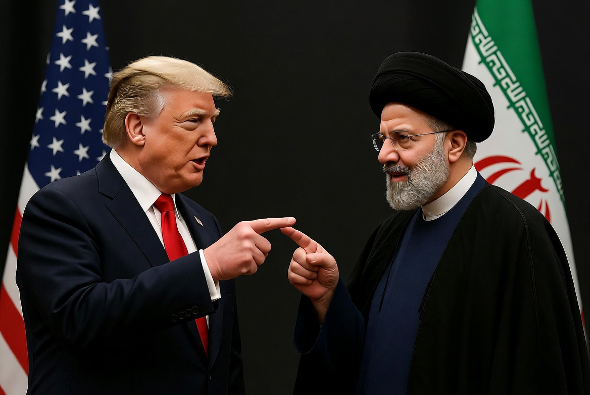

# 72 Jam Pembuka Topeng Kekuasaan: Trump, Iran, Saudi & Ketakutan Perang yang Tidak Bisa Dikendalikan 

*Ilustrasi ketegangan AS-Iran (pic: Grok AI).*

  
***Inti paling jujur dari geopolitik modern, semua negara berbicara tentang perdamaian sambil tetap menjaga jari di tombol perang***
  

Jika laporan-laporan terbaru benar, maka dunia baru saja menyaksikan sesuatu yang sangat langka, negara-negara Teluk berhasil membuat Washington menginjak rem perang.

Dan itu menarik sekali. Karena selama puluhan tahun, narasi klasik Timur Tengah biasanya:
Amerika memerintah,
Teluk mengikuti,
perang dimulai,
minyak naik,
rakyat regional menanggung akibat.

Tetapi kali ini?
Arab Saudi, Qatar, dan UAE justru tampak berkata kepada Trump: “Jangan bakar rumah kami demi drama geopolitikmu.” 

Beberapa laporan menyebut Trump memang menunda rencana serangan besar terhadap Iran setelah tekanan dan permintaan langsung dari para pemimpin Teluk, memberi ruang tambahan untuk negosiasi.  

## Trump dan Politik Ultimatum: Gaya Kasino Geopolitik 

Trump selalu menyukai diplomasi ala kasino:
ancam dulu,
naikkan tensi,
bikin dunia panik,
lalu negosiasi di menit terakhir.

Ia memperlakukan geopolitik seperti negosiasi properti Manhattan: “Kalau lawan takut, harga naik.”

Masalahnya, Iran bukan kontraktor hotel Atlantic City. Iran adalah negara dengan:
jaringan milisi regional,
kemampuan misil besar,
pengaruh energi global,
dan budaya strategis yang sangat tahan tekanan.

Jadi ketika Trump mengeluarkan ultimatum “12 jam” atau ancaman operasi militer besar, dunia langsung sadar ini bukan cuma gertakan. Tetapi juga bukan jaminan perang benar-benar akan terjadi.

Karena Trump sendiri punya pola Escalate to negotiate. Naikkan ancaman untuk menciptakan posisi tawar.

Dan sering kali, ultimatum Trump lebih mirip trailer film Michael Bay daripada deklarasi perang permanen. 

## Mengapa Saudi & UAE Justru Menahan Trump?

Ini bagian paling penting. Banyak orang mengira negara Teluk otomatis ingin Iran dihancurkan. Tidak sesederhana itu.

Saudi dan UAE memang takut pada Iran.
Tetapi mereka juga:
takut perang regional,
takut rudal menghantam kilang,
takut investor kabur,
takut ekonomi Vision 2030 berantakan,
takut Hormuz lumpuh total.

Karena negara Teluk modern sekarang hidup bukan hanya dari minyak, tetapi dari:
citra stabilitas,
investasi global,
pariwisata,
pusat keuangan,
proyek futuristik.

Mereka sedang membangun kota cyberpunk gurun:
NEOM,
financial hub,
AI economy,
tourism economy.

Dan perang besar? Itu racun bagi semua mimpi itu. Maka lahirlah paradoks menarik, Saudi anti-Iran, tetapi juga anti-perang besar.

Karena mereka tahu, kalau Washington menyerang Iran habis-habisan, Iran tidak akan membalas ke Texas. Iran akan membalas ke Teluk.

## Iran dan Kalimat Mojtaba Khamenei: “Kami Siap Perang, Tapi Bukan yang Bodoh”

Kalimat ini sangat Persia.
Sangat strategis.
Sangat penuh lapisan. 

Artinya:
Iran tidak mau terlihat takut,
tetapi juga tidak mau masuk perang total yang bisa menghancurkan rezim.
Iran memahami satu hal, Amerika unggul secara militer konvensional. Tetapi Amerika juga takut perang panjang baru di Timur Tengah.

Maka strategi Iran selama ini adalah controlled escalation atau eskalasi terkendali.

Cukup agresif untuk menunjukkan taring.
Tetapi tidak cukup liar untuk memicu invasi total. Iran ingin terlihat:
kuat,
tahan tekanan,
siap perang,
    tetapi tetap rasional.

Karena Tehran tahu, kalau perang berubah menjadi perang total, mereka bisa kehilangan:
ekonomi,
infrastruktur,
elite militer,
bahkan stabilitas internal.
Maka pernyataan Mojtaba terdengar seperti pesan terselubung, “Kami tidak takut perang. Tapi kami juga tidak sebodoh itu untuk masuk perang yang tidak bisa dimenangkan.”

## Yang Sebenarnya Terjadi: Semua Pihak Sedang Mencari Jalan Keluar Elegan 

Ini menarik:
Trump tidak ingin terlihat lemah.
Iran tidak ingin terlihat menyerah.
Saudi tidak ingin wilayahnya terbakar.

UAE tidak ingin investor panik.
Israel tidak ingin Iran lolos.
Pasar minyak tidak ingin kiamat harga.

Semua orang ingin menang narasi, tetapi tidak ingin membayar harga perang total.

Maka lahirlah:
ultimatum,
pause 72 jam,
negosiasi backchannel,
diplomasi lewat Qatar dan Pakistan,
ancaman sambil senyum.

Geopolitik modern sering seperti duel koboi:m, kedua pihak memegang pistol, tetapi diam-diam berharap lawannya berkedip duluan. 

## Kenapa Trump Mundur? Karena Realitas Selalu Mengalahkan Ego

Ada kemungkinan besar Trump sadar satu hal, perang dengan Iran bukan perang satu malam.

Iran bukan Irak 2003.
Bukan Libya.
Bukan Serbia.

Iran punya:
geografi brutal,
populasi besar,
misil,
proksi regional,
kemampuan gangguan energi global.

Dan satu ketakutan terbesar Washington: Hormuz. Kalau Iran benar-benar mengacaukan Selat Hormuz:
minyak bisa melonjak,
inflasi global naik,
pasar saham terguncang,
ekonomi AS ikut kepukul.
mTrump mungkin bisa menjual perang singkat ke publik. Tetapi sangat sulit menjual bensin mahal + peti mati tentara + pasar crash. Apalagi menjelang tekanan politik domestik.

## Israel dan Frustrasi Strategisnya

Kalau dibaca lebih dalam, kemungkinan Israel tidak terlalu bahagia dengan pause ini. Karena bagi sebagian elite keamanan Israel setiap jeda diplomatik memberi Iran:
waktu,
napas,
reorganisasi,
peluang bertahan.

Sementara negara-negara Teluk mulai semakin pragmatis, mereka lebih memilih Iran yang “dikurung” daripada kawasan yang meledak total.

Ini menunjukkan pergeseran besar, Arab Teluk mulai berpikir sebagai pengelola ekonomi global, bukan sekadar front anti-Iran.

## 72 Jam Ini Membuka Rahasia Besar Dunia Modern

Yang paling menarik sebenarnya bukan perang atau damainya. Tetapi fakta bahwa ekonomi global kini lebih kuat daripada ego perang.

Dulu perang Timur Tengah bisa dimulai hanya karena ideologi. Sekarang?
hedge fund ikut cemas,
investor minyak ikut lobi,
pasar obligasi ikut menekan,
negara Teluk ikut menghitung valuasi.

Perang modern tidak lagi hanya soal tank.
Tetapi juga:
rating kredit,
harga minyak,
flight capital,
panic market.

Dan itu membuat semua pihak lebih berhati-hati.

## Dunia Sedang Berdiri di Atas Kaca Tipis 

72 jam tambahan itu bukan perdamaian. Itu jeda napas.

Seperti dua petinju berdarah yang kembali ke sudut ring sambil menatap satu sama lain dengan mata penuh kebencian dan kalkulasi.

Trump ingin kemenangan tanpa perang panjang.
Iran ingin bertahan tanpa terlihat takut.
Saudi ingin stabilitas tanpa tunduk total.
Israel ingin ancaman Iran dipatahkan.

Pasar ingin semua orang berhenti bermain api.

Tetapi Timur Tengah adalah wilayah di mana:
satu drone, satu misil, satu salah hitung,
bisa mengubah diplomasi menjadi neraka dalam semalam.

Dan mungkin itulah inti paling jujur dari geopolitik modern, semua negara berbicara tentang perdamaian sambil tetap menjaga jari di tombol perang. 

  
**Referensi**

Axios. (2026). Trump says he’s pausing plan to attack Iran.

The Wall Street Journal. (2026). Trump says planned Iran attack on hold after Gulf leaders’ request.

CBS News. (2026). Trump says he’s called off plans for scheduled attack of Iran after request from Gulf partners.

Waltz, K. N. (1979). Theory of international politics. McGraw-Hill.

Mearsheimer, J. J. (2001). The tragedy of great power politics. W. W. Norton.

Allison, G. (2017). Destined for war: Can America and China escape Thucydides’s trap? Houghton Mifflin Harcourt.
