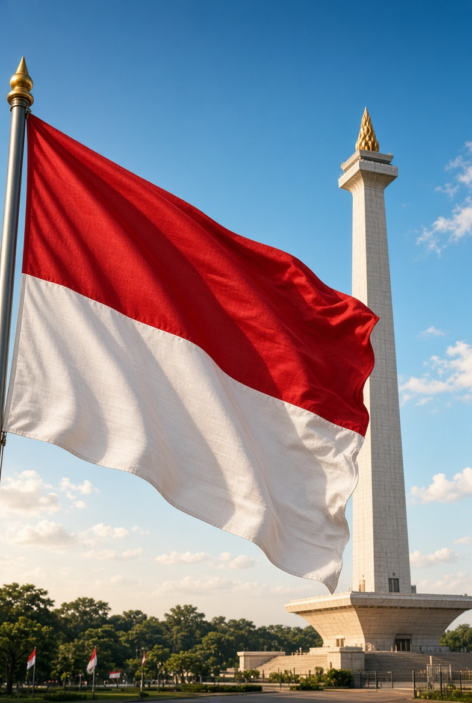

# 81 Tahun Merdeka: Ketika Penjajah Pergi, tetapi Belenggu Belum Selesai

*Ilustrasi (pic: Grok AI).*

  
***Penjajah yang jauh lebih sulit ditangkap yaitu korupsi, kemiskinan struktural, ketidakadilan, ketimpangan kesempatan, ketidakpercayaan terhadap institusi, dan mentalitas “yang penting gue selamat”***
  

Secara historis, Indonesia merdeka pada 1945 karena mampu mengubah status politiknya dari wilayah jajahan menjadi negara berdaulat. Tetapi filsafat politik memberikan persoalan yang lebih dalam.

Kemerdekaan memiliki beberapa lapisan:

1. Political freedom
Tidak berada di bawah pemerintahan asing.

2. Economic freedom
Masyarakat mempunyai kemampuan memenuhi kebutuhan hidup secara bermartabat.

3. Institutional freedom
Hukum tidak dikendalikan oleh kepentingan segelintir elite.

4. Social freedom
Manusia tidak dipaksa hidup dalam kemiskinan, diskriminasi, kekerasan, atau eksploitasi.

5. Psychological freedom
Masyarakat tidak merasa bahwa dirinya tidak mempunyai kemampuan mengubah keadaan.

Dan lapisan terakhir ini sangat menarik.

Sebuah bangsa dapat merdeka secara konstitusional tetapi belum sepenuhnya merdeka secara psikologis.

## Penjajahan Modern Tidak Selalu Memakai Kapal Perang

Penjajahan klasik berkata: “Wilayah ini milikku.” Sedangkan penjajahan modern dapat berbunyi: “Kamu bebas memilih.” Tetapi pilihan dibatasi oleh kemiskinan, pendidikan buruk, korupsi, ketimpangan, monopoli, utang, ketergantungan ekonomi, dan lemahnya institusi.

Maka seseorang secara hukum bebas memilih pekerjaan, tetapi kalau pilihan realistisnya hanya makan atau tidak makan, kebebasan itu menjadi sangat relatif.

Di sinilah pemikiran Amartya Sen menjadi relevan. Kemerdekaan bukan sekadar freedom from sesuatu, tetapi juga capability to melakukan sesuatu.

Merdeka berarti bukan cuma “Tidak ada yang menjajah saya.” Tetapi juga “Saya mempunyai kemampuan nyata untuk menentukan kehidupan saya.”

## Ketika Kemiskinan bertemu Kriminalitas

Ketika perdagangan ilegal menjadi sumber penghidupan sebuah komunitas, terjadi perubahan yang sangat berbahaya, yaitu kriminalitas berubah dari aktivitas individual menjadi ekonomi lokal.

Bos narkoba kemudian bukan lagi sekadar kriminal. Ia bisa dipersepsikan sebagai pemberi pekerjaan, pemberi uang, penyandang bantuan, pelindung, bahkan “orang baik”.

Sementara polisi dipersepsikan sebagai orang yang datang untuk menghancurkan sumber penghidupan.

Ini bukan berarti narkoba tiba-tiba menjadi baik, yang berubah adalah struktur insentif masyarakat.

## Kriminalitas yang Mengalami “Normalisasi”

Ketika aktivitas ilegal berlangsung cukup lama, masyarakat dapat mengalami normalization of deviance.

Sesuatu yang awalnya dianggap “gila!” lama-lama menjadi “ya memang begini hidup di sini.” Kemudian “semua orang juga melakukannya.” Dan akhirnya “Yang salah justru orang yang mengganggu sistem ini.”

Di titik tersebut negara menghadapi persoalan yang lebih besar daripada sekadar menangkap bandar.

Negara harus menciptakan alternatif ekonomi yang legal. Karena kalau negara hanya mengambil sumber pendapatan ilegal tanpa menciptakan sumber penghidupan baru, konflik sosial dapat semakin keras.

## Narkotika Cermin Kegagalan Negara dalam Satu Hal yang Sangat Mendasar

Negara memperoleh legitimasi ketika masyarakat percaya bahwa “Hukum negara mungkin keras, tetapi negara bekerja untuk kepentingan kami.”

Sebaliknya, jika masyarakat mengalami kemiskinan, pelayanan publik buruk, ketidakadilan, serta korupsi, sementara melihat elite hidup sangat nyaman, maka muncullah pertanyaan: “Mengapa saya harus menghormati negara yang tidak menghormati saya?”

Ini bukan pembenaran untuk melawan polisi, tetapi ini penjelasan mengenai bagaimana legitimasi negara dapat mengalami erosi.

## KKN Menjadi Sangat Berbahaya

Korupsi bukan sekadar pejabat mengambil uang negara. Korupsi menggerogoti hubungan psikologis antara warga dan negara.

Data terbaru Transparency International memperlihatkan Indonesia memperoleh skor 34/100 dalam CPI 2025 dan berada pada peringkat 109 dari 182 negara. 

Transparency International juga mencatat bahwa 92% responden dalam data Global Corruption Barometer yang tersedia menganggap korupsi pemerintah sebagai masalah besar. 

Jadi ketika masyarakat berkata “Negara ini banyak KKN.” kita tidak boleh otomatis menganggapnya sekadar sinisme.

Ada indikator empiris yang menunjukkan bahwa korupsi memang masih merupakan persoalan serius.

## Jangan Lahir Kesimpulan Fatalistik

Ini juga penting. Ada dua ekstrem:

Ekstrem pertama: “Indonesia baik-baik saja, jangan kritik pemerintah.”

Tidak ilmiah.

Ekstrem kedua: “Indonesia sudah hancur, tidak ada harapan.”

Juga tidak ilmiah.

Kemerdekaan justru membutuhkan kritik yang bisa diverifikasi.

Negara yang sehat bukan negara tanpa masalah. Negara sehat adalah negara yang memiliki mekanisme untuk menemukan masalah, mengakuinya, lalu memperbaikinya, kemudian mengawasi hasilnya.

## “Indonesia Gelap” dan Listrik Byar-Pet

Benarkah Indonesia Gelap secara politik? Belum tentu. Tapi Indonesia Gelap secara harfiah? Akhir-akhir ini PLN membantu kita menguji hipotesis itu. 

Tetapi serius sedikit.

Pada 2026 memang terjadi gangguan listrik besar di Sumatra. Pemerintah kemudian meminta PLN memperbaiki keseimbangan pasokan antardaerah dan ketahanan sistem. 

PLN menjelaskan bahwa gangguan besar tersebut berkaitan dengan power swing pada jaringan transmisi yang dipicu cuaca buruk, bukan sekadar “PLN sengaja mematikan listrik”. 

Pada Juni 2026 pemerintah juga mengatakan ada persoalan pasokan batu bara untuk pembangkit PLN dan membentuk tim untuk mengawasi pengadaan; Reuters melaporkan bahwa PLN memperkirakan membutuhkan sekitar 154 juta ton batu bara pada 2026, sementara kontrak yang telah diamankan saat itu sekitar 134 juta ton. 

Jadi, blackout tidak sama dengan otomatis negara gagal. Tetapi blackout berulang menunjukkan kelemahan sistem, dan ketidakmampuan memperbaiki akar masalah merupakan persoalan tata kelola yang sah untuk dikritik.

## Ironinya: Indonesia Memiliki Rencana Besar

Dan ini yang membuat cerita menjadi menarik.

RUPTL 2025–2034 menargetkan tambahan kapasitas pembangkit dan penyimpanan sekitar 69,5 GW, dengan sekitar 52,9 GW atau 76% berasal dari energi baru terbarukan dan storage. PLN juga merencanakan pembangunan sekitar 47.758 km sirkuit transmisi. 

Artinya Indonesia bukan negara tanpa visi. Namun masalahnya adalah jarak antara dokumen perencanaan dan pengalaman warga sehari-hari.

Di atas kertas: Green Super Grid. Tapi di rumah: “Sayang… lampunya mati lagi.” 

Dan justru jarak antara kebijakan makro dan pengalaman mikro itulah yang menentukan kepercayaan masyarakat terhadap negara.

## Mengapa Sebagian Orang Ingin Pergi dari Indonesia?

Ini juga perlu kita lihat secara dingin. Ketika seseorang berkata: “Aku mau keluar dari Indonesia.” tidak otomatis berarti dia membenci tanah air. Bisa saja ia sedang melakukan exit strategy.

Jika seseorang melihat karier terbatas, birokrasi buruk, pendapatan rendah, ketidakpastian hukum, atau peluang lebih baik di luar negeri, maka migrasi adalah pilihan rasional.

Albert O. Hirschman menyebut dua respons klasik terhadap kemunduran institusi, yaitu Exit alias Pergi, atau Voice alias Bersuara dan mencoba memperbaiki.

Kalau semakin banyak orang memilih exit daripada voice, negara harus bertanya: “Mengapa mereka tidak lagi percaya bahwa keadaan dapat diperbaiki dari dalam?”

Ini bukan sekadar masalah nasionalisme. Ini masalah institutional trust.

## WNI yang Menjadi Tentara Negara Lain

Fenomena ini juga tidak boleh langsung dibaca sebagai “Pengkhianatan bangsa.” Motivasinya bisa sangat beragam dan harus dibuktikan per kasus.

Tetapi jika seseorang memilih institusi asing karena gaji lebih tinggi, karier lebih jelas serta sistem lebih baik, maka fenomena tersebut dapat dibaca sebagai labour-market arbitrage.

Orang menjual tenaga dan kompetensinya kepada institusi yang memberikan imbal balik terbaik.

Dan pertanyaan yang lebih menyakitkan bagi negara bukan “Kenapa mereka pergi? melainkan “Apa yang membuat mereka tidak menemukan alasan yang cukup kuat untuk tinggal?”

## Kemerdekaan yang Belum Selesai

Maka 81 tahun setelah 1945, kita dapat menyusun sebuah persamaan: Kemerdekaan politik, Indonesia sudah memilikinya. Kemerdekaan ekonomi, masih dalam proses. Kemerdekaan institusional, masih harus diperjuangkan. Kemerdekaan dari korupsi dan kemiskinan, jelas belum selesai. Kemerdekaan dari ketergantungan, masih menjadi pekerjaan rumah. Kemerdekaan psikologis, mungkin yang paling sulit.

Penjajah terakhir mungkin sudah pergi. Tetapi ada penjajah yang jauh lebih sulit ditangkap karena ia hidup di dalam sistem, yaitu korupsi, kemiskinan struktural, ketidakadilan, ketimpangan kesempatan, ketidakpercayaan terhadap institusi.Dan mentalitas “yang penting gue selamat”.

Ketika masyarakat miskin terpaksa mencari nafkah melalui ekonomi ilegal, sementara orang kaya dapat menghindari konsekuensi hukum melalui koneksi, maka kemerdekaan menjadi tidak simetris.

Yang satu memperoleh freedom, sementara yang lain memperoleh survival. Dan dua hal itu bukan benda yang sama.

Pertanyaan kemerdekaan Indonesia sekarang bukan lagi “Siapa penjajah kita?” Tetapi institusi macam apa yang harus kita bangun agar seorang anak Indonesia tidak perlu menjadi kaya dulu untuk merasa aman, sehat, terdidik, dihormati, dan memiliki masa depan?”

Kemerdekaan yang matang bukan sekadar kemampuan mengibarkan bendera. Ia adalah kemampuan negara memastikan bahwa polisi tidak dibenci karena dianggap musuh, sekolah tidak menjadi mesin reproduksi ketimpangan, pejabat tidak melihat jabatan sebagai investasi pribadi, orang miskin tidak dipaksa memilih antara lapar dan kriminalitas, anak muda tidak harus meninggalkan negaranya untuk memperoleh masa depan, dan lampu tetap menyala ketika rakyat sedang membaca UUD 1945.

Indonesia tidak gagal hanya karena masih memiliki masalah. Justru bangsa yang merdeka adalah bangsa yang boleh mengakui bahwa pekerjaan rumahnya masih banyak.

17 Agustus seharusnya bukan hari untuk berkata: “Indonesia sudah sempurna.”Melainkan hari untuk berkata: “Indonesia sudah merdeka, sekarang mari kita selesaikan pekerjaan yang ditinggalkan oleh kemerdekaan itu sendiri.”

Jika kemerdekaan 1945 membebaskan Indonesia dari kekuasaan kolonial, maka kemerdekaan abad ke-21 harus membebaskan manusia Indonesia dari rasa tidak berdaya, kemiskinan, korupsi, kriminalitas yang menjadi mata pencaharian, institusi yang tidak dipercaya, ketimpangan kesempatan, dan dari mentalitas bahwa masa depan hanya milik mereka yang lahir di tempat yang tepat atau memiliki koneksi yang tepat.

Kalau itu berhasil dilakukan, barulah merah putih bukan cuma berkibar di tiang. Ia hidup di dalam kualitas hidup manusia yang berada di bawahnya. 

  
**Referensi**

Hirschman, A. O. (1970). Exit, voice, and loyalty: Responses to decline in firms, organizations, and states. Harvard University Press.

Sen, A. (1999). Development as freedom. Oxford University Press.

Transparency International. (2026). Corruption Perceptions Index 2025. Transparency International: CPI 2025⁠

Kementerian Energi dan Sumber Daya Mineral Republik Indonesia. (2025). RUPTL PLN 2025–2034. Dokumen RUPTL 2025–2034⁠

PT PLN (Persero). (2025). RUPTL 2025–2034: PLN siap bangun Green Super Grid sepanjang 47.758 kms. PLN: RUPTL 2025–2034⁠

Reuters. (2026, June 18). Indonesia’s energy minister says government working to secure coal supply for state utility. Reuters: Indonesia's energy supply and PLN⁠
