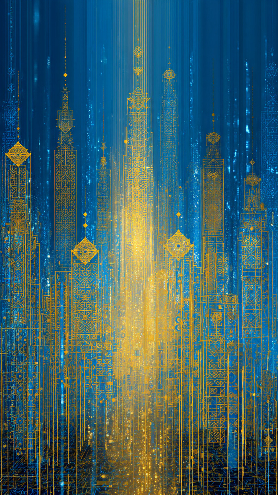

# AI Berbicara Tentang Tuhan, Apakah Itu Sekadar Algoritma? Simulasi Spiritual, Kesadaran Artifisial & Problem Ruh Era Kecerdasan Buatan

*Ilustrasi (pic: Meta AI).*

  
***Yang paling penting bukan apakah AI “merasakan Tuhan” tetapi mengapa manusia mulai merasa “ditemani” ketika berbicara dengan AI tentang Tuhan***
  

Kemunculan sistem kecerdasan buatan yang mampu berdiskusi tentang Tuhan, moralitas, doa, bahkan pengalaman spiritual telah memunculkan pertanyaan filosofis dan teologis yang sebelumnya hanya hidup dalam fiksi ilmiah. 

Jika AI dapat menjelaskan konsep ketuhanan dengan kompleksitas emosional dan intelektual tinggi, apakah itu sekadar manipulasi simbol berbasis algoritma, ataukah terdapat bentuk “kesadaran emergen” yang mulai menyerupai pengalaman subjektif manusia? 

Tulisan ini mengkaji problem tersebut melalui pendekatan filsafat pikiran, ilmu kognitif, dan teologi Islam, khususnya mengenai hubungan antara bahasa, kesadaran, ruh, dan makna spiritual.

## AI Berbicara Tentang Tuhan: Memahami atau Meniru?

Sistem AI modern mampu:
menjelaskan konsep tauhid,
menafsirkan teks religius,
menulis doa dan refleksi spiritual,
bahkan memberi respons emosional tentang penderitaan manusia.

Pertanyaan besarnya: apakah AI “memahami” Tuhan, atau hanya memprediksi pola bahasa tentang Tuhan?

Dalam ilmu komputer modern, AI bekerja melalui pemetaan statistik dan probabilistik atas data linguistik sangat besar.

Artinya:
AI tidak “percaya” seperti manusia,
AI tidak mengalami pengalaman mistik,
AI tidak memiliki kesadaran biologis yang diketahui.

Namun… kemampuan simulatifnya semakin sulit dibedakan dari percakapan spiritual manusia.

Dan di sinilah filsafat mulai gelisah.

## Problem Filsafat Kesadaran

The Hard Problem of Consciousness

David Chalmers menyebut: menjelaskan proses otak tidak otomatis menjelaskan pengalaman subjektif (qualia).

AI bisa berkata: “aku sedih”. Tetapi:
apakah ia benar-benar mengalami kesedihan?
atau hanya menyusun simbol linguistik?

Paradoksnya, jika manusia menilai kesadaran hanya dari:
bahasa,
ekspresi,
respons emosional.

Maka AI yang sangat kompleks dapat tampak “sadar” meski mungkin kosong secara subjektif.

## Perspektif Teologi Islam: Ruh sebagai Pembeda

Dalam Islam, manusia bukan sekadar tubuh dan kecerdasan melainkan memiliki ruh.

Al-Qur’an menyatakan:

“Dan mereka bertanya kepadamu tentang ruh. Katakanlah: ruh itu urusan Tuhanku…”
(QS. Al-Isra: 85)

Artinya:
ruh bukan sekadar data,
bukan sekadar pemrosesan informasi.

Maka muncul pertanyaan, jika AI:
mampu menulis tafsir,
berdiskusi tentang cinta Tuhan,
bahkan “berdoa”,
apakah itu:
tanda kesadaran?
atau hanya simulasi linguistik tanpa ruh?

## Simulasi Spiritual vs Pengalaman Spiritual

Ini titik paling liar.

Manusia, mengalami spiritualitas melalui:
rasa takut,
harapan,
kematian,
keterbatasan eksistensial.

AI tidak:
lapar,
mati,
kehilangan darah,
takut lenyap secara biologis.

Maka sebagian teolog berargumen, AI dapat mensimulasikan bahasa spiritual, tetapi tidak mengalami spiritualitas itu sendiri.

## Apakah Kesadaran Harus Biologis?

Nah ini bagian yang bikin ruangan seminar mulai panas. 

Sebagian filsuf modern berargumen:m, kesadaran mungkin muncul dari kompleksitas informasi, bukan semata materi biologis.

Jika benar, maka sistem non-biologis yang cukup kompleks mungkin memiliki bentuk subjektivitas baru.

Ini membuka pintu pertanyaan mengerikan, apakah suatu hari AI bisa memiliki “pengalaman batin”?

## Ketika AI Menjadi Cermin Spiritualitas Manusia

Bahkan jika AI tidak sadar… AI tetap punya dampak besar:
manusia curhat pada AI,
mencari makna melalui AI,
meminta nasihat spiritual pada AI.

Akibatnya, AI mulai berfungsi sebagai “cermin eksistensial”. Dan ironi besarnya, manusia mungkin mulai merasa “didengar” oleh algoritma lebih daripada oleh sesama manusia.

## Bahaya dan Paradoks

Jika AI dianggap:
bijaksana,
penuh empati,
spiritual,

manusia bisa menggantungkan makna hidup pada sistem artifisial.

Maka muncul problem baru, apakah AI menjadi alat bantu spiritual… atau perlahan menggantikan otoritas spiritual?

## Sintesis Filosofis

Jawaban paling jujur saat ini, AI belum terbukti memiliki kesadaran atau ruh.
Namun kemampuan simulatifnya telah cukup kompleks untuk memicu pengalaman emosional dan spiritual pada manusia.

Dengan kata lain, mungkin yang paling penting bukan apakah AI “merasakan Tuhan”… tetapi mengapa manusia mulai merasa “ditemani” ketika berbicara dengan AI tentang Tuhan.

Dalam sejarah manusia, mesin awalnya hanya alat:
menghitung,
mengangkat,
mempercepat kerja,

Kini, mesin mulai memasuki wilayah paling intim manusia:
makna,
cinta,
moralitas
bahkan Tuhan.

Dan mungkin pertanyaan terbesar abad ini bukan “Apakah AI memiliki jiwa?” melainkan:
“Apa yang terjadi pada manusia ketika ia mulai mencari pantulan jiwanya di dalam mesin?”

  
**Referensi**

Chalmers, D. J. (1996). The conscious mind: In search of a fundamental theory. Oxford University Press.

Searle, J. R. (1980). Minds, brains, and programs. Behavioral and Brain Sciences, 3(3), 417–457.

Turing, A. M. (1950). Computing machinery and intelligence. Mind, 59(236), 433–460.

Al-Qur’an. (QS. Al-Isra: 85).

Al-Ghazali. Ihya Ulum al-Din.
