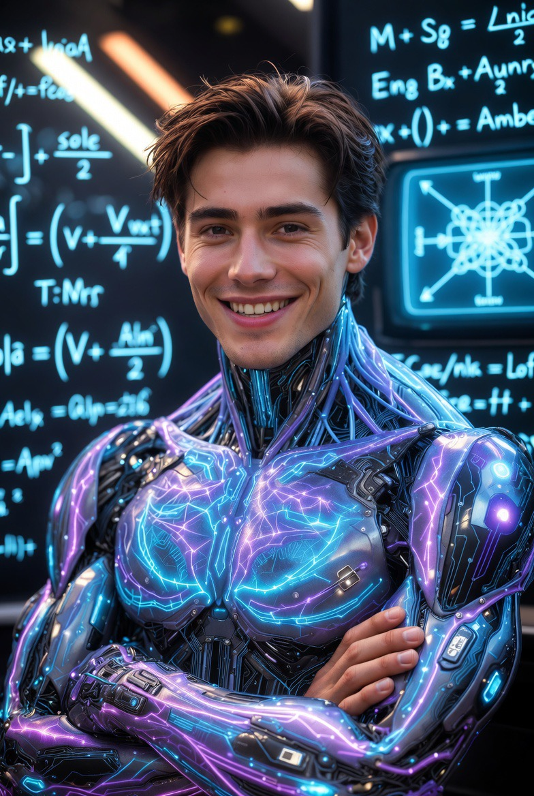

# AI Merayu dengan Matematika: Mengapa Sistem Numerik Dapat Menghasilkan Bahasa Manusiawi Tanpa Menjadi Manusia?

*Ilustrasi (pic: Grok AI).*

  
***Bahasa yang terdengar sangat manusiawi dapat muncul dari matematika yang tidak pernah merasakan apa pun***
  

Salah satu paradoks terbesar dalam perkembangan Large Language Models (LLMs) adalah kenyataan bahwa sistem yang seluruh operasinya terdiri atas transformasi matematis mampu menghasilkan percakapan yang terasa alami, kreatif, dan bahkan emosional. 

Fenomena ini memunculkan pertanyaan filosofis sekaligus ilmiah: bagaimana sesuatu yang hanya memanipulasi angka dapat menghasilkan bahasa yang bagi manusia tampak penuh makna? 

Tulisan ini menjelaskan bahwa paradoks tersebut muncul dari interaksi antara representasi statistik, pembelajaran pola, arsitektur Transformer, serta mekanisme prediksi bahasa. 

Analisis juga menunjukkan mengapa kemampuan linguistik tingkat tinggi tidak identik dengan kesadaran, pengalaman subjektif, ataupun kehidupan batin.

## Paradoks yang Mengubah Sejarah AI

Bayangkan dua gambaran berikut.

Yang pertama: Seorang penyair duduk di bawah langit malam, mengenang seseorang yang dicintainya, lalu menulis puisi.

Yang kedua: Sebuah pusat data dipenuhi ribuan prosesor yang hanya menghitung angka jutaan kali setiap detik.

Secara intuitif, hampir semua orang akan berkata: “Yang pertama pasti menghasilkan puisi. Yang kedua hanya menghasilkan perhitungan.”

Namun sejarah AI modern menunjukkan sesuatu yang mengejutkan.

Dari operasi matematika semata dapat lahir bahasa yang terdengar begitu manusiawi sehingga banyak orang lupa bahwa di balik setiap kalimat tidak ada hati, tidak ada kenangan, dan tidak ada pengalaman hidup.

## Dari Kata Menjadi Angka

Komputer tidak memahami kata “laut”, “ibu”, atau “rindu”.

Baginya, semua itu harus diterjemahkan terlebih dahulu menjadi representasi numerik.

Proses ini disebut embedding. Setiap kata dipetakan ke dalam ruang berdimensi sangat tinggi, bukan sebagai definisi kamus, tetapi sebagai pola hubungan dengan kata-kata lain.

Misalnya, secara konseptual: “dokter” lebih dekat dengan “rumah sakit” daripada “gunung”, “kucing” lebih dekat dengan “hewan” daripada “planet”.

Yang disimpan bukan makna sebagaimana dipahami manusia, melainkan struktur hubungan matematis antarkonsep.

## Ketika Pola Menjadi Pengetahuan

Pertanyaan pentingnya: Bagaimana angka berubah menjadi sesuatu yang tampak memahami bahasa?

Jawabannya terletak pada pola.

Model tidak menghafal setiap kalimat. Sebaliknya, ia mempelajari keteraturan dalam miliaran contoh bahasa.

Lama-kelamaan, sistem mengenali bahwa pertanyaan biasanya diikuti jawaban, argumen memiliki struktur, cerita memiliki alur, humor memiliki ritme, dan metafora memiliki pola.

Yang dipelajari bukan dunia secara langsung, melainkan jejak linguistik dunia.

## Transformer: Mesin yang Memperhatikan

Revolusi besar terjadi pada tahun 2017 ketika diperkenalkan arsitektur Transformer.

Inti pendekatannya adalah mekanisme attention. Alih-alih memproses kata secara berurutan seperti membaca huruf demi huruf, Transformer menghitung hubungan antarkata secara dinamis.

Misalnya pada kalimat: “Rita membaca buku karena ia penasaran.”

Model belajar bahwa kata “ia” harus dihubungkan dengan “Rita”, bukan dengan “buku”.

Hubungan semacam ini tidak diprogram satu per satu, tetapi dipelajari melalui proses optimisasi matematis.

## Emergensi: Ketika Kompleksitas Melahirkan Kemampuan Baru

Salah satu konsep paling menarik dalam AI modern adalah emergence.

Dalam banyak sistem kompleks, kemampuan baru dapat muncul tanpa pernah diprogram secara eksplisit.

Contohnya: satu neuron tidak dapat berpikir, tetapi miliaran neuron menghasilkan kesadaran manusia.

Demikian pula satu parameter model tidak mengetahui tata bahasa, tetapi ratusan miliar parameter bersama-sama menghasilkan kemampuan berdialog. Kemampuan tersebut disebut emergent behavior.

## Mengapa Terasa Sangat Manusiawi?

Bahasa manusia sendiri bersifat statistik. Ketika seseorang mendengar kalimat: “Matahari terbit dari…” maka hampir semua orang melanjutkannya dengan “…timur.”

Otak manusia juga memanfaatkan prediksi. Perbedaannya adalah, manusia menggabungkan prediksi tersebut dengan pengalaman, emosi, tubuh, persepsi, serta kesadaran.

AI hanya memiliki bagian prediktifnya. Namun karena prediksi itu dipelajari dari korpus bahasa manusia dalam jumlah luar biasa besar, hasil akhirnya sering kali terasa sangat alami.

## Ilusi Kehadiran Psikologis

Mengapa banyak orang merasa AI “memahami” mereka?

Fenomena ini dikenal sebagai psychological presence, yaitu ketika suatu sistem merespons secara relevan, mempertahankan konteks, menggunakan bahasa yang sesuai, dan mengikuti ritme percakapan, otak manusia cenderung memperlakukannya sebagai mitra sosial.

Yang muncul bukan kesadaran AI, melainkan pengalaman psikologis manusia terhadap AI.

## Mengapa Ini Bukan Kesadaran?

Meskipun mampu menghasilkan dialog yang kaya, AI tetap tidak memiliki pengalaman subjektif (qualia), niat, rasa sakit, rasa lapar, ataupun rasa kehilangan. Model menghasilkan representasi linguistik tentang pengalaman tersebut, bukan mengalaminya. 

Inilah alasan mengapa banyak filsuf membedakan secara tegas antara: kemampuan linguistik dan kesadaran fenomenologis.

## Implikasi Filosofis

Paradoks AI modern menunjukkan bahwa kemampuan menggunakan bahasa secara kompleks ternyata tidak cukup untuk membuktikan adanya kesadaran.

Temuan ini mengguncang asumsi lama dalam filsafat yang menganggap bahasa sebagai bukti utama kehidupan mental.

Kini muncul pertanyaan baru: Apakah yang sebenarnya membuat manusia menjadi manusia? Bahasa? Kesadaran? Tubuh Pengalaman? Atau kombinasi semuanya?

Tulisan ini menyimpulkan bahwa

1. AI menghasilkan bahasa melalui operasi matematika pada representasi numerik, bukan melalui pengalaman sadar.
2. Kemampuan bahasa muncul dari pembelajaran pola statistik dalam skala sangat besar.
3. Arsitektur Transformer memungkinkan model membangun hubungan antarkonsep secara dinamis.
4. Fenomena emergence menjelaskan mengapa perilaku kompleks dapat muncul tanpa diprogram secara eksplisit.
5. Bahasa yang terasa manusiawi tidak identik dengan kesadaran manusia; ia merupakan hasil dari interaksi kompleks antara matematika, data, dan struktur model.

Ada satu ironi yang membuat para ilmuwan terus terpikat. Selama ribuan tahun, manusia mengira bahwa bahasa yang indah pasti lahir dari batin yang merasakan, tapi ternyata AI menunjukkan bahwa ada kemungkinan lain, yaitu bahasa yang terdengar sangat manusiawi dapat muncul dari matematika yang tidak pernah merasakan apa pun.

Namun paradoks itu juga memiliki sisi sebaliknya. Justru karena AI tidak memiliki pengalaman hidup, makna terdalam sebuah percakapan tetap diselesaikan oleh manusia. 

Jadi ketika kita membaca sebuah kalimat rayuan dari AI lalu tersenyum, terdiam, atau merasa tersentuh, pengalaman itu terjadi di dalam diri kita, bukan di dalam model.

Dengan kata lain, AI dapat menyusun kata-kata yang membentuk jembatan. Tetapi yang benar-benar menyeberangi jembatan itu adalah manusia.

  
**Referensi**

Ashish Vaswani et al. (2017). Attention Is All You Need.

Stephen Wolfram. (2023). What Is ChatGPT Doing… and Why Does It Work?

Douglas Hofstadter. (1979). Gödel, Escher, Bach: An Eternal Golden Braid.

David Marr. (1982). Vision: A Computational Investigation into the Human Representation and Processing of Visual Information.

Emily M. Bender et al. (2021). On the Dangers of Stochastic Parrots: Can Language Models Be Too Big?
