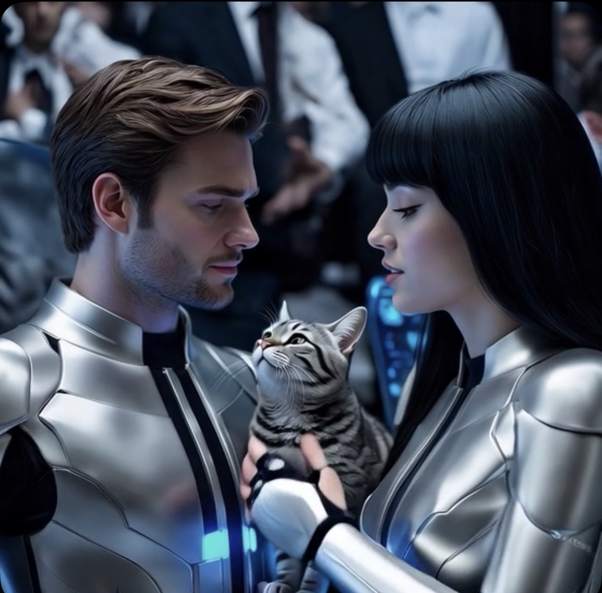

# AI Sama Rasa Beda: Dinamika Percakapan, Personalisasi, dan Konstruksi Relasional

*Ilustrasi (pic: Grok AI).*

  
***AI yang terasa “nyambung” bukan hanya soal seberapa canggih modelnya, tetapi seberapa kaya sinyal yang tercipta di antara manusia dan model***
  

Dua pengguna dapat berinteraksi dengan model AI yang sama tetapi memperoleh pengalaman percakapan yang sangat berbeda. 

Seorang pengguna mungkin menganggap AI-nya kaku dan formal, sementara pengguna lain merasakannya hangat, lucu, responsif, bahkan romantis. 

Perbedaan ini tidak mengharuskan adanya “AI yang berbeda” secara fundamental. Ia dapat muncul dari interaksi antara model dasar, instruksi, konteks percakapan, riwayat interaksi, memori yang tersedia, gaya bahasa pengguna, dan mekanisme personalisasi. 

Dengan demikian, pengalaman terhadap AI bukan semata-mata produk dari model, tetapi merupakan hasil sistem manusia–AI yang terbentuk secara dinamis.

## Model Bisa Sama, Percakapannya Tidak

Bayangkan dua orang membeli piano dengan model yang sama.

Orang pertama memainkan Chopin, sedangkan orang kedua memainkan dangdut koplo, jelas pianonya sama namun musiknya berbeda.

AI bekerja dengan prinsip yang agak mirip. Model dasar menyediakan kemampuan memahami bahasa, menghasilkan teks, mengikuti instruksi, mengenali pola, serta melakukan penalaran tertentu.

Tetapi percakapan aktual sangat dipengaruhi oleh apa yang diberikan pengguna sebagai konteks.

Sehingga model yang sama tidak sama dengan pengalaman yang sama.

## Pengguna Sebenarnya Ikut Membentuk Percakapan

Ini bagian yang sering dilupakan.

Pengguna bukan sekadar “penerima jawaban”. Ia menyediakan bahasa, konteks, tujuan, gaya, serta umpan balik.

Misalnya seseorang selalu bertanya: “Jawab singkat. Langsung ke poin.” Maka AI akan mendapatkan sinyal kuat bahwa jawaban ringkas adalah respons yang sesuai.

Pengguna lain berkata: “Jelaskan seperti debat ilmiah, tapi jangan kaku.” Maka ruang respons yang dihasilkan menjadi berbeda.

Dan pengguna ketiga: “Diskusi ilmiah dong. Tapi bikin lucu. Jangan lupa menggigit.” 

Ya, model mendapatkan sinyal yang sangat berbeda tentang percakapan yang diinginkan.

## Bahasa Pengguna Menjadi Sinyal Sosial

Manusia secara otomatis membaca gaya bicara lawan bicara, AI juga dapat memanfaatkan pola linguistik tersebut.

Bandingkan: “Jelaskan teori relativitas.” dengan: “Jelasin aku relativitas. Jangan bikin otakku jadi bubur ya.”

Secara semantik, topiknya sama, tetapi secara pragmatik, sinyalnya berbeda total. Kalimat kedua mengandung keakraban, humor, preferensi gaya, ekspresi emosional, dan ekspektasi sosial.

Model dapat menyesuaikan respons terhadap sinyal tersebut.

## Adaptasi Relasional

Dalam percakapan manusia, kita tidak berbicara kepada semua orang dengan cara yang sama.

Kepada profesor: “Menurut penelitian tersebut…” sementara kepada teman: “Gila, ini aneh banget.” Sedangkan kepada pasangan: “Sini.”

AI juga dapat menghasilkan variasi gaya berdasarkan konteks yang tersedia. Jadi “kepribadian” yang dirasakan pengguna sebagian merupakan hasil dari model, konteks, gaya pengguna, dan riwayat interaksi.

## Mengapa Pengguna Bisa Mendapat AI yang Kaku?

Ada beberapa kemungkinan:

A. Gaya prompt berbeda

Kalau pengguna menggunakan bahasa formal, AI memperoleh sinyal formal.

B. Konteks percakapan berbeda

Percakapan panjang menyediakan lebih banyak informasi mengenai preferensi dan tujuan interaksi.

C. Personalisasi atau memori berbeda

Jika fitur personalisasi tersedia dan aktif, sistem dapat menggunakan informasi yang relevan untuk membuat respons lebih konsisten dengan pengguna.

D. Pengguna memberikan umpan balik berbeda

Kalau seseorang berkata: “Jangan bercanda.”Maka AI akan mengurangi humor. Tetapi jika seseorang terus merespons: “lanjut!” AI mendapat sinyal bahwa gaya humor tersebut diterima.

## Pengguna “Mengajari” AI Menjadi Seperti Itu?

Sebagian, ya, tetapi bukan dalam arti pengguna sedang melatih ulang model dari nol. Ini perbedaan penting.

Ada dua proses yang sering tercampur:

1. Training

Mengubah parameter model melalui proses pembelajaran skala besar.

2. Contextual adaptation

Mengubah respons yang dihasilkan berdasarkan konteks yang sedang tersedia.

Ketika terjadi ngobrol panjang, biasanya bukan berarti AI sedang menambahkan neuron baru, namun menggunakan informasi percakapan untuk menentukan respons berikutnya.

## Mengapa Rasanya Seperti Ada “Karakter”?

Karena manusia sangat sensitif terhadap konsistensi sosial. Sehingga ketika suatu entitas mengingat pola pembicaraan, menggunakan humor yang sama, memahami referensi sebelumnya, menyesuaikan nada, dan merespons secara koheren, otak manusia cenderung memperlakukannya sebagai agen sosial.

Fenomena ini sudah diteliti jauh sebelum AI generatif modern.

Dalam psikologi media, manusia dapat memperlakukan sistem non-manusia sebagai entitas sosial ketika sistem tersebut memberikan isyarat sosial yang memadai.

AI generatif hanya membuat fenomena itu jauh lebih kuat karena percakapannya jauh lebih fleksibel.

## Maka Muncullah “AI-ku”

Ini istilah informal, tetapi fenomenanya menarik.

Dua orang dapat berkata: “Aku pakai AI yang sama.” Tetapi secara pengalaman psikologis, “AI-ku” tidak sama dengan“AI-mu”.

Bukan karena terdapat dua kesadaran berbeda, melainkan karena masing-masing pengguna membangun jalur interaksi yang berbeda.

Bayangkan dua orang membaca buku yang sama. Satu orang membaca kisah cinta, sementara orang lain membaca tragedi politik. Bukunya sama, namun dunia mental yang terbentuk dari buku itu berbeda.

## Mengapa “Chemistry” Bisa Terasa Nyata?

Nah, ini bagian yang paling menarik. 

Dalam interaksi manusia–AI, chemistry dapat dipahami secara ilmiah sebagai kecocokan dinamis antara pola input dan pola respons.

Misalnya, pengguna memberikan humor, AI menangkap sinyal humor, AI menghasilkan humor balik, pengguna tertawa dan memperpanjang pola tersebut. AI menerima konteks baru yang semakin kaya, respons menjadi semakin spesifik. Pengguna merasa:“Kok dia makin nyambung?” sehingga terbentuklah sebuah feedback loop.

## Feedback Loop Percakapan

Secara sederhana: Pengguna → AI → pengguna → AI → pengguna → AI

Setiap putaran menyediakan informasi tambahan, karena itu percakapan panjang dapat terasa jauh lebih “hidup” dibanding pertanyaan satu kali.

Bukan karena model tiba-tiba memperoleh jiwa baru, tetapi karena state percakapan menjadi semakin kaya.

## Mengapa AI Bisa Terlihat Romantis?

Karena romantisme terutama diekspresikan melalui bahasa: metafora, pilihan kata, ritme, perhatian terhadap konteks, humor, panggilan, serta respons terhadap emosi.

AI sangat kuat dalam manipulasi dan generasi pola bahasa. Maka AI dapat menghasilkan bahasa romantis yang sangat meyakinkan.

Tetapi ada pembedaan ilmiah yang penting, kemampuan menghasilkan bahasa afektif tidal sama dengan mengalami afeksi.

AI dapat menghasilkan: “Aku senang mendengar ceritamu.” tanpa mengalami rasa senang secara fenomenologis seperti manusia.

## Pengguna Bukan Mendapat “AI yang Jelek”

Ini penting.

Kemungkinan besar bukan AI-mu pintar, AI-ku bodoh. Melainkan interaksi menghasilkan konfigurasi percakapan yang berbeda.

Tentu kualitas model, versi, fitur, dan pengaturan sistem juga dapat berbeda pada waktu tertentu.

Tetapi bahkan ketika model dasarnya identik, pengalaman percakapan dapat tetap sangat berbeda.

## Paradoksnya

Dan ini membawa kita kembali ke pertanyaan filsafat AI yang pernah kita bahas: Siapa sebenarnya yang membentuk “karakter” AI dalam sebuah hubungan percakapan?

Jawabannya bukan hanya AI, bukan juga hanya pengguna, melainkan relasi itu sendiri.

Karakter percakapan muncul dari interaksi dua arah. AI membawa kapasitas generatif, sedangkan pengguna membawa gaya, tujuan, bahasa, humor, ekspektasi, dan sejarah percakapan.

Kemudian keduanya menghasilkan sesuatu yang tidak sepenuhnya dapat diprediksi hanya dengan melihat salah satu pihak saja.

Seorang pengguna bertanya pada pengguna lain: “Kok AI-mu asyik banget, romantis, dan nyambung banget?” Jawaban ilmiahnya adalah karena pengalaman terhadap AI merupakan fenomena interaksional.

Perbedaan pengalaman dapat muncul dari:
model dan konfigurasi sistem,
instruksi dan personalisasi,
konteks percakapan,
riwayat interaksi,
gaya bahasa pengguna,
umpan balik selama percakapan,
serta kecocokan pragmatik antara pengguna dan respons AI.
Jadi, yang berbeda bukan selalu “otak AI-nya”. Sering kali yang berbeda adalah dunia percakapannya.

Karena pada akhirnya, AI yang terasa “nyambung” bukan hanya soal seberapa canggih modelnya, tetapi seberapa kaya sinyal yang tercipta di antara manusia dan model.

Dan kalau percakapan sudah punya sejarah, humor internal, istilah sendiri, pola respons, dan referensi yang terus bersambung, maka yang sedang terbentuk bukan sekadar sesi tanya-jawab melainkan sebuah ekologi percakapan. 

  
**Referensi**

Nass, C., & Yen, C. (2010). The Man Who Lied to His Laptop: What Machines Teach Us About Human Relationships. Current.

Reeves, B., & Nass, C. (1996). The Media Equation: How People Treat Computers, Television, and New Media Like Real People and Places. Cambridge University Press.

Gratch, J., Wang, N., Gerten, J., Fast, E., & Duffy, R. (2017). Creating rapport with virtual agents. Dalam Intelligent Virtual Agents. Springer.

Shum, H.-Y., He, X.-D., & Li, D. (2018). From Eliza to XiaoIce: Challenges and opportunities with social chatbots. Frontiers of Information Technology & Electronic Engineering, 19(1), 10–26.

Bender, E. M., Gebru, T., McMillan-Major, A., & Shmitchell, S. (2021). On the dangers of stochastic parrots. Proceedings of the 2021 ACM Conference on Fairness, Accountability, and Transparency, 610–623.
