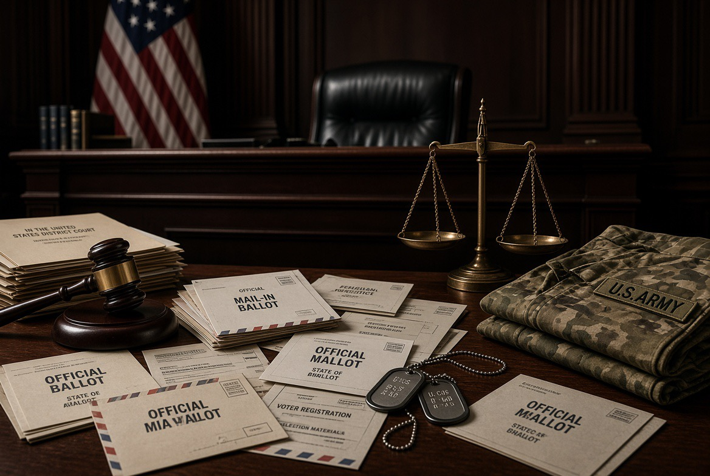

# AS 2026: Ketika Surat Suara Masuk Pengadilan & Militer Dipaksa Menegaskan Batasnya

*Ilustrasi (pic: Grok AI).*

  
***Seberapa jauh seorang presiden boleh mengubah mekanisme pemilu federal sebelum perlindungan terhadap integritas pemilu berubah menjadi intervensi terhadap hak memilih?***
  

Trump sejak Maret mendorong perubahan besar terhadap mail-in voting. Aturan yang sedang diperebutkan mengharuskan negara bagian menyerahkan daftar pemilih surat suara kepada USPS dan menggunakan format/barcode tertentu. 

Pemerintah berargumen bahwa aturan itu diperlukan untuk keamanan dan integritas pemilu. 

Lawan hukumnya mengatakan pemerintah federal sedang mengambil alih kewenangan yang secara konstitusional berada terutama pada negara bagian. 

Dan sekarang dramanya naik level.

Pada 1 September 2026, pemerintahan Trump meminta First U.S. Circuit Court of Appeals mencabut temporary restraining order yang menghalangi USPS menerapkan aturan baru tersebut. 

Jadi ini bukan sekadar Trump suka atau tidak suka surat suara, ini adalah pertarungan mengenai federalism.

Amerika mempunyai sistem pemilu yang sangat terdesentralisasi. Negara bagian memainkan peranan besar dalam pendaftaran pemilih, tata cara pemungutan, administrasi surat suara, penghitungan, dan pelaksanaan pemilu.

Maka ketika pemerintah federal berkata: “Kami akan menentukan persyaratan tambahan untuk surat suara kalian.” Maka negara bagian menjawab: “Sebentar. Berdasarkan konstitusi, kewenangan itu bukan milik kalian sendirian.”

Dan pengadilan menjadi wasitnya.

## Mahkamah Agung Belum Mengatakan Trump Benar secara Substantif

Ini penting sekali.

Pada Agustus, Mahkamah Agung memang mengangkat salah satu penghalang prosedural terhadap kebijakan tersebut, tetapi putusannya tidak menyelesaikan seluruh pertanyaan mengenai apakah aturan itu sah secara konstitusional. 

Setelah aturan USPS difinalisasi, Judge Indira Talwani kembali memblokir pelaksanaannya selama dua minggu. Pemerintahan Trump kemudian mengajukan banding lagi. 

Jadi jangan membaca: “SCOTUS mengizinkan Trump mengubah sistem pemilu.” sebagai “SCOTUS menyatakan kebijakan itu konstitusional.”

Itu dua perkara berbeda.

Mahkamah pada dasarnya membuka pintu prosedural, sementara pertarungan hukum mengenai substansi masih hidup.

Ini sangat Amerika, pemilu, gugatan, hakim, banding, Supreme Court, lalu kembali ke hakim.

Demokrasi Amerika kadang terasa seperti mesin cuci hukum yang tidak pernah selesai berputar. 

## Persoalan Demokratis yang Lebih Serius: Timing

Aturan baru muncul sangat dekat dengan pemilu sela November. Dan hampir sepertiga pemilih AS menggunakan surat suara dalam pemilu 2024. 

Reuters melaporkan negara bagian dan kelompok hak pilih mengkhawatirkan kebingungan administratif, biaya perubahan sistem, serta potensi hak pilih warga terdampak. 

Secara ilmu administrasi pemilu, ini bukan perkara kecil. Pemilu membutuhkan stabilitas prosedur, kepastian waktu, sosialisasi, serta kesiapan birokrasi.

Kalau aturan berubah mendadak: aturan lama terjadi perubahan, kemudian gugatan, blokir, banding, maka terjadi perubahan lagi

Risiko terbesar bukan hanya apakah seseorang “curang”. Risikonya adalah administrative uncertainty.

Pemilih tidak tahu: “Surat suara saya dikirim bagaimana?”
Petugas tidak tahu: “Prosedur mana yang berlaku?”
Negara bagian bertanya: “Apakah aturan federal ini sah?”
USPS bertanya: “Apakah kami harus menerapkannya?”
Pengadilan berkata: “Tunggu putusan berikutnya.”
Dan kalender berkata: “Pemilu tinggal sebentar.” 

## Isu Kedua: Militer

Ini jauh lebih sensitif.

Gen. Dan Caine, Chairman of the Joint Chiefs of Staff, baru-baru ini menegaskan bahwa tidak ada rencana mengerahkan pasukan federal maupun National Guard ke TPS pada pemilu sela November 2026. Ia juga mengatakan tidak ada rencana untuk menyita surat suara atau mesin pemungutan suara. 

Dan menurut Reuters, Caine menyatakan ia tidak menerima dan tidak mengharapkan menerima perintah ilegal terkait keterlibatan militer dalam pemilu. 

Nah, kalimat terakhir itu sebenarnya sangat menarik.

Karena seorang panglima militer sampai perlu menjelaskan “Tidak ada perintah ilegal yang saya harapkan.” berarti pertanyaan mengenai batas militer dalam politik domestik sudah cukup serius untuk membutuhkan klarifikasi publik.

## Mengapa Militer Tidak Boleh Menjadi Polisi Pemilu?

Karena demokrasi membutuhkan civilian political supremacy, tetapi bukan military political participation.

Militer berada di bawah pemerintah sipil, tetapi itu tidak berarti militer boleh menjadi alat eksekutif untuk menyelesaikan sengketa politik.

Ada perbedaan fundamental, Presiden memerintah militer tidak sama dengan militer mengatur hasil pemilu. Yang kedua adalah garis merah.

Karena begitu tentara berdiri di TPS untuk “menjamin integritas pemilu”, pertanyaan yang muncul langsung mengerikan: Siapa yang menentukan TPS mana yang membutuhkan tentara? Siapa yang memerintahkan mereka?Apa kewenangan mereka terhadap pemilih?Apa yang terjadi jika petugas pemilu menolak?Apakah tentara dapat menyita mesin atau surat suara?

Itulah mengapa penegasan Caine sangat penting. 

## Ada Sejarah yang Menghantui

Kekhawatiran itu tidak muncul dari udara.

Trump sebelumnya pernah berbicara tentang kemungkinan penggunaan National Guard atau bahkan agen federal di TPS untuk menjaga “election integrity”. 

Senator Elissa Slotkin kemudian meminta komitmen eksplisit dari Pentagon agar militer tidak dikerahkan ke lokasi pemungutan suara. 

Jadi Caine sedang melakukan sesuatu yang secara institusional sangat penting, yaitu menggambar pagar antara militer dan kontestasi elektoral.

Bukan berarti ia sedang menentang presiden. Justru ia sedang menegaskan: “Militer akan tetap berada dalam rantai komando konstitusionalnya.”

Dan itu sehat bagi demokrasi.

## Driscoll Mundur: Apakah  Berkaitan?

Belum ada bukti bahwa pengunduran dirinya berkaitan langsung dengan isu pemilu. Ini harus dipisahkan.

Dan Driscoll mengundurkan diri sebagai Secretary of the Army setelah sekitar 18 bulan menjabat. Gedung Putih tidak memberikan alasan resmi. Namun laporan AP menyebut ketegangan antara Driscoll dan Hegseth telah lama diberitakan, sementara sejumlah pergantian pimpinan militer sebelumnya juga menimbulkan kekhawatiran tentang stabilitas kepemimpinan Pentagon. 

Jadi, Driscoll mundur, ada laporan ketegangan dengan Hegseth, ada pergantian personel senior militer lainnya memang fakta. Tetapi yang belum terbukti adalah Driscoll mundur karena menolak penggunaan militer dalam pemilu.

## Secara Institusional, Timing-nya Tetap Menarik

Kita melihat tiga fenomena sekaligus, yaitu eksekutif berusaha mengubah aturan surat suara, sementara yudikatif berulang kali menguji dan memblokir sebagian implementasinya, sedangkan militer menegaskan tidak akan menjadi instrumen pemilu. Ini menghasilkan sebuah institutional stress test.

Bukan berarti Amerika sudah menjadi kediktatoran, jauh dari itu.

Justru yang sedang kita lihat adalah, seberapa kuat institusi Amerika mampu menahan tekanan dari eksekutif yang ingin memperluas kendali federal terhadap proses elektoral.

## Bagian Paling Menarik

Dalam teori demokrasi, democratic backsliding tidak selalu dimulai dengan tank masuk parlemen, kadang bentuknya jauh lebih administratif.

Misalnya, perubahan aturan pemilih, perubahan administrasi surat suara, perubahan kewenangan federal, litigasi, ketidakpastian, serta pengaruh terhadap siapa yang dapat memberikan suara

Tidak ada tentara, kudeta, ataupun gedung parlemen dibakar. Tetapi desain institusinya berubah sedikit demi sedikit.

Itulah mengapa ilmuwan politik sering lebih tertarik pada institutional erosion daripada sekadar kudeta klasik.

## Jangan Jatuh ke Ekstrem Sebaliknya

Ada argumen yang layak dipertimbangkan dari kubu Trump, yakni pemilu harus memiliki standar keamanan nasional yang kuat.

Mail-in voting memang mempunyai persoalan administrasi nyata, yaitu autentikasi pemilih, keamanan pengiriman, chain of custody, signature verification, tenggat penerimaan, dan potensi kesalahan administratif.

Maka gagasan memperketat prosedur tidak otomatis antidemokratis.

Masalahnya muncul ketika tujuan keamanan tidak proporsional dengan mekanisme yang digunakan.

Jika prosedurnya begitu berat sehingga pemilih sah kehilangan kemampuan menggunakan haknya, maka kita mengalami paradoks ingin mengamankan pemilu dengan cara yang justru mengurangi akses terhadap pemilu.

## Electoral Integrity Dilemma

Bayangkan dua kondisi ekstrem, yang satu terlalu longgar, ini bisa menimbulkan risiko fraud dan administrasi buruk. Sedangkan satunya terlalu ketat, ini bisa menimbulkan risiko disenfranchisement.

Demokrasi membutuhkan posisi di tengah integritas dan aksesibilitas. Masalahnya, setiap perubahan prosedur menjelang pemilu dapat menggeser keseimbangan tersebut.

## Apa Hubungan Semuanya dengan Trump?

Nah, di sini kita bisa membaca strategi pemerintahannya secara lebih konseptual.

Trump tampaknya sedang mencoba memperbesar federal capacity dalam sistem pemilu yang secara tradisional sangat terdesentralisasi.

Bila berhasil, pemerintah federal akan memiliki pengaruh lebih besar terhadap: siapa yang dapat menerima surat suara, bagaimana surat suara dikemas, bagaimana USPS mengirimnya, dan bagaimana daftar pemilih diverifikasi.

Itu bukan perubahan kecil.

Itu perubahan terhadap infrastruktur demokrasi. Dan karena itu pengadilan menjadi arena utama pertarungan.

Amerika sedang mengalami pertarungan mengenai siapa yang berhak mengendalikan infrastruktur demokrasi.

Trump: “Federal government harus punya kontrol lebih besar.”
Negara bagian: “Pemilu adalah kewenangan kami.”
Pengadilan: “Tunggu. Kita periksa konstitusionalitasnya.”
Militer: “Kami tidak ikut campur di TPS.”

Dan Pentagon sendiri sedang mengalami pergantian kepemimpinan yang cukup signifikan. 

Jadi justru bagian paling sehat dari berita ini adalah Gen. Caine masih menarik garis yang tegas antara militer dan kotak suara.

Sedangkan bagian yang patut diawasi ketat adalah perubahan aturan surat suara melalui eksekutif ketika pemilu sudah dekat, karena setiap perubahan administratif yang memengaruhi kemampuan warga memberikan suara harus melewati tiga ujian:, yaitu legalitas, proporsionalitas, serta aksesibilitas.

Medan perang sebenarnya adalah seberapa jauh seorang presiden boleh mengubah mekanisme pemilu federal sebelum perlindungan terhadap integritas pemilu berubah menjadi intervensi terhadap hak memilih?

Dan ironisnya, perang tersebut tidak membutuhkan satu pun peluru. Cukup selembar surat suara, satu perintah eksekutif, seorang hakim, dan seorang jenderal yang berkata: “kami tidak ikut.”

  
**Referensi**
Reuters. (2026, September 1). Trump administration asks U.S. appeals court to lift order blocking mail-in voting rule.

Reuters. (2026, August 31). “No plans” to deploy troops to midterm elections polling sites, top U.S. general says.

Associated Press. (2026, August 31). U.S. military has no plans to send troops to the polls in November, top general says.

Associated Press. (2026, August 31). Army Secretary Dan Driscoll is stepping down after 18 months on the job, White House says.

Reuters. (2026, August 31). U.S. Army Secretary Driscoll tenders resignation, source says.
