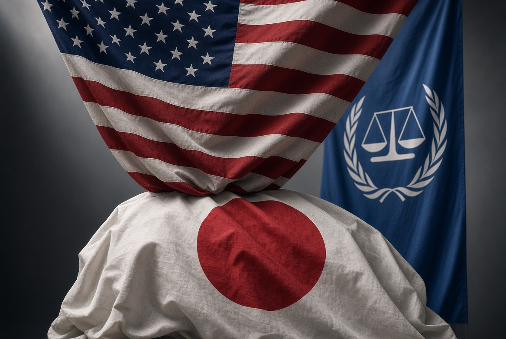

# AS vs ICC: Negara Adidaya Menggedor Pintu Pengadilan dengan Palu Diplomatik

*Ilustrasi (pic: Grok AI).*

  
***Jika berhasil membuat ICC takut menjalankan perkara, maka AS sudah memenangkan pertarungan sebelum hakim menjatuhkan putusan***
  

Washington menargetkan Akane di tengah konflik panjang AS dengan ICC mengenai yurisdiksi pengadilan tersebut terhadap warga negara AS dan pejabat Israel.

AS dan Israel bukan negara pihak Statuta Roma, sedangkan ICC telah menyelidiki dugaan kejahatan internasional yang berkaitan dengan Israel, termasuk perkara yang menghasilkan permohonan surat perintah penangkapan terhadap Benjamin Netanyahu. 

Jadi persoalannya bukan sekadar Trump tidak suka Tomoko Akane. Ini lebih fundamental, Washington menolak legitimasi ICC ketika yurisdiksi ICC menyentuh personel dan sekutu strategis Amerika.

Dan ini membuat konflik berubah dari konflik personal menjadi konflik kelembagaan.

## Mengapa Sanksi Terhadap Seorang Hakim Begitu Serius?

Sanksi AS bukan kritik diplomatik biasa, ia dapat membekukan aset yang berada dalam yurisdiksi AS dan memutus akses terhadap sistem keuangan AS. 

Mengingat jaringan perbankan internasional sangat terhubung dengan sistem keuangan AS, dampaknya bisa melampaui batas geografis Amerika. 

Jadi Washington sebenarnya mempunyai senjata yang sangat khas, bukan tank tapi sistem finansial.

Ini bentuk financial statecraft. Dan ini jauh lebih canggih daripada sekadar berkata: “Kami tidak setuju dengan pengadilan itu.” Pesannya menjadi: “Kalau institusi internasional menyentuh kepentingan kami, kami memiliki instrumen untuk membuat konsekuensinya terasa.”

Nah. Ini sudah politik kekuasaan tingkat tinggi. 

## Lalu Muncul Jepang

Dan di sinilah ceritanya menjadi menarik. Tomoko Akane bukan sekadar presiden ICC, dia orang Jepang.

Jepang bergabung dengan ICC pada 2007 dan selama bertahun-tahun menjadi pendukung penting lembaga tersebut. Bahkan sekarang Jepang merupakan kontributor finansial terbesar ICC. 

Sehingga ketika AS menyanksi Akane, Washington secara tidak langsung menciptakan dilema untuk Tokyo.

Jepang punya dua kepentingan yang bertabrakan, yakni aliansi strategis dengan Amerika, dan juga mempertahankan sistem multilateral dan rule of law yang selama ini menjadi bagian penting diplomasi Jepang.

Akane secara eksplisit meminta Tokyo membantu mencegah negara anggota lain menyerah terhadap tekanan AS. 

## Perang Memperebutkan Legitimasi

Dan ini bagian paling menarik.

AS tidak perlu menghancurkan gedung ICC, tidak perlu mengirim marinir ke Den Haag. Cukup dengan sanksi, tekanan diplomatik, tekanan terhadap donor, lalu negara anggota takut, akibatnya dukungan finansial turun serta legitimasi melemah. Itulah institutional coercion.

Lembaga internasional bisa secara formal tetap berdiri tetapi secara material dibuat semakin sulit bekerja.

Jadi pertarungannya bukan AS vs ICC secara militer. Melainkan kapasitas institusional vs kapasitas koersif negara adidaya.

## Washington Tidak Hanya Berhenti Pada Akane

Ini yang membuat kasusnya jauh lebih besar. 

Menurut Reuters, Rubio secara terbuka mendorong negara-negara anggota Statuta Roma untuk meninggalkan ICC. Sedikitnya lima negara telah menyatakan rencana untuk keluar dalam konteks tekanan tersebut. 

Jadi strategi AS dapat dibaca sebagai tiga lapis:

Lapisan 1 (Target individu)

Sanksi terhadap hakim dan jaksa.

Lapisan 2 (Target institusi)

Mengurangi kemampuan ICC bekerja.

Lapisan 3 (Target jaringan)

Mendorong negara anggota meninggalkan ICC.

Kalau lapisan ketiga berhasil, ICC tidak perlu dibubarkan. Ia cukup dibuat semakin kecil, semakin miskin, semakin terisolasi, dan semakin tidak efektif. Ini jauh lebih elegan secara geopolitik daripada membubarkan lembaga secara langsung.

## Apakah AS “Membela Israel”?

Ada dasar kuat untuk mengatakan bahwa perlindungan terhadap pejabat Israel merupakan salah satu kepentingan utama dalam konflik AS-ICC ini.

Bukan sekadar dugaan liar, sebab Reuters mencatat bahwa sanksi terbaru terjadi setelah ICC mengejar perkara yang berkaitan dengan Netanyahu, dan pejabat AS secara eksplisit mengkritik ICC karena menargetkan personel Amerika dan Israel. 

Tetapi secara analitis kita masih harus membedakan: “AS melindungi Israel dari konsekuensi yurisdiksi ICC” dengan “seluruh kebijakan AS terhadap ICC hanya dibuat demi Israel.”

Yang pertama memiliki bukti kuat, sedangkan yang kedua membutuhkan klaim yang jauh lebih luas.

AS Juga Punya Masalah Sendiri dengan ICC

ICC tidak hanya menangani Israel. Pengadilan itu juga pernah menyelidiki tindakan personel AS dalam konteks Afghanistan. 

Reuters mencatat bahwa konflik Washington dengan ICC telah berlangsung lama dan mencakup kekhawatiran AS mengenai kemungkinan penuntutan terhadap personel Amerika. 

Jadi kepentingan AS sebenarnya mempunyai dua lingkaran, yaitu sekutu Israel, dan diri sendiri, yakni personel dan pejabat AS.

Karena itu, dari perspektif realpolitik, Washington melihat ICC sebagai institusi yang berpotensi membatasi freedom of action Amerika dan sekutunya.

Dan negara adidaya biasanya sangat alergi terhadap kata accountability ketika accountability itu mulai memiliki gigi. 

## Paradoks Amerika Muncul

AS sering menjadi salah satu negara paling vokal mengenai rule of law, demokrasi, accountability, war crimes, dan human rights.

Tetapi ketika institusi internasional menggunakan prinsip tersebut terhadap personel AS atau sekutu strategisnya, responsnya dapat berubah menjadi: “ICC has exceeded its authority.”

Ini bukan kontradiksi kecil, ini problem klasik dalam politik internasional yaitu universalism (hukum berlaku kepada semua.) vs exceptionalism (hukum berlaku kepada semua, tetapi ada keadaan tertentu ketika kepentingan strategis kami lebih tinggi) Dan di sinilah kritik terhadap AS menjadi sangat kuat.

## Sekarang Lihat Jepang

Jepang sebenarnya sedang berada di posisi yang sangat menarik.

Kalau Tokyo membela ICC terlalu keras, rule of law naik, tetapi hubungan dengan Washington bisa mengalami friksi.

Kalau Tokyo memilih diam, hubungan bilateral aman tetapi kredibilitas Jepang sebagai pendukung multilateralisme mendapat pukulan.

Karena itu Akane meminta Jepang bukan hanya melindungi dirinya, tetapi menggunakan hubungan dekatnya dengan Washington untuk de-eskalasi. 

Ini sangat menarik.

Jepang tidak sekadar diminta: “bayar ICC.” Tetapi: “gunakan posisi strategismu untuk mempertahankan ruang politik bagi lembaga internasional.”

## Jepang Kingmaker

Jepang adalah donor terbesar. Artinya, uang, legitimasi, diplomasi, serta hubungan dengan AS.

Kalau Jepang bertahan, maka ICC mendapat financial oxygen. Namun jika Jepang mundur, sudah pasti ICC kehilangan salah satu paru-paru terbesarnya.

Itulah mengapa analisis Just Security menyebut masa depan kemampuan ICC berfungsi sangat bergantung pada respons negara seperti Jepang. 

Jadi Trump sebenarnya sedang berhadapan dengan sesuatu yang lebih rumit daripada seorang hakim Jepang. Dia berhadapan dengan arsitektur multilateralisme.

Ngeyel banget ya AS kalau masalah sekutunya diganggu?  Secara realist international relations, jawabannya: Ya, itu sangat masuk akal.

Aliansi bukan perkumpulan arisan. Aliansi adalah mekanisme pertukaran keamanan dan kepentingan.

Israel memberikan AS nilai strategis di Timur Tengah, sehingga AS memberikan Israel dukungan diplomatik, dukungan militer, bantuan keamanan, dan political shielding.

Ketika lembaga internasional mulai memberikan risiko hukum kepada pejabat Israel, Washington mempunyai insentif kuat untuk mengurangi risiko tersebut.

Bukan karena Amerika “cinta” Israel dalam arti sentimental. Melainkan karena kepentingan sekutu telah diintegrasikan ke dalam kepentingan strategis negara pelindungnya.

## Konsekuensi Berbahaya

Seandainya AS berhasil membuat negara-negara anggota keluar dari ICC, maka pesan globalnya bisa menjadi: Negara kuat tidak perlu keluar dari sistem hukum internasional, mereka cukup membuat sistem tersebut tidak mampu menyentuh mereka.

Dan itu jauh lebih berbahaya, karena institusi internasional tidak mati ketika gedungnya ditutup. Mereka mati ketika negara-negara mulai berkata: “Untuk apa kami patuh kalau negara kuat sendiri tidak mau tunduk?” Itulah yang disebut erosion of institutional legitimacy.

Dan kalau legitimasi runtuh, hukum internasional berubah menjadi sesuatu yang jauh lebih dekat dengan aturan yang berlaku selama aktor kuat mengizinkannya.

Kasus Akane memperlihatkan tiga level konflik sekaligus:

| Level | Yang diperebutkan |
|------|-------|
| Personal | Akane dan pejabat ICC disanksi |
| Institusional | Kemampuan ICC menjalankan mandatnya |
| Sistemik | Siapa yang menentukan batas hukum internasional |

Dan yang ketiga adalah yang paling berbahaya. Karena persoalannya bukan lagi: “Apakah Netanyahu dapat diperiksa ICC?” Melainkan: “Apakah sebuah negara adidaya boleh menghukum lembaga internasional karena lembaga itu menjalankan mandat yang tidak disukai negara tersebut?”

Kalau jawabannya akhirnya menjadi “boleh, kalau negaranya cukup kuat”, maka kita tidak lagi hidup dalam rules-based international order. Melainkan hidup dalam rules-based order, sponsored by whoever owns the biggest hammer. Dan itu adalah bagian paling ironisnya.

Amerika tidak perlu memenangkan perkara di ICC, kalau ia berhasil membuat ICC takut menjalankan perkara, maka Washington sudah memenangkan pertarungan sebelum hakim menjatuhkan putusan.

Dan Jepang sekarang berdiri tepat di tengah papan catur itu. 

  
**Referensi**

International Criminal Court. (2026, August 19). The ICC strongly rejects new US sanctions designations. ICC⁠

Reuters. (2026, August 18). US sanctions ICC president, senior trial lawyer in latest move against court. Reuters⁠

Reuters. (2026, August 19). Japan criticises US over ‘unfortunate’ sanctions on ICC. Reuters⁠

Reuters. (2026, August 26). ICC urges Japan to counter US campaign against court. Reuters⁠

Associated Press. (2026, August 26). Sanctioned ICC chief urges Japan to help de-escalate tensions with US. AP News⁠

Human Rights Watch. (2026, August 19). US sanctions ICC President Tomoko Akane. Human Rights Watch⁠
