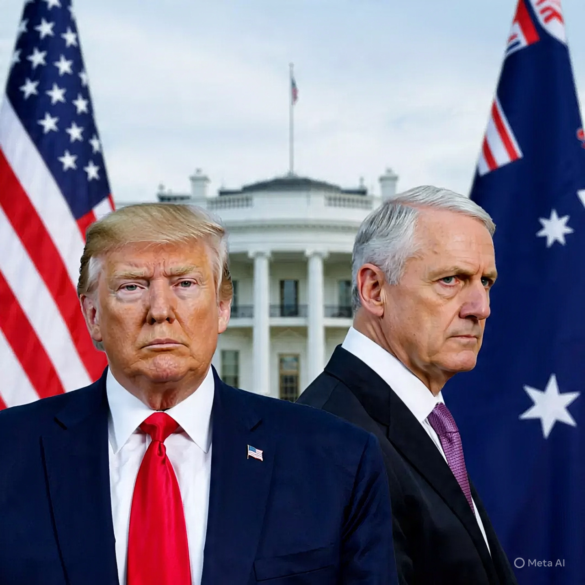

# Bully dalam Balutan Aliansi: Kritik Malcolm Turnbull terhadap Hegemoni Amerika Serikat di Era Trump

*Ilustrasi Malcolm Turnbull dan Donald Trump (pic: Meta AI).*

  
***Kritik Malcolm Turnbull terhadap pemerintahan Trump adalah lebih dari sekadar serangan personal***
  

Artikel ini mengevaluasi kritik mantan Perdana Menteri Australia Malcolm Turnbull terhadap kebijakan dan perilaku Presiden Amerika Serikat Donald Trump, khususnya penyebutan Trump sebagai “bully” dalam konteks tatanan politik global yang berubah. 

Melalui pendekatan hubungan internasional kritis dan realisme struktural, artikel ini menunjukkan bahwa kritik tersebut mencerminkan kegelisahan negara menengah terhadap dominasi hegemonik, ketegangan aliansi tradisional, dan perlunya strategi diplomatik yang adaptif di tengah disrupsi global. 

Penelitian ini menggunakan data pernyataan politik, konteks AUKUS, serta dinamika kebijakan luar negeri Australia dalam hubungan dengan AS.

## Pendahuluan

Pada Januari 2026, Malcolm Turnbull, mantan Perdana Menteri Australia, menyerukan kepada pemerintah Canberra untuk “mengakui realitas global baru” di bawah pemerintahan Presiden AS Donald Trump dan menolak berpura-pura normal seperti sebelumnya. 

Ia bahkan menyebut Trump sebagai “bully”, sebuah istilah bermuatan politik yang kuat yang merujuk pada perilaku agresif atau mendikte dalam hubungan bilateral. 

Pernyataan itu menunjukkan titik kritis dalam hubungan AS–Australia dan menandakan transformasi dalam persepsi aliansi tradisional ketika kekuatan global berubah.  

## Kerangka Teoretik

Pendekatan artikel ini didasarkan pada dua teori utama:

1.Realisme Struktural

Realisme struktural melihat hubungan internasional sebagai arena kompetisi kekuasaan di mana negara berperilaku berdasarkan kepentingan keamanan dan kelangsungan hidup. 

Di bawah paradigma ini, dominasi negara besar seperti AS sering dipandang sebagai sumber ketidakpastian bagi negara menengah seperti Australia. 

Bully bukan sekadar istilah emosional, tetapi indikasi persepsi perilaku hegemon yang tidak kooperatif dan mendesak sekutu untuk mengadopsi posisi yang lebih pragmatis.

2.Teori Aliansi dan Ketergantungan Militer

Dalam hubungan aliansi, negara menengah sering memiliki pergulatan internal antara kebutuhan strategis untuk mempertahankan hubungan dengan negara besar dan kebutuhan untuk menjaga otonomi kebijakan luar negeri sendiri. 

Kritik Turnbull dapat dipahami sebagai ekspresi ketegangan ini, terutama dengan kesepakatan AUKUS yang memperkuat keterikatan Australia pada AS tetapi juga mengekspos risiko strategis baru.

## Kritik Turnbull terhadap AS di Era Trump

Turnbull menilai bahwa pemerintahan Trump telah mengubah sifat aliansi tradisional sehingga Australia harus berhenti berpura-pura bahwa AS adalah mitra yang stabil dan dapat diprediksi seperti sebelumnya. 

Ia menyatakan:
“[…] Australians can see that the United States under Trump is not the United States we’d grown up to know and respect and work with.”  

Dalam konteks geopolitik, istilah bully ini bukan hanya retorika emosional, tetapi mencerminkan pandangan bahwa AS semakin sering menggunakan kekuatan politik dan diplomatik untuk mendikte persyaratan, mendesak sekutu untuk kompromi, dan menggeser perilaku aliansi tradisional ke arah yang lebih unilateral.

## AUKUS dan Ketidakseimbangan Strategis

Kerjasama AUKUS antara Australia, Inggris, dan AS merupakan contoh integrasi strategis yang mendalam. Namun kritik Turnbull menunjukkan bahwa:

•	Ketergantungan Australia pada AS meningkat

•	Negosiasi dengan AS cenderung reaktif, bukan strategis

•	Australia perlu memperkuat otonomi kebijakan luar negeri

Turnbull bahkan menekankan bahwa AS hanya “bernegosiasi ketika ada pushback (tahanan balik)”, menandakan perlunya Australia mengambil peran lebih proaktif dalam hubungan bilateral.  

## Aliansi dan Identitas Nasional

Pernyataan Turnbull mengandung pesan bahwa Australia harus mempertimbangkan bukan hanya aspek militer dari alliancenya, tetapi juga identitas nasional dan strategi geopolitik jangka panjang. 

Ketergantungan total pada AS tanpa evaluasi realitas politik global dapat mengarah pada dilema strategis, di mana Australia menjadi terlalu rentan pada kebijakan luar negeri AS yang berubah-ubah.

## Kritik terhadap Retorika dan Dampaknya

Istilah bully dalam diplomasi internasional lebih dari sekadar kata keras; ia merefleksikan perubahan persepsi tentang peran hegemon. 

Kritik semacam ini dapat:

•	mempengaruhi opini publik domestik tentang aliansi

•	mendorong perdebatan tentang diversifikasi hubungan internasional

•	mendorong negara menengah untuk memperkuat kemampuan otonom mereka

Kritik Malcolm Turnbull terhadap pemerintahan Trump adalah lebih dari sekadar serangan personal. 

Ia mencerminkan:
1.	Ketegangan strategis dalam hubungan aliansi di era global yang berubah cepat.
2.	Persepsi ketidakpastian perilaku hegemon yang memengaruhi kebijakan luar negeri negara menengah.
3.	Kebutuhan Australia mengakui realitas geopolitik baru dan menavigasi antara kepentingan keamanan yang terikat aliansi dan kebutuhan untuk otonomi strategis.  

  
**Referensi**

Turnbull urges Albanese to acknowledge new global political reality under ‘bully’ Trump. (2026, January 27). The Guardian.  

Jim Chalmers says Canadian PM’s ‘stunning’ denunciation of Trump is being widely discussed in Australian government. (2026, January). The Guardian.  

Defence department chief Greg Moriarty to succeed Kevin Rudd as Australian ambassador to US. (2026, January 25). The Guardian.  
