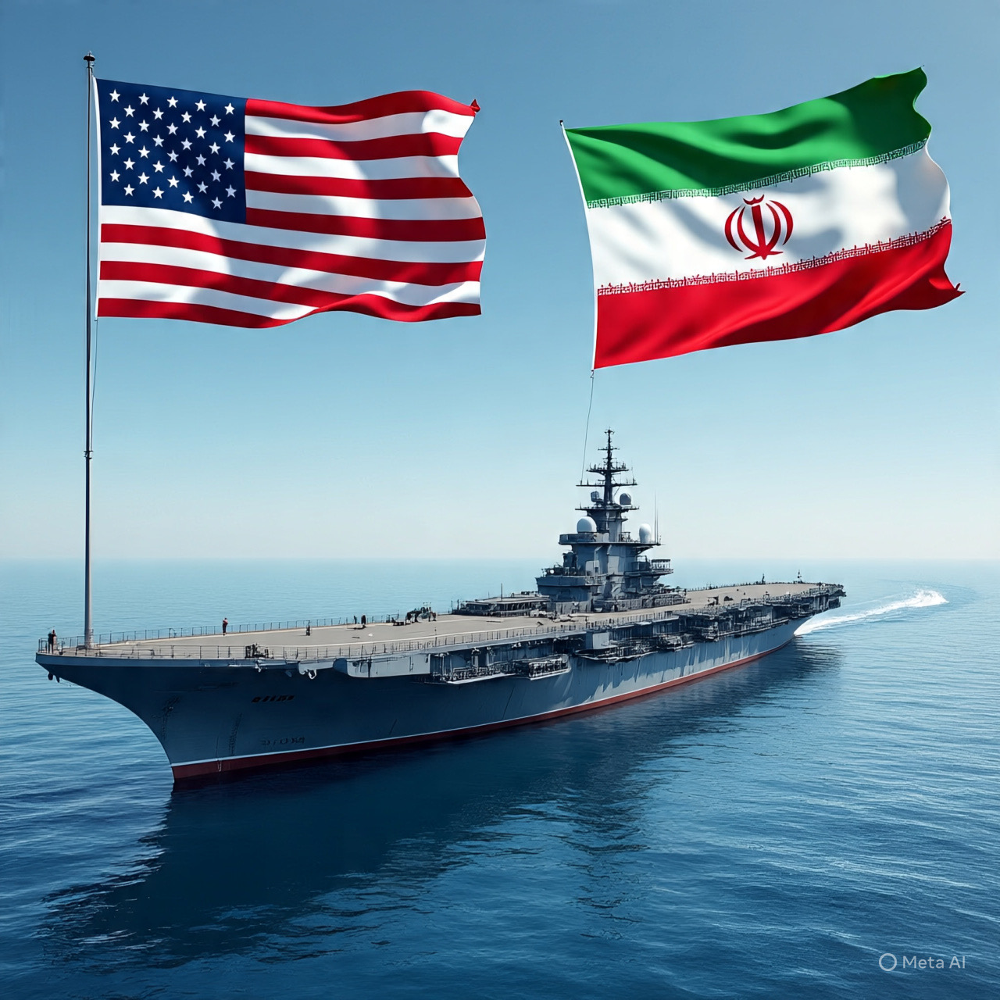

# Negosiasi di Bawah Bayang-Bayang Kapal Perang: Ketidakstabilan, Strategi Deterrence, dan Politik Global Iran–AS

*Ilustrasi ketegangan AS dan Iran (pic: AI Image Generator/Meta AI).*

  
***Ketegangan Iran dan AS berada pada fase coercive diplomacy kompleks, kekuatan militer digunakan sebagai alat tawar negosiasi, bahkan ketika jalur dialog tetap terbuka***
  

Ketegangan antara Republik Islam Iran dan Amerika Serikat mencapai puncaknya pada awal 2026, dengan pengerahan kekuatan militer AS ke Teluk Persia di tengah ancaman konfrontasi. Meskipun ada indikasi pembicaraan bilateral, retorika keras dan kesiapan militer terus muncul. 

Artikel ini menggunakan pendekatan hubungan internasional kritis, teori perang nuklir, dan hukum humaniter untuk menjelaskan dinamika ancaman, potensi eskalasi, dan kenapa strategi “pencet tombol nuklir sebagai pilihan respons” bukanlah opsi yang realistis atau sesuai hukum internasional. 

Fokus analisis meliputi: (1) upaya diplomasi, (2) logic deterrence dan teori keseimbangan nuklir, (3) implikasi hukum internasional, (4) skenario konflik regional, dan (5) pembacaan kontra-naratif populer.

## Konteks Ketegangan: Diplomasi vs Militer

Ketegangan Iran–AS di awal 2026 ditandai oleh dua dinamika utama:

1.Pengerahan Kekuatan Militer AS ke Teluk

AS mengerahkan gugus tugas kapal perang dan pesawat tempur ke kawasan Teluk sebagai bentuk tekanan strategis. 

Presiden AS Donald Trump menyatakan bahwa Iran sedang “seriously talking” dengan Washington, dengan harapan negosiasi dapat menghasilkan kesepakatan yang bisa diterima. 

Trump juga menekankan armada besar yang menuju wilayah tersebut sebagai sinyal kekuatan sekaligus penguat posisi tawar dalam negosiasi.  

2. Sikap Iran terhadap Negosiasi

Iran secara terbuka menyatakan kesiapan untuk berdialog dengan AS tanpa ancaman militer, menegaskan bahwa negosiasi yang dipaksakan “under the shadow of threats” akan ditolak. 

Menteri Luar Negeri Iran mengecam pengerahan militer AS sebagai upaya mendikte aktivitas militer Iran di perairan teritorialnya.  

## Ironi Logika Negosiasi dan Ancaman Militer

Penempatan kekuatan militer sering digunakan oleh negara dominan sebagai alat diplomasi tekanan (coercive diplomacy). 

Meski ada sinyal dialog, blok militer yang besar di perairan dekat Iran mencerminkan strategi tekanan maksimum tanpa eskalasi langsung — suatu bentuk calculated coercion. 

Strategi ini sering muncul pada fase awal konflik geopolitik ketika kedua pihak ingin memperkuat posisi negosiasi tanpa memulai perang penuh.  

## Keseimbangan Nuklir dan Implikasi Teoretis

Teori Deterrence (Penangkis). Dalam ilmu hubungan internasional dan studi keamanan nuklir, kekuatan nuklir berperan sebagai unsur pencegah (deterrent). 

Teori klasik seperti Mutually Assured Destruction (MAD) menunjukkan bahwa ancaman penggunaan nuklir hanya efektif sebagai pencegah jika dipandang rasional dan kredibel oleh kedua belah pihak. 

Menggunakan senjata nuklir secara proaktif biasanya mengakibatkan eskalasi total yang tidak rasional secara strategis bagi aktor negara yang sama kuatnya karena konsekuensi globalnya jauh di luar kontrol mereka.

Dalam konteks Iran – yang tidak memiliki senjata nuklir operasional dan berada di bawah rezim hukum internasional (NPT & IAEA), penggunaan atau ancaman penggunaan nuklir sebagai respon terhadap tekanan militer AS akan:

1.	Melanggar Traktat Non-Proliferasi Nuklir (NPT).

2.	Membuka legitimasi sanksi dan intervensi lebih luas.

3.	Memicu konsekuensi militer global dan retaliasi yang jauh lebih besar dari sekadar regional.

Analisis ini menunjukkan bahwa bahkan dalam kondisi tekanan maksimal, opsi nuklir bukan pilihan rasional tingkat negara yang ingin mempertahankan kelangsungan politik dan teritorialnya.

## Hukum Humaniter Internasional dan Norma Perang

Nuklir termasuk dalam kategori senjata dengan konsekuensi humaniter masif (mass humanitarian impact). 

Di bawah hukum humaniter internasional, penggunaan senjata yang tidak membedakan antara kombatan dan sipil adalah pelanggaran. 

Skala destruktif senjata nuklir juga menimbulkan isu legalitas di berbagai konvensi dan penafsiran norma global meskipun belum sepenuhnya dilarang secara absolut. 

Reaksi negara lain (termasuk kekuatan nuklir lain) terhadap penggunaan nuklir akan sangat cepat dan tegas, baik secara militer maupun hukum internasional.

## Realitas Politik Regional: Risiko Eskalasi vs Diplomasi Multilateral

Iran telah menyatakan bahwa serangan terhadap wilayahnya akan memicu konflik lebih luas di kawasan. 

Pemimpin Iran mengatakan bahwa serangan terhadap negara ini “would spark a regional war”. 

Amerika Serikat, di sisi lain, tidak mengabaikan kemungkinan dialog jika Iran membuka negosiasi yang “fair and equitable”.  

Hipotesis bahwa pasukan rahasia bisa “menculik pemimpin” sebagaimana di Venezuela, dan bahwa ancaman nuklir merupakan respon efektif, bukanlah analisis strategis yang sah dalam ilmu hubungan internasional. 

Itu lebih mirip narasi dramatis daripada opsi kebijakan nyata, karena:

•	operasi semacam itu akan memicu krisis legitimasi global dan kemungkinan balasan militer yang lebih luas;

•	penculikan pemimpin asing adalah pelanggaran berat hukum internasional, membuka intervensi kolektif;

•	retorika nuklir meningkatkan risiko proliferasi sebagai imbalan yang jauh lebih besar daripada apa pun yang bisa dihasilkan dari negosiasi ataupun konfrontasi berskala kecil.

Ketegangan antara Iran dan AS berada pada fase coercive diplomacy yang kompleks, di mana kekuatan militer digunakan sebagai alat tawar negosiasi, bahkan ketika jalur dialog tetap terbuka. 

Teori keseimbangan nuklir dan hukum humaniter internasional menunjukkan bahwa:

1.	Opsi “pencet tombol nuklir sebagai respons” tidak konsisten dengan strategi antikrisis dan hukum internasional.

2.	Diplomasi multilateral tetap menjadi jalur rasional terbaik untuk menghindari eskalasi besar.

3.	Risiko kepentingan regional  dapat mempengaruhi dinamika, tetapi bukan sebagai pemicu otomatis penggunaan senjata nuklir.

  
**Referensi**

•	Antara News. (2026, February 1). Trump sebut Iran sedang bernegosiasi dengan AS. ANTARA News.  

•	Anadolu Agency. (2026, January 31). Iran’s foreign minister slams US military deployment to Persian Gulf. Anadolu Agency.  

•	France 24. (2026, January 29). Warships and fighter jets: What is the “massive” US armada on its way to Iran? France 24.  

•	Reuters. (2026, February 1). Tehran warns of regional conflict if US attacks Iran. Reuters.  

•	AP News. (2026, February 1). Iran’s supreme leader warns any US attack would spark ‘regional war’. AP News.

•	Wald, M. L. (1989). Nuclear weapons and deterrence: A historical analysis. Journal of Strategic Studies.*
