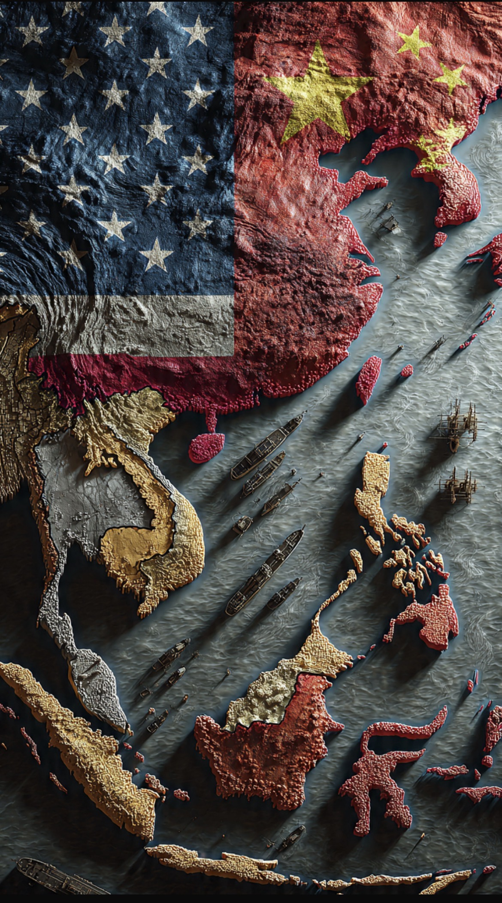

# ASEAN di Tengah Himpitan Tiga Badai: Rivalitas AS-China, Laut China Selatan & Ekonomi Global

*Ilustrasi (pic: Grok AI).*

  
***Tantangan terbesar ASEAN adalah perang bukan semata menghadapi China atau Amerika, melainkan mempertahankan otonomi strategisnya sendiri di tengah persaingan dua kekuatan besar***
  

ASEAN tidak ingin memilih kubu, tetapi masalahnya dua kekuatan terbesar dunia justru berharap ASEAN semakin dekat kepada masing-masing.

Amerika Serikat ingin ASEAN tetap mendukung tatanan internasional berbasis hukum, kebebasan navigasi, dan menjaga keseimbangan kekuatan di Indo-Pasifik.

Sedangkan China adalah mitra dagang terbesar ASEAN. Nilai perdagangan keduanya telah melampaui US$1 triliun, sehingga hampir semua ekonomi ASEAN memiliki ketergantungan yang besar terhadap pasar dan rantai pasok China.  

Itulah sebabnya ASEAN memilih strategi yang disebut hedging. Artinya tidak memusuhi China, tetapi juga tidak meninggalkan Amerika.

## Laut China Selatan Belum Selesai

Ini sumber tekanan kedua. 

Negara-negara ASEAN sendiri tidak sepenuhnya memiliki kepentingan yang sama. Misalnya Filipina bersikap paling keras, Vietnam juga aktif mempertahankan klaimnya, sementara Malaysia dan Brunei memiliki klaim tertentu, dan negara lain lebih berhati-hati karena hubungan ekonominya yang erat dengan Beijing.

Akibatnya ASEAN sering kesulitan mengeluarkan sikap yang benar-benar bulat. Pada KTT ASEAN 2026, para pemimpin kembali menyerukan pengendalian diri, penyelesaian damai, dan percepatan penyusunan Code of Conduct untuk Laut China Selatan.  

## Ekonomi Global Sedang Bergejolak

Konflik di Timur Tengah dan gangguan jalur energi membuat ASEAN khawatir terhadap harga minyak, inflasi, biaya logistik, ketahanan pangan, dan investasi.

Dalam KTT ASEAN 2026, isu ketahanan energi bahkan menjadi salah satu agenda utama karena dampak krisis di sekitar Selat Hormuz terhadap negara-negara pengimpor energi di Asia Tenggara.  

## Mengapa ASEAN Tidak Memilih Salah Satu?

Memilih salah satu risikonya besar. Kalau terlalu dekat ke AS, hubungan dagang dengan China bisa terganggu. Sedangkan kalau terlalu dekat ke China, akan muncul kekhawatiran mengenai keamanan dan sengketa maritim.

Jadi strategi ASEAN adalah menjaga ASEAN Centrality, yaitu tetap menjadi pusat dialog regional tanpa terseret menjadi blok salah satu kekuatan besar. Strategi ini terus ditekankan dalam berbagai pertemuan ASEAN.  

ASEAN hari ini ibarat penyeberang jembatan bambu di atas dua sungai yang sedang banjir.

Di kiri, ada kekuatan ekonomi China. Sementara di kanan, ada kekuatan militer Amerika Serikat. Di bawahnya… arus Laut China Selatan, dan di kejauhan…awan gelap ekonomi global.

Kalau melangkah terlalu jauh ke kiri, jembatan bisa miring. Kalau terlalu ke kanan… jembatan juga bisa patah.

Maka pilihan ASEAN bukan berlari, melainkan menjaga keseimbangan.

Itulah sebabnya sebagian analis menyebut tantangan terbesar ASEAN saat ini bukan semata menghadapi China atau Amerika, melainkan mempertahankan otonomi strategisnya sendiri di tengah persaingan dua kekuatan besar. 

Selama mampu menjaga keseimbangan itu, ASEAN masih memiliki ruang untuk menjadi aktor, bukan sekadar arena perebutan pengaruh. Namun jika persaingan AS-China semakin tajam, ruang gerak tersebut akan semakin sempit.

  
**Referensi**

Association of Southeast Asian Nations. (2026). Chairman’s Statement of the 48th ASEAN Summit.  

Reuters. (2026). ASEAN summit focuses on energy security and South China Sea.  

International Monetary Fund. (2025). Regional Economic Outlook: Asia and Pacific.

Council on Foreign Relations. Global Conflict Tracker. (2026).
