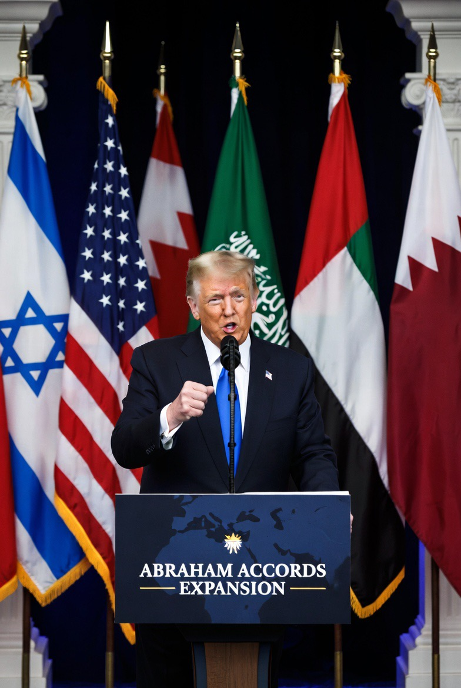

# Abraham Accords 2.0, “Gurita Israel”, dan Realignment Timur Tengah Pasca-Palestina?

*Ilustrasi  ekspansi Abraham Accords (pic: Grok AI).*

  
***Ketika semuanya sudah terhubung…
negara-negara kecil sering sadar: mereka masih merdeka secara bendera, tapi pilihan geopolitiknya mulai sempit***
  

Dorongan Donald Trump pada 27 Mei 2026 untuk memperluas Abraham Accords kembali membuka perdebatan besar di dunia Muslim dan geopolitik global. 

Di satu sisi, normalisasi dengan Israel menjanjikan perdagangan, teknologi, investasi, dan kerja sama keamanan. Di sisi lain, banyak pihak melihat proses ini sebagai realignment geopolitik yang mengorbankan isu Palestina demi kepentingan strategis anti-Iran dan stabilitas rezim regional. 

Tulisan ini membahas Abraham Accords bukan sebagai “perdamaian murni”, tetapi sebagai restrukturisasi kekuatan Timur Tengah dalam era pragmatisme ekstrem.

## Apa Itu Abraham Accords?

Secara resmi adalah perjanjian normalisasi hubungan antara Israel dan beberapa negara Arab/Muslim.

Dimulai 2020 oleh:
Uni Emirat Arab,
Bahrain,
lalu Maroko, Sudan.

Isi utamanya:
hubungan diplomatik,
perdagangan,
pariwisata,
teknologi,
keamanan,
intelijen.

Dan ya… 
semua itu berjalan tanpa penyelesaian negara Palestina terlebih dahulu.

## Kenapa Banyak Negara Tertarik?

Karena realpolitik itu dingin. Negara sering berpikir “apa keuntungan konkretnya buat kami sekarang?”

Dan Israel menawarkan:
teknologi militer,
cyber intelligence,
AI & keamanan digital,
akses ekonomi Barat,
kedekatan dengan Washington.

Bagi elite pragmatis itu jauh lebih “nyata daripada solidaritas simbolik yang tak kunjung menghasilkan solusi Palestina.

## Gurita Israel

Secara geopolitik… ada logikanya. Karena normalisasi bukan sekadar “ayo berteman” melainkan membangun:
jaringan ekonomi,
ketergantungan teknologi,
interoperabilitas militer,
pertukaran intelijen.

Begitu negara:
investasinya nyambung,
sistem senjatanya kompatibel,
data keamanannya terhubung,
maka kemampuan mereka untuk menentang Israel di masa depan otomatis melemah.

Dan inilah yang disebut “gurita”, bukan karena konspirasi mistik… tetapi karena jaringan ketergantungan strategis.

## Palestina Jadi “Harga” Normalisasi?

Nah… ini inti tragedinya.

Dulu posisi dunia Arab kira-kira “tak ada normalisasi sebelum negara Palestina.” Sekarang berubah menjadi “normalisasi dulu… Palestina nanti.”

Akibatnya:
leverage diplomatik Palestina menurun,
tekanan kolektif Arab melemah,
Israel mendapat legitimasi regional tanpa konsesi besar.

Dan itu yang membuat banyak aktivis Palestina merasa perjuangan mereka sedang dinegosiasikan tanpa mereka.

## Perdamaian Atau Koalisi Anti-Iran?

Abraham Accords lebih dekat ke strategic realignment daripada resolusi konflik Palestina. Karena fondasi tak tertulisnya adalah:
kekhawatiran terhadap Iran,
ancaman regional,
stabilitas rezim Teluk,
kepentingan AS.

Jadi, “musuh bersama” lebih penting daripada “solidaritas lama.”

## Dunia Muslim Terbelah

Sekarang ada dua kubu besar:

| Pragmatik | Prinsipil |
|------|-------|
| stabilitas ekonomi | solidaritas Palestina |
| investasi & teknologi | anti-normalisasi |
| keamanan regional | identitas ideologis |
| hubungan dengan AS | resistensi terhadap Israel |

Masalahnya:
kedua kubu sama-sama merasa paling realistis.

## Trump dan Proyek Warisan

Trump sangat menyukai:
deal besar,
simbol sejarah,
citra “pembawa perdamaian”.

Sehingga memperluas Abraham Accords memberi:
kemenangan diplomatik,
posisi historis,
dukungan lobi pro-Israel & sekutu Teluk.

Jadi slogan “perdamaian” memang ada…
tetapi isinya juga penuh:
kalkulasi kekuasaan,
arsitektur aliansi,
dan containment Iran.

## Risiko Besarnya

Kalau normalisasi terus meluas tanpa solusi Palestina, bisa muncul:
frustrasi publik Arab/Muslim,
delegitimasi elite pro-normalisasi,
radikalisasi baru,
dan rasa bahwa isu Palestina “dijual”.

Karena rakyat Palestina akan berpikir “kalau bahkan dunia Arab move on… lalu siapa lagi yang tersisa?”

Abraham Accords bukan dongeng perdamaian polos. Ia adalah proyek geopolitik besar untuk membentuk Timur Tengah baru.

Di dalamnya ada:
perdagangan,
teknologi,
keamanan,
anti-Iran coalition,
dan normalisasi Israel sebagai pusat jaringan regional.

Masalahnya: Palestina belum selesai.
Maka banyak orang melihat proses ini bukan sebagai perdamaian… melainkan “stabilisasi kawasan dengan mengorbankan inti konflik.”

Kekuatan modern tidak selalu menjajah dengan tank. Kadang ia datang lewat:
investasi,
software,
drone,
intelijen,
perdagangan,
dan ketergantungan keamanan.

Dan ketika semuanya sudah terhubung… negara-negara kecil sering sadar: mereka masih merdeka secara bendera,
tapi pilihan geopolitiknya mulai sempit. 

  
**Referensi**

Reuters. (2026, May 27). Trump pushes expansion of Abraham Accords.

Al Jazeera. (2026, May 27). Debate grows over normalization without Palestinian statehood.

Lynch, M. (2021). The Abraham Accords and the remaking of the Middle East. Foreign Policy.

Council on Foreign Relations. (2025). The geopolitics of the Abraham Accords.
