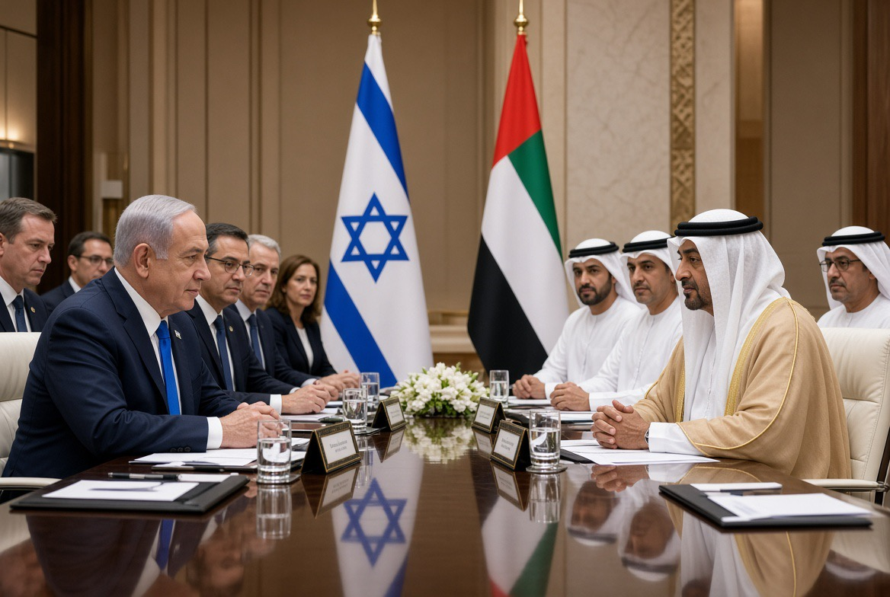

# Abu Dhabi di Tengah Badai: Netanyahu, MBZ, Iran, & Bayang-bayang 7 Oktober

*Ilustrasi (pic: Grok AI).*

  
***UAE dapat membutuhkan Israel untuk menghadapi Iran tanpa otomatis menerima seluruh kebijakan Israel terhadap Palestina***
  

Reuters mengonfirmasi bahwa Netanyahu mengunjungi Abu Dhabi pada Minggu, 27 September, bukan Senin 28 September, dan bertemu Sheikh Mohamed bin Zayed. Reuters kemudian melaporkan pada 28 September bahwa WAM, kantor berita resmi UAE, mengonfirmasi pertemuan tersebut. 

PMO Israel mengatakan kunjungan itu atas undangan MBZ dan membahas penguatan hubungan bilateral serta tantangan regional. Tiga pejabat senior Israel mengatakan pertemuan berlangsung sekitar enam jam dan fokus pada Iran. 

Detail penerbangan privat dan keberangkatan sekitar tengah hari, tiba 15:10, memang pertama diberitakan Channel 12 dan kemudian dikonfirmasi sumber Israel. Times of Israel melaporkan Netanyahu terbang dengan pesawat privat dan berada di UAE selama beberapa jam. 

Jadi ini bukan sekadar rumor internet. Pertemuannya confirmed.

## Dua Agenda yang Harus Dipisahkan

Agenda resminya adalah hubungan UAE-Israel ditambah tantangan regional. Itu yang dikatakan pemerintah UAE dan PMO Israel. WAM secara resmi hanya mengatakan kedua pihak membahas hubungan bilateral dan cara memperkuat serta mengembangkannya. 

Tetapi agenda yang dilaporkan sumber Israel adalah Iran. Tiga pejabat senior Israel mengatakan kepada Reuters bahwa Iran menjadi fokus pertemuan. 

Dan ini masuk akal secara geopolitik tanpa perlu membaca pikiran siapa pun.

UAE berada tepat di lingkungan strategis Iran. Perang yang dimulai dengan serangan AS-Israel terhadap Iran pada 28 Februari 2026 telah menjadikan Teluk, pangkalan AS, pelayaran, energi, dan pertahanan udara UAE bagian dari risiko regional. 

Reuters mencatat perang tersebut memang dimulai dengan serangan AS-Israel pada 28 Februari dan berlanjut dengan serangkaian serangan serta negosiasi yang gagal. 

Jadi Netanyahu punya alasan strategis yang sangat jelas untuk berbicara dengan MBZ soal Iran.

## Muncul Bom Politik Kedua: “Sudah Memperingatkan Netanyahu?”

Haaretz melaporkan bahwa Sheikh Mohamed diduga telah memberikan peringatan kepada Netanyahu sebelum serangan Hamas 7 Oktober 2023, mengenai ancaman serangan besar Hamas.

Netanyahu membantah laporan tersebut dan mengancam tindakan hukum terhadap Haaretz. 

Nah, lalu muncul laporan bahwa Netanyahu dalam pertemuan Abu Dhabi itu meminta MBZ membantah laporan tersebut.

AP/Times of Israel melaporkan klaim itu berdasarkan dua sumber yang diberi pengarahan mengenai perjalanan tersebut, termasuk satu sumber yang dikatakan memiliki informasi langsung. Tetapi UAE tidak mengonfirmasi permintaan itu.

Justru pernyataan resmi UAE hanya membahas hubungan bilateral. Tidak ada penyebutan tentang permintaan membantah peringatan 7 Oktober. 

PMO Netanyahu kemudian secara eksplisit menyangkal bahwa permintaan seperti itu pernah dibuat dan menyebut laporan tersebut fake news.”

Jadi secara epistemik, pertemuan adalah fakta. pembicaraan tentang Iran dilaporkan beberapa pejabat Israel, Netanyahu meminta MBZ membantah isu 7 Oktober laporan berbasis sumber anonim, dibantah PMO, tidak dikonfirmasi UAE. Itu level kepastian yang berbeda.

## Mengapa Timing-nya Begitu Sensitif?

Netanyahu baru saja berada di New York menghadapi tekanan internasional yang sangat besar mengenai Gaza, lalu pulang dan melakukan pertemuan tertutup dengan pemimpin Arab yang memiliki hubungan diplomatik dengan Israel.

Dan di saat yang sama, Iran sedang menjadi medan perang utama. Ini membuat UAE memiliki dua kepentingan yang kadang bertabrakan.

UAE perlu Israel untuk: koordinasi keamanan, pertahanan rudal, menghadapi ancaman regional, menjaga hubungan strategis yang dibangun sejak Abraham Accords.

Tetapi UAE juga perlu mencegah perang Iran melebar ke wilayah Teluk, melindungi pelabuhan dan energi, menjaga hubungan dengan Iran, mempertahankan legitimasi domestik dan regional, dan tidak terlihat sekadar menjadi perpanjangan strategi Israel.

Ini dilema negara Teluk yang sangat klasik, yaitu bekerja sama dengan Israel untuk keamanan, tanpa terseret terlalu dalam ke perang Israel.

## UAE Memiliki Posisi Berbeda dari Israel

Israel melihat Iran terutama melalui lensa ancaman keamanan eksistensial, program nuklir, kemampuan rudal, serta jaringan regional.

UAE melihat Iran juga sebagai tetangga geografis yang cuma dipisahkan Teluk.

Itu perbedaan besar.

Kalau Israel menyerang Iran dari jauh, masalah strategisnya bagi Israel adalah apakah Iran bisa membalas.

Sedangkan bagi UAE, pertanyaannya menjadi:: Kalau Iran membalas, misilnya jatuh di mana? Pelabuhan siapa? Kapal siapa? Bandara siapa? Fasilitas energi siapa? Pangkalan AS mana?

Makanya keamanan Teluk tidak bisa dibaca hanya sebagai “Israel versus Iran.” Ada negara-negara Arab yang harus hidup di antara keduanya.

## Bagian yang Paling Pahit

Di tengah semua kalkulasi itu ada Gaza.

Hubungan UAE-Israel tidak berhenti hanya karena perang Gaza. Bahkan ketika opini publik Arab sangat sensitif terhadap kehancuran Gaza, pemerintah UAE tetap mempertahankan jalur diplomatik dengan Israel.

Itu memperlihatkan sesuatu yang sering hilang dalam pemberitaan, yakni negara dapat mengecam atau prihatin terhadap konsekuensi kemanusiaan perang, tetapi tetap mempertahankan hubungan strategis karena kepentingan keamanan dan negara.

Jadi jangan dibaca sebagai UAE mendukung semua kebijakan Netanyahu, itu tidak terbukti. Tapi juga jangan dibaca sebagai UAE sudah memutuskan untuk berkonfrontasi dengan Israel, sebab itu juga tidak terbukti.

Yang terbukti adalah hubungan bilateral tetap berjalan dan bahkan sedang dibicarakan untuk diperkuat, sementara perang Iran membuat kebutuhan koordinasi keamanan semakin besar. 

## Kontroversi Peringatan 7 Oktober Mengubah Warna Pertemuan

Ini yang membuat kunjungan tersebut terasa jauh lebih berat daripada sekadar Netanyahu mampir Abu Dhabi, minum kopi, bicara Iran.

Karena kalau laporan Haaretz itu suatu hari terbukti benar, pertanyaannya menjadi sangat serius, yaitu: Siapa yang mengetahui ancaman? Kapan mereka mengetahuinya? Siapa yang menerima informasi? Apa yang dilakukan terhadap informasi tersebut?
Dan yang paling penting apakah informasi itu diteruskan kepada badan keamanan yang relevan?

Namun kita belum bisa melompat dari laporan peringatan menuju kesimpulan bahwa pemerintah Israel sengaja mengabaikannya. Karena Itu membutuhkan bukti dokumenter dan rantai komunikasi yang jelas.

Justru itulah mengapa isu ini sangat sensitif.

## Perang Narasi Tanggung Jawab

Perhatikan dua narasi yang sedang berhadapan.

Narasi Netanyahu: “Saya tidak menerima peringatan seperti yang dituduhkan.”

Jika benar, maka tanggung jawab atas kegagalan 7 Oktober harus dicari di tempat lain dalam sistem intelijen dan keamanan Israel.

Narasi laporan Haaretz: “Ada peringatan dari pemimpin regional yang relevan sebelum serangan.”

Jika benar, pertanyaan tanggung jawab berubah menjadi jauh lebih dekat kepada lingkaran politik dan pengambilan keputusan.

Karena itu, isu tersebut bukan gosip kecil. Ia menyentuh pertanyaan: Siapa yang tahu? Siapa yang diberi tahu? Siapa yang bertindak? Dan siapa yang kemudian mencoba mengendalikan narasi tentang apa yang sebenarnya diketahui?

Itulah sebabnya Netanyahu sangat berkepentingan membantahnya. Tapi kepentingan untuk membantah bukan bukti bahwa laporan itu benar.

Ini harus tetap dua arah.

## Ironi Geopolitik yang Sangat Besar

Netanyahu pergi ke Abu Dhabi untuk membicarakan ancaman Iran. Tetapi pada saat yang sama, pertemuan itu sendiri terseret ke dalam pertanyaan mengenai ancaman Hamas pada 2023.

Jadi satu meja diplomasi memuat dua perang, yakni Iran sebagai ancaman masa kini, dan 7 Oktober sebagai pertanggungjawaban masa lalu.

Dan di atas keduanya ada Gaza sebagai krisis kemanusiaan yang masih menentukan legitimasi regional Israel.

Makanya Abu Dhabi pada 27 September bukan sekadar titik di peta. Ia adalah simpul tiga persoalan,  yaitu KEAMANAN, Israel-UAE menghadapi Iran, serta AKUNTABILITAS.

Siapa yang mengetahui ancaman sebelum 7 Oktober? PALESTINA. Bagaimana hubungan dengan Israel dapat dipertahankan ketika Gaza masih menjadi luka terbuka?

Yang paling menarik dari pertemuan ini bukan sekadar Netanyahu diam-diam datang ke UAE. Yang menarik adalah apa yang pertemuan itu ungkap tentang politik Timur Tengah, bahwa negara-negara tidak hidup dalam satu moralitas tunggal. Mereka hidup dalam beberapa kepentingan yang bertabrakan sekaligus.

UAE dapat membutuhkan Israel untuk menghadapi Iran tanpa otomatis menerima seluruh kebijakan Israel terhadap Palestina.

Netanyahu dapat membutuhkan UAE untuk koordinasi keamanan sementara pada saat yang sama menghadapi kontroversi mengenai apakah UAE pernah memperingatkannya tentang Hamas.

Dan UAE dapat memilih tidak ikut campur dalam kontroversi domestik Israel, sebagaimana dilaporkan Times of Israel, sementara tetap mempertahankan jalur komunikasi langsung dengan Israel. 

Sementara Palestina?

Palestina kembali menjadi titik yang harus dilewati oleh semua kalkulasi strategis itu, meskipun sering tidak menjadi subjek utama meja perundingannya.

Dan itu mungkin bagian paling getirnya.

Karena di balik kata-kata seperti “regional challenges”, “bilateral relations”, “Iran”, dan “security”, ada jutaan manusia Palestina yang bagi mereka “regional security” bukan istilah diplomatik.

Itu berarti: rumah, keluarga, pengungsian, sekolah. makanan, kuburan, dan apakah besok masih ada tempat untuk pulang. 

  
**Referensi:** Reuters, 27–28 Sep 2026; WAM/UAE; AP/Times of Israel, 28 Sep 2026; Haaretz, 28 Sep 2026. 
