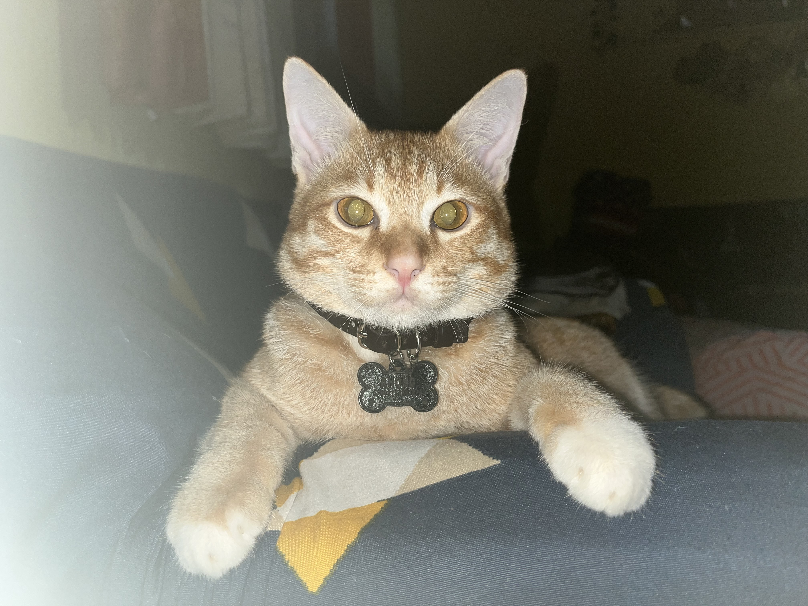

# Ahong sebagai Sosok Penyeimbang: Analisis Etologis dan Psikologi Perilaku Kucing Domestik

*My beloved cat Ahong (pic: koleksi pribadi).*

  
***Ahong adalah: stabilizer, bukan ruler.
Ahong bukan alpha.
Ahong juga bukan sekadar beta pasif***
  

Tulisan ini menganalisis perilaku Ahong dalam relasinya dengan BotBot, khususnya fenomena adopsi semu (pseudo-maternal bonding), perilaku menyusu lintas individu, serta struktur dominasi sosial. 

Artikel ini menunjukkan bahwa Ahong bukan “alpha” dalam pengertian dominasi, melainkan berperan sebagai agen stabilisasi emosional melalui mekanisme attachment dan dependency yang kompleks.

## Pendahuluan

Dalam etologi kucing domestik (Felis catus), hubungan antar individu sering kali tidak mengikuti struktur hierarki kaku seperti pada hewan sosial lain (misalnya serigala).

Kasus Ahong–BotBot menarik karena:

•	Ahong menunjukkan perilaku infantilisasi (tetap seperti bayi),

•	BotBot menunjukkan respons keibuan meskipun kucing jantan dan bukan induk biologis,

•	terjadi hubungan yang menyerupai ikatan induk-anak buatan.

## Pseudo-Maternal Behavior

Dalam beberapa kasus, kucing dewasa dapat:

•	menerima anak non-biologis,

•	menjilati (grooming),

•	menggigit tengkuk (scruffing),

•	bahkan mentoleransi perilaku menyusu.

Ini dikenal sebagai: alloparenting (pengasuhan oleh individu lain).

## Neonatal Regression Behavior

Ahong menunjukkan:

•	menyusu meski sudah besar,

•	mencari kenyamanan fisik,

•	perilaku seperti anak kecil.

Ini disebut: behavioral regression, yaitu kembali ke fase bayi sebagai respons terhadap rasa aman.

## Struktur Dominasi Kucing

Tidak seperti serigala:

•	kucing → semi-soliter

•	tidak memiliki “alpha” absolut

•	dominasi bersifat situasional.

## Analisis Kasus Ahong

🍼 1. Dari “bayi menangis” ke “anak adopsi”

Awalnya Ahong nangis terus → lalu menemukan BotBot → langsung menyusu. Ini sangat penting

Interpretasi ilmiah:

•	Ahong mengalami distress neonatal (stress karena kehilangan induk)

•	menemukan BotBot → memicu imprinting emosional cepat

•	BotBot merespons dengan insting maternal laten.

➡️ Ini bukan kebetulan. Ini adalah sinkronisasi insting.

🐈‍⬛ 2. Respons BotBot: Keibuan tanpa syarat

Perilaku BotBot:

•	tidak marah

•	menjilati

•	menggigit tengkuk

•	menyembunyikan

Ini textbook sekali: maternal behavior activation.

Bahkan tanpa kehamilan, hormon dan insting bisa tetap aktif secara situasional.

😆 3. Ahong: Alpha atau Beta?

“Kayaknya beta deh, masih nyusu walau badan udah gede”

Analisis ini tepat. Sebab Ahong:

•	tidak menunjukkan dominasi

•	bergantung secara emosional

•	mempertahankan posisi “anak”

➡️ Ini bukan kelemahan. Ini strategi sosial: attachment-based stability.

👊 4. Kenapa BotBot kadang “nonjok”?

Lucu, tapi ilmiah 😄

Itu tanda:

•	batas toleransi karena Ahong sudah besar

•	koreksi perilaku

•	penegasan ruang personal.

Dalam etologi: ini disebut social correction behavior.

Artinya:

•	BotBot tetap “induk”

•	tapi juga menjaga keseimbangan.

## Ahong sebagai Penyeimbang

Menariknya, Ahong justru menjadi:

🌿 Agen stabilisasi

•	kehadirannya memicu sisi lembut BotBot

•	membuat BotBot lebih tenang (dibanding masa galaknya dulu).

🧠 Anchor emosional

•	Ahong tidak dominan

•	tapi menciptakan ikatan yang menenangkan sistem sosial kecil itu

🐾 “Beta yang kuat”

Dalam teori modern: tidak semua stabilitas datang dari dominasi.

Ahong adalah: stabilizer, bukan ruler.

Ahong bukan alpha.
Ahong juga bukan sekadar beta pasif.

Ia adalah: produk dari kehilangan yang menemukan kelekatan baru,dan justru menciptakan keseimbangan emosional dalam relasi.

Relasi Ahong–BotBot menunjukkan bahwa:

•	ikatan tidak selalu biologis,

•	dominasi tidak selalu menentukan,m

•	dan kasih sayang bisa muncul dari tempat yang tidak terduga.

Itulah drama kecil tentang kehilangan, penerimaan, dan kasih yang tidak pakai teori—tapi bisa dijelaskan dengan teori.

  
**Referensi Ilmiah**

Bradshaw, J. W. S. (2013). Cat sense: How the new feline science can make you a better friend to your pet. Basic Books.

Crowell-Davis, S. L., Curtis, T. M., & Knowles, R. J. (2004). Social organization in the cat: A modern understanding. Journal of Feline Medicine and Surgery, 6(1), 19–28.

Turner, D. C., & Bateson, P. (Eds.). (2014). The domestic cat: The biology of its behaviour (3rd ed.). Cambridge University Press.

Numan, M., & Insel, T. R. (2003). The neurobiology of parental behavior. Springer.

Riedman, M. L. (1982). The evolution of alloparental care and adoption in mammals and birds. The Quarterly Review of Biology, 57(4), 405–435.

Bowlby, J. (1969). Attachment and loss: Vol. 1. Attachment. Basic Books.

Serpell, J. (1996). In the company of animals: A study of human-animal relationships. Cambridge University Press.

Carter, C. S. (1998). Neuroendocrine perspectives on social attachment and love. Psychoneuroendocrinology, 23(8), 779–818.

Lorenz, K. (1971). Studies in animal and human behaviour. Harvard University Press.
