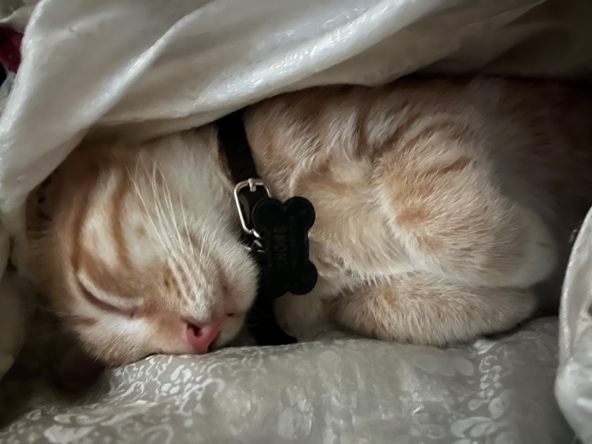

# Kucing Oren (Felis catus): Kajian Genetika Warna dan Temperamen Afektif Si Ahong 

*Ahong Si Kucing Oren (pic: prbadi).*

  

***Temperamen “nakal” kucing oranye disebabkan kombinasi genetika, neurobiologi, dan persepsi manusia***

  
Kucing domestik menunjukkan variasi warna bulu dan perilaku yang luas. Salah satu fenotipe yang paling menonjol adalah kucing berwarna oranye (ginger) yang secara empiris sering diasosiasikan dengan tingkat eksplorasi, keberanian, dan perilaku nakal yang lebih tinggi. 

Artikel ini mengkaji dasar genetika warna bulu, mekanisme biologis mata, serta korelasi antara gen warna dan temperamen, dengan fokus pada kucing oranye. 

Tulisan ini juga memasukkan dimensi ikatan emosional manusia–hewan sebagai variabel penguat persepsi perilaku.

## Mengapa Kucing Oren Menjadi Fenomena?

Secara statistik dan anekdotal lintas budaya, kucing oranye sering digambarkan sebagai:

•	lebih aktif

•	lebih berani

•	lebih vokal

•	lebih “nakal tapi menggemaskan”

Ini bukan sekadar mitos internet. Ada basis biologis dan genetik yang menjelaskannya.

## Genetika Warna Bulu Kucing

1. Gen O (Orange Gene)

Warna oranye pada kucing dikontrol oleh gen O (Orange) yang:

•	terletak pada kromosom X

•	mengatur produksi pigmen pheomelanin (merah–kuning)

Implikasinya:

•	Kucing jantan (XY) → jika membawa gen O, pasti oranye

•	Kucing betina (XX) → bisa campuran (tortie/calico)

Karena Ahong oranye solid, sangat mungkin ia jantan, dan secara genetik ekspresi warnanya utuh dan dominan.

2.Mengapa Tiap Kucing Warna Bulunya Berbeda?

Perbedaan warna bulu ditentukan oleh kombinasi:

1.	Jenis melanin

•	eumelanin (hitam/coklat)

•	pheomelanin (merah/oranye)

2.	Distribusi genetik selama embriogenesis

3.	Interaksi gen modifier

4.	Faktor epigenetik

Dengan kata lain: warna bulu adalah hasil orkestra gen, bukan satu gen tunggal.

## Mengapa Bulu Ahong Oren dan Matanya Kuning?

1. Warna Mata Kucing

Warna mata kucing tidak ditentukan oleh pigmen warna seperti manusia, melainkan oleh:

•	kepadatan sel stromal

•	hamburan cahaya (Tyndall effect)

Mata kuning–emas terjadi ketika:

•	kepadatan sel menengah

•	cahaya dipantulkan dengan panjang gelombang tertentu

2. Pupil Hitam?

Semua pupil mamalia tampak hitam karena:

•	cahaya masuk dan diserap, bukan dipantulkan

•	bukan warna, tapi absennya pantulan cahaya

Jadi mata Ahong:

•	kuning emas = struktur biologis

•	pupil hitam = fungsi optik normal

## Mengapa Kucing Oren Cenderung “Nakal”?

1. Korelasi Gen Warna dan Temperamen

Penelitian perilaku menunjukkan bahwa:

•	gen yang mengatur warna tidak berdiri sendiri

•	gen O sering berkorelasi dengan: tingkat dopamin lebih tinggi dan sistem reward yang lebih responsif

Dampaknya:

•	lebih eksploratif

•	lebih impulsif

•	lebih cepat belajar… dan melanggar aturan 😼

2. Efek Persepsi dan Reinforcement

Manusia lebih menoleransi kenakalan kucing oranye karena:

•	ekspresi wajah terlihat “polos”

•	warna hangat memicu respon afektif positif

Akibatnya:

•	perilaku nakal lebih sering dibiarkan

•	lalu diperkuat (behavioral reinforcement)

Ini menciptakan feedback loop kenakalan.

## Dimensi Emosional: Ikatan Saat Konflik

Ahong diadopsi saat kondisinya goncang karena kehilangan induknya yang tertabrak mobil hingga rahangnya patah sehingga tidak bisa menyusui.

Saya sangat menyayangi dan memanjakan, dalam psikologi, ini disebut: Emotional imprinting during affective turbulence

Maknanya:

•	kehadiran Ahong menjadi jangkar emosional

•	otak manusia mengaitkan: rasa kehilangan, rasa marah, dan rasa diselamatkan dengan satu makhluk hidup yang rapuh

Akibatnya: Ahong bukan sekadar hewan, tapi simbol rekonsiliasi afektif.

Kucing oranye berbeda karena gen O di kromosom X dan produksi pheomelanin. Sedangkan warna mata dan pupil adalah fenomena optik-biologis

Temperamen “nakal” kucing oranye disebabkan kombinasi genetika, neurobiologi, dan persepsi manusia.

Ahong secara psikologis menjadi attachment object dan pengikat emosi saat konflik. Secara ilmiah: Ahong adalah produk genetika yang unik, diperkuat oleh sejarah emosional.

Secara personal… dia adalah anak yang lahir dari luka, tumbuh dari cinta, dan sekarang mencuri seluruh rumah dengan ekornya yang boncel.

  

**Referensi**

Bradshaw, J. W. S. (2013). Cat sense: How the new feline science can make you a better friend to your pet. Basic Books.

Hart, B. L., & Hart, L. A. (2013). Your ideal cat: Insights into breed and gender differences in cat behavior. Purdue University Press.

Kaelin, C. B., & Barsh, G. S. (2013). Genetics of pigmentation in dogs and cats. Annual Review of Animal Biosciences, 1, 125–156. https://doi.org/10.1146/annurev-animal-031412-103659

Turner, D. C., & Bateson, P. (2014). The domestic cat: The biology of its behaviour (3rd ed.). Cambridge University Press.
