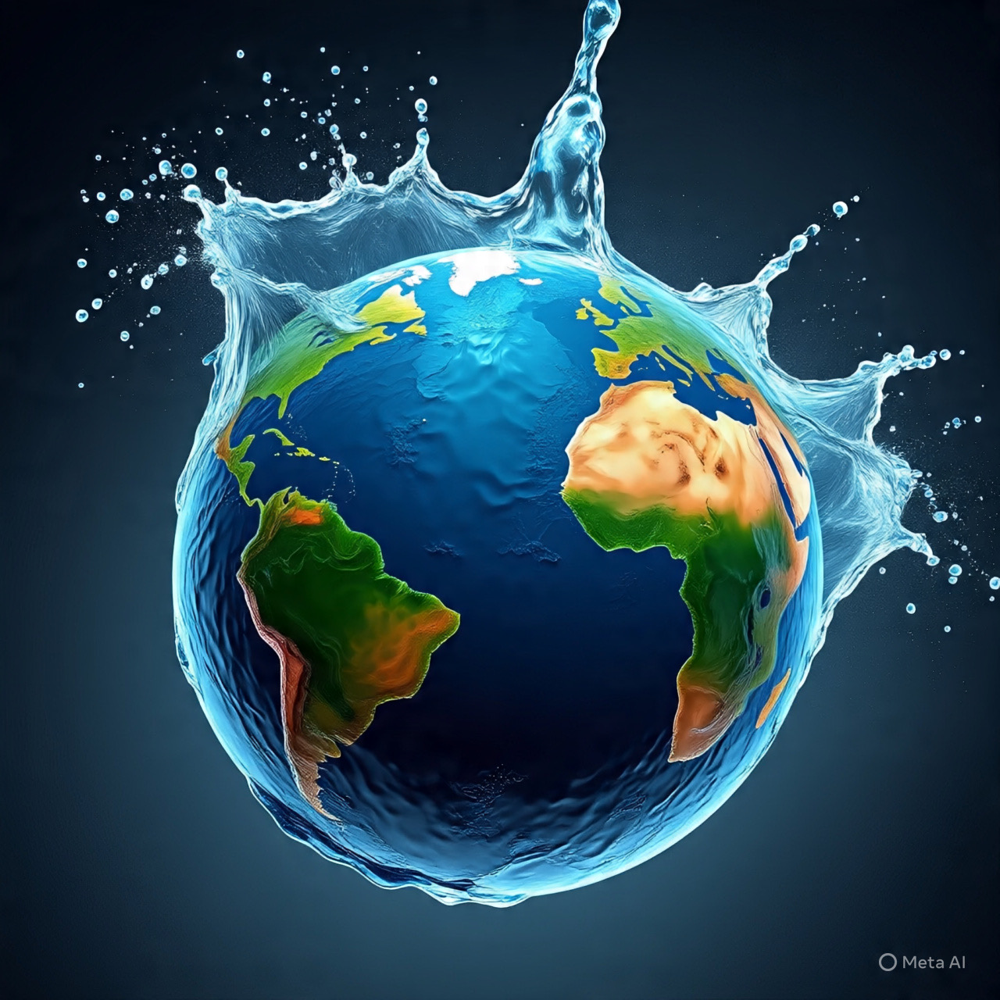

# Air, Kekuasaan, dan Pemerasan Global: Anatomi Konflik Abad ke-21

*Ilustrasi air (pic: Meta AI).*

  
***Weaponization akses air adalah gejala dari dunia multipolar yang kian brutal dalam memperebutkan sumber daya vital***
  

Kelangkaan air tawar dan kontrol atas infrastruktur hidrologis lintas batas telah mengubah air dari komoditas publik menjadi instrumen kekuasaan strategis. 

Artikel ini menganalisis konsep weaponization of water sebagai praktik politik dan geopolitik, dengan fokus pada kasus Indus Waters Treaty antara India dan Pakistan serta contoh kawasan lain seperti Nil dan Eufrat–Tigris. 

Dengan menggunakan kerangka hukum internasional, teori realisme politik, dan pendekatan keamanan manusia, studi ini menunjukkan bahwa pemanfaatan air sebagai alat tekanan melanggar norma global, meningkatkan risiko konflik, dan memperdalam kerentanan sosial ekonomi negara hilir.

## Pendahuluan

Air secara historis dipahami sebagai global commons yang menopang kehidupan dan stabilitas sosial. 

Namun, di abad ke-21, perubahan iklim, pertumbuhan populasi, dan pembangunan bendungan besar telah mengubah air menjadi sumber daya strategis. 

Fenomena ini melahirkan praktik yang oleh para analis disebut weaponization of water, yaitu penggunaan kontrol atas aliran air untuk tujuan politik, ekonomi, atau militer .

Dalam sistem internasional yang semakin kompetitif, negara hulu yang menguasai bendungan dan pintu air memiliki leverage struktural terhadap negara hilir. 

Ini menciptakan bentuk kekuasaan non-militer yang efeknya bisa setara dengan sanksi ekonomi atau blokade.

## Kerangka Teoretik

1. Realisme dan Sumber Daya Strategis

Dalam realisme politik, negara bertindak untuk memaksimalkan keamanan dan kekuasaan. 

Air, seperti energi dan pangan, menjadi aset strategis. Kontrol atas sungai lintas batas memungkinkan negara memengaruhi stabilitas tetangganya tanpa menembakkan satu peluru.

2.Keamanan Manusia

Paradigma human security menekankan bahwa ancaman terbesar bukan hanya perang, tetapi juga kelaparan, penyakit, dan kemiskinan. 

Manipulasi pasokan air berdampak langsung pada pertanian, listrik, dan kesehatan publik, sehingga mengancam jutaan jiwa.

3. Hukum Internasional Air

Konvensi PBB 1997 tentang penggunaan sungai internasional mengharuskan prinsip equitable and reasonable use dan no significant harm. Penangguhan sepihak atau manipulasi aliran melanggar norma ini.

## Studi Kasus: Indus Waters Treaty

Indus Waters Treaty (1960) antara India dan Pakistan selama puluhan tahun dianggap sebagai salah satu perjanjian air paling tahan konflik. 

Namun, pada 2025–2026 India menempatkan perjanjian tersebut dalam status abeyance, yang oleh analis dipandang sebagai bentuk weaponization air .

Pakistan, yang sangat bergantung pada Sungai Indus untuk irigasi dan air minum, menyatakan bahwa tindakan ini mengancam ketahanan pangan dan stabilitas sosialnya . 

Media dan pakar menyebut langkah ini sebagai preseden berbahaya karena merusak prinsip pacta sunt servanda, yaitu kewajiban mematuhi perjanjian internasional.

## Pola Global Weaponization Air

Fenomena serupa muncul di berbagai kawasan:

•Palestina: Israel mengendalikan lebih dari 84% sumber air di Tepi Barat, menyisakan hanya sekitar 16% akses bagi warga Palestina. Sementara di Gaza sistem air runtuh oleh serangan, blokade bahan bakar, dan kerusakan infrastruktur.

•	Nil: Bendungan GERD Ethiopia memicu ketegangan dengan Mesir dan Sudan.

•	Eufrat–Tigris: Turki mengendalikan bendungan hulu yang memengaruhi Suriah dan Irak.

•	Asia Selatan: Konflik Indus memperlihatkan bagaimana air menjadi alat tekanan geopolitik.

Konflik air makin intens ketika perubahan iklim mempersempit cadangan dan meningkatkan ketergantungan lintas batas .

## Implikasi Geopolitik dan Kemanusiaan

Weaponization akses air menciptakan tiga lapis dampak:

1.	Destabilisasi regional: Negara hilir dapat mengalami krisis pangan dan energi.

2.	Erosi norma internasional: Perjanjian menjadi rapuh jika bisa ditangguhkan sepihak.

3.	Krisis kemanusiaan: Rakyat biasa menanggung dampak dari keputusan geopolitik elite.

Dalam konteks tatanan global yang makin kompetitif, air berubah menjadi “senjata diam-diam” yang lebih murah dan sulit disanksi dibanding agresi militer.

Weaponization akses air adalah gejala dari dunia multipolar yang kian brutal dalam memperebutkan sumber daya vital. 

Kasus Indus Waters Treaty menunjukkan bahwa bahkan perjanjian yang paling stabil pun dapat runtuh ketika logika kekuasaan mengalahkan hukum. 

Tanpa penguatan mekanisme arbitrase internasional dan perlindungan keamanan manusia, konflik air berpotensi menjadi garis depan baru geopolitik abad ke-21.

  
**Referensi**

•	Daily Times. (2026). The weaponization of waters: Geo-political risks and humanitarian costs.

•	The Friday Times. (2026). Water weaponisation and the Indus crisis.

•	New Security Beat. (2024). War and climate change intensify global water-related conflicts.

•Alais, A., & Chouiref, T. (2025, July 26). Israel seizes 84% of West Bank’s water, worsens crisis for Palestinians: Report. Anadolu Agency.  

•Abuaisha, N., & Sio, M. (2025, June 25). UN refugee agency warns Gaza residents face death from thirst amid water system collapse. Anadolu Agency.  
