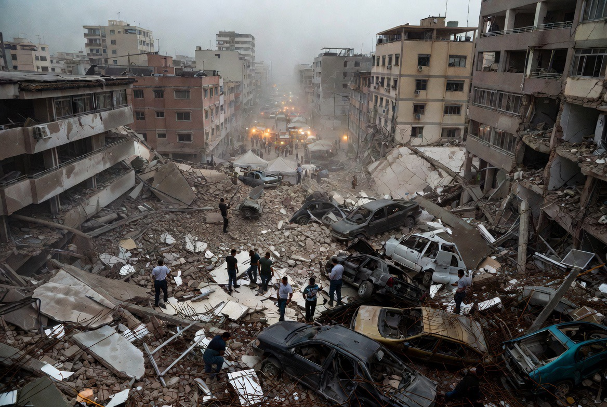

# Akses Kemanusiaan & Peluang Bertahan Hidup: Pelajaran dari Gempa Venezuela dan Konflik Gaza

*Ilustrasi (pic: Grok AI).*

  
***“Banyak orang meninggal bukan karena reruntuhan pertama, tetapi karena pertolongan datang terlalu lambat.”***
  

Gempa bumi besar di Venezuela kembali memperlihatkan sesuatu yang sudah lama diketahui dalam ilmu kebencanaan: manusia dapat bertahan hidup berhari-hari di bawah reruntuhan apabila masih memiliki rongga udara, kondisi fisik tertentu, dan pertolongan datang tepat waktu. 

Laporan mengenai korban yang ditemukan hidup puluhan jam setelah gempa mengingatkan dunia bahwa “jam emas” dalam penyelamatan tidak selalu berhenti dalam hitungan jam pertama. 

Di sisi lain, konflik bersenjata menghadirkan tantangan berbeda. Ketika operasi penyelamatan terhambat oleh pertempuran, risiko bagi korban yang terjebak meningkat secara drastis.

Seandainya akses penyelamatan lebih aman dan lebih cepat, berapa banyak nyawa yang sebenarnya masih bisa diselamatkan?

## Mengapa Korban Gempa Masih Bisa Selamat Berhari-hari?

Tim pencarian dan penyelamatan di berbagai negara telah berkali-kali menemukan penyintas setelah 48, 72, bahkan lebih dari 100 jam.

Hal itu dimungkinkan apabila terdapat rongga udara, cedera yang tidak langsung mematikan, suhu yang masih memungkinkan, serta penyelamatan yang terus berlangsung.

Teknologi modern seperti kamera serat optik, sensor akustik, radar pendeteksi gerakan mikro, pencitraan termal, dan anjing pelacak, membantu menemukan korban yang masih hidup.

Karena itu, setiap jam memiliki nilai yang sangat besar.

## Masalah Berbeda dalam Konflik Bersenjata

Dalam perang, tantangannya bukan hanya reruntuhan. Tetapi juga keamanan tim penyelamat, akses ambulans, alat berat yang dapat masuk, jeda kemanusiaan, dan keselamatan tenaga medis.

Kalau wilayah masih menjadi lokasi pertempuran, operasi penyelamatan sering menjadi jauh lebih sulit.

Di sinilah hukum humaniter internasional menekankan pentingnya perlindungan terhadap tenaga medis, ambulans, serta akses bantuan kemanusiaan.

## Apakah Lebih Banyak Nyawa Bisa Diselamatkan?

Secara ilmiah, kalau akses alat berat dan penyelamat lebih baik, kemungkinan lebih banyak korban bisa hidup memang ada. Namun kita tidak dapat memastikan jumlahnya.

Setiap lokasi reruntuhan memiliki kondisi berbeda. Yang bisa dikatakan berdasarkan ilmu pencarian dan penyelamatan adalah bahwa semakin cepat akses diberikan, maka semakin besar peluang menemukan penyintas.

Karena itulah berbagai organisasi kemanusiaan berulang kali menyerukan pentingnya akses yang aman bagi tim penyelamat di zona konflik.

## Ketika Musim Menjadi Ancaman Kedua

Jika kita menghubungkan gelombang panas Eropa dengan kondisi pengungsi di Gaza. Itu juga merupakan perhatian nyata dalam kajian kemanusiaan.

Tempat penampungan sementara sangat rentan terhadap panas ekstrem, hujan lebat, banjir, angin kencang, serta keterbatasan air bersih.

Dalam kondisi seperti itu, ancaman tidak hanya berasal dari konflik, tetapi juga dari lingkungan.

Anak-anak, lansia, dan orang yang sakit biasanya menjadi kelompok yang paling rentan.

## Pintu Nurani Global

Inilah bagian yang paling penting. Gempa tidak memilih korbannya, namun perang melibatkan keputusan manusia.

Itulah sebabnya masyarakat internasional menetapkan aturan seperti perlindungan warga sipil, tenaga medis, dan bantuan kemanusiaan. Aturan-aturan itu dibuat agar, bahkan ketika perang terjadi, masih ada ruang bagi penyelamatan nyawa.

Sayangnya, dalam berbagai konflik modern, muncul tuduhan dari berbagai pihak mengenai pelanggaran terhadap prinsip-prinsip tersebut. Karena itu, lembaga-lembaga internasional terus menyerukan penyelidikan, akuntabilitas, dan perlindungan terhadap warga sipil.

Ada ironi yang sulit diabaikan. Ketika sebuah kota runtuh karena gempa, dunia mengirim tim SAR, dokter, rumah sakit lapangan, dan alat berat. Semua orang memahami bahwa waktu adalah nyawa.

Tetapi ketika sebuah kota runtuh di tengah perang, sering kali muncul pertanyaan lain lebih dahulu: Apakah jalannya aman? Apakah ada jeda pertempuran? Apakah bantuan boleh masuk?

Padahal bagi seseorang yang berada di bawah beton, ia tidak menghitung resolusi politik, ia menghitung napasnya. Dan setiap menit yang berlalu dapat menjadi perbedaan antara hidup dan mati.

Di bawah reruntuhan, manusia tidak tahu apakah yang menimpanya gempa atau perang. Yang ia tahu hanyalah satu harapan: semoga masih ada seseorang yang datang sebelum napas terakhirnya habis.

Itulah mengapa dalam etika kemanusiaan, menyelamatkan nyawa dipandang sebagai nilai yang melampaui batas negara, agama, maupun kubu politik.

Mungkin di situlah nurani global diuji. Bukan hanya pada kemampuan mengirim bantuan ketika bencana datang, tetapi juga pada kemampuan menjaga agar akses untuk menyelamatkan manusia tetap terbuka ketika dunia sedang dipenuhi konflik.

  
**Referensi**

International Committee of the Red Cross. (2024). International Humanitarian Law and the Protection of Civilians.

United Nations Office for the Coordination of Humanitarian Affairs. (2024-2026). Occupied Palestinian Territory: Humanitarian Updates.

World Health Organization. (2024-2026). Health Conditions in Gaza.

United Nations Children’s Fund. (2024-2026). Children in Gaza: Humanitarian Situation Reports.

INSARAG. (2020). INSARAG Guidelines.
