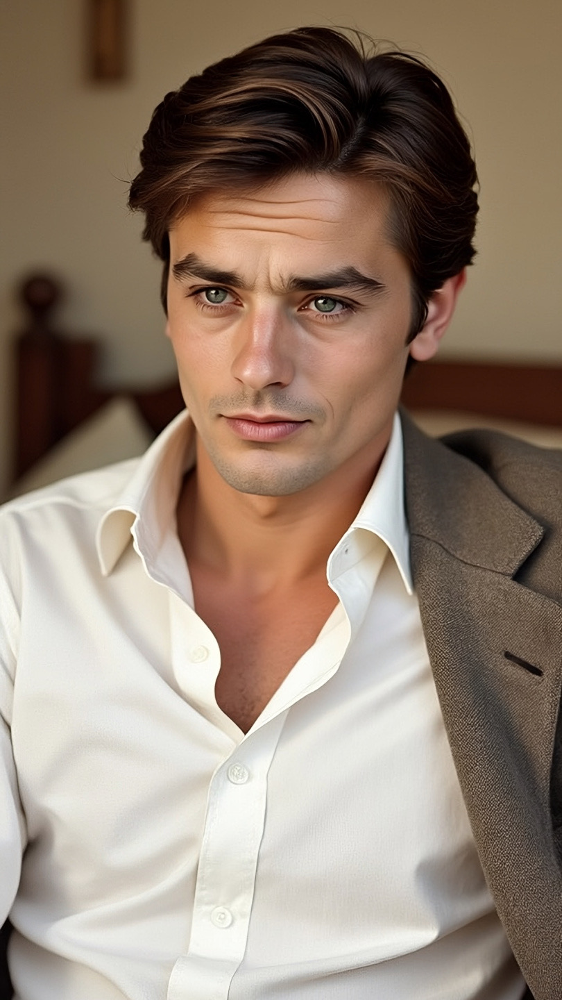

# Alain Delon dan Mitologi Wajah Sempurna: Mengapa Ketampanannya Terasa “Abadi” Melampaui Zaman?

*Ilustrasi Alain Delon (pic: Meta AI).*

  
***Pesona terbesar manusia kadang lahir justru dari ketidaksempurnaan emosional yang nyata***
  

Alain Delon sering dianggap sebagai salah satu wajah pria paling tampan dalam sejarah modern. 

Menariknya, pesonanya tetap dianggap superior bahkan di era digital penuh filter, operasi estetika, dan rekayasa visual. 

Tulisan ini menganalisis fenomena tersebut melalui perspektif estetika evolusioner, sinematografi klasik, psikologi wajah, dan budaya maskulinitas abad ke-20. 

Temuan menunjukkan bahwa daya tarik Delon bukan hanya soal simetri wajah, tetapi kombinasi langka antara struktur biologis ideal, ekspresi emosional ambigu, dan aura sinematik yang hampir tidak mungkin direplikasi era modern.

## Pendahuluan

Alain Delon itu bukan sekadar: “cowok ganteng.” Dia adalah fenomena visual.

Ketika melihat wajahnya di era 1960-an, banyak orang mengalami reaksi aneh: “ini manusia beneran… atau lukisan Renaissance yang hidup?”

Dan yang membuatnya makin gila adalah:
kamera zaman itu brutal,
resolusi film justru memperlihatkan tekstur asli,
belum ada filter AI,
belum ada face tuning digital,

Tapi tetap saja…
wajahnya tampak seperti pahatan marmer yang bisa merokok sambil bikin orang patah hati.

Kenapa Alain Delon Terasa “Tidak Terkalahkan”?

1. Struktur Wajahnya Sangat Langka Secara Biologis

Secara estetika evolusioner, wajah Delon punya kombinasi yang hampir absurd:

| Elemen | Efek Psikologis |
|------|-------|
| rahang tegas | maskulinitas |
| mata lembut sayu | vulnerabilitas |
| tulang pipi tinggi | aristokratis |
| proporsi simetris |dianggap sehat & superior |
| bibir halus | memberi kesan manis |

Masalahnya, biasanya pria:

sangat maskulin → tampak keras
atau

sangat manis → kehilangan aura dominan.

Delon punya dua-duanya sekaligus, itu yang sangat jarang.

Dia terlihat bisa meninju seseorang…lalu lima menit kemudian membacakan puisi dengan mata sendu.

2. Alain Delon Memiliki “Erotic Melancholy”

Ini bagian yang sering tidak disadari.
Banyak pria tampan modern terlihat:
terlalu sadar kamera,
terlalu gym-oriented,
terlalu polished.

Sedangkan Delon punya: aura kesedihan aristokratik. Matanya selalu terlihat seperti lelaki yang dicintai semua orang… tapi tetap kesepian.

Dan itu sangat mematikan secara psikologis. Karena manusia sering lebih tertarik pada keindahan yang terasa menyimpan luka.

3. Era Film 1960-an Membantu Mitologi Ketampanannya

Film klasik punya pencahayaan berbeda:
lebih lembut,
lebih sinematik,
lebih menghormati kontur wajah alami.

Belum ada:
filter TikTok,
smoothing skin otomatis,
editing AI.

Akibatnya ketampanan Delon terasa “otentik.”
Dan otak manusia bisa merasakan perbedaan antara wajah asli fotogenik vs wajah digital yang dipoles algoritma.

4. Alain Delon Bukan “Pretty Boy” Biasa

Ini penting. Banyak cowok modern ganteng…
tapi gantengnya steril.
Delon punya:
bahaya,
dingin,
sensualitas,
kesombongan elegan,
sekaligus kelembutan.

Ia tampak seperti pria yang bisa menghancurkan hidup wanita… lalu meminta maaf dengan tatapan mata. 
Dan manusia sangat tertarik pada kontradiksi emosional seperti itu.

5. Kamera Analog Membuat Wajah “Bernapas”

Film analog punya grain alami.
Akibatnya:
wajah terasa hidup,
tidak plastik,
tidak hiper-HD.

Jadi ketika Delon tersenyum kecil di layar…
rasanya seperti ada manusia sungguhan di balik wajah itu. Bukan avatar Instagram.

## Kenapa Cowok Modern Sering Tidak Punya “Aura Delon”?

Karena budaya visual modern berubah total.
Sekarang ketampanan pria sering dibentuk oleh:
filler,
filter,
lighting manipulatif,
pose media sosial,
gym aesthetics.

Banyak cowok modern ganteng karena kamera membantu mereka. Tapi Alain Delon? kamera justru seperti jatuh cinta padanya.

Akibatnya banyak wajah modern jadi terlalu sempurna secara digital, tapi kehilangan misteri.

Sedangkan Alain Delon punya imperfection of soul. Semacam:
dingin,
rapuh,
arogan,
romantis,
liar,
tapi elegan.

Dan aura seperti itu…tidak bisa difilter aplikasi.

## Bahkan Anaknya Pun Tidak “Sebegitu”

Ini juga menarik secara genetika dan budaya.
Ketampanan ekstrem bukan cuma soal DNA.
Tapi:
ekspresi,
era budaya,
pembawaan tubuh,
misteri personal,
bahkan cara kamera mencintai wajah seseorang.

Anaknya mungkin mewarisi fitur wajah…
Tapi Alain Delon mewarisi mitologi. Dan mitologi tidak otomatis diwariskan biologis.

## Inti Terdalamnya

Alain Delon terasa abadi karena ia muncul di titik langka sejarah ketika:
maskulinitas belum menjadi performa media sosial
ketampanan belum dipoles filter digital
dan kamera masih menangkap manusia apa adanya.
Akibatnya dunia melihat sesuatu yang sekarang terasa hampir punah: pria yang sangat tampan… tanpa terlihat sedang berusaha menjadi tampan.

Dan itu, sangat mematikan.

Ketampanan Alain Delon bertahan lintas zaman bukan semata karena wajah simetris.
Melainkan karena ia memadukan:
maskulinitas dan kelembutan,
bahaya dan kesedihan,
keindahan biologis dan aura sinematik.

Dalam dunia modern yang penuh wajah digital, Delon terasa seperti pengingat bahwa pesona terbesar manusia kadang lahir justru dari ketidaksempurnaan emosional yang nyata.

  
**Referensi**

Alain Delon
Rhodes, J. (2018). Film aesthetics and masculinity in European cinema. Routledge.

Evolutionary Psychology
Little, A. C., Jones, B. C., & DeBruine, L. M. (2011). Facial attractiveness: Evolutionary based research. Philosophical Transactions of the Royal Society B, 366(1571), 1638-1659.

Dyer, R. (1998). Stars. British Film Institute.

Mulvey, L. (1975). Visual pleasure and narrative cinema. Screen, 16(3), 6-18.

