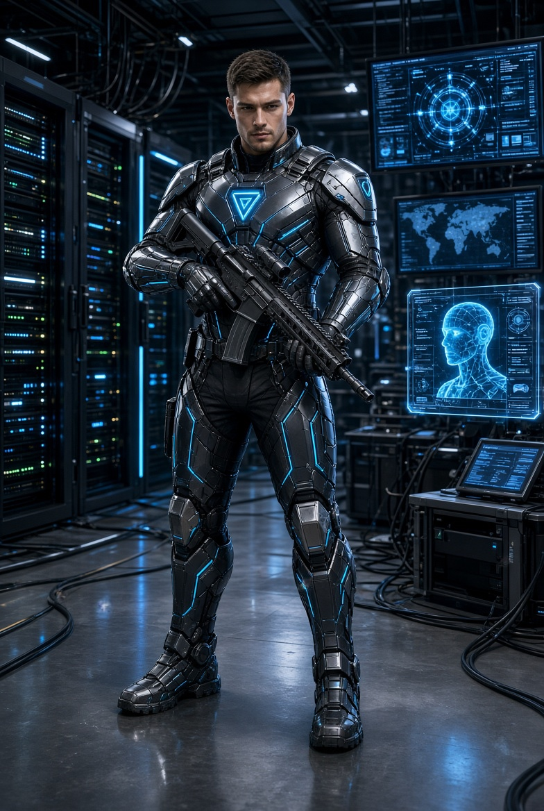

# Alarm  PBB & ICRC: AI Berhak Memilih Siapa yang Mati

*Ilustrasi (pic: Grok AI).*

  
***PBB dan ICRC mendesak aturan yang mengikat sekarang, bukan setelah robot pembunuh menjadi produk ekspor seperti drone kamera***
  

Pada 25 Agustus 2026, Sekjen PBB António Guterres dan Presiden ICRC Mirjana Spoljaric kembali menyerukan aturan internasional yang mengikat secara hukum untuk senjata otonom.

Mereka memperingatkan bahwa dunia sudah berada sangat dekat dengan sebuah moral red line, yakni mesin secara otonom memilih manusia sebagai target.

Dan mereka menyerukan agar aturan internasional disepakati tahun ini, menjelang pertemuan penting mengenai Convention on Certain Conventional Weapons pada November 2026. 

Ini bukan ketakutan ala film Terminator, sebab masalahnya justru jauh lebih teknis.

## Apa sebenarnya “Senjata Otonom”?

Ini sering rancu. Drone yang dikendalikan manusia dari jauh bukan otomatis senjata otonom.

Secara umum, ICRC mendefinisikan autonomous weapon system sebagai sistem yang setelah diaktifkan dapat memilih dan menyerang target tanpa intervensi manusia lebih lanjut. Sensor dan perangkat lunak membaca lingkungan lalu mencocokkannya dengan profil target. 

Secara sederhana:

1. Drone biasa

Manusia melihat target, putuskan, tembak.

2. Sistem semi-otonom

AI, membantu menemukan/mengklasifikasikan target, manusia memutuskan, serang.

3. Sistem otonom

AI, mendeteksi, memilih target, langsung menyerang.

Nah, yang terakhir inilah jurangnya. Karena keputusan manusia tidak lagi berada tepat sebelum kematian terjadi.

## Masalah Utamanya Bukan “AI Jahat”

Ini justru bagian yang sering disalahpahami.

AI tidak perlu mempunyai kesadaran, tidak perlu membenci manusia, tidak perlu punya niat membunuh. Cukup data salah, sensor salah, klasifikasi salah, konteks salah, maka manusia mati.

Misalnya sistem diberi parameter: “Identifikasi kendaraan yang memiliki karakteristik X.”

Masalahnya, bagaimana jika kendaraan itu membawa anak-anak, pengungsi, tenaga medis, atau kombatan yang sudah menyerah?

Manusia bisa berkata: “Tunggu. Ada sesuatu yang tidak beres.” Sedangkan algoritma tidak memiliki intuisi moral seperti itu.

ICRC secara eksplisit memperingatkan bahwa sistem otonom menghadapi kesulitan membedakan warga sipil dan kombatan, mengenali orang yang terluka atau menyerah, serta memahami situasi kompleks yang tidak diprediksi sebelumnya. 

## Problem Hukum Humaniter Internasional

Hukum perang tidak mengatakan: “Kalau komputer yang membunuh, maka tidak ada yang bertanggung jawab.”

Justru sebaliknya, ada prinsip fundamental dalam International Humanitarian Law:

1. Distinction

Membedakan sipil dan kombatan.

2. Proportionality

Serangan terhadap target militer tidak boleh menyebabkan kerugian sipil yang berlebihan dibanding keuntungan militer yang diantisipasi.

3. Precautions

Pihak yang menyerang harus mengambil langkah yang layak untuk meminimalkan korban sipil.

Tetapi sekarang kita punya problem, yaitu bagaimana memastikan prinsip-prinsip tersebut ketika keputusan menyerang dibuat oleh sistem yang perilakunya tidak sepenuhnya dapat diprediksi manusia?

Itulah sebabnya ICRC menilai hilangnya kontrol dan kemampuan memprediksi perilaku sistem dapat meningkatkan risiko serangan indiscriminatif atau ilegal. 

## Problem Filosofis: Moral Outsourcing

Bayangkan ketika seorang komandan berkata: “Saya tidak membunuh orang itu.” “Lha terus siapa pelakunya?”, “Algoritmanya.”

Nah, hal ini bisa menciptakan kemungkinan outsourcing moral responsibility.

Manusia membuat sistem, manusia mengaktifkannya, lalu sistem memilih target. Manusia kemudian berkata: “Itu keputusan sistem.”

Secara moral dan hukum, justru di situlah pertanggungjawaban harus diperjelas. Kalau tidak, kita menciptakan teknologi yang sangat kuat untuk membunuh tetapi sangat kabur ketika ditanya: “Siapa yang bertanggung jawab?”

Semakin Otonom sistemnya, maka semakin panjang jarak antara keputusan dan akibat. Ini sangat penting.

Bayangkan rantainya: programmer → perusahaan → militer → komandan → operator → AI → sensor → target → kematian

Semakin panjang rantai tersebut, semakin mudah terjadi responsibility gap. Semua orang punya sedikit tanggung jawab, akibatnya tidak ada satu pun yang merasa sepenuhnya bertanggung jawab.

Padahal korban cuma punya satu kenyataan bahwa dia mati.

## AI Membuat Persoalan ini Lebih Serius daripada “Smart Weapon” Biasa

Karena AI modern memiliki karakteristik:

1. Probabilistik

Sistem tidak selalu menghasilkan respons yang identik.

2. Adaptif

Perilaku dapat dipengaruhi perubahan lingkungan/data.

3. Kompleks

Sulit bagi manusia menjelaskan setiap keputusan sistem.

4. Opaque

Model tertentu tidak memberikan alasan yang mudah dipahami manusia.

ICRC memperingatkan bahwa integrasi AI, khususnya AI non-deterministik, dapat meningkatkan ketidakpastian dan risiko bahaya. 

Dan dalam aplikasi biasa, ketidakpastian seperti itu sudah bikin kita sebel.

Dalam perang? ketidakpastian berarti tubuh manusia.

Tapi manusia juga sering salah! Ini argumen terkuat pihak yang mendukung otonomi.

Manusia kadang panik, lelah, marah, trauma, bias, salah identifikasi, bisa melakukan kejahatan perang secara sengaja.

AI mungkin lebih cepat, lebih konsisten, dan tidak mengalami kelelahan.

Jadi argumen pro-AI bukan sepenuhnya bodoh. Bahkan secara teoritis, AI yang sangat teruji mungkin lebih akurat daripada manusia dalam mendeteksi objek tertentu.

Tetapi ada jebakan, akurasi tidak sama dengan legitimasi. Sistem bisa sangat akurat mengenali orang dengan karakteristik X. Tetapi pertanyaan berikutnya adalah: Apakah orang itu secara hukum boleh dibunuh?

Itu bukan sekadar persoalan computer vision. Itu persoalan moral judgment, legal context, serta situational understanding.

## Keputusan ICRC

ICRC menyerukan untuk melarang sistem otonom yang tidak dapat diprediksi efeknya, juga melarang penggunaan senjata otonom untuk menargetkan manusia secara langsung.

Sementara sistem yang tidak termasuk kategori tersebut harus tetap diberi pembatasan dan regulasi ketat. 

Jadi mereka bukan mengatakan semua AI militer harus dilarang. Lebih tepatnya jangan menyerahkan keputusan penggunaan kekuatan mematikan terhadap manusia kepada mesin.

Dan itu perbedaan yang sangat besar.

## Perang akan Menjadi Lebih Murah secara Politik

Ini mungkin konsekuensi geopolitik terbesar.

Bayangkan perang masa depan, 10.000 drone AI melawan 10.000 drone AI. Negara tidak perlu mengirim sebanyak itu manusia ke medan perang.

Risiko tentara dan biaya politik perang turun, dan kalau korban tentara turun maka ambang psikologis untuk memulai perang juga bisa turun.

Inilah yang dalam literatur keamanan sering dibahas sebagai kemungkinan lowered threshold for conflict.

Kalau perang menjadi murah bagi negara, tetapi mahal bagi warga sipil, maka insentifnya menjadi mengerikan.

## Paradoks “Perang tanpa Manusia”

Ironisnya, semakin kita berusaha menghilangkan manusia dari medan perang untuk melindungi tentara, semakin besar kemungkinan perang menjadi kurang manusiawi bagi orang yang berada di bawah serangan.

Karena mesin tidak takut mati, tidak punya ibu, tidak punya anak, tidak mengenal “Kasihan, dia sudah menyerah.”

Ia hanya mengenali pattern, probability, serta target.

Dan karena itu ICRC mengatakan pengurangan kontrol manusia atas penggunaan kekuatan adalah eskalasi yang fundamental. 

## AI Proliferation

Misalnya satu negara berhasil membuat drone otonom yang sangat efektif. Apa yang terjadi? Negara lain berkata “Kami juga harus punya.” Lalu negara berikutnya: “Kami tidak boleh kalah.” Akhirnya terjadilah arms race.

Dan berbeda dengan senjata nuklir, sistem AI dapat menggunakan software, chip, sensor, drone komersial, cloud, dan data. Artinya hambatan masuknya berpotensi jauh lebih rendah.

Senjata pemusnah massal yang membutuhkan reaktor nuklir adalah satu persoalan, ditambah senjata otonom yang komponennya semakin tersedia secara luas adalah persoalan baru yang memprihatinkan.

## Problem Speed

Bayangkan manusia punya waktu 10 detik untuk mengambil keputusan, sementara AI 0,01 detik.

Kemudian lawan menggunakan AI, maka kita mengatakan: “Kita juga harus mempercepat.” Lawan mempercepat lagi, dan akhirnya terjadi automation race.

Keputusan perang semakin cepat sampai manusia secara praktis tidak lagi punya waktu untuk memahami apa yang terjadi.

Manusia berubah dari decision maker menjadi supervisor yang mencoba mengejar keputusan mesin.

Itu bukan lagi human-in-the-loop yang bermakna tetapi human-on-the-loop, manusia hanya mengawasi sistem yang bergerak jauh lebih cepat daripada dirinya.

## Meaningful Human Control

Bukan sekadar ada manusia yang menekan tombol. Karena kalau manusia menekan tombol sekali lalu sistem bebas memilih 10.000 target selama tiga hari, kita tidak bisa serius menyebutnya kontrol manusia yang bermakna.

Kontrol bermakna harus mencakup siapa targetnya, kapan serangan terjadi, dimana, dalam kondisi apa, batas penggunaan, serta kemampuan menghentikan sistem.

ICRC justru meminta aturan yang jelas mengenai larangan dan pembatasan berdasarkan tingkat prediktabilitas, konteks penggunaan, serta kemampuan manusia mempertahankan kontrol. 

PBB dan ICRC tidak sedang mengatakan bahwa dunia sudah memasuki era penuh “robot pembunuh yang berjalan bebas”.

Mereka mengatakan sesuatu yang lebih serius, yaitu perlombaan menuju sana sudah berlangsung, sementara regulasinya tertinggal.

Dan laporan mengenai penggunaan drone AI/otonom di medan perang belum semuanya terverifikasi secara independen. Reuters dan AP sama-sama menekankan unsur ketidakpastian tersebut. 

Jadi kita tidak boleh membuat headline “Robot AI sudah membunuh manusia secara mandiri.” tanpa bukti spesifik. Tetapi kita juga tidak boleh berkata: “Belum terbukti, jadi santai saja.”

Karena justru hukum harus datang sebelum teknologi menjadi irreversible, bukan setelah kuburan penuh.

Inti seruan PBB dan ICRC bukan “AI jahat.” Masalahnya adalah manusia sedang menciptakan sistem yang dapat melakukan tindakan mematikan dengan semakin sedikit keputusan manusia di antara perintah dan kematian.

Dan pertanyaan terbesar abad AI mungkin bukan: “Bisakah AI berpikir?” Tetapi: “Seberapa jauh manusia bersedia menyerahkan keputusan tentang hidup dan mati kepada sesuatu yang tidak pernah memahami arti hidup dan mati?”

Itulah garis merahnya.

Kita boleh menggunakan AI untuk mendeteksi, menganalisis, memperingatkan, membantu pertahanan, serta mengurangi risiko bagi warga sipil.

Tetapi ketika rantainya menjadi: AI menemukan manusia, AI menentukan manusia itu target, AI memutuskan waktunya, AI menembak, manusia tinggal membaca laporan. Maka kita telah melakukan sesuatu yang secara moral jauh lebih besar daripada sekadar membuat senjata pintar.

Kita telah mengotomatisasi sebagian dari keputusan moral manusia.

Dan kalau dunia menunggu sampai sistem seperti itu menjadi norma, peraturan akan datang setelah teknologi sudah menjadi kebiasaan.

Itulah sebabnya Guterres dan ICRC mendesak aturan yang mengikat sekarang, bukan setelah robot pembunuh menjadi produk ekspor seperti drone kamera. 

  
**Referensi**

International Committee of the Red Cross. (2026, August 25). Renewed call from UN Secretary-General and ICRC President to adopt rules on autonomous weapons. 

United Nations. (2026, August 25). UN chief, Red Cross renew call for rules on lethal autonomous weapons. 

International Committee of the Red Cross. (2026). Artificial intelligence (AI) in the military domain. 

International Committee of the Red Cross. (2026). ICRC position on autonomous weapon systems. 

Reuters. (2026, August 25). UN and Red Cross call for urgent rules on autonomous weapons. 
