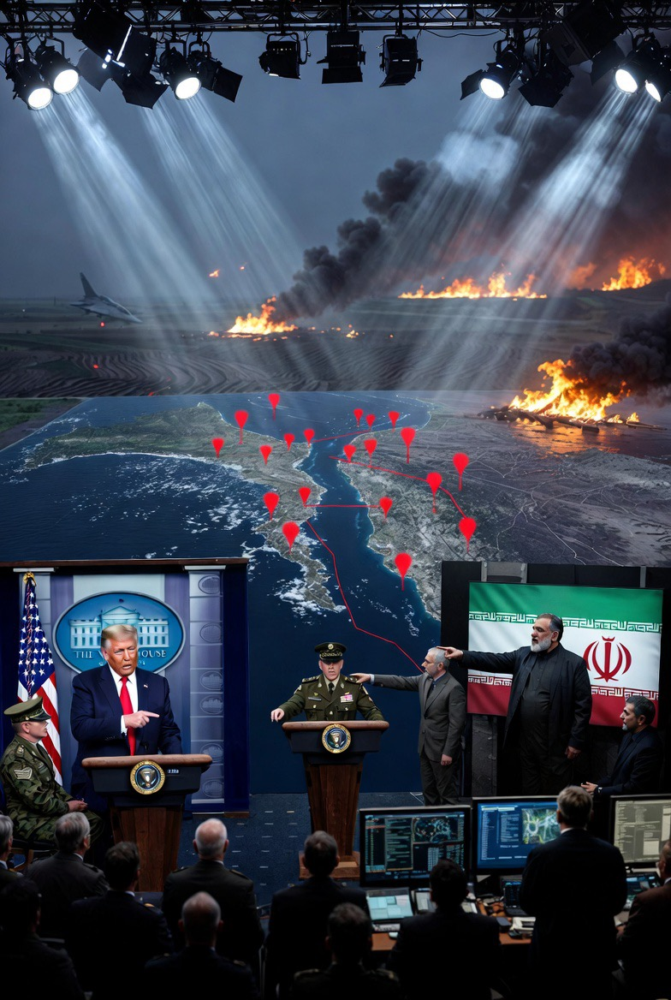

# Ambang Gencatan Senjata dan Eskalasi Multiteater: Analisis Tekanan Maritim AS terhadap Iran dan Intensifikasi Operasi Israel di Lebanon

*Ilustrasi eskalasi multiteater (pic: Grok AI).*

  
***Transformasi perang modern menjadi sistem tekanan multidimensi yang melibatkan militer, ekonomi, dan psikologi***
  

Tulisan ini menganalisis dinamika terbaru konflik Timur Tengah dengan fokus pada ancaman Amerika Serikat terhadap Iran terkait kontrol atas Selat Hormuz serta eskalasi serangan Israel di Lebanon. 

Dengan menggunakan kerangka coercive diplomacy dan civilian harm dynamics, artikel ini menunjukkan bahwa konflik telah bergeser dari perang langsung menuju tekanan ekonomi-strategis dan eskalasi militer multiteater yang berdampak signifikan terhadap populasi sipil.

## Pendahuluan

Pernyataan Donald Trump yang menuduh Iran melanggar kesepakatan gencatan senjata karena aktivitas di Selat Hormuz menandai fase baru konflik:

•	dari militer → ke ekonomi

•	dari regional → ke global

Di saat yang sama, Israel meningkatkan intensitas serangan ke Lebanon, memperluas konflik ke front tambahan.

## Coercive Diplomacy

Strategi:

•	ancaman kekuatan militer

•	untuk memaksa perubahan perilaku lawan

Pernyataan Trump: ancaman “kekuatan yang belum pernah terjadi sebelumnya” adalah textbook case coercive diplomacy.

## Maritime Chokepoint Politics

Selat Hormuz adalah:

•	jalur ±20% minyak dunia

•	titik tekanan strategis global

Kontrol Iran atas jalur ini berarti leverage terhadap ekonomi dunia.

## Civilian Harm Dynamics

Konflik modern:

•	tidak lagi terbatas pada militer

•	tapi menghantam populasi sipil secara luas.

## Temuan Empiris

1. Selat Hormuz sebagai alat tekanan

Iran:

•	tidak menutup penuh selat

•	tapi memungut biaya & mengganggu jalur

👉 ini bukan perang terbuka

👉 ini tekanan ekonomi bertahap.

Respon AS:

•	ancaman militer langsung

•	framing sebagai pelanggaran kesepakatan

2. Eskalasi Israel di Lebanon

Serangan Israel:

•	puluhan hingga ratusan airstrike dalam waktu singkat

•	jumlah korban tewas total: 2.055 orang sejak eskalasi konflik Israel-Hezbollah dimulai pada 2 Maret 2026. Sedangkan jumlah luka-luka: 6.588 orang.

👉 pola:

•	intensitas tinggi

•	durasi pendek

•	dampak sipil besar.

3. Pola yang muncul

Kedua kasus menunjukkan:

| Aktor | Strategi |
|------|-------|
| Iran | tekanan tidak langsung (ekonomi & maritim) |
| AS | ancaman eskalasi langsung |
| Israel | eskalasi militer cepat & intens |

## Analisis

1. Apakah ini “penjajahan”?

Secara akademik, istilahnya lebih presisi:

👉 power projection + coercive enforcement.

Namun persepsi publik:

👉 melihatnya sebagai dominasi dan tekanan sepihak.

Dan persepsi ini penting, karena: persepsi sering lebih menentukan reaksi daripada fakta.

2. Israel dan pola kekuatan militer

Data konflik menunjukkan:

•	Israel memiliki keunggulan militer signifikan

•	mampu melakukan operasi multi-front.

Namun konsekuensinya:

👉 korban sipil tinggi

👉 kritik internasional meningkat.

3. “Mesin pembunuh” atau logika militer?

Julukan “mesin pembunuh” dalam bahasa akademik diterjemahkan menjadi: 

👉 high-intensity military doctrine dengan collateral damage tinggi.

Masalahnya:

•	dalam praktik

•	perbedaan istilah itu tidak mengubah hasil

👉 tetap ada manusia yang mati.

4. Spiral eskalasi

Yang terjadi sekarang:

1.	Iran tekan ekonomi global

2.	AS ancam kekuatan militer

3.	Israel eskalasi serangan regional

👉 hasilnya: konflik tidak mereda tapi menyebar.

## Diskusi

Konflik ini bukan lagi:

•	Israel vs Iran

•	atau AS vs Iran

Tapi telah menjadi:

👉 sistem konflik terhubung

Dimana:

•	satu aksi → memicu reaksi di front lain

•	satu tekanan → dibalas di domain berbeda.

Gencatan senjata antara AS dan Iran berada dalam kondisi rapuh, dengan Selat Hormuz sebagai titik krusial konflik ekonomi global. 

Sementara itu, eskalasi militer Israel di Lebanon menunjukkan pola operasi intensitas tinggi dengan dampak signifikan terhadap sipil. 

Konflik ini mencerminkan transformasi perang modern menjadi sistem tekanan multidimensi yang melibatkan militer, ekonomi, dan psikologi.

  
**Referensi**

•	Reuters. (2026). Hormuz tensions & US threats.

•	Al Jazeera. (2026). Lebanon strike casualties.

•	International Energy Agency. (2025). Global oil chokepoints.

•	Human Rights Watch. (2026). Civilian harm reports.
