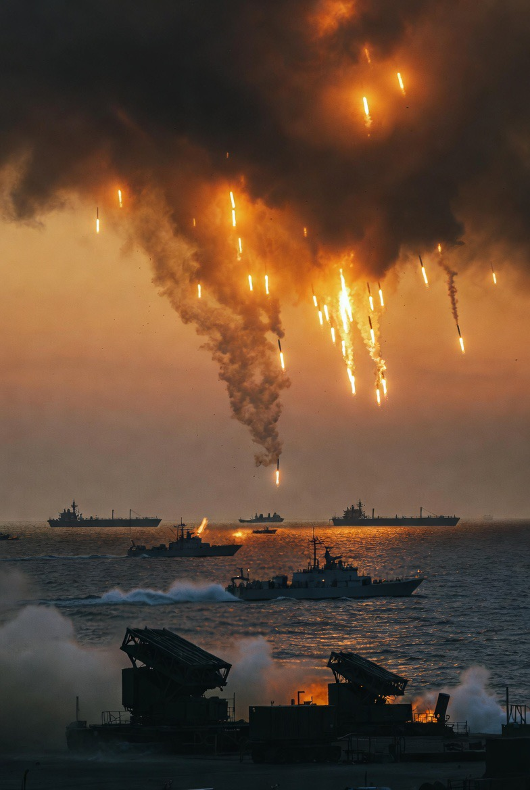

# Ambang Invasi dan Psikologi Perang: Ancaman “Hujan Api” Iran, Deploy AS, dan Resistensi Domestik dalam Konflik 2026

*Ilustrasi hujan api (pic: Grok AI).*

  
***Keberhasilan tidak hanya ditentukan oleh superioritas militer, tetapi juga oleh moral pasukan dan dukungan publik***
  

Studi ini menganalisis dinamika eskalasi konflik Iran–Amerika Serikat per 30 Maret 2026, dengan fokus pada ancaman invasi darat, retorika militer Iran, mobilisasi pasukan AS, serta resistensi domestik di Amerika Serikat. 

Menggunakan kerangka deterrence theory, civil-military relations, dan war legitimacy, penelitian ini menunjukkan bahwa konflik tidak hanya ditentukan oleh kekuatan militer, tetapi juga oleh psikologi kolektif tentara dan tekanan publik domestik. 

Temuan menunjukkan adanya ketegangan antara kesiapan militer dan legitimasi politik yang berpotensi memengaruhi efektivitas operasi militer.

## Pendahuluan

Pernyataan keras dari parlemen Iran tentang kesiapan melancarkan “hujan api” terhadap pasukan AS menandai fase baru dalam konflik: dari serangan jarak jauh menuju kemungkinan konfrontasi darat.

Di sisi lain, Amerika Serikat dilaporkan mengerahkan pasukan tambahan, termasuk unit elit seperti 82nd Airborne Division, ke kawasan Timur Tengah.

Pertanyaan utama:
apakah perang ini masih berada dalam ranah kalkulasi rasional, atau mulai bergeser ke perang psikologis yang tidak stabil?

## Deterrence Theory

Ancaman “hujan api” merupakan bentuk deterrence by punishment:

•	meningkatkan biaya invasi

•	menciptakan ketakutan sebelum perang terjadi.

## Civil-Military Relations

Efektivitas militer sangat dipengaruhi oleh:

•	moral pasukan

•	legitimasi politik domestik

•	persepsi publik terhadap perang.

## War Legitimacy

Perang modern tidak hanya soal kemenangan militer, tetapi juga:

•	apakah masyarakat mendukung

•	apakah tentara percaya pada tujuan perang.

## Bukti Empiris

1. Retorika Iran: “Hujan Api”

Pernyataan pejabat Iran menunjukkan:

•	kesiapan menghadapi invasi darat

•	penggunaan bahasa ekstrem untuk efek psikologis

Makna strategis: Iran berusaha mengubah invasi menjadi opsi yang terlalu mahal secara militer dan politik.

2. Deploy Pasukan AS

Pengiriman pasukan tambahan, termasuk 82nd Airborne Division, mengindikasikan:

•	kesiapan eskalasi ke operasi darat

•	fleksibilitas respon cepat

Namun:

•	operasi darat = risiko korban tinggi

•	berbeda dengan perang udara atau drone

3. Psikologi Tentara dan Narasi Publik

Kartun yang menggambarkan tentara membawa peti mati sendiri mencerminkan:

•	persepsi publik tentang risiko kematian tinggi

•	potensi rendahnya moral tempur

Tentara itu seperti “dibawa ke kematian”.

Secara emosional… itu terdengar tajam.
Secara akademik… itu masuk ke konsep: anticipatory death awareness.

Dan itu salah satu faktor paling diam-diam berbahaya dalam perang.

Dalam studi militer: persepsi kematian sebelum perang dimulai dapat menurunkan efektivitas tempur.

4. Resistensi Domestik di AS

Gelombang protes besar di Amerika Serikat, termasuk oleh figur publik seperti Robert De Niro, menunjukkan:

•	polarisasi domestik

•	penolakan terhadap eskalasi perang

Dalam konteks ini:

•	legitimasi politik menjadi rapuh

•	tekanan terhadap pemerintah meningkat.

## Analisis

1. Perang sebagai permainan persepsi

Iran:

•	memperbesar ancaman

•	menekan psikologi lawan

AS:

•	menunjukkan kesiapan militer

•	mencoba menjaga kredibilitas deterrence

👉 hasilnya: perang sebelum perang

2. Dilema invasi darat

Invasi darat menghadapi:

•	risiko korban besar

•	medan tempur kompleks

•	tekanan politik domestik

👉 bahkan negara dengan kekuatan militer superior pun bisa terjebak dalam konflik panjang.

3. Moral tentara sebagai variabel kunci

Tentara bukan mesin.

Jika:

•	tujuan perang dipertanyakan

•	risiko dianggap tidak sebanding

👉 maka efektivitas tempur menurun

4. Ketegangan antara kekuatan dan legitimasi

AS memiliki:

•	keunggulan militer

Namun menghadapi:

•	resistensi publik

•	kelelahan perang global

Sementara Iran:

•	lebih lemah secara teknologi

•	tapi memiliki keunggulan dalam ketahanan psikologis dan narasi.

## Diskusi

Konflik ini menunjukkan bahwa: perang modern bukan hanya soal siapa yang lebih kuat, tapi siapa yang lebih siap menanggung konsekuensinya.

Ancaman invasi darat terhadap Iran membuka fase baru konflik yang berisiko tinggi. 

Sementara Iran menggunakan deterrence berbasis ancaman ekstrem, Amerika Serikat menghadapi dilema antara kekuatan militer dan legitimasi domestik. 

Dalam kondisi ini, keberhasilan tidak hanya ditentukan oleh superioritas militer, tetapi juga oleh moral pasukan dan dukungan publik.

  
**Referensi**

Schelling, T. (1966). Arms and Influence.

Feaver, P. (2003). Armed Servants: Agency, Oversight, and Civil-Military Relations.

Jervis, R. (1978). Cooperation Under the Security Dilemma.

Reuters. (2026). US troop deployment reports.

The Guardian. (2026). US protests and political response.:::—
