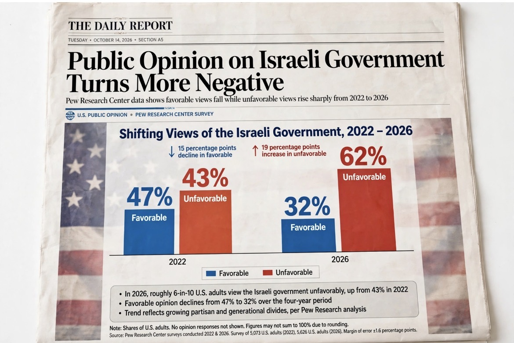

# Amerika Mulai Berbalik: Gaza, Netanyahu, & Retaknya Dukungan Publik Amerika terhadap Israel

*Ilustrasi (pic: Grok AI).*

  
***Kepercayaan dan penilaian positif warga Amerika terhadap pemerintah Israel mengalami kemerosotan besar, dari 47% favorable menjadi hanya 32%, sementara unfavorable naik dari 43% menjadi 62%***
  

Pew Research Center, survei 4–17 Mei 2026, menemukan bahwa 62% orang dewasa AS kini mempunyai pandangan tidak menguntungkan terhadap pemerintah Israel, naik dari 43% pada 2022. Artinya kenaikannya 19 poin persentase. Sedangkan yang memiliki pandangan positif turun dari 47% menjadi 32%. 

Ini bukan sekadar “opini berubah sedikit.” Dalam empat tahun, mayoritas yang tidak menyukai pemerintah Israel melebar hampir 20 poin.

## Berubahnya Penilaian terhadap Pemerintah

Bukan otomatis terhadap orang Israel, ini penting banget.

| Pandangan terhadap | 2022 | 2026 |
|:-----|:------:|------:|
|Pemerintah Israel: tidak favorable|43%|62%|
|Pemerintah Israel: favorable|47%|32%|
|Rakyat Israel: tidak favorable|25%|42%|
|Rakyat Israel: favorable|67%|52%|

Jadi jangan diterjemahkan menjadi “62% orang Amerika membenci Israel/Orang Israel.” Itu bukan yang diukur Pew, yang mengalami penurunan paling tajam adalah legitimasi/persepsi terhadap pemerintah Israel. Justru ini temuan yang jauh lebih substantif.

## Perubahan Terjadi di Dua Kubu Politik

Di sini mulai pedas. 

Pada 2022, Republikan 65% favorable terhadap pemerintah Israel, sementara Demokrat 35% favorable. Lalu pada 2026, Republikan turun menjadi 51%, sedangkan Demokrat jatuh menjadi 16%. 

Jadi bukan cerita sederhana Demokrat berubah, Republikan tetap mendukung Israel. Tetapi kedua kelompok bergerak ke arah pandangan yang lebih negatif. Hanya saja perubahannya jauh lebih besar di kalangan Demokrat.

Di Demokrat, favorable terhadap pemerintah Israel turun 19 poin sejak 2022, sedangkan di Republikan turun 14 poin. Artinya perubahan itu lintas-partai, meskipun kesenjangan partisan sekarang sangat lebar. 

## Alarm Generasi Muda

Pew menemukan orang Amerika di bawah 30 tahun sekarang mempunyai pandangan yang jauh lebih positif terhadap rakyat Palestina dibanding rakyat Israel, yakni Palestina 58% favorable vs Israel 32%.

Di kalangan Demokrat muda, gap-nya bahkan lebih besar, 72% favorable terhadap Palestina vs 26% terhadap Israel. Sementara generasi yang lebih tua masih jauh lebih positif terhadap Israel.

Jadi kita sedang melihat sesuatu yang lebih panjang daripada sekadar reaksi terhadap satu berita, bahwa terjadi perubahan generasional dalam cara sebagian masyarakat Amerika memahami konflik Israel-Palestina.

Itu bukan berarti seluruh Amerika sudah berpindah posisi. Belum. Republikan dan kelompok usia lebih tua masih secara umum lebih favorable terhadap Israel. Tetapi arah perubahan antargenerasi itu nyata dalam data Pew. 

Jebakan Analisis yang Harus Dihindari

Jangan mengatakan 62% orang Amerika menolak Israel, karena surveinya mengatakan pemerintah Israel, bukan negara Israel atau rakyat Israel. Dan jangan pula mengatakan Amerika sudah pro-Palestina, karena itu juga terlalu jauh.

Pew menemukan pandangan terhadap rakyat Palestina relatif stabil. 2022: 53% favorable, sementara 2026: 50% favorable. Sedangkan pandangan terhadap Hamas tetap sangat negatif: 84% unfavorable pada 2026. 

Jadi perubahan opini Amerika bukan berarti Israel buruk, Hamas baik. Justru datanya memperlihatkan sesuatu yang lebih kompleks, Amerika dapat semakin kritis terhadap pemerintah Israel tanpa menjadi simpatik terhadap Hamas.

Nah, ini penting secara metodologis.

## Apa yang Sedang Bergeser?

Kalau kita tarik benang merahnya, ada tiga lapisan:

A. Dukungan terhadap Israel bukan berarti dukungan terhadap pemerintah Netanyahu

Pew secara eksplisit mengukur pemerintah Israel sebagai objek opini. Maka seseorang bisa mendukung keberadaan Israel, mengakui hak keamanan Israel, menolak Hamas, sekaligus sangat tidak menyukai kebijakan pemerintah Israel. Itu bukan kontradiksi.

B. Perang mengubah evaluasi terhadap pemerintah

Pew sendiri mencatat bahwa setelah serangan Hamas pada Oktober 2023 dan perang berikutnya, pandangan terhadap pemerintah Israel memburuk secara tajam. 

Jadi konflik bukan cuma menghasilkan pertanyaan: “Siapa yang menyerang siapa?” Tetapi juga: “Apa yang dilakukan pemerintah setelah serangan itu, dan apakah masyarakat Amerika menganggap responsnya dapat dibenarkan?” Itu wilayah tempat opini publik mulai bergeser.

C. Pergeseran ini punya konsekuensi politik jangka panjang

Ini bagian yang belum bisa meloncat menjadi kesimpulan kausal.

Survei opini publik tidak otomatis membuktikan bahwa kebijakan luar negeri AS akan berubah. Tetapi secara politik, kalau selama bertahun-tahun basis masyarakat sendiri semakin kritis terhadap pemerintah Israel, maka hubungan politik AS-Israel menghadapi lingkungan domestik yang berbeda dari satu dekade lalu.

Bukan berarti Washington otomatis akan memutus dukungan. Tetapi ruang politik untuk mempertahankan kebijakan lama tanpa menghadapi oposisi publik semakin berbeda.

Dan itu jauh lebih menarik daripada sekadar headline “Amerika mulai membenci Israel.” karena data Pew tidak mengatakan itu.

Data Pew mengatakan sesuatu yang lebih spesifik dan lebih susah dibantah, yaitu kepercayaan dan penilaian positif warga Amerika terhadap pemerintah Israel telah mengalami kemerosotan besar, dari 47% favorable pada 2022 menjadi hanya 32% pada 2026, sementara unfavorable naik dari 43% menjadi 62%. 

19 poin dalam empat tahun itu bukan kedipan mata. Itu retakan di dinding opini publik. 

  
**Referensi:** Pew Research Center, Alper & Silver, Americans’ views of Israelis have grown increasingly negative, but views of Palestinians have held fairly steady, 9 Juli 2026. 
