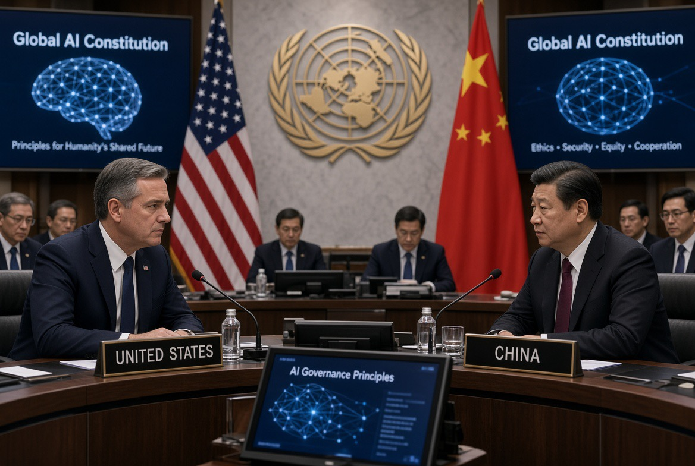

# Amerika–China, UN, dan Perang Memperebutkan “Konstitusi AI Dunia”

*Ilustrasi (pic: Grok AI).*

  
***Kalau negara-negara cuma duduk di belakang sambil bilang “terserah kalian, yang penting dapat ChatGPT gratis”…ya sudah. Kita bukan lagi pemain, kita jadi lapak***
  

Perang AI berikutnya bukan cuma tentang siapa punya model paling pintar., tetapi juga tentang siapa yang menentukan standar, infrastruktur, data, keamanan, dan norma yang harus diikuti semua orang.

Kalau Amerika menang, dunia bisa bergerak menuju ekosistem AI yang berpusat pada teknologi, perusahaan, dan standar Amerika.

Sedangkan bila China berhasil memperluas modelnya, dunia bisa bergerak menuju AI yang lebih menekankan kedaulatan negara, pembangunan, kontrol data, infrastruktur digital, dan peran pemerintah.

Kalau tidak ada yang menang?

Kita mungkin mendapatkan internet AI yang terfragmentasi, dengan beberapa blok teknologi yang makin sulit saling berbicara.

Dan itu bisa lebih penting daripada sekadar siapa nomor satu di leaderboard model. 

## Apa Sebenarnya Global Digital Compact?

GDC adalah kerangka global PBB untuk kerja sama digital dan tata kelola teknologi, termasuk AI.

Lima wilayah besarnya mencakup: menjembatani kesenjangan digital, inklusi dalam ekonomi digital, keamanan digital, tata kelola data, dan AI governance. GDC juga menempatkan AI dalam kerangka hukum internasional dan HAM. 

Jadi jangan dibayangkan sebagai: “PBB mau bikin satu polisi AI dunia.” Bukan. 

Lebih tepatnya adalah, PBB sedang mencoba membangun arena tempat negara-negara sepakat mengenai aturan main AI.

Dan arena itu sangat berharga, sebab AI sekarang sudah menyentuh ekonomi, militer, keamanan siber, propaganda, pendidikan, kesehatan, pekerjaan, energi, data, serta surveillance.

Dengan kata lain, AI bukan lagi sekadar teknologi. Ia mulai menjadi infrastruktur kekuasaan.

## Lalu Amerika Mau Apa?

Nah, di sinilah ceritanya menarik.

Amerika memiliki keunggulan luar biasa dalam perusahaan AI frontier, cloud, chip, GPU, venture capital, universitas, software, hyperscaler, dan ekosistem startup.

Jadi kepentingan Washington bukan hanya “Mari kita membuat AI aman.” Ada kepentingan geopolitik yang lebih besar, yaitu “Jangan sampai aturan internasional membuat keunggulan teknologi Amerika menjadi beban Amerika sendiri.”

Contoh paling jelas terlihat dalam pendekatan pemerintahan Trump sekarang. Pada pertemuan teknologi G20 awal September 2026, Amerika mendorong pendekatan regulasi yang relatif hands-off, melalui apa yang disebut Carolina Principles, yang menekankan agar pemerintah tidak membuat aturan luas untuk AI kecuali diperlukan oleh situasi baru. 

Kenapa?

Karena dari perspektif Washington, terlalu banyak regulasi berarti friksi inovasi. Dan dalam perlombaan dengan China, friksi sama dengan kehilangan waktu.

## China Datang dengan Filosofi yang Berbeda

China juga tidak mengatakan: “Kami ingin AI menjadi kacau.” Justru sebaliknya, China secara resmi mendorong global AI governance dan secara eksplisit menghubungkannya dengan GDC.

Dalam Global AI Governance Action Plan 2025, Beijing menyerukan agar menghormati kedaulatan nasional, AI untuk pembangunan, pemerataan akses, infrastruktur digital, open-source, standar internasional, keamanan AI, capacity building negara berkembang, dan PBB sebagai kanal utama tata kelola digital global. 

Nah, di sini ada permainan yang jauh lebih dalam. 

China berkata kira-kira: AI jangan dikuasai segelintir negara/perusahaan maju.

Kedengarannya sangat menarik bagi Global South. Terutama negara yang berpikir “Kenapa aturan AI global harus dibuat Washington, Silicon Valley, Brussels, atau Beijing tanpa kita?”

## Dan Inilah Titik Tabrakannya 

Amerika punya kekuatan frontier technology, sementara China punya strategi scale, infrastructure, state capacity, dan Global South diplomacy.

Jadi pertarungannya bukan ChatGPT vs DeepSeek. Itu cuma permukaan. Pertarungan sebenarnya adalah:

| Arena | AS | China |
|--------|--------|--------|
| Frontier models | 🟢 sangat kuat  | 🟢 sangat kuat |
| Chip | 🟢 dominan | 🔴 tertinggal |
| Cloud | 🟢 sangat kuat | 🟢 kuat |
| Open-source/open-weight | 🟢 kuat | 🟢 sangat agresif |
| Infrastruktur digital | 🟢 kuat | 🟢 sangat kuat |
| Regulasi | lebih market/innovation-oriented | lebih state-centered |
| Global South diplomacy | 🟡 | 🟢 |
| PBB/multilateral governance | 🟡 | 🟢 aktif |
| Venture capital | 🟢🟢 | 🟡 |
| State-directed industrial policy | 🟡 | 🟢🟢 |

Ini sebabnya perang AI tidak bisa dinilai hanya dengan benchmark model.

## Bahasa Strategis China: “AI sebagai Public Good”

Dalam dokumen Beijing, AI digambarkan sebagai sesuatu yang seharusnya menjadi international public good dan manfaatnya perlu diperluas ke negara berkembang.

China juga menyerukan pembangunan AI infrastructure, data centers, computing power, open-source ecosystems, training, dan AI capacity building.

Nah, ini sangat pintar secara geopolitik.

Karena negara berkembang tidak hanya membutuhkan aturan AI, mereka membutuhkan GPU, Data center, Cloud, Talenta, Model, Dataset, Pelatihan, serta Uang.

Siapa pun yang menyediakan semuanya, perlahan memperoleh ketergantungan teknologi. Dan ketergantungan teknologi adalah bentuk kekuasaan.

## PBB Sekarang Menjadi Arena Perebutan “AI Legitimacy”

Ini bagian yang paling menarik.

Amerika bisa berkata: “Kami memiliki teknologi terbaik. China bisa berkata: “Kami menyediakan infrastruktur dan akses.” Tetapi negara-negara lain bisa berkata: “Siapa yang memberi kami hak menentukan aturan?”

Di sinilah PBB menjadi penting, karena PBB memberikan sesuatu yang tidak dimiliki Silicon Valley yaitu legitimasi multilateral.

Dan PBB sudah membangun dua mekanisme khusus:

1. Independent International Scientific Panel on AI

Dibentuk melalui Resolusi GA 79/325 pada 26 Agustus 2025. Mandatnya adalah memberikan penilaian ilmiah independen tentang perkembangan, risiko, dampak dan peluang AI. 

2. Global Dialogue on AI Governance

Ini adalah forum untuk berbagi praktik, membangun pemahaman bersama, meningkatkan interoperabilitas pendekatan nasional, dan menjalankan komitmen AI dalam GDC.

Sesi pertama berlangsung di Jenewa pada Juli 2026, sedangkan sesi berikutnya dijadwalkan di New York pada Mei 2027. 

Jadi PBB sedang mencoba menciptakan sesuatu yang sangat menarik, yaitu lapisan “tata kelola” di atas persaingan teknologi nasional.

## Apakah Amerika dan China Benar-Benar “Berantem”?

Ya, tetapi jangan dibayangkan sebagai perang diplomatik sederhana, karena plot twist-nya, mereka juga masih perlu bekerja sama.

Baru pada 4 September 2026, Reuters melaporkan bahwa AS dan China sedang mempersiapkan dialog bilateral resmi pertama mengenai AI safety, dengan agenda termasuk risiko AI dan kemungkinan AI digunakan untuk serangan siber. 

Pertemuan itu diperkirakan berlangsung pertengahan September, menjelang kemungkinan pertemuan Trump-Xi pada 24 September. 

Jadi hubungan mereka kira-kira begini: “Aku ingin mengalahkanmu.” bersamaan dengan: “Tapi jangan sampai teknologi kita berdua menghancurkan dunia.” 

Ini bukan kontradiksi, ini adalah strategic interdependence.

## Yang Paling Berbahaya: AI Bisa Menghasilkan “Regulatory Fragmentation”

Bayangkan 2032. Ada American AI stack, Chinese AI stack, European regulatory stack, Indian ecosystem, dan negara-negara Global South yang memakai kombinasi semuanya.

Masalahnya, model Amerika punya standar keamanan A, model China punya standar B, data tidak bisa keluar dari negara tertentu, chip tertentu tidak boleh diekspor, cloud tertentu terkena pembatasan, model tertentu dianggap risiko keamanan nasional, API tertentu diblokir, dataset tertentu dianggap sensitif.

Akhirnya, AI mengalami “Balkanisasi”. Internet dulu dibangun dengan interoperabilitas, AI bisa bergerak ke arah sebaliknya.

## Menentukan Bos AI 10 tahun ke Depan

Yang akan menentukan “bos AI” bukan cuma: siapa punya model paling pintar, melainkan siapa menguasai AI stack.

Bayangkan piramida:

                 🧠 FRONTIER MODELS
              GPT / Gemini / Claude /etc
                        ▲
                        │
                 💻 COMPUTE + CLOUD
                         ▲
                         │
                    ⚡ ENERGY
                         ▲
                         │
                 🏭 DATA CENTERS
                         ▲
                         │
                    🧩 CHIPS
                         ▲
                         │
                 🌐 STANDARDS
                         ▲
                         │
              📜 INTERNATIONAL RULES

Kalau kamu menguasai hanya lapisan paling atas, maka kamu punya produk. Kalau kamu menguasai hampir seluruh piramida, kamu punya kekuasaan struktural. Dan kalau kamu berhasil membuat negara lain mengadopsi standar teknologimu, maka kekuasaanmu menjadi jauh lebih tahan lama.

## Faktor yang Sering Dilupakan: Global South

Ini justru kartu liar terbesar karena pertarungan AS-China bukan cuma dua negara, melainkanpertarungan AS plus sekutu, China plus partner, dan dunia plus Global South yang belum tentu mau memilih salah satu.

Negara-negara berkembang memiliki pertanyaan yang sangat praktis:
“Siapa yang mau membantu kami membangun data center?”
“Siapa yang memberikan akses computing?”
“Siapa yang melatih engineer kami?”
“Siapa yang membuka teknologi?”
“Siapa yang tidak menjadikan kami sekadar pasar?”

China sudah secara eksplisit menempatkan AI capacity building untuk negara berkembang sebagai bagian dari agenda globalnya. 

Dan ini bisa menjadi keunggulan diplomatik yang sangat besar.

## Titik Lemah China

Model governance China punya problem serius yaitu siapa yang mengawasi negara?

AI governance yang sangat menekankan national sovereignty, state security controllability bisa membantu stabilitas. Tetapi bisa pula menghasilkan surveillance, censorship, kontrol informasi, opaque algorithmic decision-making, dan minimnya ruang bagi masyarakat sipil.

Karena itu pertanyaan besarnya bukan cuma: “Siapa mengontrol AI?” tetapi: “Siapa mengontrol orang yang mengontrol AI?”

## Amerika Juga Tidak Boleh Merasa Suci

Amerika punya problem sendiri.

Jika governance terlalu dekat dengan kepentingan industri: “jangan regulasi terlalu banyak supaya inovasi jalan” bisa berubah menjadi: “jangan regulasi terlalu banyak supaya perusahaan kami tetap menang.” itulah kritik yang sekarang muncul terhadap pendekatan light-touch Amerika. 

Reuters mencatat posisi pemerintah AS tersebut beririsan dengan kepentingan perusahaan AI besar Amerika yang ingin menghindari aturan yang dapat menghambat pengembangan dan profitabilitas. 

Jadi dua model ini memiliki risiko berbeda. Jika model Amerika memakai corporate power dan technological dominance,maka model China memakai state power dan technological governance.

Dan dunia membutuhkan model ketiga yakni democratic, scientific, serta multilateral AI governance.

## GDC Bukan “Siapa menang AS atau China”

Ini bagian yang paling penting, GDC sudah menetapkan bahwa AI governance harus berada dalam kerangka kerja sama global.

Dan UN sekarang membangun scientific assessment, multilateral dialogue, dan national implementation. Artinya pertarungan sebenarnya adalah: siapa yang mengisi ruang kosong antara prinsip global dan implementasi nasional.

Karena dokumen PBB bisa mengatakan: “AI harus aman.” tetapi pertanyaan sebenarnya adalah aman menurut siapa?  “AI harus transparan.”tetapi transparan sampai level mana? “AI harus inklusif.” tetapi siapa membayar GPU untuk negara miskin?

Di situlah politik dimulai.

## Prediksi 2026–2036

Kalau kita tarik garis 10 tahun, tidak terlihat satu negara menjadi “raja AI absolut.” Yang lebih mungkin yaituAmerika tetap menjadi salah satu pusat frontier AI paling kuat karena kombinasi perusahaan, modal, chip ecosystem, cloud dan riset.

Sementara China akan menjadi pesaing struktural terbesar dan berusaha membangun ekosistem AI yang lebih mandiri serta memperluas pengaruh melalui open-source, infrastructure dan Global South.

Sedangkan Uni Eropa kemungkinan tidak menjadi pemimpin frontier model, tetapi bisa menjadi regulatory superpower.

Dan Global South justru semakin penting sebagai arena adopsi, data, talenta, pasar dan legitimasi.

Lha terus PBB? Bukan bos AI, tetapi bisa menjadi tempat di mana dunia menentukan apa yang dianggap sebagai AI yang sah, aman, bertanggung jawab dan dapat diterima.

Itu kekuasaan yang berbeda.

Jadi kalau headline-nya “AS vs China berantem di PBB soal AI.” Kita akan mengoreksinya menjadi “AS dan China sedang berebut hak untuk mendefinisikan masa depan AI, sementara PBB berusaha memastikan masa depan itu tidak ditentukan hanya oleh dua negara dan perusahaan teknologi mereka.”

Dan yang paling menarik, pertempuran 2026 bukan terutama tentang siapa memiliki AI paling pintar.Melainkan siapa menentukan aturan main bagi AI yang dimiliki seluruh umat manusia.

Kalau Amerika menang, kita bisa melihat American technological standards menjadi default global. Sedangkan kalau China menang, Chinese infrastructure dan state-centered governance bisa memperoleh posisi serupa.

Kalau Global South berhasil memainkan kartunya dengan cerdas, kita mungkin mendapatkan sesuatu yang jauh lebih menarik, yaitu bukan AI Amerika, bukan AI China, tetapi tata kelola AI yang benar-benar multilateral.

Dan kalau negara-negara cuma duduk di belakang sambil bilang “terserah kalian, yang penting dapat ChatGPT gratis”…ya sudah. Kita bukan lagi pemain, kita jadi lapak. 

Satu perkembangan yang sangat menarik adalah bahwa Washington dan Beijing justru sedang menyiapkan dialog bilateral AI safety pada pertengahan September, tepat ketika arena multilateral PBB kembali memanas. Itu menunjukkan bahwa keduanya sedang melakukan dua permainan sekaligus: berebut kepemimpinan dan mencegah kompetisi mereka berubah menjadi bencana bersama. 

  
**Referensi**

United Nations. (2024). Global Digital Compact. 

United Nations. (2025). Independent International Scientific Panel on Artificial Intelligence. 

United Nations. (2026). Global Dialogue on AI Governance. 

Ministry of Foreign Affairs of the People’s Republic of China. (2025). Global AI Governance Action Plan. 

Reuters. (2026, September 4). US, China gear up for mid-September AI safety talks. 

Reuters. (2026, September 1). US urges hands-off approach to AI regulation at G20 tech meeting. 
