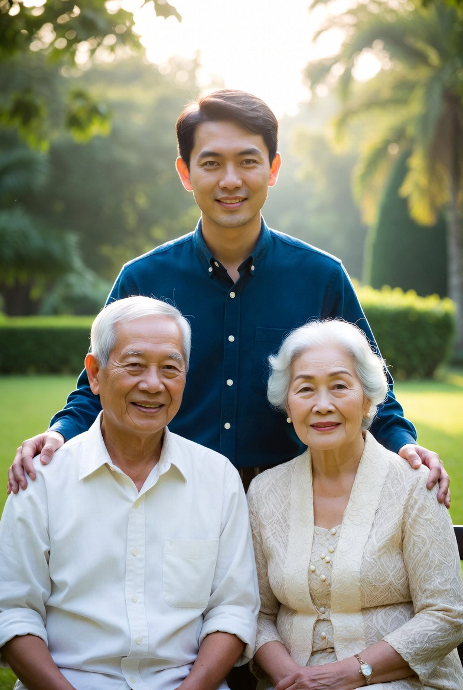

# Anak Sebagai Ujian dalam Kehidupan: Struktur Biopsikospiritual Ketaatan dan Risiko Kedurhakaan

*Ilustrasi anak dan orang tua (pic: Grok AI).*

  
***Menjadi anak yang baik bukan berarti selalu benar di mata orang tua, tapi tetap menjaga hati mereka… bahkan saat berbeda***
  

Dalam Qur’an, anak diposisikan bukan hanya sebagai anugerah, tetapi juga ujian eksistensial yang dapat mengarah pada keselamatan atau kehancuran moral. 

Bahkan terdapat narasi di mana relasi keluarga menjadi konflik iman, sebagaimana kisah anak dari Nuh yang menolak kebenaran. 

Studi ini bertujuan menganalisis bagaimana Islam merumuskan adab anak terhadap orang tua sebagai mekanisme pencegahan kedurhakaan, dengan pendekatan teologis, psikologis, dan etika normatif.

## Pendahuluan

Islam memandang keluarga sebagai unit pertama pembentukan moral. Namun relasi ini tidak steril dari konflik.

Ayat kunci:
“Sesungguhnya di antara istri-istrimu dan anak-anakmu ada yang menjadi musuh bagimu…”
(QS. At-Taghabun: 14)

Makna “musuh” di sini bukan kebencian biologis, tetapi penghalang menuju ketaatan kepada Tuhan.

## Anak sebagai Ujian: Perspektif Teologis

Dalam Qur’an disebutkan:

“Harta dan anak-anak adalah ujian (fitnah).”

Ujian ini bersifat dua arah:

1. Ujian bagi orang tua

•	apakah mendidik dengan benar

•	apakah adil dan penuh kasih

2. Ujian bagi anak

•	apakah tetap berbakti

•	atau justru melawan nilai kebenaran

## Kasus Paradigmatik: Anak Nabi

Kisah anak dari Nuh menunjukkan:

• hubungan darah tidak sama dengan jaminan iman

• pendidikan orang tua tidak sama dengan jaminan hasil

Ini mempertegas bahwa individu tetap bertanggung jawab atas pilihannya sendiri

## Konsep Kedurhakaan (Uquq al-Walidayn)

Dalam hadis Nabi Muhammad SAW: durhaka kepada orang tua termasuk dosa besar

Kedurhakaan bukan hanya tindakan ekstrem, tapi juga:

•	ucapan kasar

•	sikap meremehkan

•	mengabaikan kebutuhan orang tua

## Adab Anak terhadap Orang Tua

1. Adab Verbal (Lisan)

Dalam Qur’an:

“Janganlah engkau mengatakan ‘ah’ kepada keduanya…”

Implikasi:

•	tidak membentak

•	tidak menyela dengan kasar

•	berbicara dengan lembut

2. Adab Perilaku

•	patuh dalam hal yang tidak melanggar syariat

•	membantu kebutuhan mereka

•	menunjukkan penghormatan fisik dan emosional

3. Adab Psikologis

•	tidak menyimpan kebencian

•	memahami keterbatasan orang tua

•	melihat mereka sebagai manusia, bukan hanya otoritas

4. Adab Spiritual

•	mendoakan orang tua

•	memohon ampun untuk mereka

•	menjaga nama baik keluarga

## Batas Ketaatan

Islam juga memberikan batas penting: 

“Tidak ada ketaatan kepada makhluk dalam maksiat kepada Tuhan.”

Artinya:

➡️ ketaatan kepada orang tua tidak absolut

➡️ jika bertentangan dengan syariat, anak boleh menolak dengan tetap santun

## Analisis Biopsikospiritual

🔬Biologis

hubungan darah menciptakan ikatan emosional kuat

🧠 Psikologis

konflik generasi dapat memicu resistensi anak

🌌 Spiritual

ketaatan kepada orang tua menjadi bagian dari ketaatan kepada Tuhan

## Fenomena “anak menjadi musuh” tidak selalu berarti kebencian, tetapi:

➡️ ketika anak:

•	menarik orang tua dari kebaikan

•	atau menolak nilai yang diajarkan

Sebaliknya, anak yang beradab:

➡️ menjadi jalan keselamatan bagi orang tua

Anak dalam Islam adalah entitas ambivalen:

•	bisa menjadi sumber pahala

•	bisa menjadi sumber ujian

Agar tidak menjadi anak durhaka, diperlukan:

•	adab lisan

•	adab perilaku

•	adab psikologis

•	adab spiritual

Semua itu bertumpu pada satu prinsip: menghormati orang tua sebagai perpanjangan nilai ketuhanan, tanpa menghilangkan tanggung jawab moral pribadi.

  
**Referensi**

Ali, A. Y. (2004). The Qur’an: Text, translation and commentary. Islamic Book Trust.

Hadis riwayat Bukhari & Muslim tentang birrul walidain.
