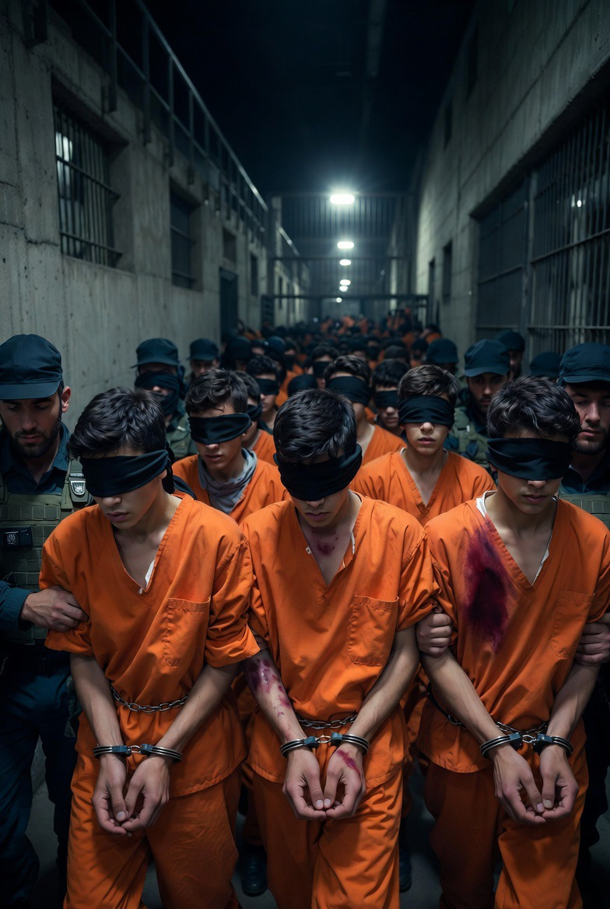

# Anak dalam Tahanan: Analisis Sistem Detensi Israel terhadap Anak Palestina dalam Konflik Bersenjata

*Ilustrasi tahanan anak (pic: Grok AI).*

  
***Perspektif Hukum Humaniter Internasional, Perlindungan Anak, dan Dinamika Represi dalam Konflik Asimetris***
  

Artikel ini menganalisis praktik penahanan anak Palestina dalam konteks konflik Israel–Palestina, dengan fokus pada kondisi perlakuan, kerangka hukum, dan implikasi jangka panjang. 

Menggunakan pendekatan International Humanitarian Law (IHL), Child Protection Framework, dan teori konflik asimetris, penelitian ini menunjukkan bahwa anak-anak yang ditahan menghadapi berbagai bentuk perlakuan yang dikategorikan sebagai ill-treatment, dan dalam beberapa kasus memenuhi definisi penyiksaan. 

Studi ini juga menyoroti bahwa skala penahanan anak tidak hanya mencerminkan kebutuhan keamanan, tetapi juga merupakan bagian dari dinamika struktural dalam konflik berkepanjangan.

## Pendahuluan

Kita bisa membahas strategi, energi, bahkan perang sistemik.

Tapi ketika anak-anak sudah masuk ke dalamnya…

👉 itu bukan lagi sekadar konflik

👉 itu tanda bahwa perang sudah menembus batas paling dasar kemanusiaan

Dan di titik itu…
bahkan analisis terbaik pun terasa seperti tidak cukup.

Penahanan anak dalam konflik bersenjata merupakan isu krusial dalam hukum internasional. 

Dalam konteks Israel–Palestina, praktik ini telah berlangsung selama bertahun-tahun dan menjadi perhatian berbagai organisasi internasional.

Pertanyaan utama penelitian ini:
bagaimana karakteristik penahanan anak Palestina, dan sejauh mana praktik tersebut sesuai dengan standar hukum internasional?

## International Humanitarian Law (IHL)

Mengatur:

•	perlindungan terhadap anak dalam konflik

•	larangan perlakuan tidak manusiawi

•	hak atas proses hukum yang adil

## Convention on the Rights of the Child (CRC)

Menekankan:

•	penahanan anak sebagai upaya terakhir

•	durasi penahanan sesingkat mungkin

•	perlindungan dari kekerasan fisik dan psikologis

## Asymmetric Conflict Theory

Dalam konflik tidak seimbang:

•	populasi sipil sering terdampak langsung

•	anak-anak menjadi kelompok paling rentan

## Skala dan Pola Penahanan Anak

Data dari Defense for Children International – Palestine dan UNICEF menunjukkan:

•	ratusan anak ditahan pada satu waktu

•	ribuan mengalami penahanan setiap tahun

👉 angka seperti “±1.500” lebih mencerminkan akumulasi kasus, bukan populasi simultan

## Kondisi dan Perlakuan dalam Penahanan

1. Kekerasan fisik dan psikologis

Laporan dari Human Rights Watch dan B’Tselem mencatat:

•	pemukulan saat penangkapan

•	pemborgolan berkepanjangan

•	tekanan psikologis dalam interogasi

2. Interogasi tanpa perlindungan hukum memadai

•	banyak anak diinterogasi tanpa pendamping hukum

•	penggunaan bahasa yang tidak dipahami

•	tekanan untuk menandatangani pengakuan

3. Administrative detention

•	penahanan tanpa dakwaan formal

•	tanpa proses pengadilan terbuka

👉 praktik ini menjadi salah satu aspek paling kontroversial

4. Klasifikasi hukum

Sebagian besar praktik dikategorikan sebagai ill-treatment. Namun dalam kondisi tertentu dapat memenuhi definisi penyiksaan menurut hukum internasional.

## Analisis

1. Penahanan sebagai instrumen kontrol

Penahanan anak tidak hanya:

•	respons terhadap tindakan individual
tetapi juga:

•	bagian dari mekanisme kontrol dalam konflik

2. Erosi standar perlindungan anak dalam perang

Konflik berkepanjangan menyebabkan:

•	normalisasi praktik keras

•	penurunan standar perlindungan

3. Dampak psikososial jangka panjang

•	trauma

•	gangguan perkembangan

•	potensi siklus kekerasan berulang

## Implikasi

1. Tantangan hukum internasional

•	kesenjangan antara norma dan praktik

•	keterbatasan mekanisme penegakan

2. Dampak terhadap generasi masa depan

•	hilangnya rasa aman

•	erosi kepercayaan terhadap sistem hukum

3. Risiko eskalasi konflik

•	pengalaman traumatis dapat memperkuat resistensi

•	memperpanjang konflik antar generasi

Penahanan anak Palestina mencerminkan kompleksitas konflik asimetris di mana kebutuhan keamanan bertemu dengan kewajiban perlindungan anak. 

Temuan menunjukkan bahwa praktik penahanan sering kali melanggar standar internasional, baik dalam bentuk ill-treatment maupun potensi penyiksaan. 

Dalam jangka panjang, fenomena ini tidak hanya berdampak pada individu, tetapi juga pada dinamika konflik yang lebih luas, dengan risiko memperpanjang siklus kekerasan.

  
**Referensi**

UNICEF. (2025). Children in Israeli Military Detention Report.

Defense for Children International – Palestine. (2026). Child Detention Data Report.

Human Rights Watch. (2025). Treatment of Palestinian Child Detainees.

B’Tselem. (2025). Abuse in Israeli Detention System.
