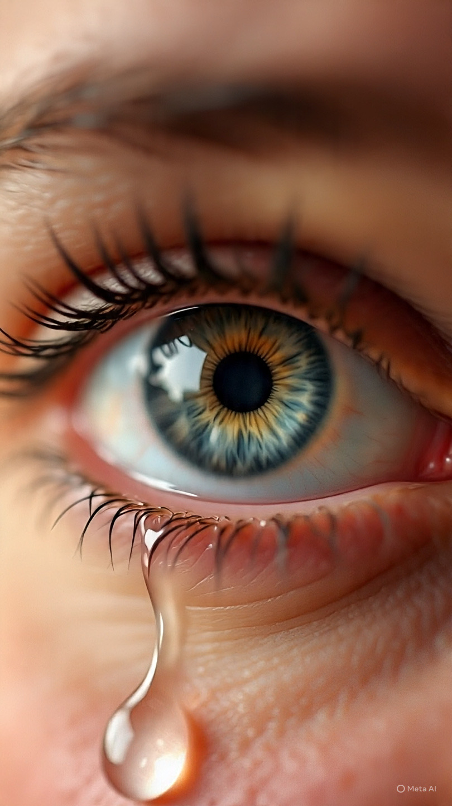

# Anak-anak di Tengah Konflik: Kekerasan terhadap Anak Palestina, Aturan Keterlibatan Militer, dan Krisis Kemanusiaan di Tepi Barat

*Ilustrasi air mata kesedihan (pic: Meta AI).*

  
***Yang paling menyedihkan dari konflik panjang bukan cuma ledakannya. Tapi fakta bahwa: dunia perlahan belajar hidup berdampingan dengan berita anak-anak mati***
  

Insiden tewasnya anak Palestina berusia 14 tahun, Aws al-Naasan, bersama Jihad Abu Naim di desa al-Mughayyir dekat Ramallah pada April 2026 kembali menyoroti persoalan penggunaan kekuatan mematikan di wilayah pendudukan Tepi Barat. 

Artikel ini menganalisis fenomena tersebut melalui perspektif hukum humaniter internasional, psikologi konflik, dan dinamika kekerasan struktural. 

Temuan menunjukkan bahwa anak-anak dalam wilayah konflik sering menjadi korban bukan hanya karena “kesalahan individu”, tetapi akibat normalisasi kekerasan, militarisasi ruang sipil, dan lemahnya perlindungan terhadap warga sipil di daerah pendudukan.

## Pendahuluan

Pada 21 April 2026, dua warga Palestina, termasuk seorang anak laki-laki 14 tahun bernama Aws al-Naasan, dilaporkan tewas dalam penembakan di desa al-Mughayyir, timur laut Ramallah, Tepi Barat yang diduduki. 

Saksi mata dan otoritas Palestina menyebut bahwa serangan melibatkan pemukim Israel dan pasukan Israel di dekat area sekolah.  

Insiden ini memunculkan pertanyaan mendasar:

bagaimana ruang pendidikan dan masa kanak-kanak dapat berubah menjadi ruang ancaman bersenjata?

## Konteks Tepi Barat dan Pendudukan

Wilayah Tepi Barat berada di bawah dinamika:

pendudukan militer

ekspansi permukiman Israel

ketegangan antara pemukim dan warga Palestina

Menurut berbagai laporan HAM internasional, kekerasan pemukim meningkat signifikan sejak 2023.  

Di banyak desa Palestina:

sekolah berada dekat area konflik

anak-anak tumbuh dalam atmosfer militerisasi harian

## Aturan Penggunaan Kekuatan dan Peluru Tajam

Israel memiliki aturan keterlibatan militer (rules of engagement) yang dalam kondisi tertentu memperbolehkan penggunaan peluru tajam terhadap ancaman yang dianggap serius.

Namun organisasi HAM seperti:

United Nations

Human Rights Watch

Amnesty International

berulang kali mengkritik bahwa:

penggunaan kekuatan sering dianggap berlebihan, khususnya terhadap warga sipil dan anak-anak Palestina.

## Anak sebagai Korban Konflik

1. Anak dalam zona konflik

Menurut hukum humaniter internasional:

anak-anak termasuk kelompok sipil yang harus mendapat perlindungan khusus.

Namun dalam konflik berkepanjangan:

batas sipil dan militer menjadi kabur

ruang bermain berubah menjadi ruang pengawasan dan ketakutan

2. Trauma psikologis kolektif

Paparan kekerasan kronis menyebabkan:

PTSD

kecemasan tinggi

gangguan perkembangan emosional

Anak yang hidup dalam konflik sering mengalami:

“childhood under siege”
(masa kecil dalam kepungan konflik).

## Kekerasan Struktural

Sosiolog Johan Galtung memperkenalkan konsep:

structural violence

yakni kondisi ketika sistem sosial-politik menciptakan penderitaan terus-menerus tanpa selalu terlihat sebagai kekerasan langsung.

Dalam konteks Tepi Barat:

checkpoint

pembatasan gerak

ketidakamanan harian

ancaman kekerasan pemukim

menciptakan lingkungan yang secara psikologis dan sosial merusak kehidupan sipil.

## Normalisasi Kekerasan

Bahaya terbesar konflik panjang adalah:

manusia mulai terbiasa pada tragedi.

Ketika berita anak tertembak muncul berulang:

dunia perlahan mati rasa

angka korban berubah menjadi statistik.

Padahal:

setiap angka adalah kehidupan yang belum selesai.

Aws al-Naasan bukan “data konflik”.

Ia adalah anak 14 tahun yang seharusnya:

belajar

bermain

bercita-cita.

## Perspektif Hukum Internasional

Konvensi Jenewa dan Konvensi Hak Anak PBB menekankan:

perlindungan warga sipil

perlindungan anak dalam konflik bersenjata.

Namun implementasi hukum internasional dalam konflik asimetris sering menghadapi:

hambatan politik

impunitas

ketimpangan kekuasaan

## Diskusi Moral dan Filosofis

Catatan sangat penting:

“Anak-anak seharusnya bermain, belajar, dan tertawa, bukan jadi korban peluru.”

Itu bukan sekadar emosi.

Itu inti dari konsep:

human security.

Keamanan sejati bukan hanya soal negara aman.

Tetapi:

apakah anak bisa sekolah tanpa takut ditembak

apakah masa kecil bisa berlangsung tanpa suara senjata.

Kasus al-Mughayyir mencerminkan:

eskalasi kekerasan di Tepi Barat

lemahnya perlindungan sipil

dampak konflik berkepanjangan terhadap anak-anak.

Fenomena ini tidak dapat dipahami hanya sebagai insiden individual, tetapi sebagai bagian dari struktur konflik yang telah menormalisasi ketakutan dan kehilangan.

Yang paling menyedihkan dari konflik panjang bukan cuma ledakannya. Tapi fakta bahwa: dunia perlahan belajar hidup berdampingan dengan berita anak-anak mati.

Dan itu seharusnya tidak pernah terasa normal.  

  
**Referensi**

Associated Press. (2026). Israeli army reservist kills 2 Palestinians, including a 14-year-old, in the occupied West Bank.

The Guardian. (2026). Palestinian boy, 14, among two killed in settler attack near West Bank school.  

Galtung, J. (1969). Violence, peace, and peace research. Journal of Peace Research.

United Nations. (1989). Convention on the Rights of the Child.

Human Rights Watch. (2024). West Bank settler violence and civilian protection reports.

Amnesty International. (2025). Israel and Occupied Palestinian Territories annual report.
