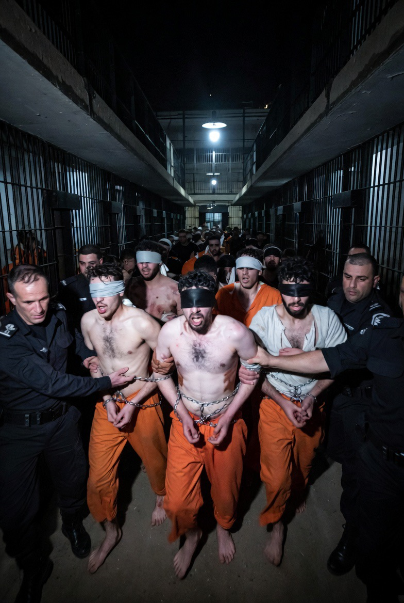

# Analisis Perlakuan terhadap Tahanan Palestina di Tengah Perang Iran–Israel: Eskalasi Kekerasan dalam Konflik Bersenjata

*Ilustrasi tahanan (pic: Grok AI).*

  
***Perspektif Human Rights, War-time Repression, dan Dinamika Distraksi Geopolitik***
  

Artikel ini menganalisis peningkatan laporan kekerasan terhadap tahanan Palestina dalam konteks eskalasi konflik regional Iran–Israel pada 2026. 

Menggunakan pendekatan human rights framework, war-time repression theory, dan geopolitical distraction, penelitian ini menunjukkan bahwa kekerasan terhadap tahanan tidak hanya merupakan fenomena terpisah, tetapi bagian dari pola struktural yang diperkuat oleh kondisi perang. 

Studi ini menemukan bahwa meskipun hubungan kausal langsung antara eskalasi Iran dan peningkatan kekerasan belum dapat dibuktikan secara definitif, dinamika perang menciptakan kondisi yang memungkinkan melemahnya akuntabilitas dan meningkatnya tindakan represif terhadap kelompok yang dipersepsikan sebagai ancaman internal.

## Pendahuluan

Dalam banyak perang, yang paling menderita bukan yang bersenjata, tapi yang sudah tidak punya kemampuan melawan. Dan mereka… sering tidak terlihat.

Perlakuan terhadap tahanan dalam konflik bersenjata merupakan indikator penting dalam menilai kepatuhan terhadap hukum humaniter internasional. 

Dalam konteks konflik Israel–Palestina, isu ini telah lama menjadi perhatian global. Namun, eskalasi konflik Iran–Israel 2026 menghadirkan pertanyaan baru:

apakah konflik regional memperburuk perlakuan terhadap tahanan Palestina?

## International Humanitarian Law (IHL)

Menekankan:

•	larangan penyiksaan

•	perlakuan manusiawi terhadap tahanan

•	perlindungan terhadap martabat manusia

## War-time Repression Theory

Dalam kondisi perang:

•	negara cenderung meningkatkan kontrol internal

•	tindakan represif terhadap kelompok tertentu meningkat

•	standar hukum dapat mengalami erosi

## Geopolitical Distraction Theory

Konflik besar:

•	mengalihkan perhatian internasional

•	mengurangi tekanan eksternal

•	menciptakan ruang bagi pelanggaran hak asasi

## Temuan Empiris

1. Laporan penyiksaan berskala besar

Seorang pelapor khusus dari United Nations melaporkan:

•	kekerasan fisik ekstrem

•	penyiksaan psikologis

•	perlakuan tidak manusiawi terhadap tahanan

👉 disebut sebagai eskalasi signifikan dalam skala dan intensitas.

2. Praktik kekerasan yang terdokumentasi

Laporan dari B’Tselem dan Human Rights Watch menunjukkan:

•	pemukulan sistematis

•	kelaparan

•	kekerasan seksual

•	kondisi penahanan yang tidak layak

👉 mengindikasikan pola struktural, bukan insiden terisolasi.

3.Melemahnya akuntabilitas

Kasus militer menunjukkan:

•	tuduhan penyiksaan terhadap tentara tidak selalu berujung hukuman

•	beberapa kasus dihentikan proses hukumnya

👉 menandakan potensi impunitas institusional

## Analisis

1. Kekerasan sebagai bagian dari struktur konflik

Kekerasan terhadap tahanan:

•	tidak berdiri sendiri

•	terkait dengan dinamika konflik yang lebih luas

•	berfungsi sebagai alat kontrol

2. Perang eksternal dan represi internal

Eskalasi konflik Iran–Israel menciptakan:

•	peningkatan persepsi ancaman

•	legitimasi tindakan keras terhadap “musuh internal”

👉 sesuai dengan war-time repression theory

3. Distraksi global dan penurunan pengawasan

Ketika perhatian dunia terfokus pada konflik regional:

•	isu tahanan menjadi kurang mendapat sorotan

•	tekanan internasional menurun

👉 membuka ruang bagi eskalasi pelanggaran

4.Kausalitas: antara bukti dan kemungkinan

Secara empiris:
•	belum ada bukti langsung bahwa serangan Iran → penyiksaan meningkat

Namun secara teoritis:
•	kondisi perang → meningkatkan probabilitas kekerasan

👉 hubungan bersifat indirek dan kontekstual

## Implikasi

1. Risiko pelanggaran HAM sistemik

•	normalisasi kekerasan

•	erosi standar hukum internasional

2. Dampak psikososial jangka panjang

•	trauma tahanan

•	radikalisasi

•	siklus kekerasan berulang

3. Tantangan akuntabilitas global

•	sulitnya investigasi

•	keterbatasan tekanan internasional

## Diskusi

Fenomena ini menunjukkan bahwa perang tidak hanya terjadi di medan tempur, tetapi juga dalam ruang tersembunyi seperti penjara.

Dalam konteks ini:

•	tahanan menjadi kelompok paling rentan

•	kekerasan terhadap mereka sering kurang terlihat

Peningkatan laporan kekerasan terhadap tahanan Palestina menunjukkan adanya eskalasi serius dalam konteks konflik bersenjata. 

Meskipun hubungan langsung dengan konflik Iran–Israel belum dapat dipastikan, kondisi perang secara signifikan menciptakan lingkungan yang memungkinkan meningkatnya tindakan represif dan melemahnya akuntabilitas. 

Oleh karena itu, perlindungan terhadap tahanan harus menjadi perhatian utama dalam analisis konflik modern.

  
**Referensi**

United Nations. (2026). Special Rapporteur Report on Detention Practices.

Human Rights Watch. (2026). Israel/Palestine Detention Conditions Report.

B’Tselem. (2025). Systematic Abuse in Israeli Detention Facilities.

Amnesty International. (2026). Treatment of Detainees in Armed Conflict.
