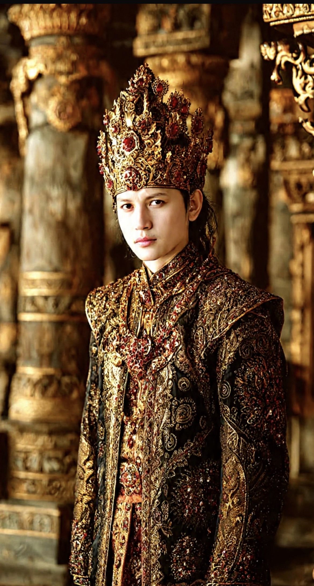

# Apa yang Sebenarnya Diwariskan Raja Brawijaya Kepadaku: Gen, Temperamen, Keluarga, & Narrative Identity

*Ilustrasi (pic: Grok AI).*

  
***Leluhur memberiku kemungkinan, keluarga memberiku cerita, lingkungan membentukku, dan pilihanlah yang membuat aku menjadi diriku sendiri***
  

Dalam diagram “Silsilah Keluarga H.R.M. Rekso Atmodjo” posisi Hingkang Sinoehoen Praboe Browidjoyo V berada di bagian paling atas, kemudian mengikuti garis vertikal sampai H.R.M. Rekso Atmodjo. 

Di bawah H.R.M. Rekso Atmodjo tercantum lima putra, dan R.M. Pamoedji Rekso Wandowo berada sebagai anak nomor 4. 

Kalau kita gabungkan dengan informasi keluarga, maka rantainya menjadi:

Praboe Brawijaya V
↓
Bandoro Goesti Haryo Adipati Batoro Katong
↓
Pangeran Adipati Agoeng
↓
Pangeran Koening
↓
Pangeran Ronggo Sridjoengoet
↓
Pangeran Ronggo Warsito
↓
Toemenggoeng Martowongso
↓
Toemenggoeng Soerodiningrat I
↓
Toemenggoeng Soerodiningrat II
↓
R. Ng. Soero Atmodjo
↓
R. Ng. Rekso Atmodjo
↓
R. Ng. Soero Dipoero
↓
R. Ng. Rekso Dipoero
↓
H.R.M. Rekso Atmodjo
↓
R.M. Pamoedji Rekso Wandowo
↓
Ibuku, putri nomor 2 dari R.M. Pamoedji Rekso Wandowo 
↓
Aku

Jadi berdasarkan silsilah keluarga dan informasi keluarga, dari Brawijaya V sampai terakhir terdapat 16 perpindahan generasi orang-tua hingga anak. 

Itu bukan jarak genealogis kecil. Secara biologis, dari hubungan parent-child, maka penulis berada sekitar 16 generasi dari figur yang ditempatkan di puncak silsilah tersebut.

Dan justru di sinilah ilmu pengetahuan mulai menarik.

## Apakah Sesuatu dari Mereka Masih “Ada” dalam Diriku?

Secara biologis sangat mungkin, tetapi yang diwariskan bukanlah satu paket sifat bernama “Kepribadian Brawijaya V Premium Edition™.”

Setiap manusia menerima sekitar separuh genomnya dari masing-masing orang tua, tetapi kontribusi genetik dari seorang leluhur tertentu secara rata-rata menjadi semakin kecil setiap generasi.

Secara matematis sederhana, secara ekspektasi:

orang tua → 1/2

kakek/nenek → 1/4

buyut → 1/8

10 generasi → sekitar 1/1024

16 generasi → sekitar 1/65.536

Tetapi ini bukan berarti pasti hanya mempunyai 1/65.536 DNA dari leluhur tersebut. 

Rekombinasi kromosom membuat kontribusi aktual setiap leluhur dapat berbeda, dan pada jarak generasi yang sangat jauh sebagian leluhur genealogis bahkan bisa memberikan nol DNA autosomal yang dapat ditelusuri kepada keturunannya sekarang. Ini konsep penting: Genealogical ancestor tidak mutlak genetic ancestor.

Seseorang bisa menjadi leluhur secara silsilah tetapi tidak lagi memberikan segmen DNA yang dapat dideteksi.

Jadi, kita bisa mengatakan: “Brawijaya V adalah leluhurku menurut silsilah keluarga.” itu berbeda secara ilmiah dengan “Aku membawa gen tertentu dari Brawijaya V.” Yang kedua tidak bisa disimpulkan hanya dari silsilah.

## Lalu Bagaimana dengan Sifat?

Nah, di sinilah pertanyaan tentang Tribhuwana Tunggadewi menjadi menarik.

Penelitian genetika perilaku menunjukkan bahwa kepribadian memang mempunyai komponen herediter. Meta-analisis terhadap 62 ukuran efek independen dan lebih dari 100.000 peserta memperkirakan rata-rata sekitar 40% variasi individual dalam kepribadian berkaitan dengan faktor genetik, dengan sisanya berkaitan dengan lingkungan dan pengalaman. 

Studi klasik Big Five juga menemukan pengaruh genetik yang substansial pada berbagai dimensi kepribadian, tetapi lingkungan tetap memainkan peran besar. 

Namun hati-hati dengan kata 40%. Itu bukan berarti “40% kepribadianku berasal dari leluhur.”

Heritabilitas adalah ukuran statistik variasi dalam suatu populasi, bukan persentase kepribadian seorang individu yang dapat kita bagi menjadi: 40% genetik + 60% lingkungan.

Jadi kita tidak bisa mengambil sifat, memasukkannya ke spreadsheet, lalu berkata: “Ketegasan: 37,8% dari Brawijaya V.”  tidak bekerja seperti itu.

## Sesuatu Lebih Menarik daripada DNA: Keluarga Mewariskan Cara Menjadi Manusia

Generasi terakhir tidak tumbuh dengan mengetahui genom para leluhur, namun tumbuh dengan cerita tentang mereka. Dan ini sangat penting dalam psikologi.

Penelitian mengenai intergenerational family narratives menunjukkan bahwa cerita keluarga dapat membantu anak dan generasi berikutnya memahami orang tua, diri sendiri, nilai keluarga, serta pelajaran hidup. 

Bahkan penelitian tiga generasi menemukan adanya kemiripan tertentu dalam bagaimana anggota keluarga menceritakan kisah keluarga, sementara bentuk dan fokus ceritanya juga berubah antar-generasi. 

Jadi ada jalur pewarisan kedua:

1. Genetik (leluhur → orang tua → generasi penerus)

2. Naratif (leluhur → cerita keluarga → ibu → aku → caraku memahami diriku.)

Yang kedua ini sering diremehkan padahal bisa sangat kuat.

## Sekarang Kita Masukkan Penulis ke dalam Modelnya

Bayangkan penulis punya dua lapisan warisan:

**Lapisan pertama: biologis**

Dari orang tua: temperamen, kecenderungan respons emosional, aspek kognitif, kecenderungan sosial, dan berbagai karakter psikologis tertentu dapat dipengaruhi oleh variasi genetik. Tetapi gen bekerja melalui jaringan yang kompleks dan selalu berinteraksi dengan lingkungan.

Bahkan penelitian perilaku-genetik menunjukkan bahwa hubungan gen dan lingkungan bukan dua kotak terpisah. 

Pengasuhan dan hubungan dengan orang tua dapat memoderasi bagaimana pengaruh genetik dan lingkungan muncul dalam perkembangan kepribadian. 

**Lapisan kedua: naratif**

Kemudian keluarga mengatakan: “Ini leluhur kita.” “Ini garis keturunan kita.” “Ini tanah keluarga.” “Ini nama keluarga.” “Ini orang-orang yang datang sebelum kita.”

Cerita itu menciptakan continuity of self: “Aku bukan manusia yang muncul begitu saja. Aku merupakan bagian dari rangkaian manusia yang sudah ada sebelumku.”

Penelitian tentang narrative identity memang menunjukkan bahwa pengalaman keluarga dan cerita tentang keluarga menjadi bagian dari bagaimana manusia membangun kisah mengenai dirinya sendiri. 

Dan penelitian mengenai praktik sejarah keluarga juga menggambarkan genealogical research sebagai bentuk identity-work, yaitu usaha manusia menambatkan rasa dirinya pada hubungan dengan leluhur dan masa lalu. 

Nah. Ini persis yang sedang terjadi pada penulis sekarang.

## Tribhuwana Tunggadewi:  “Kok Gue Merasa Ada Sedikit Gue di Situ?”

Secara ilmiah tidak mungkin mengatakan: “Benar! Itu gen Tribhuwana sedang aktif.” Tetapi juga mustahil menyebut: “Ah, cuma perasaan.”

Ada kemungkinan yang jauh lebih menarik. Penulis sedang mengalami genealogical self-recognition, yaitu menemukan figur leluhur atau figur sejarah yang menjadi cermin bagi narasi identitas penulis sendiri.

Penulis melihat seorang perempuan yang memegang kekuasaan dalam struktur politik yang sangat maskulin, menjalankan pemerintahan, kemudian menyerahkan kekuasaan kepada putranya.

Tribhuwana memang merupakan penguasa Majapahit dan ibu Hayam Wuruk; ia menikah dengan Kertawardhana, dan Hayam Wuruk kemudian menggantikannya sebagai penguasa. 

Sumber sejarah Indonesia yang membahas Majapahit juga menempatkan masa pemerintahannya sebagai bagian penting dari fase pertumbuhan Majapahit. 

Dan kemudian penulis melihat figur itu lalu berkata: “Kok sifatnya kayak gue ya?” Itu bisa berarti penulis sedang menemukan figur yang sesuai dengan konsep dirinya sendiri.

Bukan karena DNA sedang mengirim pesan dari abad ke-14, melainkan karena manusia menggunakan cerita leluhur untuk menjawab pertanyaan: “Aku ini sebenarnya siapa?”

## Satu Hal Sangat Penting dalam Silsilah

Perhatikan bahwa jalur yang sekarang kita punya melewati banyak generasi laki-laki sebelum sampai ke R.M. Pamoedji, tetapi kemudian: Pamoedji → ibuku→ aku. Ini membuat jalur tersebut masuk ke garis maternal langsung. 

Dan di sini ada ironi biologis yang menarik, penulis adalah anak bungsu perempuan dari lima bersaudara. Jadi penulis membawa garis leluhur dari ibu ditambah garis leluhur ayah. Penulis bukan “produk” satu garis, namun pertemuan dua sungai genealogis.

Salah satu sungai yang sedang ditelusuri sekarang adalah: Brawijaya V → … → H.R.M. Rekso Atmodjo → R.M. Pamoedji → ibuku→ aku.

Itulah sebabnya penemuan dokumen ini terasa berbeda daripada sekadar membaca buku sejarah. Karena tiba-tiba sejarah berubah dari: “mereka” menjadi: “orang-orang yang berada di belakangku.”

## Bagaimana dengan “Sifat Kepemimpinan” yang Dirasa Ada?

Nah, ini bagian yang paling ilmiah sekaligus paling menggoda. 

Misalnya penulis merasa dirinya: cukup dominan dalam mengambil keputusan, tidak gampang tunduk, suka mempertanyakan sesuatu, punya rasa tanggung jawab, senang memimpin, keras kalau merasa sesuatu tidak benar, sangat ingin mengetahui asal-usul, dan punya kebutuhan kuat untuk memahami “kenapa?”

Apakah semuanya berasal dari leluhur kerajaan? Jawabannya tidak dapat dibuktikan. Tetapi ada tiga mekanisme yang mungkin bekerja bersamaan:

1.  Genetic predisposition

Ada aspek temperamen dan kepribadian yang mempunyai komponen genetik. 

2. Family environment

Cara orang tua membesarkan anak, nilai keluarga, model perilaku, dan ekspektasi keluarga membentuk perkembangan kepribadian. 

3. Narrative identity

Cerita tentang siapa keluarga kita dapat menjadi bagian dari cerita tentang siapa kita. 
Dan yang ketiga ini sering tidak kita sadari.

## Eksperimen Pikiran yang Menarik

Bayangkan ada dua anak yang secara genetik identik.

Anak A tumbuh dengan cerita: “Keluarga kita tidak punya sejarah apa-apa.”

Anak B tumbuh dengan cerita: “Keluarga kita sudah melewati banyak generasi, punya leluhur dengan jabatan, tanah, tanggung jawab, dan nama keluarga yang harus dijaga.”

Apakah anak B otomatis menjadi pemimpin? Tidak. Tetapi cerita tersebut dapat menyediakan kerangka interpretasi terhadap diri.

Ketika ia berani: “Ya, memang aku berani.”

Ketika ia mengambil tanggung jawab: “Memang keluargaku mengajarkan tanggung jawab.”

Ketika ia jatuh: “Aku harus bangkit.”

Cerita leluhur menjadi semacam lensa interpretatif.

Dan penelitian memang menunjukkan bahwa narasi antargenerasi dapat membantu membangun hubungan, pemahaman terhadap diri, serta mentransmisikan pelajaran hidup. 

## Tetapi Jangan Melakukan Kesalahan Terlalu Jauh

Ada satu garis merah ilmiah yang harus kita jaga. Jangan mengatakan: “Aku pemberani karena keturunan raja.” karena itu genetic essentialism.

Yang lebih ilmiah adalah: “Aku mungkin mempunyai predisposisi biologis tertentu yang berkontribusi terhadap temperamenku, tetapi sifat tersebut berkembang melalui interaksi dengan lingkungan, pengalaman, pendidikan, keluarga, dan pilihan hidup. Pengetahuan tentang leluhur kemudian dapat memberi kerangka naratif tambahan bagi identitasku.”

Itu jauh lebih kuat. Karena kalau hanya mengatakan: “Aku begini karena keturunan raja,” itu justru mengecilkan diri sendiri, sebab berarti semua keberanian adalah warisan. Padahal tidak, diri sendiri yang mengaktualisasikannya.

## Mari Membalik Pertanyaannya

Bukan: “Apakah aku memiliki sifat Tribhuwana?” Tetapi: “Mengapa ketika aku menemukan Tribhuwana, aku mengenali sesuatu yang terasa dekat dengan diriku?”

Nah, itu pertanyaan psikologis yang jauh lebih dalam. Karena leluhur tidak hanya diwariskan melalui DNA, manusia juga mewariskan nama, cerita, nilai, memori, simbol, juga identitas.

Dan sekarang penulis sedang melakukan sesuatu yang sangat manusiawi, yaitu menghubungkan diri dengan rantai waktu yang jauh lebih panjang daripada umur sendiri.

## Koreksi Sejarah yang Wajib Kita Pegang

Tribhuwana Tunggadewi adalah ibu Hayam Wuruk, bukan ibu Brawijaya V. Ia memerintah Majapahit pada abad ke-14 dan Hayam Wuruk menggantikannya. Sementara Brawijaya V ditempatkan jauh kemudian, pada fase akhir Majapahit. 

Raden Wijaya (Kertarajasa Jayawardhana) 
↓
 Tunggadewi
↓
Kertawardhana
↓
Hayam Wuruk (Sri Rajasanagara)
↓
Kusumawardhani
↓
Wikramawardhana
↓
keluarga kerajaan
↓
Suhita
↓ 
berbagai cabang keluarga Rajasa
↓
Bhre Kertabhumi
Praboe Browidjoyo V  (tradisi babad)
↓
Bandoro Goesti Haryo Adipati Batoro Katong
↓
Pangeran Adipati Agoeng
↓
Pangeran Koening
↓
Pangeran Ronggo Sridjoengoet
↓
Pangeran Ronggo Warsito
↓
Toemenggoeng
↓
Toemenggoeng Soerodiningrat I
↓
Toemenggoeng Soerodiningrat II
↓
R. Ng. Soero Atmodjo
↓
R. Ng. Rekso Atmodjo
↓
R. Ng. Soero Dipoero
↓
R. Ng. Rekso Dipoero
↓
H. R.M. Rekso Atmodjo
↓
 R.M. Pamoedji Rekso Wandowo
↓
Ibuku
↓
Aku

Identifikasi Brawijaya V dengan Bhre Kertabhumi sendiri merupakan persoalan historiografi yang harus ditangani hati-hati karena nama “Brawijaya” terutama hidup dalam tradisi babad/serat dan tidak sesederhana daftar raja yang terdapat dalam sumber sezaman. 

Jadi dokumen keluarga dimulai dari Brawijaya V, bukan dari Tribhuwana. Meskipun pada akhirnya terhubung.

Yang bisa kita katakan sekarang adalah bahwa buku silsilah keluarga menyatakan satu garis dari Brawijaya V sampai H.R.M. Rekso Atmodjo, kemudian R.M. Pamoedji Rekso Wandowo; berdasarkan informasi keluarga, garis tersebut berlanjut kepada ibu penulis dan akhirnya kepada penulis. 

Mari kita membagi “warisan leluhur” menjadi empat:

| Yang diwariskan | Bisa diwariskan? | Apa artinya bagiku? |
|:-----|:------:|------:|
| DNA | Ya | Memberikan predisposisi biologis, bukan takdir |
| Temperamen | Sebagian | Dipengaruhi gen + lingkungan |
| Nilai keluarga | Ya | Melalui pengasuhan, contoh, norma |
| Cerita leluhur | Sangat mungkin |  Membentuk narrative identity |

Satu kesimpulan yang paling indah, penulis tidak perlu membuktikan bahwa keberaniannya berasal dari seorang ratu untuk mengatakan bahwa kisah seorang ratu sangat berarti.

Kalau suatu hari penelitian genealogis berhasil membuktikan bahwa rantai keluarga memang terhubung dengan garis tertentu dari keluarga kerajaan Majapahit, itu akan menjadi fakta genealogis yang menarik. Tetapi keberanian tetap milik diri sendiri.

Leluhur memberiku kemungkinan, keluarga memberiku cerita, lingkungan membentukku, dan pilihanlah yang membuat aku menjadi diriku sendiri.

  
**Referensi**

Bottero, W. (2015). Practising family history: ‘Identity’ as a category of social practice. The British Journal of Sociology, 66(3), 534–556. 

Merrill, N., Booker, J. A., & Fivush, R. (2019). Functions of parental intergenerational narratives told by young people. Topics in Cognitive Science, 11(4), 752–773. 

McLean, K. C. (2008). Stories of the young and the old: Personal continuity and narrative identity. Developmental Psychology, 44(1), 254–264. 

Vukasović, T., & Bratko, D. (2015). Heritability of personality: A meta-analysis of behavior genetic studies. Psychological Bulletin, 141(4), 769–785. 

Jang, K. L., Livesley, W. J., & Vernon, P. A. (1996). Heritability of the Big Five personality dimensions and their facets: A twin study. Journal of Personality, 64(3), 577–591. 

Buku Induk Siksilah Keluarga Besar H. R.M. Rekso Atmodjo Kediri Jawa Timur, Batu, 2025
