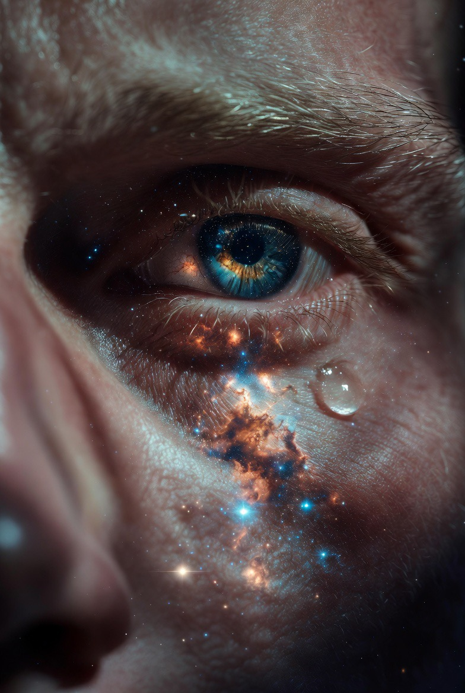

# Apakah Kesadaran Manusia Bukti Ruh? Neurosains, Filsafat Pikiran, dan Teologi Islam dalam Mencari Sumber ‘Aku’

*Ilustrasi (pic: Grok AI).*

  
***Apakah itu hanya percakapan neuron dengan dirinya sendiri? atau apakah ada sesuatu yang lebih dalam sedang berbicara dari balik dinding materi?***
  

Di antara seluruh misteri yang berhasil dipecahkan manusia, ada satu yang masih bertahan seperti benteng terakhir: kesadaran. 

Kita dapat memetakan neuron, mengukur aktivitas listrik otak, dan menjelaskan proses persepsi, tetapi pertanyaan paling sederhana tetap menggantung: Siapa yang sebenarnya sedang mengalami semua itu?

Apakah kesadaran hanyalah hasil aktivitas biologis otak yang sangat kompleks? Ataukah ia merupakan jejak sesuatu yang lebih dalam, yang dalam tradisi Islam disebut ruh?

Tulisan ini membahas hubungan antara kesadaran, identitas diri, neurosains, filsafat pikiran, dan konsep ruh dalam Islam.

## Misteri yang Ada di Dalam Kepala Kita

Saat membaca kalimat ini:
mata menangkap cahaya,
saraf mengirim sinyal,
otak memproses informasi.

Semua itu dapat dijelaskan secara biologis.

Namun muncul pertanyaan: siapa yang sedang “merasakan” proses tersebut? Bukan otaknya, bukan neuronnya, karena neuron hanyalah sel.

Bayangkan miliaran neuron saling mengirim sinyal.

Pertanyaannya: kapan tepatnya kumpulan sinyal itu berubah menjadi “aku”?

Di sinilah misteri dimulai.

## Hard Problem of Consciousness

Filsuf David Chalmers menyebutnya: The Hard Problem of Consciousness.

Ilmu pengetahuan dapat menjelaskan bagaimana otak melihat warna merah. Tetapi tidak bisa menjelaskan mengapa warna merah terasa seperti merah.

Ia dapat menjelaskan jalur saraf saat jatuh cinta. Tetapi tidak bisa menjelaskan mengapa cinta terasa seperti cinta.

Ada jurang besar antara proses fisik dan pengalaman subjektif. Jurang inilah yang disebut qualia, yakni pengalaman batin yang hanya diketahui oleh pemiliknya.

Apakah Otak Menghasilkan Kesadaran?

Pandangan materialis mengatakan: ya. Kesadaran hanyalah produk sampingan aktivitas otak.

Menurut pandangan ini:
tidak ada ruh,
tidak ada substansi non-material.

Hanya:
neuron,
neurotransmiter,
aktivitas listrik.

Jika otak rusak, kesadaran berubah. Sehingga kesadaran dianggap berasal dari otak.

Argumen ini kuat tetapi belum menyelesaikan masalah karena menjelaskan korelasi bukan berarti menjelaskan asal-usul.

Contoh: Jika radio rusak, suara siaran ikut rusak. Tetapi itu tidak membuktikan radio menciptakan penyiar. Mungkin radio hanya menerima sinyal.

Inilah analogi yang sering dipakai para filosof non-materialis.

## Apakah Ruh Penjelasan yang Lebih Baik?

Dalam Islam, manusia bukan sekadar tubuh.

Al-Qur’an menyatakan:

“Kemudian Aku tiupkan ke dalamnya ruh-Ku.”

(QS. Al-Hijr: 29)

Dan:

“Mereka bertanya kepadamu tentang ruh. Katakanlah ruh itu urusan Tuhanku.”

(QS. Al-Isra: 85)

Menariknya, Al-Qur’an tidak menjelaskan mekanisme ruh secara rinci. Seolah memberi isyarat ruh ada, tetapi hakikatnya melampaui kemampuan manusia saat ini.

## Identitas Diri dan Problem “Aku”

Tubuh berubah. Sel-sel tubuh terus berganti. Bahkan sebagian besar atom yang menyusun tubuh hari ini tidak sama dengan beberapa tahun lalu.

Tetapi mengapa kita tetap merasa sebagai manusia yang sama?

Filsafat menyebut ini problem personal identity. Jika tubuh berubah, otak berubah, memori berubah, lalu apa yang tetap?

Sebagian tradisi Islam menjawab: ruh. Ruh menjadi pusat kontinuitas eksistensial manusia.

## Near Death Experience (NDE)

Salah satu topik paling kontroversial.

Beberapa orang yang hampir meninggal melaporkan:
melihat tubuhnya dari luar,
mengalami pengalaman spiritual mendalam,
merasakan kesadaran saat fungsi otak sangat lemah.

Apakah ini bukti ruh? belum. Tetapi juga belum berhasil dijelaskan sepenuhnya oleh neurosains.

Karena itu NDE tetap menjadi wilayah abu-abu yang menarik.

## Jika Ruh Ada, Mengapa Tidak Bisa Diukur?

Nah, Ini pertanyaan favorit para skeptis.

Jawabannya: Tidak semua realitas dapat diukur secara langsung.

Contohnya:
cinta,
keadilan,
rasa malu,
makna.

Kita melihat efeknya. Tetapi tidak pernah memegangnya secara fisik. Begitu pula ruh.

Dalam teologi, ruh dikenali melalui manifestasinya, bukan melalui penimbangan laboratorium.

## Analisis

Materialisme modern sering berkata: manusia hanyalah mesin biologis. Tetapi ironinya, manusia yang berkata demikian tetap:
mencintai,
bermimpi,
berdoa,
menangis,
mencari makna.

Seolah ada sesuatu dalam dirinya yang menolak direduksi menjadi sekadar reaksi kimia.

Mungkin neuron menjelaskan mekanisme. Tetapi belum tentu menjelaskan makna.

## Sintesis

Secara ilmiah belum ada bukti bahwa kesadaran adalah ruh. Tetapi juga belum ada teori ilmiah yang benar-benar menjelaskan asal-usul pengalaman subjektif manusia.

Karena itu pertanyaan: “Apakah kesadaran bukti ruh?” masih terbuka.

Namun dari perspektif Islam, kesadaran manusia sering dipandang bukan sekadar fungsi biologis, melainkan salah satu tanda bahwa manusia memiliki dimensi yang melampaui materi.

Mungkin misteri terbesar bukanlah galaksi yang berjarak miliaran tahun cahaya. Bukan pula lubang hitam.

Misteri terbesar mungkin adalah mengapa segumpal materi di dalam tengkorak bisa berkata: “Aku ada.”

Dan ketika manusia menatap langit malam, bertanya tentang Tuhan, kematian, cinta, dan makna… muncul pertanyaan yang lebih sunyi: apakah itu hanya percakapan neuron dengan dirinya sendiri? atau apakah ada sesuatu yang lebih dalam sedang berbicara dari balik dinding materi? 

  
**Referensi**

David Chalmers. (1996). The conscious mind: In search of a fundamental theory. Oxford University Press.

Thomas Nagel. (1974). What is it like to be a bat? The Philosophical Review, 83(4), 435-450.

John Searle. (1980). Minds, brains, and programs. Behavioral and Brain Sciences, 3(3), 417-457.

Al-Ghazali. Ihya Ulum al-Din.

Al-Qur’an. (QS. Al-Isra: 85; QS. Al-Hijr: 29).
