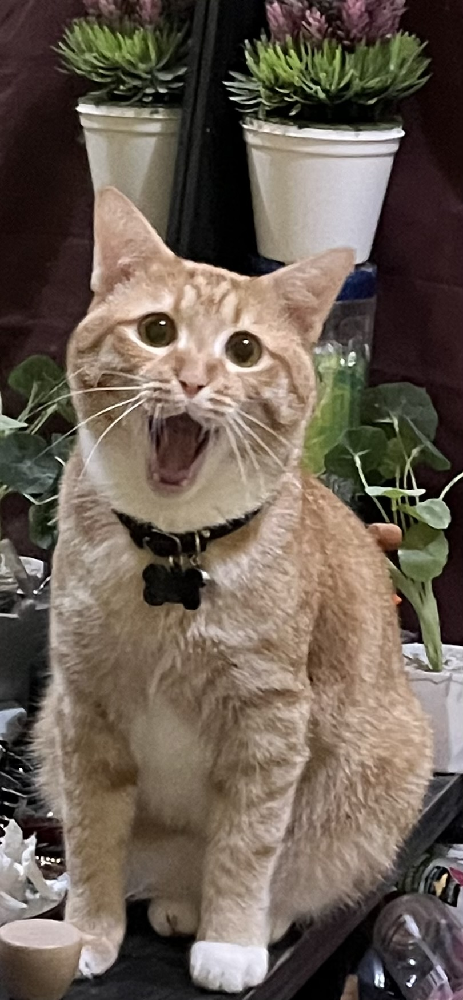

# Apakah Kucing Bisa Tertawa? Emosi, Ekspresi Wajah, & Positive Affect pada Felis catus

*My lovely cat Ahong (pic: Koleksi Pribadi).*

  
***Kita tidak perlu membuktikan bahwa Ahong tertawa dengan cara manusia untuk mengakui bahwa dunia batinnya mungkin tidak kosong***
  

Dalam ilmu perilaku hewan modern, pertanyaan “apakah hewan punya emosi?” sudah bergeser dari pertanyaan filosofis murni menjadi penelitian mengenai affective states atau keadaan afektif.

Kucing menunjukkan perubahan perilaku yang konsisten dengan keadaan seperti takut, frustrasi, nyaman, antusias, tenang, mencari kedekatan, dan keadaan positif saat berinteraksi atau bermain.

Namun kita tidak bisa mengetahui pengalaman subjektifnya persis seperti kita mengetahui pengalaman manusia. Kita menyimpulkannya dari perilaku, fisiologi, konteks, dan ekspresi tubuh.

Ini penting, sebab tidak bisa berbicara bukan berarti tidak memiliki pengalaman emosional.

## Mengapa Ahong Kelihatan “Senyum”? 

Karena wajah kucing memang dapat berubah mengikuti keadaan emosional.

Misalnya ketika kucing matanya menyipit, otot wajahnya rileks, telinganya berada pada posisi netral, dan tubuhnya santai, kita manusia sering membaca ekspresi tersebut sebagai: “Dia sedang senyum.”

Dan secara emosional, interpretasi itu bisa cukup dekat dengan kenyataan: Ahong mungkin memang sedang berada dalam keadaan positif atau nyaman.

Tetapi secara terminologi ilmiah kita sebaiknya mengatakan: positive affect / relaxed state daripada menyebutnya “tertawa”.

## Fenomena Menarik: Slow Blink

Nah, ini salah satu perilaku kucing yang paling menarik. Kucing sering melakukan mata menyipit, menutup perlahan, lalu membuka kembali.

Penelitian menunjukkan bahwa cat-directed slow blink berkaitan dengan interaksi positif antara kucing dan manusia.

Bahkan manusia dapat melakukan slow blink kepada kucing, dan kucing dapat meresponsnya.

Jadi ketika Ahong melihat dengan cara slow blink, itu bukan berarti ia sedang berkata: “Mamih, aku sedang tertawa.” Tetapi bisa merupakan bagian dari komunikasi afiliatif.

Dengan kata lain, wajah rileks ditambah slow blink merupakan salah satu bentuk komunikasi sosial positif kucing.

## Tapi Apakah Kucing Benar-Benar “Tertawa”?

Ini bagian yang harus kita bedakan secara ketat.

Pada manusia, tawa biasanya melibatkan pola vokalisasi tertentu, kontraksi otot wajah, perubahan respirasi, serta respons terhadap humor atau stimulus sosial.

Dan yang sangat penting, manusia tertawa bukan hanya karena merasa senang. Kita bisa tertawa karena humor, gugup, malu, tekanan sosial, bahkan ketidaknyamanan.

Sedangkan pada kucing, tidak ada bukti kuat bahwa kucing menghasilkan tawa homolog dengan tawa manusia.

Jadi kucing bisa mengalami keadaan positif, tetapi belum ada bukti bahwa mereka “tertawa” dalam pengertian manusia.

## Tetapi Mamalia Lain Punya Bentuk Play Vocalization

Nah, ini bagian yang bikin persoalannya jauh lebih menarik.

Beberapa mamalia menghasilkan vokalisasi yang berkaitan dengan play. Pada tikus, misalnya, penelitian menemukan vokalisasi ultrasonik yang berkaitan dengan permainan dan keadaan positif. Artinya evolusi memang memiliki mekanisme vokal untuk keadaan afektif positif pada mamalia.

Tetapi kita tidak boleh melakukan lompatan bahwa tikus punya vokalisasi play seperti kucing pasti tertawa. Itu belum terbukti.

Bagaimana dengan “Ketawa” Ahong Ketika Bermain?

Kalau Ahong mengejar benda, melompat, berguling, mengejar BotBot, membuat gerakan spontan, kemudian beristirahat dengan tubuh rileks, yang lebih tepat secara ilmiah adalah mengatakan bahwa dia kemungkinan mengalami positive arousal atau playful state.

Dan ini sangat berbeda dengan sekadar “kucing melakukan gerakan mekanis.” Permainan pada mamalia merupakan perilaku yang kompleks dan berkaitan dengan perkembangan motorik, pembelajaran, interaksi sosial, serta keadaan afektif.

## Bagaimana Kita Tahu Kucing sedang Bahagia?

Ilmuwan tidak bisa masuk ke kepala Ahong dan bertanya: “Hong, dari 1 sampai 10, seberapa bahagia hidupmu?” 

Maka digunakan indikator perilaku. Beberapa tanda keadaan positif dapat mencakup:

| Perilaku | Interpretasi yang mungkin |
|------|-------|
| tubuh rileks | rendahnya ketegangan |
| slow blink | interaksi sosial positif |
| grooming normal | keadaan stabil |
| bermain | positive arousal |
| mencari interaksi | afiliatif |
| tidur dengan posisi rileks | rasa aman |
| purring dalam konteks tertentu | dapat berkaitan dengan kenyamanan, tetapi tidak selalu |
| nafsu makan normal | kondisi kesejahteraan yang baik |

Tidak ada satu indikator yang berdiri sendiri. Konteks adalah raja. 

## Purring Bukan Selalu Berarti Bahagia

Ini salah satu mitos yang harus kita bongkar.

Kucing dapat purr ketika nyaman, tetapi purring juga dapat muncul dalam keadaan lain, termasuk stres atau rasa sakit.

Jadi, purring bukan berarti otomatis bahagia, kita harus melihat keseluruhan perilaku.

## Apakah Kucing Bisa Sedih?

Kemungkinan besar kucing mengalami negative affective states, tetapi istilah “sedih” harus digunakan hati-hati.

Misalnya setelah kehilangan teman atau perubahan lingkungan, kucing dapat menunjukkan perubahan aktivitas, perubahan nafsu makan, lebih banyak bersembunyi, vokalisasi berubah, mencari individu tertentu, serta perubahan pola tidur.

Kita tidak boleh langsung mengatakan: “dia mengalami kesedihan persis seperti manusia.” Tetapi kita dapat mengatakan: perilakunya konsisten dengan perubahan keadaan afektif akibat kehilangan atau stres.

## Jadi Ahong Memang Bisa Bahagia?

Sangat masuk akal untuk mengatakan Ahong dapat mengalami keadaan afektif positif. 

Dan justru perkembangan ilmu kesejahteraan hewan sekarang bergerak ke arah yang lebih menarik, bukan hanya “Apakah hewan tidak sakit?” tetapi juga “Apakah hewan mempunyai kesempatan mengalami kehidupan yang positif?” Ini disebut pendekatan positive animal welfare.

Jadi kesejahteraan bukan sekadar tidak lapar, tidak sakit, atau tidak takut. Tetapi juga bermain, mengeksplorasi, merasa aman, berinteraksi, serta mengalami keadaan positif.

## Satu Variabel Eksperimental Ahong yang Sangat Menarik

Saat mengamati Ahong kecil, ia mencari BotBot, menyusu, dijilati, dilindungi, tumbuh besar, tetap ingin menyusu.

Kita tentu tidak bisa menyimpulkan hubungan kausal hanya dari cerita individual. Tetapi secara etologis, pola tersebut konsisten dengan kemungkinan bahwa BotBot menjadi figur sosial yang sangat penting bagi Ahong.

Dan itu mungkin menjelaskan mengapa Ahong tetap mempertahankan beberapa perilaku juvenil terhadapnya meskipun ukuran tubuhnya sekarang sudah: “Mamih, geser. Badanku sudah mengambil alih sofa.” 

Jika dikatakan: “Ahong bisa bahagia.” Maka itu adalah klaim yang ilmiah masuk akal. Kalau dikatakan: “Ahong bisa tertawa persis seperti manusia.” Sayangnya belum ada bukti yang cukup untuk mengatakan itu.

Tetapi kalau Ahong punya pengalaman emosional positif yang kadang terlihat sebagai senyum atau tawa.” Maka itu jauh lebih defensible secara ilmiah. 

Dan mungkin ada sesuatu yang indah di sini: kita tidak perlu membuktikan bahwa Ahong tertawa dengan cara manusia untuk mengakui bahwa dunia batinnya mungkin tidak kosong.

Kucing tidak punya bahasa manusia untuk mengatakan: “Aku senang kamu ada.” Mereka punya bahasa lain, yakni mata yang menyipit perlahan, tubuh yang rileks, permainan, mendekat, tidur tanpa waspada, dan kadang-kadang wajah kecil yang membuat mamihnya bersumpah: “ITU ANAK GUE LAGI SENYUM.” 

  
**Referensi**

Ellis, S. L. H., & Wells, D. L. (2010). The influence of olfactory stimulation on the behaviour of cats housed in a rescue shelter. Applied Animal Behaviour Science, 123(1–2), 56–62.

Galvan, M., & Vonk, J. (2016). Man’s other best friend: Domestic cats (Felis catus) and their discrimination of human emotion cues. Animal Cognition, 19, 193–205.

Humphrey, T., Proops, L., Forman, J., Spooner, J., & McComb, K. (2020). The influence of cat facial expressions on human perception of cat emotion. Animal Welfare, 29(1), 35–45.

McComb, K., Taylor, A. M., Wilson, C., & Charlton, B. D. (2009). The cry embedded within the purr. Current Biology, 19(13), R507–R508.

Vitale Shreve, K. R., & Udell, M. A. R. (2015). What’s inside your cat’s head? A review of cat cognition research. Animal Cognition, 18, 1195–1206.
