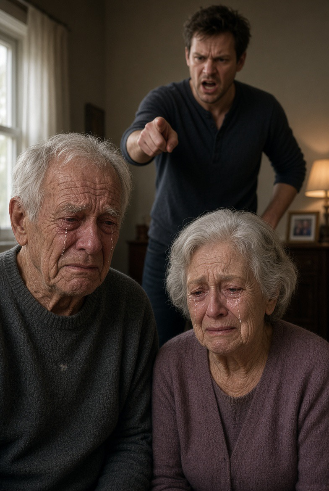

# Apakah Menjadi Dewasa Berarti Berhak Mengorbankan Hati Orang Tua?

*Ilustrasi (pic: Grok AI).*

  
***Tentang utang pengasuhan, kemandirian, attachment, konflik generasi, dan etika anak terhadap orang tua***
  

Coba kita lihat manusia ketika lahir. Bayi tidak bisa makan sendiri, tidak bisa berjalan, tidak bisa mengatur suhu tubuh secara mandiri, tidak bisa mencari makanan, tidak bisa melindungi diri, bahkan tidak mampu bertahan hidup tanpa pengasuhan intensif.

Secara evolusioner, manusia mempunyai masa ketergantungan yang sangat panjang.

Ini salah satu karakteristik penting human life history, yaitu anak manusia dilahirkan dengan ketergantungan tinggi dan membutuhkan pengasuhan selama bertahun-tahun.

Sehingga kadang orang tua berucap pada anaknya yang sudah tumbuh besar dan mulai melawannya: “Dulu tubuhmu kecil dan tidak mampu melakukan apa-apa, sekarang setelah besar kau bertanya mengapa orang tuamu tidak melindungimu.”

Kalimat di atas memiliki inti filosofis yang kuat. kapasitas biologis anak berubah, tetapi memori mengenai siapa yang merawatnya sering kali tidak otomatis berkembang dengan proporsi yang sama.

## Fenomena Psikologis: Anak Sering Menganggap Kondisi Sekarang sebagai “Normal”

Ketika seorang anak sudah dewasa, ia punya uang,  pekerjaan,  pasangan, bisa menyewa rumah, bisa mengambil keputusan sendiri, membuatnya dapat mengalami perubahan perspektif.

Perlindungan orang tua yang dahulu luar biasa besar menjadi sesuatu yang terasa: “Ya memang seharusnya begitu.”

Ini berkaitan dengan hedonic adaptation dan proses normalisasi. Ketika suatu kebutuhan selalu tersedia, manusia cenderung berhenti merasakan betapa luar biasanya kebutuhan tersebut pernah dipenuhi.

Bayi tidak berkata: “Terima kasih, Mama, karena malam ini engkau bangun tiga kali.” Dia cuma: WAAAAAA! dan ibunya bangun.

## Anak Menjadikan Orang Tua ATM

Tidak semua anak yang meminta bantuan finansial adalah parasit, dan tidak semua anak yang mandiri adalah anak durhaka.

Ada anak yang sedang mengalami kesulitan, kehilangan pekerjaan, sakit, merawat anak, atau memang membutuhkan bantuan sementara.

Masalahnya muncul ketika hubungan berubah menjadikan orang tua sebagai sumber daya, dan bukan sebagai manusia yang memiliki martabat, kebutuhan, dan batas. Di sinilah teori reciprocity dalam hubungan sosial menjadi relevan.

Hubungan keluarga yang sehat tidak selalu berarti: “Aku sudah memberi Rp100 juta, sekarang kamu harus membayar Rp100 juta.” Bukan begitu.

Reciprocity dalam keluarga lebih bersifat: perhatian dibalas perhatian. perawatan dibalas penghargaan, dan dukungan dengan tanggung jawab

## Mengapa Pasangan Kadang Mendapatkan Pembelaan Lebih Besar Daripada Orang Tua?

Nah, ini bagian yang paling menarik.

Karena ketika anak memasuki masa dewasa, terjadi proses psikologis yang disebut attachment reorganization, yaitu ketika figur keterikatan utama secara bertahap dapat bergeser.

Pada masa bayi, orang tua adalah pusat keamanan. Namun ketika masa dewasa, pasangan romantis dapat menjadi attachment figure utama. Secara perkembangan, memang normal bagi manusia dewasa untuk membangun ikatan intim di luar keluarga asal.

Masalahnya muncul kalau proses tersebut berubah menjadi: “Pasanganku harus dibela apa pun yang terjadi, orang tuaku selalu salah.”

Nah, itu bukan sekadar kemandirian. Itu sudah menjadi persoalan boundary, loyalty conflict, dan kualitas penilaian interpersonal.

## Kesalahan Logika yang Sering Terjadi

Anak berkata: “Sekarang kalian tidak melindungi aku.”

Pertanyaan ilmiahnya: “Apakah orang tua memang tidak melindungi?” atau: “Apakah definisi perlindungan anak sudah berubah?”

Saat kecil, perlindungan berupa makanan, rumah, kesehatan, keamanan. Ketika dewasa, perlindungan orang tua berupa menghormati otonomi, memberi nasihat, mendukung keputusan, dan tidak mengontrol secara berlebihan.

Jadi orang tua tidak harus terus-menerus menjadi bodyguard anak yang sudah dewasa.

Kalau anak umur 30 tahun pacaran, orang tua tidak bisa lagi berperan seperti ketika anak berumur 3 tahun.

Dan sebaliknya, anak dewasa tidak boleh menganggap: “Karena aku sekarang mandiri, seluruh kontribusi masa lalu tidak pernah terjadi.”

## Di sinilah Al-Qur’an Berbicara Sangat Tajam

Ada ayat yang luar biasa relevan:

“Kami perintahkan manusia agar berbuat baik kepada kedua orang tuanya. Ibunya telah mengandungnya dalam keadaan lemah yang bertambah-tambah…”
QS. Luqman 31:14

Perhatikan argumentasinya, Al-Qur’an membawa manusia kembali ke asal-usul ketergantungannya.

Manusia dewasa harus mengingat: “Aku pernah menjadi makhluk yang sepenuhnya bergantung.”

Dan Al-Qur’an juga mengatakan:

“Dan Kami perintahkan manusia untuk berbuat baik kepada kedua orang tuanya…”
QS. Al-’Ankabut 29:8

Tetapi Islam tidak mengatakan bahwa ketaatan kepada orang tua bersifat absolut.

QS. Luqman 31:15 bahkan memberikan batas:

Jika orang tua memaksakan sesuatu yang bertentangan dengan Allah, jangan ditaati dalam hal tersebut, tetapi tetap perlakukan mereka dengan baik.

Ini penting sekali. Islam tidak mengajarkan orang tua selalu benar. Islam mengajarkan: orang tua harus dihormati, tetapi bukan disembah.

## Durhaka  Jangan digunakan Sembarangan

Ini bagian yang sering kacau.

Anak: “Aku berbeda pendapat dengan orang tuaku.” “Aku memilih pasangan sendiri.” “Aku pindah rumah karena ingin mandiri.” Hal ini belum tentu durhaka.

Tetapi menghina orang tua, mempermalukan mereka, sengaja menyakiti, menelantarkan ketika mereka membutuhkan tanpa alasan yang dibenarkan, atau memperlakukan mereka seolah-olah tidak mempunyai martabat jelas merupakan persoalan etis yang jauh lebih serius.

Kemandirian tidak sama dengan kedurhakaan, dan ketaatan bukan berarti kehilangan otonomi.

## Sekarang  Masuk ke Filsafat Moral

Ada satu pertanyaan yang lebih dalam: Apakah anak mempunyai “utang” kepada orang tua?

Jawabannya tidak sederhana.

Kalau orang tua memberikan kehidupan dan pengasuhan, apakah anak harus membayar kembali semuanya?

Secara matematis tidak mungkin. Kita tidak bisa menghitung 9 bulan kehamilan, ribuan malam begadang, biaya sekolah, makanan, obat, serta pengorbanan emosional, lalu berkata: “Total utangmu Rp1.372.000.000, cicilan dimulai Senin.” Hubungan orang tua-anak bukan transaksi komersial. 

Dalam etika kebajikan, hal ini lebih tepat disebut gratitude. Bahwa Anak tidak harus “membayar harga kelahirannya”. Tetapi ia mempunyai alasan moral untuk mengakui kebaikan yang telah diterimanya dan membalasnya melalui penghormatan serta kepedulian.

## Satu Hal yang Harus Dihindari

Jangan sampai narasinya menjadi: “Aku melahirkanmu, maka hidupmu sekarang milikku.” Itu juga keliru. Orang tua memberikan kehidupan, tetapi anak bukan properti. Ini sangat penting.

Kalau orang tua berkata: “Aku membesarkanmu, maka kamu harus menikah dengan orang yang kupilih.” atau: “Aku membiayaimu, maka seluruh hidupmu harus mengikuti kehendakku.” maka konsep parental sacrifice berubah menjadi alat kontrol.

Secara psikologis itu dapat menghasilkan enmeshment, konflik identitas, dan kesulitan membangun otonomi.

Jadi ada dua sikap ekstrem yang harus dihindari, 

Anak: “Orang tuaku tidak berhak apa-apa karena aku sudah dewasa.”

Orang tua: “Aku melahirkanmu, maka seluruh hidupmu milikku.”

Relasi yang sehat  adalah “Aku menyayangimu, aku menghargai pengorbananmu, tetapi kita tetap dua manusia dengan batas dan kehendak masing-masing.”

## Inti Persoalan Generasi Sekarang

Bukan semata-mata anak zaman sekarang lebih buruk, itu terlalu sederhana. Yang berubah adalah struktur sosial.

Generasi sebelumnya hidup dengan ketergantungan keluarga, komunitas, agama, dan norma kolektif.

Generasi sekarang lebih banyak hidup dengan individualisme, mobilitas, ekonomi digital, pasangan romantis, identitas personal, serta media sosial. Akibatnya sumber identitas anak dewasa menjadi lebih beragam.

Dulu: “Aku anaknya siapa?”

Sekarang: “Aku siapa?”

Perubahan tersebut memiliki keuntungan berupa otonomi individu, tetapi juga risiko fragmentasi keluarga, konflik nilai, isolasi, dan lemahnya solidaritas antargenerasi.

## Apa yang Seharusnya Dilakukan Anak?

Ada prinsip sederhana, yaitu “Mandiri secara ekonomi, jangan miskin secara ingatan.”

Anak boleh punya pekerjaan sendiri, tinggal sendiri, menikah, memilih pasangan, membangun kehidupan sendiri. Tetapi jangan sampai kemandirian membuatnya mengalami amnesia moral.

Ingat, sebelum anak mampu melindungi dirinya sendiri, seseorang pernah melindunginya.

Bukan berarti anak harus hidup selamanya di bawah kendali orang tua. Tetapi setidaknya jangan menghapus sejarah hanya karena sekarang anak sudah kuat dan dewasa.

## Kalimat Al-Qur’an yang Sangat Indah

Tentang orang tua:

“Rabbir hamhuma kama rabbayani saghira.”

“Wahai Tuhanku, sayangilah keduanya sebagaimana mereka menyayangiku ketika aku kecil.”
QS. Al-Isra’ 17:24

Perhatikan logikanya. Bukan: “Bayarlah utang mereka.” Tetapi: “Sayangilah mereka sebagaimana mereka menyayangiku.”

Itu perubahan yang sangat indah, dependency, gratitude, reciprocity, dan compassion.

Anak memang tidak wajib kehilangan seluruh otonominya demi orang tua. Tetapi anak juga tidak seharusnya mengalami penyakit moral bernama: “Aku sudah kuat, maka masa laluku tidak relevan.”

Sebab manusia dewasa yang berdiri tegak hari ini pernah menjadi bayi yang bahkan tidak bisa mengangkat kepalanya sendiri.

Dan di sinilah mungkin kedewasaan sesungguhnya, bukan ketika kita akhirnya tidak membutuhkan orang tua, tetapi ketika kita sudah tidak membutuhkan mereka untuk bertahan hidup namun tetap memilih untuk menghargai, menyayangi, dan menjaga mereka.

Itu bukan kelemahan. Itu kematangan moral.

Dan pasangan romantis? Silakan dicintai sampai bulan malu melihatnya. Tetapi jangan sampai ketika menemukan seseorang yang baru, kita tiba-tiba menghapus dua manusia yang sudah berada di belakang kita sejak kita bahkan belum tahu bagaimana mengucapkan kata “Ibu.” 

  
**Referensi**

Bowlby, J. (1982). Attachment and loss: Vol. 1. Attachment (2nd ed.). Basic Books.

Festinger, L. (1954). A theory of social comparison processes. Human Relations, 7(2), 117–140.

Arnett, J. J. (2000). Emerging adulthood: A theory of development from the late teens through the twenties. American Psychologist, 55(5), 469–480.

Smetana, J. G. (2011). Adolescents, families, and social development. Wiley Interdisciplinary Reviews: Cognitive Science, 2(3), 309–319.

Qur’an, QS. Al-Isra’ 17:23–24; QS. Luqman 31:14–15.
