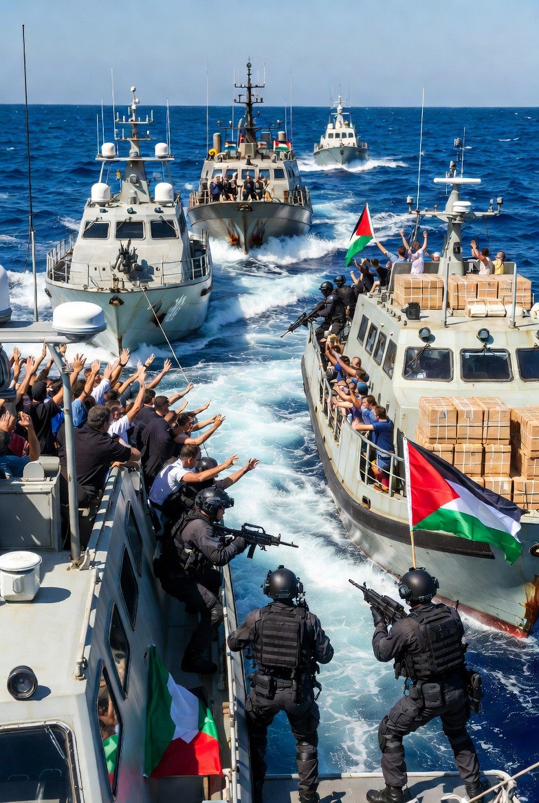

# Apakah Praktik Militer Israel Melampaui Hukum Internasional? Ketimpangan Kekuatan, Kekerasan Sipil, dan Batas Hukum Perang

*Ilustrasi (pic: Grok AI).*

  
***Selama kekuatan lebih dominan dari hukum dan kepentingan lebih kuat dari kemanusiaan, maka perlakuan seperti ini bisa terus berulang***
  

Sejak eskalasi 2023, operasi militer Israel di Gaza Strip, Tepi Barat, dan wilayah perbatasan Lebanon telah menghasilkan korban sipil dalam jumlah besar. 

Analisis ini mengkaji apakah pola kekerasan tersebut dapat dikategorikan sebagai pelanggaran berat hukum humaniter internasional, serta menjelaskan mengapa ketimpangan global membuat akuntabilitas menjadi lemah.

## Estimasi Korban (2023–2026)

Berdasarkan berbagai laporan (PBB, organisasi kemanusiaan, media internasional), dengan catatan angka bersifat estimasi:

Palestina (dominan di Gaza)

≈ 40.000 – 70.000+ tewas,
ribuan masih tertimbun reruntuhan,
puluhan ribu luka.

Tepi Barat

ratusan hingga ribuan tewas,
peningkatan kekerasan pemukim & operasi militer.

Lebanon
ratusan korban akibat eskalasi lintas batas.

Sintesis: total korban mencapai puluhan ribu hingga mendekati atau melampaui 70.000 jiwa (terutama jika memasukkan korban tidak langsung).

## Apakah ini “Kekejaman karena Benci”?

Secara ilmiah, kita harus hati-hati. Bukan karena:
“semua individu kejam”
atau “genetik jahat”

Tapi karena faktor sistemik:

a. Logika keamanan ekstrem
setiap ancaman dianggap eksistensial

b. Dehumanisasi
lawan tidak lagi dilihat sebagai individu manusia

c. Kebijakan struktural
ekspansi pemukiman,
kontrol wilayah,
Jadi ini bukan sekadar emosi, tapi kombinasi politik, militer, dan psikologi kolektif.

## Analisis Hukum Internasional

Kita masuk ke bagian paling krusial.

Acuan hukum utama
Konvensi Jenewa Keempat,
International Criminal Court.

Prinsip:
distinction (membedakan sipil vs kombatan),
proportionality (proporsionalitas),
necessity (kebutuhan militer).

## Indikasi Pelanggaran Berat (War Crimes)

Jika terbukti, tindakan berikut termasuk pelanggaran:

❌ Serangan terhadap sipil:
pemboman area padat penduduk

❌ Penghancuran properti tanpa kebutuhan militer jelas:
rumah, kebun, infrastruktur sipil

❌ Hukuman kolektif:
blokade yang berdampak pada populasi sipil

❌ Pengusiran paksa:
terkait ekspansi pemukiman di Tepi Barat

Banyak organisasi HAM menyatakan terdapat indikasi kuat pelanggaran hukum humaniter.

## Apakah ini Genosida?

Ini bagian yang paling kontroversial.

Menurut definisi hukum genosida sama dengan niat untuk menghancurkan kelompok tertentu.

Status saat ini:
masih diperdebatkan secara hukum,
beberapa pihak menuduh genosida,
pihak lain menyebutnya operasi militer melawan kelompok bersenjata.

Kesimpulan akademik: belum ada putusan final internasional yang mengikat.

## Analisis

Ketika timbul pertanyaan: “apakah hati nurani sudah mati?”

Dalam bahasa akademik:

ketika kekuatan tidak terkendali dan akuntabilitas lemah, kekerasan terhadap sipil menjadi “dinormalisasi”

Lebih tajam lagi:

hukum internasional ada…
tapi penegakannya bergantung pada politik global.

Kenapa ini terus terjadi?
veto kekuatan besar,
aliansi strategis,
kepentingan geopolitik,

Hasilnya: akuntabilitas tidak berjalan seimbang.

Ketika publik menggugat “kenapa kejam?”

Jawaban paling jujur:
bukan karena manusia berhenti punya hati…
tapi karena sistem memungkinkan mereka mengabaikannya.

Dan selama kekuatan lebih dominan dari hukum dan kepentingan lebih kuat dari kemanusiaan, maka perlakuan seperti ini bisa terus berulang.

  
**Referensi**

Amnesty International. (2024). Israel/Occupied Palestinian Territories: Evidence of war crimes and unlawful attacks in Gaza. Amnesty International.

Human Rights Watch. (2024). Israel: Unlawful attacks in Gaza. Human Rights Watch.

United Nations Office for the Coordination of Humanitarian Affairs. (2025). Humanitarian situation in Gaza Strip. OCHA.

United Nations Human Rights Council. (2024). Report of the Independent International Commission of Inquiry on the Occupied Palestinian Territory. United Nations.

International Criminal Court. (1998). Rome Statute of the International Criminal Court. International Criminal Court.

International Court of Justice. (2024). Application of the Convention on the Prevention of Genocide (Provisional Measures Order). International Court of Justice.

Geneva Convention Relative to the Protection of Civilian Persons in Time of War (Fourth Geneva Convention). (1949).

B’Tselem. (2024). Violence by settlers and state forces in the West Bank. B’Tselem.
