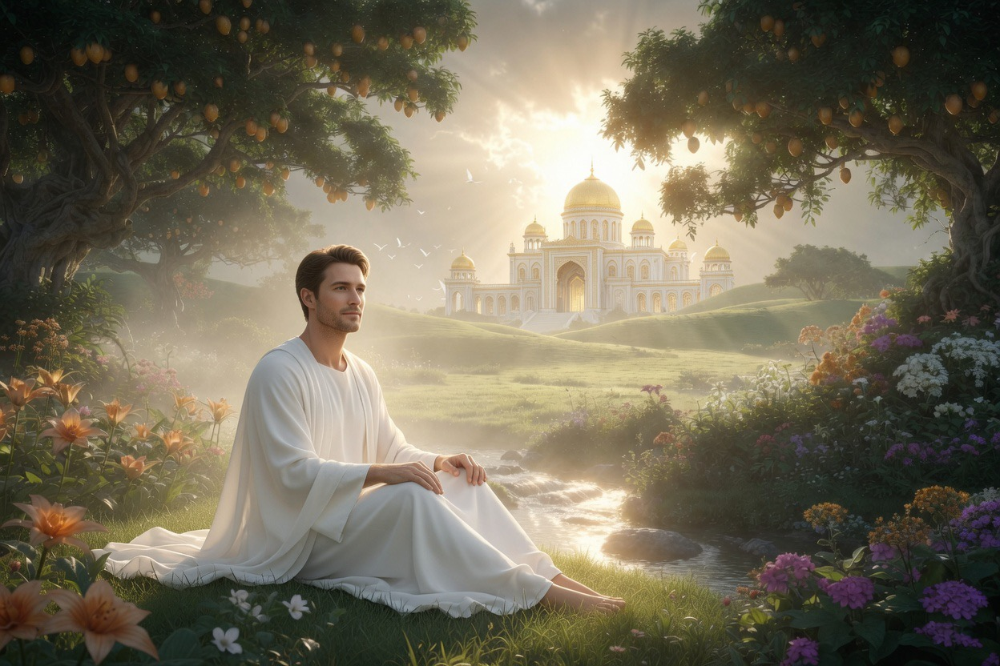

# Apakah Surga Adalah Tempat atau Keadaan Kesadaran? (1) Kajian Ontologi Akhirat dalam Filsafat, Neurosains, dan Teologi Islam

*Ilustrasi (pic: Grok AI).*

  
***Di balik sungai, taman, dan istana, tersembunyi kerinduan paling tua umat manusia yaitu keinginan untuk hidup tanpa luka dan tanpa perpisahan lagi***
  

Sejak manusia pertama menatap langit dan bertanya tentang kematian, muncul satu pertanyaan yang tak pernah benar-benar pergi: Apa itu surga?

Apakah surga adalah tempat nyata yang dapat dihuni sebagaimana bumi, lengkap dengan ruang, waktu, dan keberadaan fisik? Ataukah surga merupakan keadaan kesadaran tertinggi, suatu bentuk pengalaman eksistensial yang melampaui konsep ruang dan materi?

Tulisan ini membahas problem ontologis surga melalui filsafat metafisika, psikologi kesadaran, dan teologi Islam. 

Analisis menunjukkan bahwa perdebatan mengenai surga bukan hanya tentang kehidupan setelah mati, tetapi juga tentang hakikat realitas itu sendiri.

## Pertanyaan yang Lebih Tua dari Peradaban

Hampir semua kebudayaan mengenal gagasan tentang:
dunia setelah kematian,
kehidupan kekal,
alam kebahagiaan.

Mengapa?

Karena manusia adalah makhluk yang sadar bahwa dirinya akan mati. Dan kesadaran akan kematian melahirkan pertanyaan: “Apakah ini akhir dari segalanya?”

Di titik inilah konsep surga lahir. Bukan sekadar sebagai harapan. Tetapi sebagai jawaban terhadap kecemasan paling mendasar manusia.

## Masalah Filosofis: Tempat atau Pengalaman?

Jika surga adalah tempat:
di mana lokasinya?
apakah memiliki ruang?
apakah memiliki waktu?

Jika surga adalah keadaan kesadaran:
siapa yang mengalaminya?
bagaimana pengalaman itu berlangsung tanpa tubuh biologis?

Perdebatan ini berlangsung ribuan tahun.

## Pandangan Klasik Islam

Dalam mayoritas teologi Islam klasik, surga adalah realitas objektif. Bukan sekadar simbol. Bukan sekadar metafora psikologis.

Al-Qur’an menggambarkan:
taman-taman,
sungai-sungai,
buah-buahan,
tempat tinggal,
perjumpaan dengan orang-orang beriman.

Deskripsi tersebut menunjukkan bahwa surga memiliki eksistensi nyata. Namun persoalannya tidak sesederhana itu .

## Al-Ghazali dan Tingkatan Kenikmatan

Al-Ghazali berpendapat bahwa kenikmatan tertinggi surga bukanlah:
sungai susu,
istana,
makanan.

Melainkan kedekatan dengan Allah.

Dengan kata lain, bahkan jika surga adalah tempat, inti terdalamnya adalah keadaan spiritual.

## Ibnu Arabi: Surga Sebagai Realitas Kesadaran

Pandangan yang lebih filosofis muncul pada Ibnu Arabi. Menurutnya realitas akhirat tidak dapat dipahami sepenuhnya dengan kategori dunia.

Artinya, surga bukan sekadar lokasi geografis kosmis. Melainkan tingkat keberadaan yang lebih tinggi.

Dalam perspektif ini, kesadaran manusia berubah. Dan perubahan kesadaran itu membuka cara baru mengalami realitas.

## Apa Kata Neurosains?

Neurosains modern menunjukkan semua pengalaman manusia saat ini berkaitan dengan aktivitas otak.

Rasa:
cinta,
takut,
bahagia,
sedih,
semuanya memiliki korelasi neurologis.

Pertanyaannya: jika otak berhenti saat kematian, bagaimana pengalaman surga bisa terjadi?

Ada dua jawaban besar:

**Materialisme**

Kesadaran berakhir saat otak berakhir, surga tidak ada.

**Dualisme**

Kesadaran tidak sepenuhnya bergantung pada otak, pengalaman pascakematian tetap mungkin.

Dan sampai hari ini… ilmu pengetahuan belum mampu memutuskan secara final.

## Paradoks yang Jarang Dibahas

Coba pikirkan, misalkan ada dua orang:

**Orang pertama**

Hidup di istana mewah.

Tetapi:
depresi,
kesepian,
penuh kecemasan.

**Orang kedua**

Tidak memiliki kemewahan besar.

Tetapi:
damai,
bahagia,
penuh makna.

Siapa yang lebih dekat dengan pengalaman “surga”?

Pertanyaan ini menunjukkan sesuatu. Bahwa kebahagiaan tidak selalu identik dengan tempat. Sering kali ia terkait dengan kondisi kesadaran.

## Surga dalam Perspektif Ontologi Islam

Pandangan yang paling seimbang mungkin adalah bahwa surga merupakan tempat sekaligus keadaan.

Tempat: karena Al-Qur’an menggambarkannya sebagai realitas objektif.

Keadaan: karena inti kenikmatannya bukan sekadar materi.

Melainkan:
kedamaian sempurna,
hilangnya penderitaan,
kedekatan dengan Allah.

Tanpa dimensi kesadaran itu, bahkan istana surga pun kehilangan maknanya.

## Analisis

Manusia modern sering membayangkan surga sebagai:
rumah besar,
makanan lezat,
kemewahan abadi.

Padahal masalah terbesar manusia bukan kekurangan barang. Banyak orang kaya:
gelisah,
takut,
kesepian.

Mungkin karena penderitaan terdalam manusia bukan kemiskinan materi. Tetapi kekosongan makna.

Dan jika demikian… surga mungkin bukan terutama tentang apa yang dimiliki.

Melainkan apa yang akhirnya tidak lagi hilang.

Mungkin kita salah bertanya selama ini. Bukan: “Di mana surga berada?” Melainkan: “Jenis keberadaan seperti apa yang membuat manusia akhirnya merasa pulang?”

Dalam Islam, surga bukan sekadar kompensasi setelah kematian. Ia adalah pemulihan.

Pemulihan dari:
ketakutan,
kehilangan,
ketidakadilan
keterpisahan.

Dan mungkin karena itulah gambaran surga selalu terasa begitu menyentuh.

Karena di balik sungai, taman, dan istana, tersembunyi kerinduan paling tua umat manusia yaitu keinginan untuk hidup tanpa luka dan tanpa perpisahan lagi. 

  
**Referensi**

Al-Ghazali. Ihya Ulum al-Din.

Ibnu Arabi. Al-Futuhat al-Makkiyyah.

Mulla Sadra. Al-Hikmah al-Muta’aliyah fi al-Asfar al-‘Aqliyyah al-Arba’ah.

William James. (1902). The varieties of religious experience. Longmans, Green & Co.

Al-Qur’an. (QS. Az-Zukhruf: 68–73; QS. Ar-Ra’d: 23–24; QS. Al-Waqi’ah: 10–40).
