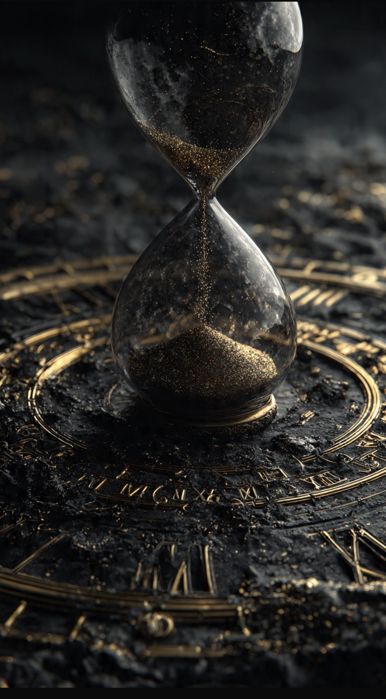

# Apakah Waktu Benar-Benar Ada atau Hanya Cara Manusia Memahami Perubahan? Kajian Ontologi, Filsafat, dan Fisika Modern

*Ilustrasi (pic: Grok AI).*

  
***Lalu suatu hari manusia  sadar yang sebenarnya habis bukan waktu. Melainkan: dirinya sendiri***
  

Waktu adalah sesuatu yang kita rasakan setiap hari, tetapi sangat sulit didefinisikan. 

Kita berkata kemarin, hari ini, besok, namun pertanyaan mendasarnya tetap menggantung: Apakah waktu benar-benar ada? Ataukah ia hanyalah konstruksi pikiran manusia untuk mengukur perubahan?

Tulisan ini membahas hakikat waktu melalui ontologi, filsafat Barat, fisika modern, dan teologi Islam. 

Analisis menunjukkan bahwa waktu adalah salah satu misteri terdalam eksistensi, ia terasa nyata, dapat diukur, tetapi hakikatnya tetap menjadi perdebatan hingga kini.

## Pertanyaan yang Membuat Filsuf Garuk Kepala Selama Ribuan Tahun

Coba pikirkan, apa sebenarnya waktu itu? Apakah benda? energi? dimensi? ilusi? atau sekadar angka di jam tangan?

Kita semua merasakan waktu. Tetapi bisakah kita menunjukkannya? Bisakah kita memegang lima menit? Atau hari Selasa? Tidak.

Yang kita lihat hanyalah matahari bergerak, jam berdetak, tubuh menua, daun gugur.

Maka pertanyaan ontologis muncul: Apakah waktu sungguh ada? Atau kita hanya melihat perubahan lalu menamakannya “waktu”?

## Filsafat Yunani: Waktu Adalah Ukuran Perubahan

Aristotle mendefinisikan waktu sebagai ukuran perubahan berdasarkan sebelum dan sesudah.

Artinya, kalau tidak ada perubahan, maka tidak ada waktu.

Bayangkan, seluruh alam semesta membeku.
Tidak ada gerakan, pikiran, bintang, atau atom yang bergetar. Apakah waktu masih berjalan?

Aristotle mungkin menjawab: Tidak, karena waktu hanyalah cara mengukur perubahan.

## Newton: Waktu Itu Nyata dan Absolut

Lalu datang Isaac Newton. Ia berkata: Tidak.
Waktu tetap mengalir, meskipun tidak ada manusia yang mengamatinya.

Menurut Newton, waktu adalah sungai kosmik. Ia mengalir seragam, absolut, dan independen dari alam semesta.

Maka meskipun seluruh manusia tidur, waktu tetap berdetak.

## Einstein Menghancurkan Konsep Itu

Lalu datang si pembuat banyak dosen fisika pusing, yakni Albert Einstein.

Menurut teori relativitas, waktu tidak absolut. Waktu bisa melambat, bisa berbeda bagi pengamat lain, dipengaruhi gravitasi, dan dipengaruhi kecepatan.

Artinya, dua orang dapat mengalami jumlah waktu yang berbeda.

Misalnya, astronaut yang bergerak sangat cepat dapat menua sedikit lebih lambat dibanding orang di bumi.

Jadi, jam bukan mencatat waktu. Jam mencatat bagaimana waktu dialami oleh pengamat tertentu.

## Apakah Waktu Hanya Ilusi?

Nah, d sinilah seminar mulai ricuh. Sebagian filsuf modern berkata masa lalu sudah tidak ada, masa depan belum ada. Yang ada hanya saat ini.

Kalau begitu, apa sebenarnya waktu? Apakah ia sungguh ada, atau hanya cara pikiran menyusun pengalaman?

Sebagian bahkan mengatakan: waktu adalah ilusi kesadaran. Yang nyata hanyalah perubahan.

## Ontologi Islam: Allah Menciptakan Waktu?

Dalam Islam, Allah bersumpah:

Al-Qur’an:

“Demi masa.”

(QS. Al-’Asr)

Allah juga berfirman:

“Dia yang menciptakan malam dan siang.”

(QS. Al-Anbiya: 33)

Mayoritas ulama memahami waktu adalah bagian dari ciptaan Allah. Artinya waktu bukan Tuhan, bukan sesuatu yang berdiri sendiri, melainkan salah satu unsur alam semesta yang diciptakan.

## Sebelum Alam Diciptakan, Apakah Ada Waktu?

Nah ini pertanyaan yang sangat liar. Kalau Allah menciptakan alam, lalu sebelum alam ada, apakah waktu sudah ada?

Mayoritas teolog Islam menjawab: tidak. Karena waktu adalah sifat alam ciptaan. Sedangkan Allah tidak menua, tidak berubah, dan tidak terikat sebelum dan sesudah.

Allah tidak menunggu, tidak bertambah tua. tidak bergerak dari masa lalu menuju masa depan. Karena Dia berada di luar keterikatan waktu ciptaan.

## Jadi Pencipta Waktu Siapa?

Jawabannya bukan manusia. Sebab manusia membuat jam, membuat kalender, memberi nama Senin, Selasa, Januari, 2026. Tetapi manusia tidak menciptakan pergantian siang malam, penuaan, ataupun perubahan kosmik.

Dalam Islam, pencipta waktu adalah Allah. Sedangkan manusia hanya menciptakan sistem pengukuran waktu.

## Analisis

Kadang manusia berkata: “Aku tidak punya waktu.” Padahal yang tidak dimiliki manusia bukan waktu. Karena bukan hanya orang kaya yang punya 24 jam, tetapi pengangguran, presiden, dan petani juga punya 24 jam. Yang berbeda adalah bagaimana manusia mengisi waktu.

Lucunya lagi, manusia sering membunuh waktu, menghabiskan waktu, membuang waktu. Lalu suatu hari ia sadar: yang sebenarnya habis bukan waktu. Melainkan: dirinya sendiri.

Mungkin waktu adalah salah satu ciptaan Allah yang paling aneh. Ia: tidak terlihat, tidak dapat disentuh, serta tidak dapat dihentikan, tetapi membentuk seluruh kehidupan manusia.

Filsafat bertanya: apakah waktu sungguh ada? Fisika bertanya: bagaimana waktu bekerja? Islam bertanya: untuk apa waktu diberikan?

Dan mungkin… itu pertanyaan yang paling penting. Karena pada akhirnya, yang akan ditanyakan kepada manusia bukan berapa lama ia hidup. Tetapi apa yang ia lakukan dengan waktu yang telah dipinjamkan kepadanya.

  
**Referensi**

Aristotle. Physics.

Isaac Newton. (1687). Philosophiæ Naturalis Principia Mathematica.

Albert Einstein. (1916). Relativity: The Special and General Theory.

Al-Ghazali. Tahafut al-Falasifah.

Al-Qur’an. (QS. Al-’Asr; QS. Al-Anbiya: 33).
