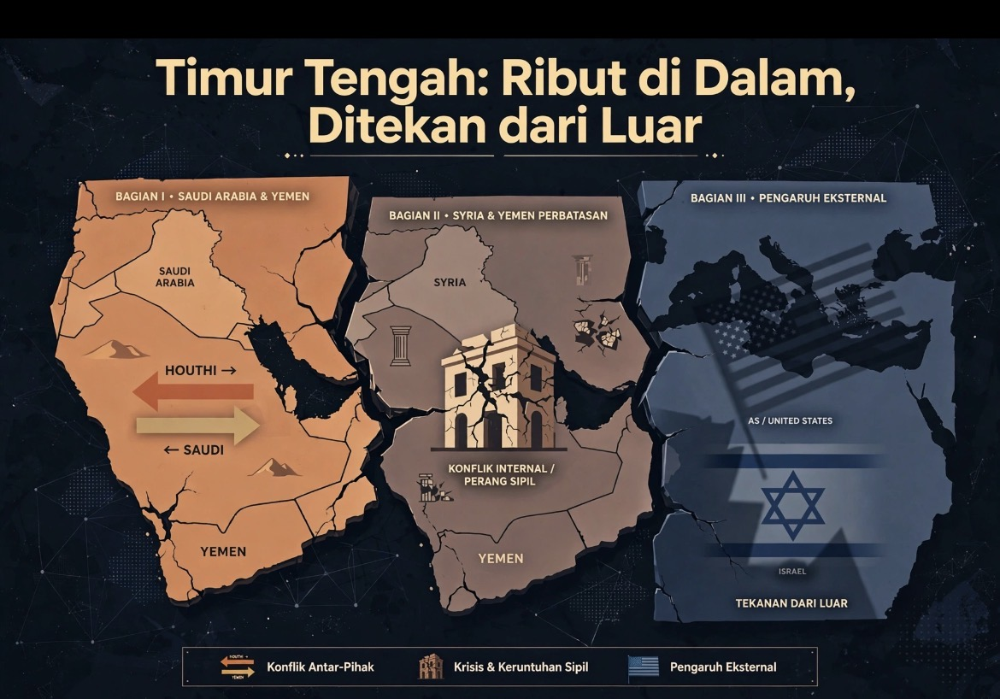

# Arab Saudi vs Houthi: Ketika Para Pemain Membakar Papan Catur

*Ilustrasi (pic: Meta AI).*

  
***Saat semua pihak hanya mengejar kemenangan sendiri, maka Timur Tengah akan kehilangan masa depannya bersama***
  

Ketika negara-negara Timur Tengah dan jaringan proksinya saling menguras tenaga, ruang strategis memang bisa terbuka bagi Amerika Serikat dan Israel. 

Tapi ada satu koreksi penting, ruang strategis itu bukan berarti AS dan Israel sedang santai tanpa risiko, apalagi otomatis bisa menguasai kawasan yang sudah hancur.

Justru, puing-puing perang sering menghasilkan tiga hal sekaligus: pasar senjata, kekosongan kekuasaan, dan generasi baru perlawanan. Yang tampak seperti tontonan gratis dapat berubah menjadi kebakaran yang menjalar ke ruang tamu sendiri.

## Yaman Bukan Lagi Sekadar Medan Perang Lokal

Per 21 September 2026, eskalasi Houthi–Saudi justru makin berbahaya. Houthi bergerak merebut dataran strategis di Taiz dan Lahij, berupaya memutus pasukan pemerintah yang didukung Saudi dari pesisir Laut Merah.

Serangan Houthi dilaporkan telah menjangkau Riyadh, sementara Saudi terus melakukan serangan udara.

Houthi mengklaim serangan terhadap lokasi sensitif di Riyadh dan fasilitas Aramco di Yanbu. Saudi menyatakan sebagian serangan berhasil dicegat, tetapi situasi di lapangan tetap berkembang.

Washington dilaporkan sempat menyiapkan serangan udara terhadap Houthi setelah permintaan Saudi, tetapi Presiden Trump akhirnya membatalkannya. 

Jadi, AS belum memilih masuk perang langsung demi Saudi, meskipun tetap berkepentingan menjaga jalur energi dan keamanan sekutu

Ada ironi besar di sini, Saudi membutuhkan dukungan Amerika, tetapi Amerika tidak ingin setiap permintaan sekutunya berubah menjadi perang baru yang harus ditanggung Washington. Sementara itu, Houthi memanfaatkan celah tersebut untuk memperbesar posisi tawar.

AP juga melaporkan bahwa melalui pembicaraan yang dimediasi Oman, Houthi dan Washington menegaskan kembali kesepahaman agar Houthi tidak menyerang kapal AS, sementara serangan udara Amerika dihentikan. Namun, kesepahaman itu tidak otomatis menghentikan perang Houthi–Saudi.

Dengan kata lain: ada kanal komunikasi dengan AS, tetapi tidak ada perdamaian yang menyeluruh. Inilah politik kawasan yang bikin kepala ingin dibungkus handuk dingin.

## Apakah AS dan Israel Sedang “Ngopi Sambil Nonton”?

Sebagian iya dalam arti strategis, tetapi tidak sesederhana mereka duduk santai menikmati kehancuran.

Dalam geopolitik, konflik antaraktor regional dapat memberikan keuntungan relatif kepada kekuatan eksternal melalui beberapa mekanisme:

A. Beban musuh terpecah

Jika Iran, Saudi, Houthi, kelompok bersenjata Irak, dan aktor regional lain saling berkonfrontasi, perhatian, sumber daya, dan kapasitas militer mereka terbagi.

Israel dapat memperoleh ruang untuk memantau dan mengganggu jaringan Iran; memperkuat hubungan keamanan dengan sejumlah negara Arab; memanfaatkan kekhawatiran negara Teluk terhadap Iran; menempatkan dirinya sebagai pemasok keamanan bagi negara-negara yang merasa terancam.

Amerika Serikat juga dapat menggunakan konflik tersebut untuk mempertahankan kehadiran militernya, menjual sistem pertahanan, dan memperkuat posisi tawar diplomatik.

Namun, fragmentasi regional juga menciptakan ancaman yang tidak dapat dikendalikan Washington atau Tel Aviv, yaitu serangan terhadap pangkalan, kapal, infrastruktur energi, pasar minyak, dan warga sipil. 

Serangan terhadap Riyadh dan gangguan di Bab el-Mandeb bukan tontonan yang sepenuhnya berada di balik kaca. 

B. Senjata laku, tetapi perang tidak selalu menguntungkan

Konflik dapat meningkatkan permintaan terhadap: rudal pencegat; sistem pertahanan udara; drone; amunisi; sensor dan pengawasan; jasa pemeliharaan serta dukungan militer.

Tetapi jangan menyederhanakannya menjadi rumus “perang pasti menguntungkan AS dan Israel.” Industri pertahanan tertentu bisa memperoleh kontrak, sementara negara secara keseluruhan menghadapi biaya operasi, tekanan anggaran, risiko korban, dan ketidakstabilan ekonomi.

Lebih tepatnya, perang menciptakan pemenang komersial tertentu, tetapi tidak menjamin keuntungan strategis jangka panjang bagi negara yang memasok senjata.

Negara-negara Teluk membeli persenjataan mahal untuk menghadapi ancaman yang sebagian justru diperkuat oleh siklus intervensi, persenjataan, dan konflik regional. 

Mereka membayar mahal untuk menghadapi kebakaran yang sistem keamanannya sendiri gagal padamkan.

## Jeda AS–Iran: Gengsi, Biaya, dan Perang yang Tidak Selesai

Perang Houthi-Saudi  dapat menjadi jeda bagi AS  untuk bernafas akibat menahan malu setelah digebuki Iran.

Dalam konflik berskala besar, negara tidak hanya menghitung kemampuan militer, tetapi juga:
- Biaya eskalasi: apakah serangan berikutnya akan menghasilkan keuntungan atau justru memperluas perang?
- Kredibilitas: apakah mundur terlihat sebagai kelemahan di mata sekutu dan lawan?
- Kanal negosiasi: apakah musuh masih bisa diajak berbicara tanpa dianggap memberikan konsesi?
- Kendali eskalasi: apakah serangan terbatas bisa dihentikan sebelum berubah menjadi perang regional?
Karena itu, permintaan jeda perang tidak selalu disampaikan secara terbuka sebagai, “Saya sudah capek, mari berhenti.” Negara bisa memakai mediator, pernyataan bersyarat, gencatan senjata terbatas, atau komunikasi tidak langsung.

Gengsi negara besar sering membuat diplomasi harus memakai kostum kemenangan. Semua pihak ingin mengatakan bahwa mereka tidak mundur, hanya sedang mengatur ulang strategi. 

Namun, kita perlu membedakan fakta dan tafsir, laporan mengenai komunikasi AS–Houthi dan mediasi terkait Iran menunjukkan adanya kanal diplomatik, tetapi tidak cukup untuk membuktikan bahwa Washington sedang “menahan malu” sebagai motif tunggal.

## Mengapa Kawasan yang Hancur Justru Sulit Dikuasai?

Di sini ada paradoks penting. Kehancuran negara dapat melemahkan institusi, tetapi tidak otomatis menghilangkan kemampuan masyarakat untuk melawan.

| Kondisi | Dampak jangka pendek | Risiko jangka panjang |
|:-----|:------:|------:|
|Pemerintah melemah|Kekuasaan lebih mudah diperebutkan|Fragmentasi dan perang faksi|
|Infrastruktur hancur|Masyarakat bergantung pada bantuan|Krisis legitimasi dan kemiskinan|
|Senjata menyebar|Kelompok bersenjata semakin kuat|Konflik berkepanjangan|
|Intervensi asing|Aktor eksternal memperoleh pengaruh|Nasionalisme anti-intervensi|
|Institusi hukum runtuh|Impunitas meningkat|Siklus balas dendam|

Irak, Libya, Suriah, dan Yaman memperlihatkan bahwa menghancurkan kapasitas negara tidak sama dengan membangun tatanan politik yang dapat dikendalikan.

Pendudukan atau intervensi bisa menggulingkan pemerintahan, tetapi setelah itu muncul pertanyaan yang jauh lebih sulit: Siapa yang mengatur keamanan? Siapa yang menguasai senjata? Siapa yang membayar rekonstruksi? Siapa yang dipercaya masyarakat? serta Siapa yang memiliki legitimasi untuk memerintah?

Kalau jawabannya tidak jelas, kekuatan asing bisa memenangkan operasi militer tetapi kehilangan kendali atas konsekuensi politiknya.

Rumus pahitnya adalah kemenangan taktis ditambah kehancuran institusional  dikurangi legitimasi politik sama dengan perang yang beregenerasi.

Karena itu, Israel dan AS mungkin memperoleh keuntungan dari kelemahan sebagian aktor regional, tetapi kawasan yang terfragmentasi juga dapat menghasilkan kelompok baru, serangan baru, dan ancaman yang tidak mudah diprediksi.

## Iran: Cerdas Secara Strategis, tetapi Bukan Aktor Tanpa Masalah

Iran memiliki kapasitas strategis yang tidak bisa diremehkan. Iran tidak hanya mengandalkan kekuatan konvensional, melainkan membangun jaringan mitra dan proksi, kemampuan rudal dan drone, kedalaman strategis di sejumlah negara, instrumen diplomasi, kemampuan mengancam jalur energi dan pelayaran, serta narasi perlawanan terhadap dominasi AS dan Israel.

Jaringan ini membuat Iran dapat memengaruhi lingkungan keamanan tanpa selalu berperang langsung dengan setiap lawannya.

Tetapi, kecerdasan strategis tidak sama dengan kebal terhadap kesalahan strategis. Dukungan terhadap kelompok bersenjata dapat meningkatkan daya tangkal, sekaligus menciptakan risiko eskalasi, beban ekonomi, dan ketergantungan pada aktor yang memiliki agenda sendiri.

Houthi bukan robot yang cukup ditekan tombolnya dari Teheran. Mereka memiliki kepentingan domestik Yaman, agenda kekuasaan, dan kalkulasi sendiri. 

Iran dapat memberikan dukungan dan pengaruh, tetapi setiap proksi juga memiliki otonomi.

Jadi analisis yang lebih akurat bukan Iran mengendalikan seluruh konflik. Melainkan Iran membangun jaringan pengaruh yang memperbesar kemampuan mengganggu lawan, tetapi jaringan itu juga menghasilkan risiko yang tidak sepenuhnya dapat dikendalikan Iran.

## Apakah ada Pihak yang Sengaja Memanaskan Seluruh Timur Tengah?

Pertanyaan ini harus dibelah menjadi tiga tingkat:

Tingkat pertama: aktor memang mengeksploitasi kekacauan

Ini sangat masuk akal secara strategis. Negara dan kelompok bersenjata dapat memanfaatkan krisis untuk memperluas wilayah, meningkatkan daya tawar, mengalihkan perhatian publik, memperkuat legitimasi domestik, melemahkan lawan, serta memperoleh konsesi diplomatik.

Dalam konflik Yaman terbaru, Houthi memanfaatkan pelemahan lawan dan tekanan regional untuk memperluas posisi militer. Saudi merespons dengan kekuatan udara dan meminta dukungan eksternal.

Tingkat kedua: beberapa aktor memiliki kepentingan yang saling bertemu

AS, Israel, Iran, Saudi, Turki, dan berbagai kelompok bersenjata dapat mengambil tindakan yang menguntungkan kepentingan masing-masing tanpa harus membuat satu rencana rahasia bersama.

Inilah yang disebut konvergensi kepentingan. Misalnya, satu aktor ingin melemahkan musuhnya. Aktor kedua ingin memperluas pengaruh. Aktor ketiga ingin menjual senjata. Hasil akhirnya bisa memperpanjang konflik, meskipun mereka tidak duduk di satu meja untuk menyusun seluruh skenario.

Tingkat ketiga: satu dalang mengatur seluruh perang

Untuk klaim ini, diperlukan bukti spesifik: komunikasi, keputusan terkoordinasi, pendanaan, perintah, atau dokumen operasional.

Belum ada dasar yang cukup untuk menyimpulkan bahwa satu pihak mengendalikan seluruh perang Timur Tengah. 

Menunjukkan bahwa suatu aktor memperoleh keuntungan dari konflik tidak otomatis membuktikan bahwa aktor tersebut menciptakan atau mengarahkan konflik itu.

Ini bukan membela AS atau Israel. Ini justru membuat kritik lebih tahan banting, karena tidak bergantung pada dugaan yang belum terbukti.

## Palestina: Pusat Tragedi yang Terus Tersingkir dari Agenda Keamanan

Inilah bagian yang paling menyakitkan. Ketika perang Iran–AS, Houthi–Saudi, Irak, dan konflik lainnya memenuhi berita, Palestina berisiko diperlakukan sebagai satu krisis tambahan, bukan persoalan politik dan hukum yang belum diselesaikan.

Ada tiga bentuk pengabaian yang saling memperkuat:
- Pengabaian perhatian: krisis baru menggeser liputan Gaza dan Tepi Barat.
- Pengabaian politik: negara-negara regional memprioritaskan keamanan rezim, energi, dan hubungan bilateral.
- Pengabaian struktural: bantuan kemanusiaan dipakai untuk mengelola penderitaan, sementara akar persoalan pendudukan, blokade, permukiman, dan ketiadaan solusi politik tetap berlangsung.

Maka, Palestina bukan sekadar korban perang yang kebetulan terjadi bersamaan. Ia terjebak dalam sistem regional yang membuat penderitaan warga sipil terus bersaing dengan agenda keamanan negara.

Ketika semua pihak berbicara tentang stabilitas, pertanyaan yang harus diajukan adalah: stabilitas untuk siapa? Stabilitas bagi pasar minyak? Stabilitas bagi rezim? Stabilitas bagi jalur pelayaran? Atau stabilitas yang memungkinkan warga Palestina, Yaman, Irak, Libya, dan Suriah hidup tanpa terus-menerus menjadi objek operasi militer?

## Timur Tengah Bukan Papan Catur Kosong

AS dan Israel bukan tidak pernah memperoleh keuntungan dari konflik regional. Mereka dapat memperoleh keuntungan relatif melalui fragmentasi lawan, hubungan keamanan, dan pengaruh diplomatik.

Tetapi ada batas penting, bahwa:
- Kekacauan dapat dimanfaatkan, tetapi tidak selalu dapat dikendalikan.
- Penjualan senjata dapat meningkat, tetapi biaya perang juga membesar.
- Negara yang dilemahkan dapat lebih mudah ditekan, tetapi masyarakatnya tidak otomatis tunduk.
- Proksi dapat memperluas pengaruh, tetapi juga dapat menyeret patronnya ke eskalasi.
- Perang saudara menguras negara-negara regional, tetapi tidak menghapus akar konflik Palestina.

Timur Tengah bukan kawasan yang gagal karena terlalu banyak orang bodoh. Ia adalah kawasan tempat kepentingan keamanan, kekuasaan, intervensi asing, dan luka sejarah saling bertabrakan, sementara rakyat biasa membayar tagihannya.

Yang menang mungkin memperoleh wilayah, pengaruh, atau kontrak senjata. Tetapi ketika semua pihak hanya mengejar kemenangan sendiri, kawasan itu kehilangan masa depannya bersama.

Dan soal AS serta Israel ngopi, mungkin kopinya memang masih panas. Tetapi kalau Bab el-Mandeb dan Hormuz terus terguncang, harga kopi, bahan bakar, jalur perdagangan, dan stabilitas politik bisa ikut masuk ke cangkir mereka. 

  
**Referensi**

Associated Press. (2026, September 20). Iran-backed Houthi rebels warn against joining Saudi Arabia in Yemen’s growing civil war.

Reuters. (2026, September 21). Houthis push for control of Yemen highlands as Trump reported to have called off airstrikes.

Reuters. (2026, September 19). Flames, smoke seen near Riyadh airport; Houthis claim attacks on Saudi capital.
