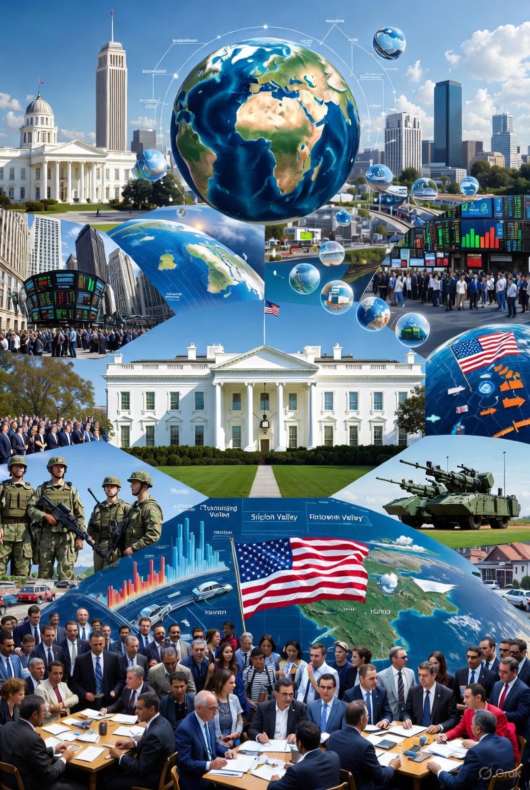

# Risiko Geopolitik Sistemik: Peran Amerika Serikat dalam Transformasi dan Disrupsi Tatanan Global Kontemporer

*Ilustrasi peran AS dalam tatanan global (pic: Grok).*

  
***Ketika Amerika Serikat mengubah relasinya dengan hukum, kedaulatan, dan multilateralisme, dunia tidak hanya menghadapi konflik, tetapi kehilangan kompas normatif***
  

Dalam dua dekade terakhir, Amerika Serikat semakin dipersepsikan bukan sebagai penjaga tatanan internasional liberal, melainkan sebagai aktor yang secara selektif menegosiasikan, menangguhkan, bahkan melanggar norma global yang sebelumnya ia bangun sendiri. 

Tulisan ini menganalisis risiko geopolitik besar yang muncul dari pergeseran peran tersebut, dengan menyoroti implikasi terhadap kedaulatan negara, hukum internasional, stabilitas ekonomi global, dan fragmentasi sistem multilateral. 

Dengan pendekatan struktural dan politik ekonomi internasional, artikel ini berargumen bahwa dunia sedang bergerak dari rules-based order menuju power-contingent order, di mana kepatuhan pada hukum internasional ditentukan oleh posisi kekuasaan, bukan norma universal.

## Pendahuluan

Sejak berakhirnya Perang Dingin, Amerika Serikat memosisikan diri sebagai arsitek utama tatanan internasional liberal. 

Namun, dinamika geopolitik mutakhir menunjukkan kontradiksi mendasar: negara yang paling vokal membela rule of law justru semakin sering bertindak di luar kerangka hukum internasional ketika kepentingan strategisnya terancam.

Fenomena ini menimbulkan pertanyaan kunci:
apakah AS masih menjaga tatanan global, atau justru sedang mengubahnya secara sepihak?

Hegemoni dan Risiko Sistemik

Teori stabilitas hegemonik berargumen bahwa tatanan internasional relatif stabil ketika satu kekuatan dominan bersedia menanggung biaya menjaga aturan bersama. 

Namun, ketika hegemon mulai:

•	bertindak unilateral,

•	menerapkan standar ganda,

•	dan mempolitisasi institusi internasional,

maka stabilitas berubah menjadi risiko sistemik.

Dalam konteks ini, risiko geopolitik bukan lagi konflik antarnegara semata, melainkan erosi kepercayaan terhadap aturan global itu sendiri.

## Indikator Perubahan Tatanan Global oleh AS

1. Erosi Prinsip Kedaulatan

Praktik sanksi sepihak, intervensi militer tanpa mandat PBB, dan yurisdiksi ekstrateritorial memperlihatkan redefinisi kedaulatan secara selektif. Negara tertentu dilindungi, sementara yang lain menjadi “wilayah uji coba” kebijakan koersif.

2. Instrumentalisasi Hukum Internasional

Hukum internasional tidak lagi diperlakukan sebagai norma universal, melainkan sebagai alat politik. Kepatuhan menjadi kondisional, bergantung pada aliansi strategis dan kepentingan ekonomi.

3. Fragmentasi Multilateralisme

Lembaga-lembaga global seperti PBB, WTO, dan ICC mengalami delegitimasi ketika keputusan mereka diabaikan oleh aktor paling berpengaruh. Ini menciptakan preseden berbahaya bagi negara lain untuk melakukan hal serupa.

## Dampak Global: Dari Stabilitas ke Volatilitas

1. Risiko Keamanan Internasional

Normalisasi tindakan sepihak mendorong negara lain untuk mengadopsi strategi serupa, meningkatkan potensi konflik regional dan perlombaan senjata.

2. Ketidakpastian Ekonomi Global

Sanksi finansial, politisasi dolar AS, dan fragmentasi rantai pasok global meningkatkan volatilitas pasar dan mempercepat upaya de-dollarization.

3. Krisis Moral dan Legitimasi

Ketika nilai-nilai demokrasi dan HAM digunakan secara selektif, kredibilitas normatif Barat melemah, membuka ruang bagi model alternatif yang lebih transaksional dan otoritarian.

## Dari Rules-Based Order ke Power-Based Reality

Transformasi tatanan global saat ini bukanlah runtuhnya sistem secara tiba-tiba, melainkan pengikisan perlahan melalui praktik yang dimaafkan. 

Dunia bergerak menuju kondisi di mana:

•	hukum berlaku bagi yang lemah,

•	pengecualian bagi yang kuat,

•	dan moralitas menjadi fungsi kepentingan.

Ini bukan anarki total, tetapi ketidakpastian permanen.

Tulisan ini menyimpulkan bahwa risiko geopolitik terbesar saat ini bukan kebangkitan kekuatan baru semata, melainkan perubahan perilaku hegemon lama. 

Ketika Amerika Serikat mengubah relasinya dengan hukum, kedaulatan, dan multilateralisme, dunia tidak hanya menghadapi konflik, tetapi kehilangan kompas normatif.

Jika tren ini berlanjut, tatanan global abad ke-21 akan ditentukan bukan oleh aturan bersama, melainkan oleh negosiasi kekuasaan yang cair, rapuh, dan berbahaya.
  

**Referensi**

Gilpin, R. (1987). The political economy of international relations. Princeton University Press.

Ikenberry, G. J. (2011). Liberal leviathan: The origins, crisis, and transformation of the American world order. Princeton University Press.

Ikenberry, G. J. (2018). The end of liberal international order? International Affairs, 94(1), 7–23. https://doi.org/10.1093/ia/iix241

Keohane, R. O. (1984). After hegemony: Cooperation and discord in the world political economy. Princeton University Press.

Mearsheimer, J. J. (2018). The great delusion: Liberal dreams and international realities. Yale University Press.

Orford, A. (2003). Reading humanitarian intervention. Cambridge University Press.

Koskenniemi, M. (2005). From apology to utopia: The structure of international legal argument. Cambridge University Press.

United Nations General Assembly. (2022). Strengthening the rule of law at the national and international levels. A/RES/77/247.
