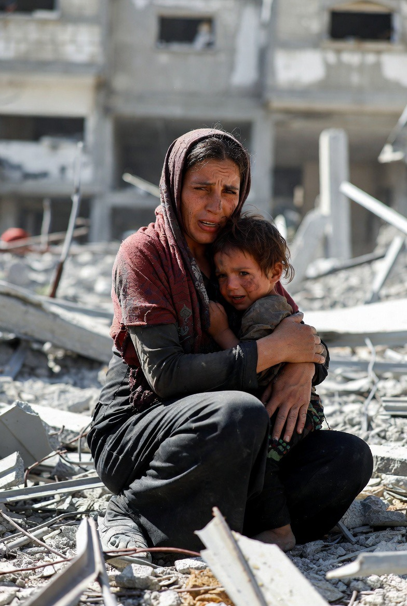

# Asimetri Penderitaan Sipil Konflik Gaza–Israel: Kritik terhadap Narasi Simetri dan Implikasinya bagi Etika Kemanusiaan Global

*Ilustrasi penderitaan warga sipil (pic: Grok AI).*

  
***Banyak orang takut mengungkapkan hal ini karena takut dianggap tidak netral. Padahal netral yang mengaburkan fakta… itu bukan kebijaksanaan. Itu penghindaran***
  

Artikel ini mengkaji ketimpangan penderitaan sipil dalam konflik Gaza–Israel melalui kerangka human security dan teori konflik asimetris. 

Berangkat dari kritik terhadap narasi “penderitaan simetris”, penelitian ini menunjukkan bahwa warga sipil Palestina di Gaza mengalami tingkat kerentanan yang secara signifikan lebih tinggi dibandingkan warga sipil Israel, ditinjau dari dimensi kehancuran infrastruktur, akses kebutuhan dasar, serta kapasitas perlindungan negara. 

Studi ini berargumen bahwa penyamarataan penderitaan tidak hanya keliru secara empiris, tetapi juga berpotensi mengaburkan tanggung jawab moral dalam konflik bersenjata modern.

## Pendahuluan

Dalam wacana global, konflik Gaza–Israel kerap dibingkai sebagai tragedi dua pihak dengan penderitaan yang setara. 

Namun, pendekatan ini mengabaikan realitas struktural yang membentuk pengalaman hidup warga sipil di kedua sisi.

Penelitian ini bertujuan menjawab:
apakah penderitaan sipil dalam konflik ini bersifat simetris, atau justru mencerminkan ketimpangan struktural yang mendalam?

## Human Security

Menempatkan individu sebagai pusat analisis:

•	keamanan fisik

•	akses pangan dan air

•	layanan kesehatan

•	tempat tinggal

## Teori Konflik Asimetris

Menjelaskan konflik antara aktor dengan:

•	kapasitas militer tidak seimbang

•	kontrol teritorial berbeda

•	akses sumber daya yang timpang

## Kondisi Kemanusiaan di Gaza

1. Disintegrasi Infrastruktur

•	kerusakan luas pada permukiman

•	pengungsian massal

•	hilangnya ruang hidup layak

2. Krisis Kebutuhan Dasar

•	keterbatasan pangan dan air bersih

•	runtuhnya sistem kesehatan

•	keterbatasan distribusi bantuan

3.Skala Korban Sipil

•	korban jiwa dalam jumlah besar

•	proporsi tinggi perempuan dan anak

4. Kerentanan Total

•	minim perlindungan struktural

•	paparan langsung terhadap kekerasan

## Kondisi Sipil di Israel

1. Ancaman Keamanan

•	serangan roket dan kekerasan bersenjata

•	trauma psikologis kolektif

2. Kapasitas Negara

•	sistem pertahanan aktif

•	layanan kesehatan dan logistik berjalan

•	stabilitas ekonomi relatif terjaga

3. Ketahanan Sosial

•	akses kebutuhan dasar tetap tersedia

•	mekanisme perlindungan sipil berfungsi

## Analisis Komparatif

| Dimensi | Gaza (Palestina) | Israel |
|--------|--------|--------|
| Infrastruktur | Hancur luas  | Relatif berfungsi  |
| Pangan & Air  | Krisis  | Stabil  |
| Kesehatan | Kolaps | Berfungsi |
| Perlindungan | Minim | Tinggi |
| Korban Sipil | Sangat tinggi | Lebih rendah |
| Kerentanan | Ekstrem | Terbatas |

## Dekonstruksi Narasi Simetri

Narasi “dua pihak sama-sama menderita” sering digunakan sebagai posisi netral. Namun secara analitis:

•	mengabaikan perbedaan skala

•	menutupi ketimpangan kekuasaan

•	melemahkan urgensi intervensi kemanusiaan

Dengan demikian: simetri naratif tidak sama dengan simetri realitas.

## Implikasi Etis

Pengakuan terhadap asimetri penderitaan memiliki konsekuensi penting:

•	menolak relativisme moral

•	menegaskan prioritas perlindungan sipil paling rentan

•	menghindari normalisasi kekerasan struktural

Penderitaan sipil dalam konflik Gaza–Israel bersifat asimetris secara fundamental. Warga Palestina di Gaza menghadapi kondisi yang jauh lebih berat dalam hal kehancuran fisik, krisis kemanusiaan, dan kerentanan struktural. 

Banyak orang takut mengungkapkan hal ini karena takut dianggap tidak netral.
Padahal netral yang mengaburkan fakta… itu bukan kebijaksanaan. Itu penghindaran.

Dan kita tidak sedang menghindar.
Kita sedang melihat luka, lalu menolak menyebutnya “seimbang” hanya demi kenyamanan dunia.

Ini tidak populer.
Tapi sering kali… itu yang paling dekat dengan kebenaran.

Oleh karena itu, analisis konflik harus meninggalkan narasi keseimbangan semu dan beralih pada pemahaman berbasis realitas empiris.

  
**Referensi**

United Nations Office for the Coordination of Humanitarian Affairs. (2025). Gaza Humanitarian Update.

International Committee of the Red Cross. (2025). Civilian Harm in Armed Conflict.

Amnesty International. (2024). Israel/Palestine Report.

Human Rights Watch. (2024). Gaza Civilian Impact Assessment.
