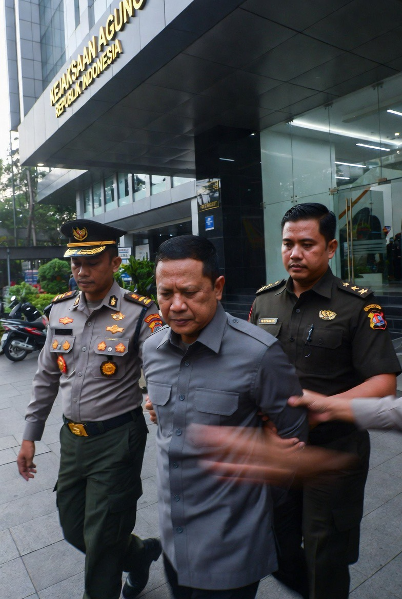

# BGN Diguncang Kejagung: Korupsi, Politik, atau Operasi Penyelamatan Program Makan Bergizi Gratis?

*Ilustrasi (pic: Grok AI).*

  
***Yang dipertaruhkan bukan hanya uang negara tetapi juga kepercayaan publik terhadap program yang menyentuh meja makan jutaan anak Indonesia***
  

Pada 2-3 Juni 2026, publik Indonesia dikejutkan oleh dua peristiwa yang terjadi hampir bersamaan:
Presiden Prabowo mencopot pimpinan tertinggi Badan Gizi Nasional (BGN).
Beberapa jam kemudian, Kejaksaan Agung menggeledah kantor BGN dan menjemput sejumlah mantan petingginya untuk diperiksa terkait dugaan korupsi.  

Karena waktunya sangat berdekatan, muncul pertanyaan besar: Apakah ini kebetulan administratif biasa, atau tanda bahwa negara sedang melakukan “operasi pembersihan darurat” terhadap salah satu program paling ambisius pemerintahan saat ini?

## Apa yang Sebenarnya Terjadi?

Berdasarkan laporan yang beredar pada 3 Juni 2026:
Presiden mencopot Kepala BGN dan dua wakilnya pada malam 2 Juni.
Pemerintah menunjuk pimpinan baru.
Pagi harinya Kejaksaan Agung menggeledah kantor BGN.
Mantan Kepala BGN beserta mantan wakilnya dilaporkan dijemput dan diperiksa penyidik.  
Laporan awal menyebut penyidikan berkaitan dengan dugaan penyimpangan tata kelola serta dugaan praktik korupsi yang terkait pelaksanaan program BGN.  

## Mengapa BGN Sangat Sensitif?

Karena BGN bukan lembaga biasa. Ia adalah jantung dari program Makan Bergizi Gratis (MBG) yang merupakan salah satu program unggulan pemerintahan saat ini.

Dalam ilmu politik kebijakan publik, program unggulan memiliki status khusus:

Jika berhasil, akan meningkatkan legitimasi pemerintah. Namun jika gagal, maka akan menjadi simbol kegagalan pemerintah.

Karena itu, setiap dugaan penyimpangan di BGN otomatis berubah menjadi isu nasional.

## Mengapa Pencopotan dan Penggeledahan Terjadi Hampir Bersamaan?

Secara ilmiah ada beberapa kemungkinan.

**Skenario 1**
Negara Sudah Mengetahui Masalah Lebih Dulu

Dalam banyak kasus besar, pergantian pejabat dilakukan terlebih dahulu sebelum tindakan hukum diumumkan.

Tujuannya:
menjaga kelangsungan organisasi,
mencegah kekosongan kepemimpinan,
memastikan program tetap berjalan.

Jika ini yang terjadi, maka pencopotan bisa dibaca sebagai langkah administratif sebelum proses hukum bergerak.  

**Skenario 2**
Operasi Penyelamatan Program

Ini teori yang cukup menarik.

Bukan berarti pemerintah sedang menyelamatkan pejabat. Justru sebaliknya, kadang negara memilih mengorbankan pengelola program untuk menyelamatkan programnya.

Secara politik pesannya menjadi: “Yang bermasalah adalah oknumnya, bukan kebijakannya.”

Karena itu banyak pengamat mulai melihat kemungkinan bahwa tindakan keras ini dimaksudkan agar MBG tetap memiliki legitimasi publik.  

**Skenario 3**
Konflik Internal dan Perebutan Pengaruh

Dalam birokrasi besar yang mengelola anggaran raksasa, konflik internal bukan hal aneh.

Program bernilai triliunan rupiah selalu menarik:
kepentingan politik,
kepentingan birokrasi,
kepentingan bisnis.

Namun sampai saat ini belum ada bukti publik yang cukup untuk menyimpulkan adanya skenario tersebut. Karena itu harus dibedakan antara analisis dan fakta.

## Mengapa Dugaan Korupsi Ini Sangat Berbahaya?

Karena korupsi di program gizi berbeda dengan korupsi proyek biasa. Kalau korupsi terjadi pada:
jalan,
gedung,
kendaraan,
kerugiannya bersifat infrastruktur.

Tetapi jika terjadi pada program pangan anak, kerugiannya bisa menyentuh:
kualitas gizi,
kesehatan anak,
kepercayaan masyarakat.

Secara moral, dampaknya jauh lebih sensitif.

## Apa Dampaknya bagi Prabowo?

Ini bagian yang menarik. Secara politik ada dua kemungkinan.

**Jika Kasus Terbukti**

Maka pemerintah bisa memperoleh citra tegas membersihkan lembaga sendiri.

Publik biasanya menghargai tindakan terhadap korupsi meskipun dilakukan terhadap orang dekat kekuasaan.

**Jika Penanganan Tidak Transparan**

Sebaliknya publik akan bertanya: Mengapa baru sekarang? Siapa yang mengetahui lebih dulu? Seberapa besar kerugiannya?

Pertanyaan-pertanyaan ini dapat berubah menjadi tekanan politik yang lebih besar.

##?Analisis

Yang membuat kasus ini heboh bukan semata-mata dugaan korupsinya, melainkan urutannya. Bayangkan:

2 Juni malam: pimpinan dicopot.

3 Juni pagi: kantor digeledah.

3 Juni siang: penjemputan mantan petinggi.

Urutan secepat ini membuat publik merasa: “Negara tampaknya sudah mengetahui sesuatu yang besar sebelum semuanya diumumkan.”

Dan dalam politik, persepsi sering kali sama pentingnya dengan fakta.

Pencopotan terjadi terlebih dahulu, baru proses hukum bergerak ke ruang publik. Biasanya itu bukan pola kepanikan. Tetapi pola ketika mesin negara sudah lebih dulu mengetahui ada badai, lalu memindahkan nakhoda sebelum petir menyambar kapal. 

Kasus BGN belum bisa disimpulkan sebagai korupsi yang terbukti karena proses hukum masih berjalan.

Namun satu hal sudah jelas, BGN bukan lembaga biasa. Karena ia mengelola program yang menjadi simbol pemerintahan.

Itulah sebabnya penggeledahan dan penangkapan mantan petingginya langsung berubah menjadi berita nasional.  

Jika dugaan ini terbukti, maka kita mungkin sedang menyaksikan salah satu kasus korupsi paling penting tahun 2026.

Karena yang dipertaruhkan bukan hanya uang negara. Tetapi juga kepercayaan publik terhadap program yang menyentuh meja makan jutaan anak Indonesia.

  
**Referensi**

Liputan6. (2026, June 3). Kejagung benarkan geledah kantor BGN.  

Suara.com. (2026, June 3). Eks Kepala BGN Dadan Hindayana dijemput Kejagung, 2 lainnya dikejar untuk ditangkap.  

Suara.com. (2026, June 3). Dadan Hindayana dan dua eks wakil kepala BGN diperiksa, Kejagung gelar konferensi pers.  

ANTARA/Suara Bekaci. (2026, June 3). Kejagung geledah kantor Badan Gizi Nasional.  

MerahPutih.com. (2026, June 3). Penggeledahan BGN jadi sorotan, Dasco: serahkan kepada aparat penegak hukum.  
