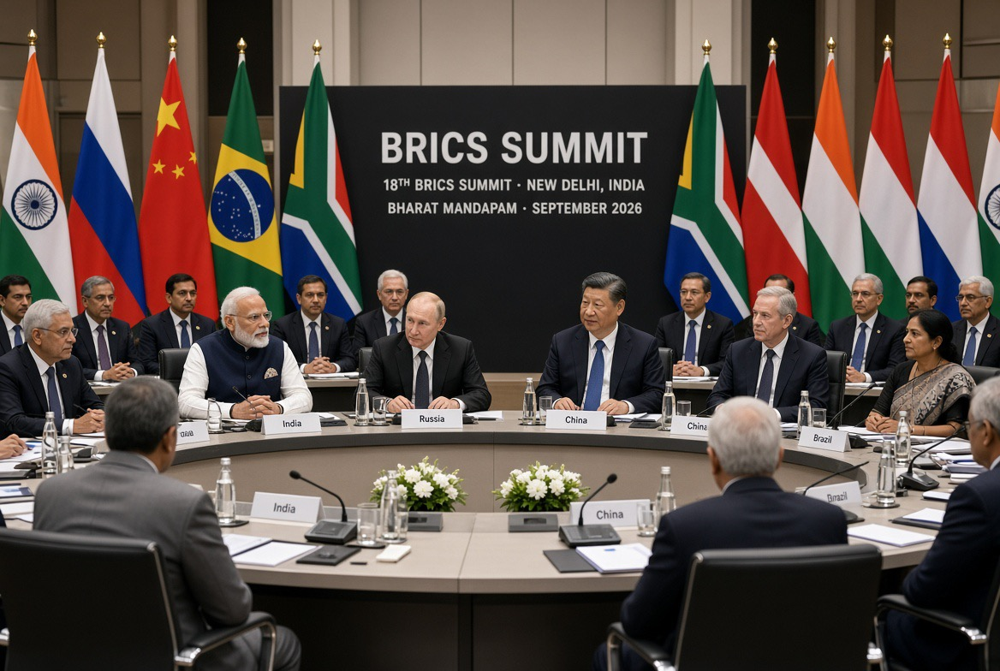

# BRICS: Kami Tidak Menyebut Nama Tapi Semua Orang Tahu

*Ilustrasi (pic: Grok AI).*

  
***BRICS sedang mencoba mengubah bahasa kritik terhadap hegemoni menjadi bahasa hukum internasional***
  

BRICS ke-18 berlangsung di New Delhi 12–13 September 2026, dan pada 12 September para pemimpin mengadopsi New Delhi Declaration. 

Reuters sebelumnya melaporkan bahwa para anggota memang menyepakati bahasa yang tidak menyebut negara tertentu tetapi mengecam perang unilateral. Dan sekarang dokumen resminya sudah bisa dibaca.

Plot twist-nya, BRICS tidak cuma ngomong soal perang. Mereka memasukkan satu paket bahasa diplomatik yang kalau dibaca dalam konteks perang Iran dan Gaza, memang sangat sulit untuk tidak mengaitkannya dengan AS dan Israel, meskipun nama keduanya tidak ditulis pada bagian itu. 

## Perang Sepihak: Memang Sindiran?

Ya, sangat mungkin. Tetapi secara diplomatik, kita harus bilang: implicitly, bukan eksplisit.

Reuters melaporkan bahwa empat sumber mengatakan teks tersebut akan mengecam “unilateral war by any country” tetapi sengaja tidak menyebut negara tertentu. 

Kenapa sengaja tidak menyebut? Karena BRICS punya problem yang lucu sekaligus serius.

Iran dan UAE sama-sama anggota BRICS, dan keduanya berada pada posisi berbeda dalam konflik Teluk. 

Kalau BRICS menulis “Kami mengecam Amerika dan Israel.” maka UAE bisa mengalami problem diplomatik.

Kalau BRICS menulis “Kami mengecam Iran.” Iran jelas akan menolak. Sedangkan kalau menulis “Kami mengecam semua pihak.” maka semua bisa pulang dengan wajah diplomatis yang masih utuh. 

Jadi formula BRICS adalah: “Kami gak sebut siapa-siapa. Tapi kalian tahu sendiri.” Itulah strategic ambiguity.

## BRICS Lebih Spesifik Daripada itu 

Lihat deklarasi finalnya.

BRICS menyatakan mendukung multilateralisme dan multipolaritas; menegaskan supremasi Piagam PBB; menolak tindakan koersif unilateral yang bertentangan dengan hukum internasional; menolak sanksi yang tidak mendapat otorisasi Dewan Keamanan PBB; menyerukan penyelesaian sengketa melalui diplomasi; menentang serangan terhadap infrastruktur sipil; dan  menentang serangan terhadap fasilitas nuklir damai yang berada di bawah safeguards IAEA. 

Nah, yang terakhir ini sudah bukan sekadar slogan anti-perang. Karena konteks aktualnya adalah perang AS-Israel-Iran.

AP secara eksplisit menilai bahwa kecaman BRICS terhadap serangan terhadap fasilitas nuklir Iran merupakan kritik tidak langsung terhadap serangan AS dan Israel terhadap fasilitas nuklir Iran. 

## Bagian Palestina  Lebih Terang-terangan Lagi 

Ini yang lebih menarik daripada kalimat “perang sepihak”.

Deklarasi resmi BRICS menyatakan: mendukung keanggotaan penuh Palestina di PBB, mendukung solusi dua negara berdasarkan perbatasan 1967, menentang forced displacement warga Palestina, menolak perubahan geografis atau demografis terhadap Gaza, dan menyerukan penghentian kebijakan yang mendorong pemindahan paksa Palestina. 

Bahkan deklarasi menyebut: penggunaan kelaparan sebagai metode perang, serangan terhadap warga sipil, serangan terhadap fasilitas kesehatan, serangan terhadap infrastruktur sipil, serta penghalangan bantuan kemanusiaan, sebagai pelanggaran yang harus dihentikan. 

Jadi kalau ada orang berkata: “BRICS cuma ngomong normatif.” Tidak sepenuhnya, karena norma yang mereka pilih itu sangat relevan dengan konflik yang sedang berlangsung.

## Apakah BRICS sedang “Menyerang AS-Israel”?

Secara retoris: iya, sebagian. Sedangkan secara tekstual tidak secara eksplisit. Namun secara geopolitik sangat jelas konteksnya.

Itu tiga level yang harus dipisahkan.

Kalau kita bilang: “BRICS secara resmi menyatakan AS dan Israel melakukan perang unilateral.” Itu terlalu jauh. Mereka tidak menyebut nama.

Tetapi kalau kita mengatakan bahasa deklarasi BRICS secara jelas menargetkan prinsip-prinsip tindakan yang sangat relevan dengan operasi militer AS-Israel terhadap Iran, sementara bagian Palestina secara langsung mengkritik kebijakan yang berdampak pada warga Palestina. Itu jauh lebih defensible.

## Yang Paling Pedas Justru Unilateral Sanctions

Ini bagian yang kadang lolos dari headline.

BRICS menyatakan menentang unilateral coercive measures, termasuk sanksi ekonomi unilateral dan secondary sanctions, terutama yang tidak disahkan Dewan Keamanan PBB. 

Ini punya dimensi anti-hegemoni ekonomi, karena sistem global selama beberapa dekade memungkinkan negara dengan kekuatan finansial besar untuk mengatakan: “Kami memberi sanksi kepada negara X.”

Kemudian, bank internasional takut ikut berdagang dengan X, perusahaan asing takut terkena secondary sanctions, akses finansial menjadi senjata.

BRICS pada dasarnya berkata: “Kekuatan finansial satu negara tidak boleh otomatis menjadi hukum internasional.”

Nah, ini memang salah satu kritik fundamental terhadap unipolarity.

## Ini Bukan Sekadar Anti-Amerika

BRICS tidak sedang mengatakan: “Kami semua sekarang anti-Amerika.”

India sendiri justru sangat berkepentingan mempertahankan hubungan strategis dengan AS dan Barat. Dan Modi secara eksplisit mengatakan di KTT bahwa BRICS bukan kelompok yang melawan siapa pun.

Ia malah mengatakan Global South harus berkembang menjadi “rule-shaper” dalam tata kelola global. 

Ini penting karena proyek BRICS sebenarnya lebih besar daripada anti-AS. Proyeknya adalah mengurangi kemampuan satu pusat kekuasaan menentukan aturan untuk semua orang.

Itulah mengapa kata-kata: multipolarity, multilateralism, sovereignty, UN Charter, dan reform of global institutions muncul berulang kali.

## Paradoks Lucu 

BRICS sedang mengatakan: “Kami menentang perang unilateral.” Tetapi di dalam BRICS sendiri ada: Rusia, Iran, China, India, UAE, Brazil, South Africa, Egypt dll. Mereka tidak punya kepentingan strategis yang identik.

Rusia punya perang Ukraina, Iran sedang berperang dengan AS-Israel, UAE mempunyai kepentingan keamanan yang berbeda dari Iran, India punya hubungan kuat dengan Washington sekaligus Moscow, China punya kepentingan ekonomi global yang sangat besar.

Jadi BRICS bukan NATO versi Timur, juga bukan: “satu untuk semua, semua untuk satu.”  Tetapi lebih mirip: “Kita berbeda-beda, tapi jangan sampai aturan dunia ditentukan oleh satu klub saja.”

Dan justru kemampuan mereka menghasilkan deklarasi bersama setelah sebelumnya gagal mencapai pernyataan bersama mengenai perang Iran menunjukkan bahwa konsensus ini sendiri adalah prestasi diplomatik. 

AP mencatat para menteri luar negeri BRICS pada Mei gagal menyepakati pernyataan bersama mengenai perang Iran, sehingga India harus mengeluarkan chair’s summary. 

## Apa Pesan Sebenarnya dari New Delhi?

Ada empat pesan:

Pesan 1: “Jangan jadikan kekuatan militer sebagai hukum.”

Perang harus kembali ke UN Charter, diplomacy, negotiation, dan sovereignty.

Pesan 2: “Jangan jadikan dolar dan sistem finansial sebagai senjata geopolitik.”

Makanya ada kecaman terhadap unilateral sanctions serta secondary sanctions.

Pesan 3: “Global South bukan penonton.”

BRICS ingin negara-negara berkembang bukan sekadar objek keputusan Washington, Brussels, Beijing atau Moscow. Mereka ingin menjadi rule-shaper. 

Pesan 4: “Palestine dan Gaza adalah ujian kredibilitas multipolaritas.”

Kalau BRICS bicara multipolarity, sovereignty, international law, civilian protection, tetapi membiarkan isu Palestina sepenuhnya menjadi permainan kekuatan besar, maka proyek moralnya akan berlubang.

Karena itu deklarasi memasukkan Palestine, Gaza, forced displacement, humanitarian access, 1967 borders, serta UN membership. 

Itulah seni diplomasi multilateral, tidak menyebut nama bisa menjadi cara untuk mencapai konsensus, sementara konteks membuat sasaran retorisnya tetap terbaca.

Tetapi jangan kita berhenti di “BRICS nyindir AS-Israel”. Yang lebih besar adalah, BRICS sedang mencoba mengubah bahasa kritik terhadap hegemoni menjadi bahasa hukum internasional. Itu jauh lebih penting.

Mereka tidak sedang berkata: “China/Rusia/Iran harus menggantikan Amerika.” Mereka sedang mencoba mengatakan bahwa tidak boleh ada satu negara atau satu blok yang merasa memiliki hak istimewa untuk menentukan kapan perang, sanksi, dan penggunaan kekuatan dianggap sah.

Dan itu sudah masuk pertarungan yang lebih besar, bukan sekadar AS vs BRICS, tetapi siapa yang berhak menentukan aturan dunia abad ke-21. 

  
**Referensi**

Government of India. (2026, September 12). BRICS New Delhi Declaration: Building for Resilience, Innovation, Cooperation and Sustainability. Prime Minister of India, New Delhi Declaration⁠

Associated Press. (2026, September 12). BRICS leaders voice concern over Middle East, condemn unilateral sanctions at India summit. 

Reuters. (2026, September 12). BRICS bloc agrees on joint declaration, sources say. 

Reuters. (2026, September 10). India hosts BRICS summit as Iran war tests bloc unity. 
