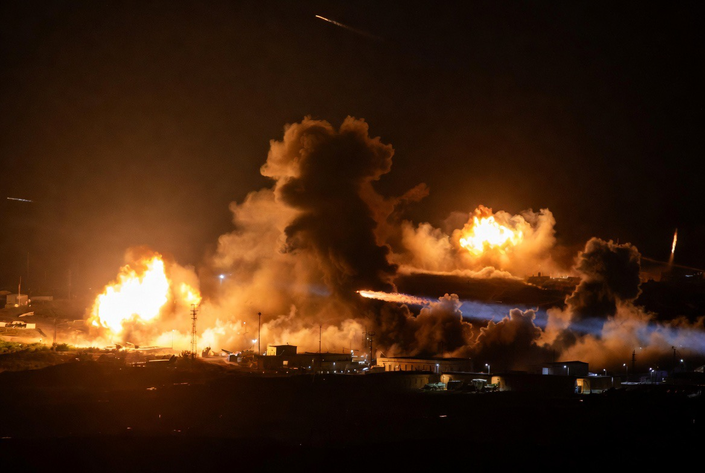

# Babak Baru Perang AS-Iran: Apakah Timur Tengah Sedang Bergerak Menuju “Perang yang Dinormalisasi”?

*Ilustrasi (pic: Grok AI).*

  
***“Bahaya terbesar sebuah perang bukan ketika perang dimulai, melainkan ketika dunia berhenti terkejut melihatnya.”***
  

Dalam beberapa dekade terakhir, setiap bentrokan besar di Timur Tengah biasanya memicu kekhawatiran bahwa kawasan akan jatuh ke perang regional yang luas. Namun dinamika beberapa waktu terakhir memperlihatkan gejala yang berbeda.

Serangan terbatas dibalas dengan serangan terbatas, ancaman keras diikuti negosiasi, operasi militer berlangsung berdampingan dengan komunikasi diplomatik.

Muncul pertanyaan: Apakah Timur Tengah sedang memasuki era “perang yang dinormalisasi”, yaitu kondisi ketika penggunaan kekuatan militer menjadi instrumen rutin tanpa berkembang menjadi perang total?

## Perang yang Dinormalisasi

Dalam kajian hubungan internasional, normalisasi perang bukan berarti masyarakat menganggap perang sebagai sesuatu yang baik.

Yang dimaksud adalah penggunaan kekuatan bersenjata menjadi semakin lazim sebagai alat kebijakan luar negeri, sementara para aktor berusaha menjaga konflik tetap berada di bawah ambang perang besar.

Karakteristiknya antara lain: serangan presisi, operasi udara terbatas, perang siber, operasi intelijen, penggunaan proksi, diplomasi yang tetap berjalan meski serangan berlangsung.

Perang tidak berhenti. Namun juga tidak berkembang menjadi mobilisasi total seperti perang dunia.

## AS dan Iran Sama-Sama Berhitung

Dari perspektif strategis, baik Washington maupun Teheran memiliki insentif untuk menghindari perang terbuka yang berkepanjangan.

Bagi Amerika Serikat, konflik besar berisiko mengganggu stabilitas energi global, membebani anggaran, serta menyerap perhatian dari prioritas lain seperti persaingan dengan China.

Bagi Iran, perang total dapat menghancurkan infrastruktur, memperberat tekanan ekonomi, dan memperbesar risiko instabilitas domestik.

Akibatnya, kedua pihak cenderung mencari keseimbangan antara menunjukkan ketegasan dan menghindari eskalasi tak terkendali.

## Kondisi Berbahaya

Paradoksnya, konflik yang “terkendali” justru dapat menjadi lebih sering.

Jika setiap pihak percaya bahwa lawan akan menahan diri, maka ambang penggunaan kekuatan bisa menjadi lebih rendah.

Akibatnya, serangan menjadi lebih rutin, pembalasan menjadi pola, dan dunia perlahan terbiasa dengan konflik yang terus berulang.

Yang dinormalisasi bukan perdamaian, melainkan ritme konflik.

## Dampak terhadap Timur Tengah

Bila pola ini bertahan, kawasan menghadapi beberapa risiko.

Pertama, negara-negara tetangga akan terus hidup dalam ketidakpastian keamanan.

Kedua, investasi dan pembangunan ekonomi dapat terhambat karena risiko geopolitik tetap tinggi.

Ketiga, kelompok bersenjata non-negara mungkin melihat ruang yang lebih besar untuk beroperasi di tengah persaingan negara-negara besar.

## Dampak terhadap Tatanan Dunia

Fenomena ini tidak hanya menyangkut Timur Tengah. Ia juga memengaruhi norma internasional.

Jika penggunaan kekuatan menjadi semakin sering tanpa konsekuensi politik atau hukum yang jelas, muncul pertanyaan: Apakah larangan penggunaan kekuatan dalam Piagam PBB masih memiliki daya cegah yang sama seperti dulu?

Jawaban atas pertanyaan itu akan memengaruhi bukan hanya Timur Tengah, tetapi juga kawasan lain yang memiliki sengketa keamanan.

Barangkali ancaman terbesar hari ini bukanlah bahwa perang semakin besar, melainkan bahwa perang semakin biasa.

Dunia masih mengecam, pasar masih bereaksi, diplomat masih bertemu. Namun setelah itu, aktivitas global kembali berjalan seolah serangan bersenjata hanyalah salah satu berita harian.

Jika kondisi ini terus berlangsung, ada risiko bahwa ambang moral terhadap penggunaan kekuatan ikut bergeser.

Bukan karena masyarakat menyukai perang, melainkan karena manusia memiliki kecenderungan beradaptasi terhadap sesuatu yang berulang.

Konflik AS-Iran menunjukkan bahwa abad ke-21 mungkin tidak didominasi oleh perang dunia dalam arti klasik.

Sebaliknya, dunia dapat menghadapi konflik berkepanjangan dengan intensitas yang naik turun, diselingi diplomasi, sanksi, operasi siber, tekanan ekonomi, dan serangan militer terbatas.

Tantangan terbesar bagi komunitas internasional bukan hanya menghentikan satu konflik tertentu. Melainkan mencegah lahirnya sebuah norma baru: bahwa perang adalah instrumen kebijakan luar negeri yang dapat digunakan secara berkala selama masih berada di bawah ambang perang total.

Jika norma seperti itu menguat, maka generasi mendatang mungkin tidak lagi bertanya, “Mengapa perang terjadi?” Mereka justru akan bertanya, “Mengapa hari ini tidak ada perang?”

Peradaban jarang runtuh karena satu perang besar, namun lebih sering terkikis ketika perang kecil menjadi kebiasaan, dan dunia kehilangan kemampuan untuk merasa terkejut.

  
**Referensi**

The Tragedy of Great Power Politics. (2014). W. W. Norton.

Strategy: A History. (2013). Oxford University Press.

United Nations. (1945). Charter of the United Nations.

International Institute for Strategic Studies. (2025-2026). The Military Balance.

Stockholm International Peace Research Institute. (2025-2026). SIPRI Yearbook.
