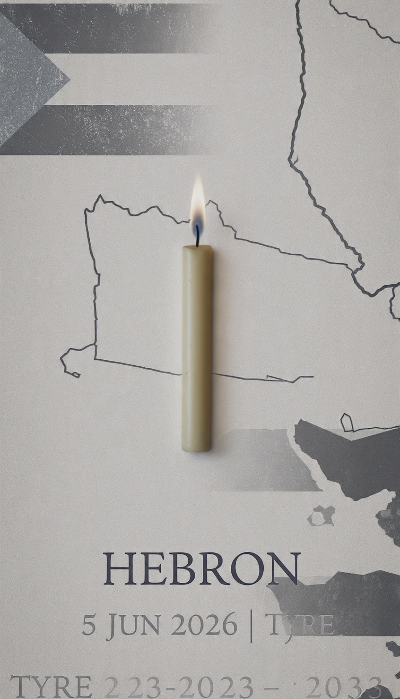

# Bayi, Bendera & Bom Fosfor: Dugaan Pelanggaran Kemanusiaan di Tepi Barat, Gaza, dan Lebanon dalam Perspektif Hukum Humaniter Internasional

*Ilustrasi (pic: Meta AI).*

  
***Hukum humaniter internasional dibangun untuk satu tujuan utama yaitu memastikan bahwa bahkan di tengah perang, kemanusiaan tidak sepenuhnya hilang***
  

Awal Juni 2026 kembali memperlihatkan paradoks tragis konflik Israel-Palestina. 

Di Tepi Barat, seorang bayi Palestina berusia tujuh bulan tewas akibat tembakan tentara Israel. Orang tuanya juga terluka. 

Pada saat yang sama, perdebatan mengenai penggunaan white phosphorus (fosfor putih) oleh Israel di Gaza dan Lebanon kembali mengemuka setelah bertahun-tahun didokumentasikan oleh organisasi hak asasi manusia internasional. 

Tulisan ini menganalisis tiga isu utama: perlindungan warga sipil, penggunaan fosfor putih dalam konflik bersenjata, dan persoalan penegakan hukum internasional yang sering dianggap tidak konsisten. 

Tujuannya bukan membela salah satu pihak, melainkan menilai peristiwa melalui kerangka hukum humaniter internasional dan prinsip perlindungan manusia dalam perang.

## Ketika Bayi Menjadi Korban Politik Orang Dewasa

Perang selalu dimulai oleh orang dewasa. Tetapi sering kali yang membayar harganya adalah anak-anak.

Pada Juni 2026, dunia dikejutkan oleh kematian Sam Fahd Abu Haikal, bayi Palestina berusia tujuh bulan di Hebron, Tepi Barat. 

Militer Israel mengakui bahwa warga sipil yang tidak terlibat terkena tembakan dan menyatakan kasus tersebut sedang diselidiki. Reuters, AP, dan berbagai media internasional mengonfirmasi kematian bayi tersebut.

Namun kematian bayi ini bukan sekadar insiden tunggal. Ia menjadi simbol dari pertanyaan yang lebih besar: Apakah hukum perang modern masih mampu melindungi mereka yang paling tidak berdaya?

## Tepi Barat dan Krisis Perlindungan Warga Sipil

Dalam hukum humaniter internasional terdapat prinsip yang sangat mendasar yaitu: 

- Distinction (Pembedaan)

Pasukan bersenjata wajib membedakan antara:
kombatan,
warga sipil.

- Proportionality (Proporsionalitas)

Operasi militer tidak boleh menyebabkan kerugian sipil yang berlebihan dibanding keuntungan militer yang diperoleh.

- Precaution (Kehati-hatian)

Setiap pihak wajib mengambil langkah maksimal untuk mengurangi risiko terhadap warga sipil.

Bayi berusia tujuh bulan jelas tidak memenuhi definisi ancaman militer.

Karena itu kematiannya secara otomatis memicu perhatian hukum internasional, terlepas dari hasil investigasi akhir mengenai siapa yang bertanggung jawab secara individual.

Di sinilah muncul persoalan utama: Semakin lama konflik berlangsung, semakin besar risiko bahwa perlindungan warga sipil berubah dari kewajiban hukum menjadi sekadar slogan diplomatik.

## Bendera sebagai Instrumen Kekuasaan

Banyak laporan dari lapangan menunjukkan meningkatnya simbol-simbol nasional dan politik di wilayah sengketa Tepi Barat.

Dalam ilmu politik, bendera bukan sekadar kain. Ia merupakan simbol:
identitas,
kedaulatan,
klaim wilayah.

Karena itu penurunan satu bendera dan pemasangan bendera lain hampir selalu dipahami sebagai pesan politik.

Konflik Israel-Palestina tidak hanya memperebutkan tanah. Ia memperebutkan narasi sejarah. Siapa yang dianggap penduduk asli, siapa yang dianggap pemilik sah, dan siapa yang memiliki hak menentukan masa depan wilayah tersebut.

Karena itu perang simbol sering kali sama emosionalnya dengan perang senjata.

## Fosfor Putih: Fakta, Bukti, dan Kontroversi

Inilah bagian yang sering disederhanakan secara keliru.

Apakah Israel menggunakan fosfor putih?

Berdasarkan dokumentasi yang tersedia. Jawaban akademiknya: Ya, terdapat bukti kuat bahwa fosfor putih telah digunakan.

Bukti tersebut berasal dari:
Amnesty International (2023),
Human Rights Watch (2023-2026),
berbagai peneliti independen,
analisis video dan citra lokasi.

**- Lebanon**

Amnesty International mendokumentasikan penggunaan white phosphorus di Lebanon Selatan pada Oktober 2023, termasuk di Dhayra, yang menyebabkan korban sipil dan kerusakan objek sipil.

Human Rights Watch kemudian melaporkan penggunaan fosfor putih di setidaknya 17 desa dan munisipalitas Lebanon Selatan.

Laporan HRW tahun 2026 juga mendokumentasikan insiden di Yohmor yang menyebabkan kebakaran rumah dan kendaraan sipil.

Menurut otoritas Lebanon, ratusan kebakaran dan sedikitnya 173 korban luka dikaitkan dengan penggunaan munisi tersebut.

**- Gaza**

HRW memverifikasi penggunaan white phosphorus di wilayah Gaza pada Oktober 2023.

Organisasi tersebut juga menghubungkan penggunaan fosfor putih dengan sejumlah konflik sebelumnya, termasuk konflik Gaza 2008-2009 yang menimbulkan kerusakan terhadap sekolah, rumah sakit, pasar, dan area sipil lainnya.

## Apakah Fosfor Putih Otomatis Kejahatan Perang?

Di sinilah nuansanya penting.

Tidak, fosfor putih tidak dilarang secara mutlak oleh hukum internasional. Ia dapat digunakan untuk:
tirai asap,
penerangan,
penandaan sasaran.

Namun persoalan muncul ketika digunakan:
di atas area padat penduduk,
dekat permukiman sipil,
dengan risiko luka bakar berat terhadap warga sipil.

Karena itu banyak laporan HRW menggunakan istilah unlawful use of white phosphorus, bukan sekadar use of white phosphorus. Artinya yang dipersoalkan bukan hanya jenis senjatanya. Melainkan konteks penggunaannya.

Jika penggunaan tersebut terbukti mengabaikan perlindungan warga sipil, maka potensi pelanggaran hukum humaniter internasional menjadi sangat serius.

## Mengapa Banyak Orang Melihat Ketidakadilan?

Inilah bagian yang paling sensitif.

Di berbagai konflik dunia, masyarakat sering melihat perbedaan antara: Apa yang tertulis dalam hukum dan Apa yang terjadi dalam praktik.

Banyak pihak mempertanyakan mengapa:
beberapa negara mendapat tekanan internasional sangat cepat,
sementara negara lain menghadapi proses yang jauh lebih lambat.

Perdebatan ini muncul bukan hanya dalam konflik Israel-Palestina. Tetapi juga dalam konflik:
Irak,
Suriah,
Ukraina,
Yaman,
Myanmar.

Akibatnya muncul persepsi bahwa hukum internasional kadang dipengaruhi oleh kekuatan politik global.

Apakah persepsi itu sepenuhnya benar?
Perdebatan masih berlangsung. Namun fakta bahwa persepsi tersebut sangat luas menunjukkan adanya krisis kepercayaan terhadap sistem internasional.

## Krisis Moral Perang Modern

Perang modern sering berbicara tentang:
drone,
rudal presisi,
kecerdasan buatan,
satelit.

Tetapi pada akhirnya ukuran moral perang tetap sederhana, bukan teknologi, melainkan manusia.

Ketika:
bayi tewas,
rumah sakit rusak,
sekolah terbakar,
warga sipil mengungsi,
maka pertanyaan yang muncul bukan lagi: “Siapa yang unggul?” melainkan: “Apa harga kemanusiaan yang sedang dibayar?”.

Kematian bayi Palestina di Tepi Barat merupakan fakta yang telah dikonfirmasi oleh berbagai media internasional dan sedang diselidiki oleh militer Israel.

Sementara itu, penggunaan fosfor putih oleh Israel di Gaza dan Lebanon bukan lagi sekadar tuduhan tanpa dasar. Amnesty International, Human Rights Watch, dan sejumlah penelitian independen telah mendokumentasikan penggunaan munisi tersebut dalam berbagai insiden sejak 2023.

Yang masih menjadi perdebatan hukum bukan keberadaan fosfor putih itu sendiri, melainkan legalitas penggunaannya pada setiap kasus spesifik dan tingkat tanggung jawab hukum yang dapat dibuktikan.

Perdebatan politik dapat berlangsung tanpa akhir, tetapi ketika bayi menjadi korban dan senjata pembakar digunakan di dekat warga sipil, pertanyaan yang tersisa bukan lagi tentang kemenangan, melainkan tentang batas kemanusiaan yang sedang diuji. 

Pada akhirnya, hukum humaniter internasional dibangun untuk satu tujuan utama yaitu memastikan bahwa bahkan di tengah perang, kemanusiaan tidak sepenuhnya hilang.

  
**Referensi**

Reuters. (2026, June 5). Palestinian baby killed by Israeli gunfire in occupied West Bank.

Reuters. (2026, June 6). Seven-month-old Palestinian killed by Israeli military laid to rest.

Associated Press. (2026). Israeli troops kill 7-month-old baby in West Bank, Palestinian officials say.

Amnesty International. (2023). Evidence of white phosphorus use in Lebanon and Gaza.

Human Rights Watch. (2023). Israel: White phosphorus used in Gaza and Lebanon.

Human Rights Watch. (2026). Lebanon: Unlawful white phosphorus attacks harm civilians.

Baydoun, A. (2025-2026). Mapping White Phosphorus Incidents in Southern Lebanon.
