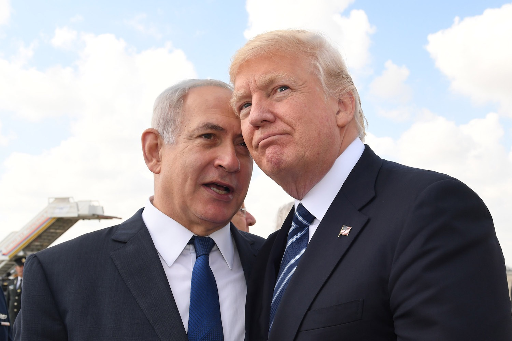

# Beban Pribadi dan Keputusan Negara: Analisis Kasus Donald Trump dan Benjamin Netanyahu dalam Perspektif Politik Kekuasaan

*Ilustrasi Benjamin Netanyahu dan Donald Trump (pic: Grok AI).*

  
***Kadang yang terlihat sebagai “strategi negara”… hanyalah refleksi dari ketakutan, tekanan, dan ambisi pribadi***
  

Kepemimpinan politik tidak pernah steril dari faktor personal. Artikel ini menganalisis bagaimana tekanan hukum, krisis legitimasi, dan dinamika psikologis individu mempengaruhi keputusan politik dari Donald Trump dan Benjamin Netanyahu. 

Temuan menunjukkan bahwa tekanan pribadi dapat mendorong eskalasi kebijakan, populisme, dan strategi distraksi politik.

## Pendahuluan

Dalam teori klasik, pemimpin dianggap aktor rasional.

Namun realitas menunjukkan: pemimpin adalah manusia dengan beban pribadi, ego, dan kebutuhan bertahan

Kasus Donald Trump dan Benjamin Netanyahu adalah contoh ekstrem bagaimana faktor personal dan politik saling berkelindan.

Kasus Donald Trump

1. Tekanan Hukum dan Legitimasi

Donald Trump menghadapi berbagai persoalan hukum:

➡️ kasus terkait pemilu

➡️ investigasi dokumen rahasia

➡️ litigasi bisnis

📌 Dampak politik:

•	narasi “korban sistem”

•	mobilisasi basis populis

•	delegitimasi institusi hukum

2. Tekanan Finansial & Reputasi

•	denda besar

•	tekanan bisnis

•	kebutuhan mempertahankan citra “kuat”

➡️ politik menjadi alat untuk mempertahankan posisi ekonomi & simbolik

3. Obsesi Kekuasaan dan Re-entry Politik

Trump:

•	tidak menerima kekalahan dengan mudah

•	terus membangun narasi comeback

➡️ politik = arena pembuktian diri

4. Strategi Distraksi

Dalam banyak kasus: konflik eksternal atau retorika keras digunakan untuk mengalihkan perhatian publik dari masalah internal.

## Kasus Benjamin Netanyahu

1. Kasus Korupsi dan Pengadilan

Benjamin Netanyahu menghadapi:

➡️ tuduhan korupsi

➡️ proses pengadilan panjang

📌 Dampak:

•	tekanan untuk tetap berkuasa

•	potensi konflik kepentingan

•	penggunaan kebijakan sebagai tameng politik

2. Krisis Legitimasi Domestik

•	protes besar terhadap reformasi peradilan

•	polarisasi masyarakat Israel

➡️ legitimasi tidak stabil

3. Politik Keamanan sebagai Survival Strategy

Netanyahu sering:

➡️ menekankan ancaman eksternal

➡️ menguatkan kebijakan militer

Analisis: keamanan menjadi alat konsolidasi kekuasaan

4. Tekanan Geopolitik

•	konflik dengan Iran

•	tekanan internasional

•	dinamika regional kompleks

➡️ mempersempit ruang manuver politik

## Analisis Komparatif

Persamaan

| Faktor | Trump | Netanyahu |
|--------|--------|--------|
| Tekanan hukum  | Tinggi  | Tinggi  |
| Krisis legitimasi  | Tinggi  | Tinggi  |
| Populisme | Sangat kuat | Kuat |
| Strategi distraksi | Ada | Ada |

Perbedaan

•	Trump → lebih fokus domestik & personal branding

•	Netanyahu → lebih fokus keamanan & geopolitik

## Perspektif Teoretis

1. Political Survival Theory

Pemimpin akan: melakukan apa pun untuk mempertahankan kekuasaan.

2. Diversionary War Theory

Konflik eksternal digunakan untuk:

➡️ mengalihkan perhatian dari krisis internal

➡️ meningkatkan dukungan publik

3. Personalization of Politics

Politik modern semakin:

➡️ terpusat pada individu

➡️ bukan institusi

## Diskusi Kritis

Pertanyaan penting: apakah kebijakan keras mereka murni demi negara… atau juga demi menyelamatkan diri sendiri?

Realitasnya sering abu-abu:

➡️ kepentingan negara dan pribadi bercampur

➡️ sulit dipisahkan secara tegas

Kasus Donald Trump dan Benjamin Netanyahu menunjukkan: politik bukan hanya tentang negara, tapi juga tentang manusia yang memegang kendali atasnya.

  
**Referensi**

•	U.S. Department of Justice (2023–2025). Indictments related to classified documents and election interference.

•	New York Supreme Court (2024). Civil fraud ruling against Trump Organization.

•	Fulton County District Attorney’s Office (2023). Election interference case (Georgia).

•	Levitsky, S., & Ziblatt, D. (2018). How Democracies Die. Harvard University Press.

•	Mearsheimer, J. J. (2014). The Tragedy of Great Power Politics. (untuk konteks perilaku kekuasaan)

•	Mueller, J. (2017). The Politics of Fear. Oxford University Press.

•	Israeli Attorney General (2019–2024). Indictments: Case 1000, 2000, 4000.

•	Supreme Court of Israel Judicial review & constitutional challenges.

•	Brookings Institution (2023–2025). Analisis reformasi peradilan Israel & dampaknya.

•	International Crisis Group (2023–2026). Laporan konflik Israel dan dinamika domestik.

•	Bueno de Mesquita, B., et al. (2003). The Logic of Political Survival. MIT Press.

•	Levy, J. S. (1989). “The Diversionary Theory of War.” Handbook of War Studies.

•	McAllister, I. (2007). “The Personalization of Politics.” Comparative Political Studies.

•	Mudde, C. (2004). “The Populist Zeitgeist.”  Government and Opposition.

•	Amnesty International

•	Human Rights Watch

•	United Nations
