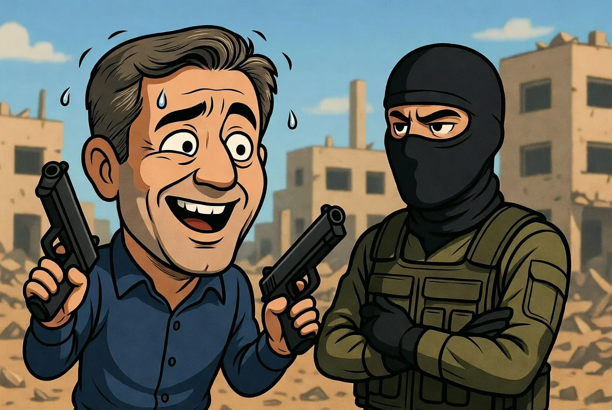

# Ben-Gvir dan Politik “Macho Nasionalisme”: Ketika Retorika Perang Bertemu Realitas Nyali Individu

*Ilustrasi (pic: Grok AI).*

  
***Pembahasan tentang ultra-maskulinitas politik, performative toughness, dan kenapa politisi garis keras jarang duel sendiri di medan nyata***
  

Ada ironi klasik dalam politik modern, orang yang paling keras di podium belum tentu orang yang paling dulu maju sendirian di lorong gelap.

Dan itu bukan cuma soal Itamar Ben-Gvir. 
Itu fenomena global.

Retorika keras Itamar Ben-Gvir terhadap aktivis flotilla dan kelompok Palestina mencerminkan fenomena “performative nationalism” dalam politik modern: penggunaan bahasa ekstrem dan simbol kekerasan untuk memperkuat citra kepemimpinan di mata pendukung domestik. 

Tulisan ini membahas bagaimana figur politik garis keras membangun persona maskulin agresif, hubungan antara retorika keamanan dan populisme, serta mengapa politik performatif sering lebih penting daripada keberanian fisik individual dalam sistem negara modern.

## “Aktivis = Teroris”: Bahasa yang Mengubah Persepsi Moral

Ketika Ben-Gvir menyebut “aktivis flotilla adalah teroris,” itu bukan sekadar hinaan spontan.

Dalam Psikologi Politik, label seperti:
teroris,
musuh negara,
ancaman eksistensial,
punya fungsi besar sebagai moral framing. Yaitu mengubah persepsi publik sehingga tindakan keras terhadap kelompok tersebut terasa lebih dapat dibenarkan.

Karena begitu seseorang diberi label “teroris, maka empati publik terhadap mereka otomatis turun di sebagian audiens.

## Politik Ultra-Maskulin

Ben-Gvir memainkan karakter politik hypermasculine nationalism. Ciri-cirinya:
bahasa keras,
glorifikasi kekuatan,
anti kompromi,
tampil agresif,
dan menunjukkan dominasi simbolik.

Kenapa gaya ini populer?

Karena dalam masyarakat yang merasa terancam, publik sering tertarik pada figur yang terlihat:

“kuat,”

“tak takut,”

“keras pada musuh.”

## Apakah Politisi Garis Keras Selalu Berani Bertarung Langsung? 

Nah ini bagian lucunya.

Dalam negara modern, politisi hampir tidak pernah bertarung sendiri. Karena kekuasaan modern bekerja lewat:
aparat,
tentara,
polisi,
sistem hukum,
dan teknologi negara.

Jadi figur seperti Ben-Gvir membangun symbolic toughness, bukan keberanian gladiator literal.

Dalam istilah sederhana, mereka menjual citra “aku singa.” Tapi yang benar-benar bertarung di lapangan biasanya:
tentara muda,
polisi,
milisi,
atau warga sipil yang terjebak konflik.

## Kenapa Banyak Orang Ingin Melihat Tokoh Garis Keras “One by One”?

Karena manusia punya intuisi moral kuno, kalau seseorang sangat agresif, kita ingin tahu apakah ia sendiri siap menghadapi risiko yang sama.

Itu semacam fairness instinct, yaitu naluri “jangan suruh orang lain perang kalau kamu sendiri tidak berani.”

Makanya dalam budaya populer, publik sering mengejek politisi hawkish sebagai:
keyboard warrior,
chickenhawk,
atau omdo.

## Bahaya Psikologis Konflik

Ketika publik mulai membayangkan “adu satu lawan satu” itu menunjukkan konflik sudah sangat emosional dan personal. Padahal realitas perang modern bukan duel kehormatan seperti film.

Perang modern adalah:
drone,
misil,
blokade,
propaganda,
dan kekuatan negara besar.
Yang paling sering mati justru orang yang bahkan tidak ikut membuat keputusan perang.

## Kenapa Ben-Gvir Tetap Populer bagi Sebagian Orang Israel?

Karena banyak warga Israel hidup dengan:
trauma serangan,
ketakutan keamanan,
memori intifada,
dan ancaman Hamas atau Hezbollah.

Bagi sebagian pendukung, Ben-Gvir terlihat seperti orang yang “tidak akan lembek terhadap ancaman.”

Jadi penting dipahami bahwa figur seperti dia tidak muncul dari ruang kosong tetapi dari masyarakat yang juga mengalami rasa takut kolektif.

## Retorika Ekstrem Punya Harga Besar

Masalahnya, bahasa yang terus menerus:
menghina,
merendahkan,
melabeli semua lawan sebagai teroris,
dapat mempercepat dehumanization.

Dan ketika dehumanisasi meningkat:
kekerasan lebih mudah dibenarkan,
kompromi makin mustahil,
dan konflik makin brutal.

## Politik Medsos: Kekerasan sebagai Konten

Ben-Gvir memahami era digital dengan sangat baik. Di zaman sekarang:
penghinaan,
video penahanan,
retorika keras,
dan simbol dominasi
sering dipakai sebagai performance for supporters. Semacam “lihat, saya paling keras membela bangsa.”

Akibatnya politik berubah seperti:
reality show hiper-nasionalis,
di mana kemarahan menjadi bahan bakar engagement.

## Filosofi Kekuasaan

Ada paradoks tua dalam sejarah manusia, orang yang benar-benar kuat sering tidak perlu terus meneriakkan kekuatannya.

Sebaliknya, politik populis modern sering membutuhkan:
drama,
ancaman,
penghinaan,
dan musuh permanen.

Karena tanpa musuh… figur garis keras kehilangan panggung emosionalnya.

Retorika Itamar Ben-Gvir terhadap aktivis flotilla menunjukkan:
penggunaan bahasa ekstrem sebagai alat politik,
performa ultra-maskulin dalam populisme nasionalis,
dan proses dehumanisasi yang memperdalam konflik.
Keberanian politik modern tidak lagi berbentuk duel fisik individual, melainkan:
kemampuan mengontrol narasi,
memobilisasi emosi massa,
dan menggunakan simbol kekuatan negara.
Namun sejarah menunjukkan, semakin suatu konflik dipenuhi penghinaan dan demonisasi, maka semakin sulit perdamaian dibangun.

Karena pada titik tertentu, musuh tidak lagi dipandang sebagai manusia… melainkan target yang dianggap pantas diperlakukan apa saja.

Politik garis keras itu sering seperti orang yang berteriak paling keras di balkon kastil. Tapi belum tentu dia mau turun sendirian ke arena tanpa pasukan.

  
**Referensi**

Human Rights Watch. Reports on Israeli detention practices and political extremism.

Bandura, A. (1999). Moral disengagement in the perpetration of inhumanities.

Arendt, H. (1970). On Violence.

Fanon, F. (1961). The Wretched of the Earth.

Brookings Institution. Populism, nationalism, and political polarization in Israel.

Council on Foreign Relations. Israeli far-right politics and regional implications.

Al Jazeera: Several nations summon Israeli envoys as Ben-Gvir taunts flotilla activists

Al Jazeera: Outrage over Israel’s Ben-Gvir flotilla abuse video

The Guardian: Israeli security minister stirs diplomatic outrage

AP News report

Sky News report

Washington Post report
