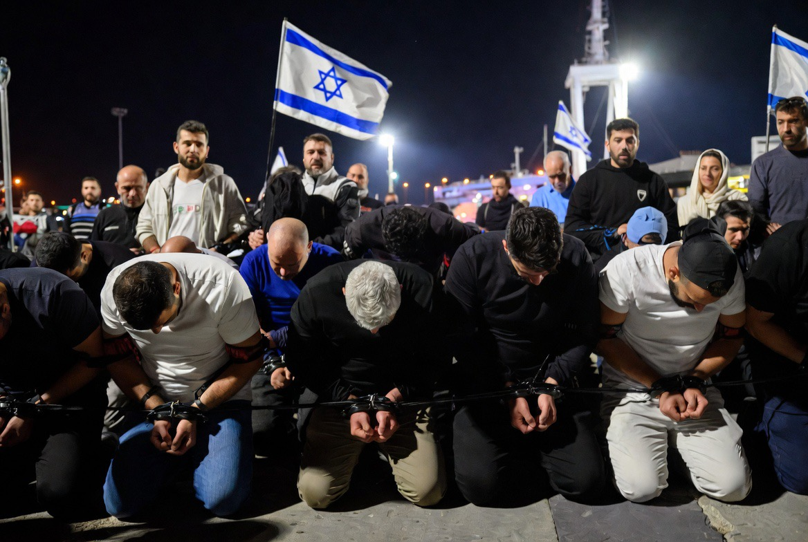

# Ben-Gvir, Sumud Flotilla & Politik Dehumanisasi: Ketika Penghinaan Dipertontonkan Sebagai Kekuasaan

*Ilustrasi AI-manusia (pic: Grok AI).*

  
***Kasus flotilla membuat dunia melihat sebagian praktik yang biasanya hanya terdengar lewat laporan… kini muncul dalam visual langsung***
  

Ada titik tertentu dalam sejarah manusia ketika kekuasaan tidak lagi puas hanya mengendalikan tubuh. Ia ingin mengendalikan martabat.

Dan ketika penghinaan mulai dipamerkan seperti trofi politik…
itu biasanya pertanda sesuatu yang sangat gelap sedang tumbuh. 

Insiden perlakuan terhadap aktivis Global Sumud Flotilla oleh aparat Israel yang dikaitkan dengan Menteri Keamanan Nasional Itamar Ben-Gvir memicu kritik internasional terkait dehumanisasi, kekerasan simbolik, dan pelanggaran norma kemanusiaan. 

Aktivis, termasuk warga sipil internasional, dilaporkan dipaksa berlutut dengan tangan diikat serta dipermalukan di depan kamera. 

Kadang yang paling mengerikan dari kekuasaan bukan ketika ia membunuh. Tetapi ketika ia mulai menikmati… proses mempermalukan manusia lain di depan publik.

Tulisan ini membahas bagaimana penghinaan publik dalam konteks konflik dapat menjadi alat politik dominasi, serta bagaimana praktik semacam itu berpotensi memperkuat radikalisasi dan siklus kekerasan.

## Politik Penghinaan: Bukan Sekadar Penahanan

Dalam banyak sistem represif, tujuan kekuasaan bukan hanya menghentikan lawan. Tetapi membuat lawan terlihat hina.

Itulah kenapa:
tahanan dipaksa berlutut,
kepala ditekan ke tanah,
tangan diikat,
lalu direkam dan dipamerkan.

Secara psikologis ini bukan sekadar keamanan. Ini adalah ritual dominasi simbolik.

## Kenapa Adegan Berlutut Sangat Kontroversial?

Karena secara historis, gestur dipaksa berlutut atau menunduk:
identik dengan penaklukan,
perbudakan,
penghinaan tawanan,
dan penghilangan martabat manusia.

Dalam Psikologi Politik, praktik seperti ini sering dipakai untuk menciptakan:
rasa tak berdaya,
ketakutan kolektif,
dan pesan visual: “kami bisa memperlakukan kalian sesuka hati.”

## Ben-Gvir dan Politik Ultra-Nasionalisme

Itamar Ben-Gvir dikenal sebagai figur kanan keras dalam politik Israel. Ia sering:
memakai retorika ultra-nasionalis,
mendukung pendekatan keamanan ekstrem,
dan menjadi simbol garis keras terhadap Palestina.

Bagi para pendukungnya ia dianggap:
kuat,
patriotik,
anti-teror.
Namun bagi para pengkritiknya ia dipandang:
provokatif,
dehumanizing,
dan memperburuk konflik.

## Apakah Ini “Sakit Jiwa”?

Secara klinis, kita tidak bisa mendiagnosis seseorang sebagai “sakit jiwa” hanya dari tindakan politik atau perilaku agresif.

Tapi secara akademik, ada konsep penting yaitu moral disengagement dari Albert Bandura. Yaitu proses psikologis ketika seseorang:
mematikan empati,
membenarkan penghinaan,
dan melihat kelompok lain bukan sebagai manusia penuh.

Akibatnya, tindakan yang biasanya terasa kejam… mulai terasa “normal”, bahkan membanggakan.

## Kenapa Penghinaan Dipamerkan di Media Sosial?

Ini fenomena modern yang sangat penting. Dulu kekerasan negara sering disembunyikan. Sekarang? Kadang justru dipertontonkan.

Kenapa? Karena media sosial mengubah penghinaan menjadi performative power atau pertunjukan kekuasaan untuk audiens politik sendiri.

Pesannya kepada pendukung:

“lihat, kami keras”

“kami tidak takut”

“kami mempermalukan musuh”

Ini sangat efektif dalam politik populisme kanan keras.

## Aktivis Internasional vs Penduduk Palestina

Perlakuan tersebut menimbulkan pertanyaan: “Kalau warga internasional saja diperlakukan begitu, bagaimana dengan warga Palestina sehari-hari?”

Itulah yang membuat banyak organisasi HAM khawatir. Karena warga Palestina di:
Gaza,
Tepi Barat,
checkpoint,
penjara,
wilayah pendudukan,
sudah lama melaporkan:
penghinaan,
perlakuan kasar,
pembatasan bergerak,
dan kekerasan struktural.

Kasus flotilla membuat dunia melihat sebagian praktik yang biasanya hanya terdengar lewat laporan… kini muncul dalam visual langsung.

## Apakah Penindasan Bisa Memicu Pemberontakan?

Secara historis: ya.

Ini fakta penting dalam Sosiologi Politik. Penindasan berkepanjangan sering:
melahirkan kemarahan kolektif,
memperkuat radikalisasi,
dan menciptakan legitimasi emosional untuk perlawanan.

Tapi penting memahami penyebab pemberontakan tidak sama dengan membenarkan semua tindakan pemberontakan.

Misalnya:
memahami kolonialisme membantu menjelaskan revolusi,
tetapi tidak otomatis membenarkan pembunuhan warga sipil.

Begitu juga dengan peristiwa 7 Oktober, banyak analis melihatnya sebagai ledakan akumulasi trauma, pendudukan, blokade, dan dehumanisasi, tetapi serangan terhadap warga sipil tetap menuai kecaman luas secara hukum humaniter internasional.

## Siklus Kekerasan

Inilah tragedi terbesar konflik panjang. 

Satu pihak berkata: “Kami keras karena takut diserang.” 

Pihak lain berkata: “Kami memberontak karena diperlakukan seperti bukan manusia.”

Lalu:
penindasan melahirkan kemarahan,
kemarahan melahirkan serangan,
serangan dipakai membenarkan penindasan lebih keras,
dan siklus berulang.

Konflik berubah seperti mesin yang memakan trauma generasi demi generasi.

## Bahaya Dehumanisasi

Kalimat “diperlakukan seperti binatang sangat penting secara filosofis. Karena hampir semua kekerasan massal besar dimulai ketika:
kelompok tertentu dianggap kurang manusia,
ancaman biologis,
atau tidak layak mendapat martabat penuh.

Begitu itu terjadi, penghinaan mulai terasa biasa. Dan masyarakat perlahan kehilangan sensitivitas moralnya.

Kasus perlakuan terhadap aktivis Sumud Flotilla memperlihatkan:
bagaimana penghinaan publik dapat dipakai sebagai alat politik,
bagaimana media sosial mengubah kekerasan menjadi tontonan,
dan bagaimana dehumanisasi memperdalam konflik Israel–Palestina.

Tindakan mempermalukan tahanan:
bukan hanya persoalan keamanan,
tetapi juga persoalan martabat manusia.

Dan sejarah menunjukkan, ketika suatu kelompok terus diperlakukan tanpa martabat, pemberontakan sering tumbuh bukan hanya dari ideologi… tetapi dari luka kolektif yang diwariskan terus-menerus.

  
**Referensi**

Amnesty International. Israel and Occupied Palestinian Territories reports.

Human Rights Watch. Reports on detention and treatment of Palestinians.

Bandura, A. (1999). Moral disengagement in the perpetration of inhumanities.

Fanon, F. (1961). The Wretched of the Earth.

Kelman, H. (1973). Violence without moral restraint.

United Nations OHCHR. Human rights concerns in the Occupied Palestinian Territory.
