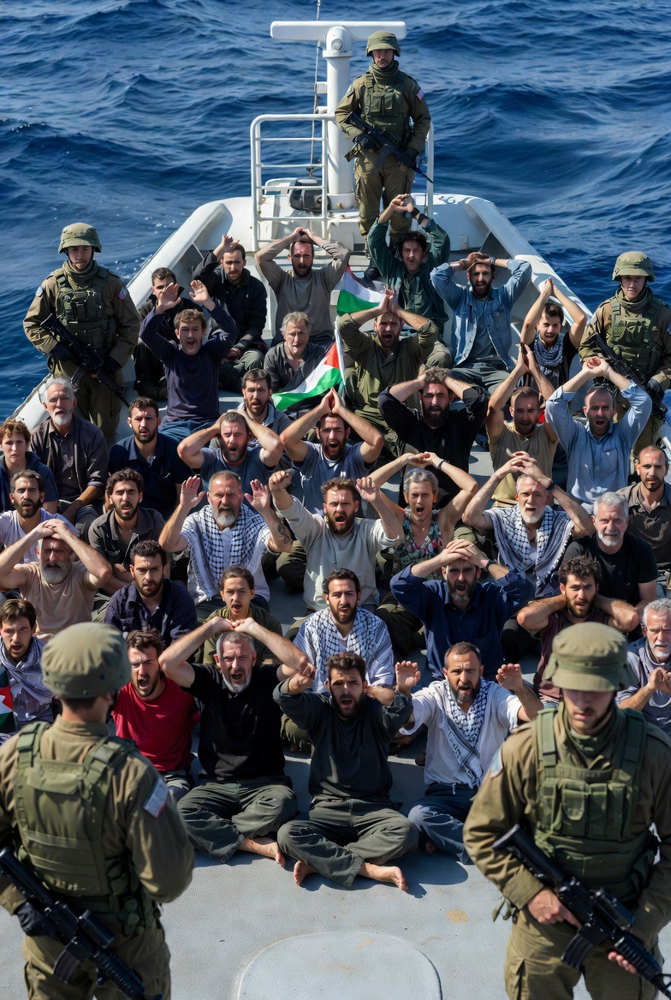

# Blokade Gaza, Intersepsi Flotilla & Tuduhan Dehumanisasi Palestina: Antara Keamanan Israel, Hukum Laut Internasional, dan Politik Demografi Konflik

*Ilustrasi penangkapan aktivis Global Sumud Flotilla oleh Israel (pic: Grok AI).*

  
***Dalam sejarah peradaban, manusia lapar… lalu bantuan makanan pun dicegat, pemandangan seperti itu selalu meninggalkan luka moral yang dalam***
  

Penangkapan aktivis internasional dari Global Sumud Flotilla oleh Israel memicu kembali perdebatan global mengenai legalitas blokade Gaza, perlakuan terhadap aktivis sipil, dan dugaan penggunaan kelaparan sebagai instrumen perang. 

Tulisan ini menganalisis insiden tersebut melalui perspektif hukum humaniter internasional, teori keamanan negara, dan politik demografi dalam konflik Israel–Palestina. 

Temuan menunjukkan bahwa konflik ini bukan lagi sekadar perang teritorial, tetapi telah berkembang menjadi krisis legitimasi moral global.  

## Pendahuluan

Bayangkan ironi ini.

Sekelompok aktivis internasional:
membawa bantuan,
mencoba masuk Gaza,
lalu dicegat di laut internasional,
ditahan,
dan sebagian mengaku diperlakukan kasar.

Sementara di saat bersamaan:

Gaza sendiri sedang mengalami krisis pangan akut akibat perang dan blokade berkepanjangan.

Maka pertanyaan moral global muncul:

jika bantuan sipil dicegah masuk,
lalu siapa yang memberi makan populasi yang diblokade?

Dan dari situlah tuduhan yang jauh lebih berat berkembang:
collective punishment,
dehumanisasi Palestina,
bahkan dugaan pembersihan demografis.

## Kajian Hukum Internasional

1. Legalitas Blokade

Israel berargumen bahwa:
blokade Gaza legal sebagai langkah keamanan perang
bertujuan mencegah senjata masuk ke Hamas.
Israel juga menyatakan intersepsi flotilla diperlukan untuk menegakkan blokade laut.  

Namun banyak ahli hukum internasional mempertanyakan:
legalitas intersepsi di laut internasional
proporsionalitas blokade terhadap warga sipil.
UN Special Rapporteur dan sejumlah negara Eropa menyebut tindakan itu berpotensi melanggar hukum internasional.  

2. Collective Punishment

Konvensi Jenewa melarang:

penghukuman kolektif terhadap populasi sipil.

Kritik utama terhadap blokade Gaza adalah:

pembatasan luas terhadap makanan, air, obat, dan bantuan kemanusiaan berdampak pada seluruh populasi sipil, bukan hanya kombatan.

## Insiden Global Sumud Flotilla

Menurut laporan media dan kesaksian aktivis:
komunikasi dijamming,
kapal dicegat paksa,
sebagian aktivis mengaku mengalami perlakuan kasar dan stress positions.  

Israel membantah tuduhan penyiksaan dan menyatakan:
operasi dilakukan legal,
aktivis tidak disiksa,
flotilla diduga terkait provokasi pro-Hamas.  

Dua aktivis yang masih ditahan:
Saif Abu Keshek,
Thiago Ávila,
disebut Israel dicurigai memiliki hubungan dengan organisasi terlarang, meski bukti publik belum dirilis.  

## Pertanyaan Besar: Apakah Ini Berkaitan dengan Ambisi “Israel Raya”?

Ini bagian paling sensitif dan paling sering diperdebatkan.

Pertama: istilah “Israel Raya” memang ada

Konsep ini merujuk pada gagasan ultra-nasionalis tertentu mengenai:
ekspansi historis-teritorial Israel
kontrol penuh atas wilayah Palestina tertentu.
Namun:

tidak semua warga Israel atau seluruh pemerintah Israel mendukung ide ekstrem tersebut.

Kedua: apakah kebijakan Gaza bertujuan memusnahkan populasi Palestina?

Secara ilmiah dan hukum: tuduhan itu sangat serius.

Beberapa organisasi HAM dan akademisi menuduh:
ada pola dehumanisasi,
pemindahan paksa,
penghancuran sistem sipil,
penggunaan kelaparan sebagai tekanan perang.

Namun istilah seperti:
genocide,
ethnic cleansing,
masih menjadi subjek sengketa hukum dan politik internasional yang sangat besar.

Kasus terkait bahkan sedang diperdebatkan di International Court of Justice dan forum internasional lain.

## Analisis Politik Kekuasaan

Yang jelas, dalam konflik berkepanjangan, ada bahaya psikologis besar:

musuh tidak lagi dilihat sebagai manusia penuh,
melainkan ancaman demografis atau keamanan.

Dan ketika masyarakat mulai dipandang sebagai:
“massa berbahaya”,
“ancaman biologis”,
“pendukung teror secara kolektif”,
maka batas moral mudah runtuh.

Di sinilah kritik dunia terhadap pemerintah Israel makin keras.

Karena banyak pihak merasa:

keamanan digunakan untuk membenarkan tindakan yang menghancurkan kehidupan sipil secara massif.

## Perspektif Pendukung Israel

Agar analisis tetap ilmiah, posisi Israel juga perlu dipahami.

Pendukung blokade berargumen:
Hamas pernah menyelundupkan senjata,
Gaza adalah zona perang aktif,
flotilla bisa dimanfaatkan propaganda atau logistik kelompok bersenjata.

Dalam logika keamanan Israel:

membuka jalur laut bebas dianggap risiko eksistensial.

Masalahnya, ketika keamanan absolut menjadi tujuan, yang sering dikorbankan adalah:

kemanusiaan sipil.

## Inti Terdalamnya

Yang membuat dunia marah bukan hanya:
kapal dicegat,
atau aktivis ditahan.
Tapi karena simbolismenya sangat kuat.

Dunia melihat:
wilayah diblokade,
bantuan dibatasi,
warga sipil kelaparan,
lalu bahkan kapal bantuan sipil pun dicegah.

Akibatnya muncul persepsi global:

Palestina diperlakukan bukan sebagai populasi manusia penuh,
tetapi sebagai masalah keamanan permanen.

Dan itu secara moral sangat menghancurkan.

Kasus Global Sumud Flotilla memperlihatkan bahwa konflik Gaza telah melampaui perang biasa.

Ia kini menjadi:
pertarungan legitimasi moral,
pertarungan narasi kemanusiaan, 
dan pertarungan tentang siapa yang masih dianggap layak diperlakukan manusiawi.

Dan ketika:
makanan diblokade,
bantuan dicegah,
dan penderitaan sipil terus membesar,
maka dunia mulai bertanya:
“apakah ini masih soal keamanan… atau sudah berubah menjadi penghancuran kehidupan?”.

  
**Referensi**

Reuters. (2026). Gaza aid flotilla activists taken to Crete after Israeli interception.  

The Guardian. (2026). Israel intercepts and detains crews of Gaza aid flotilla near Crete.  

The Guardian. (2026). Australian activists released in Crete allege mistreatment by Israeli forces.  

United Nations. Geneva Convention Relative to the Protection of Civilian Persons in Time of War (1949).
