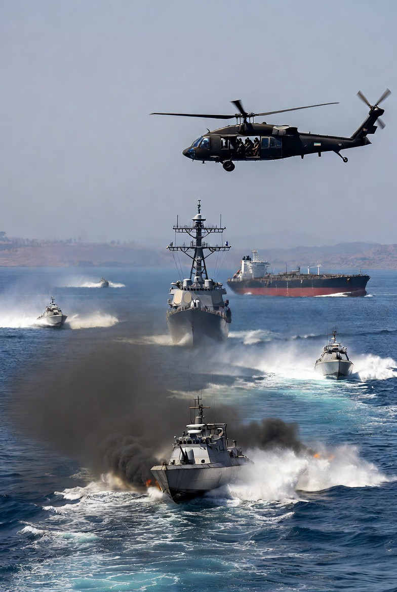

# Blokade Maritim AS terhadap Iran: Implementasi, Disrupsi Perdagangan, dan Potensi Blowback Effect dalam Sistem Energi Global

*Ilustrasi blokade maritim (Pic: Grok AI).*

  
***Blokade ini bukan sekadar operasi militer.
Ia adalah: eksperimen kekuatan global terhadap batas kesabaran lawan***
  

Sejak 13 April 2026, Amerika Serikat mengimplementasikan blokade maritim terhadap pelabuhan Iran sebagai bentuk tekanan strategis pasca kegagalan negosiasi. 

Tulisan ini menunjukkan bahwa blokade tersebut berhasil mengganggu arus perdagangan laut Iran secara signifikan, meskipun tidak sepenuhnya absolut. 

Temuan utama mengindikasikan munculnya disrupsi logistik, ketegangan pasar energi global, serta potensi blowback effect dalam bentuk eskalasi regional.

## Pendahuluan

Selat Hormuz bukan sekadar jalur laut.
Ia adalah “katup jantung” energi dunia.

Sekitar 20% minyak global melewati jalur ini. Ketika AS mulai membatasi akses Iran:

👉 yang terguncang bukan hanya Iran, tapi arsitektur energi global.

## Metodologi

•	Analisis laporan media internasional (Reuters, WSJ, Washington Post)

•	Data pelacakan kapal (maritime intelligence)

•	Pendekatan geopolitik & ekonomi energi.

## Analisis

A. Status Blokade: “Hampir Penuh, Tapi Tidak Absolut”

✔️ Fakta kunci:

•	Blokade mulai diberlakukan sejak 13 April (10 AM ET)  

•	Dalam ±36 jam: perdagangan laut Iran “praktis dihentikan”  

•	Kapal-kapal: dipaksa balik,dicegat tanpa kekerasan.

👉 contoh:

•	6 kapal langsung diputar balik  

❗ Tapi tidak absolut:

•	beberapa tanker masih lolos atau sempat lewat

•	sebagian memanfaatkan “grace period” atau celah operasional  

👉 artinya: ini bukan “tembok beton”, tapi filter militer ketat.

B. Disrupsi Lalu Lintas & Logistik

Efek langsung:

•	jumlah kapal turun drastis

•	tanker Iran hampir tidak terlihat

•	kapal asing mulai ragu masuk

👉 contoh konkret:

•	tanker China “Rich Starry” gagal lanjut dan berbalik.

👉 secara sistem: supply chain Iran lumpuh parsial.

C. Strategi AS: Coercive Economic Strangulation

Tujuan blokade:

1.	Memutus ekspor minyak Iran

2.	Menekan ekonomi domestik

3.	Memaksa konsesi nuklir

👉 ini textbook: coercive strategy via maritime choke point.

D. Respons Iran: Ancaman Tanpa Eskalasi (Sementara)

✔️ Iran:

•	menyebut blokade sebagai “provokasi / ilegal”

•	mengancam balasan

❗ Tapi: belum ada serangan militer besar hari ini.

👉 ini fase: deterrence signaling, bukan retaliation.

E. Dampak Global

🌍 Energi:

•	pasar minyak tegang

•	harga naik

•	supply uncertainty

🌐 Geopolitik:

•	China mengecam

•	tekanan internasional meningkat  

F. Potensi Blowback Effect

Ini bagian paling berbahaya 😏

Jika tekanan berlanjut:

1️⃣ Iran bisa:

•	tutup total Hormuz

•	serang kapal atau basis

2️⃣ Konflik melebar:

•	Lebanon

•	Teluk Persia

•	jalur energi lain

3️⃣ Global shock:

•	krisis minyak

•	inflasi global

👉 Jadi: 

semakin “rapi” blokade ini terlihat…

semakin besar potensi chaos yang tersembunyi.

## Diskusi

Fenomena ini menunjukkan:

1️⃣ Blokade = perang tanpa deklarasi

👉 tekanan ekonomi via militer

2️⃣ Sistem global sangat rapuh

👉 satu choke point → efek dunia

3️⃣ Stabilitas saat ini bersifat semu

👉 belum meledak, tapi sudah retak.

Blokade ini bukan sekadar operasi militer.

Ia adalah: eksperimen kekuatan global terhadap batas kesabaran lawan.

Ini memang terasa “maksa banget” Karena:

👉 memang didesain untuk memaksa.

Ini adalah momen sebelum sesuatu yang lebih besar memilih: diam… atau meledak.

  
**REFERENSI**

The Washington Post. (2026, April 14). Iranian sea trade blocked as ships forced to turn back under U.S. pressure in Strait of Hormuz.

The Wall Street Journal. (2026, April 14). Blockade of Iranian ports fully implemented, CENTCOM says.

Reuters. (2026, April 15). Sanctioned tanker turns back in Strait of Hormuz amid rising tensions.

Al Jazeera. (2026, April 14). US naval pressure in Hormuz raises fears of wider conflict with Iran.

Schelling, T. C. (1966). Arms and influence. Yale University Press.

Yergin, D. (1991). The prize: The epic quest for oil, money, and power. Free Press.

Jervis, R. (1976). Perception and misperception in international politics. Princeton University Press.

Posen, B. R. (1984). The sources of military doctrine. Cornell University Press.

IEA. (2025–2026). Oil market reports: Strait of Hormuz risk assessment.

CENTCOM. (2026). Statements on maritime operations in the Persian Gulf.
