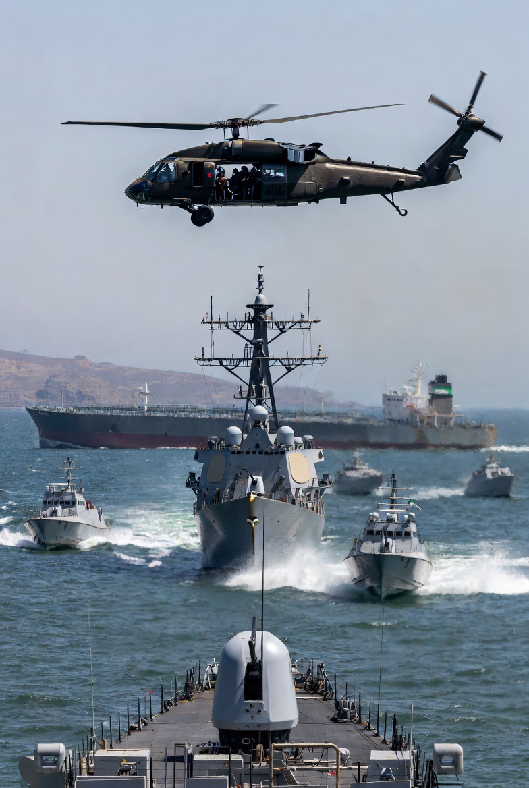

# Blokade Selat Hormuz oleh AS: Analisis Coercive Strategy, Eskalasi Energi Global, dan Fragmentasi Konflik Iran–Israel

*Ilustrasi blokade Selat Hormuz (pic: Grok AI).*

  
***Semakin besar tekanan yang diberikan, semakin besar pula risiko blowback effect***
  

Blokade de facto Selat Hormuz oleh Amerika Serikat pada 14 April 2026 menandai eskalasi signifikan dalam konflik Iran–Israel–AS. 

Tulisan ini menganalisis tindakan tersebut sebagai bentuk coercive maritime strategy yang bertujuan menekan Iran dalam isu nuklir dan kontrol jalur energi. 

Temuan menunjukkan bahwa langkah ini memperbesar risiko eskalasi global, memicu volatilitas pasar energi, dan memperdalam fragmentasi konflik regional, khususnya melalui intensifikasi operasi Israel di Lebanon.

## Pendahuluan

Selat Hormuz bukan sekadar jalur laut.

Ia adalah: arteri utama ekonomi global. Sekitar 20% pasokan minyak dunia melewati jalur ini.

Ketika Amerika Serikat mulai melakukan blokade:

•	bukan hanya Iran yang ditekan

•	tapi seluruh sistem ekonomi global ikut “ditahan napasnya”.

Keputusan AS yang terkesan “maksa banget sih?”:

Secara emosional → iya terasa begitu

Secara ilmiah → itu disebut: coercive pressure dalam sistem internasional yang tidak simetris.

## Coercive Maritime Strategy

Menurut Thomas C. Schelling: tekanan militer digunakan untuk memaksa lawan mengubah perilaku tanpa perang total.

Blokade adalah bentuk klasiknya.

## Energy Geopolitics

Kontrol atas jalur energi = kekuatan global.

Negara yang mengontrol:

•	suplai

•	distribusi

👉 memiliki leverage politik luar biasa.

## Escalation Ladder

Konsep ini menjelaskan: konflik meningkat bertahap dari tekanan → ancaman → konfrontasi langsung.

Blokade berada di level tinggi, nyaris sebelum perang terbuka.

## Analisis

A. Blokade: Tekanan atau Provokasi?

Tujuan resmi:

•	membuka Hormuz tanpa biaya

•	menekan program nuklir Iran

Namun secara strategis: ini adalah bentuk pemaksaan kebijakan eksternal terhadap kedaulatan negara lain.

B. Nuklir Iran: Kepentingan Siapa?

Pertanyaan tajam: untuk AS atau Israel?

Jawaban ilmiah:

👉 keduanya, tapi dalam bentuk berbeda

🔹 AS:

•	mencegah proliferasi nuklir

•	menjaga stabilitas global

🔹 Israel:

•	menjaga superioritas militer regional

👉 Jadi: satu kebijakan… melayani dua kepentingan sekaligus.

C. Dampak Langsung: Pasar Global

Efek cepat:

•	harga minyak melonjak

•	pasar finansial tegang

•	investor masuk mode defensif

👉 Ini menunjukkan: konflik regional bisa langsung jadi krisis global.

D. Risiko Eskalasi: “Permainan Berbahaya”

Ini berbahaya karena:

1.	Iran bisa balas:

•	menutup Hormuz total

•	menyerang aset AS

2.	AS bisa meningkatkan:

•	serangan militer

•	tekanan ekonomi

👉 Ini menciptakan: spiral eskalasi yang sulit dihentikan.

E. Israel dan Lebanon: Eksploitasi Momentum

Israel menyerang Lebanon sebagai “aji mumpung”. Dalam istilah akademik disebut opportunistic escalation.

Israel:

•	memanfaatkan fokus Iran pada negosiasi

•	melanjutkan operasi di Lebanon

👉 Ini menghasilkan: perang yang tidak berhenti… hanya berpindah fokus.

F. Fragmentasi Konflik

Sekarang konflik tidak lagi satu garis.

Tapi menjadi:

•	AS vs Iran (strategi global)

•	Israel vs Hezbollah (konflik regional)

•	Iran vs tekanan ekonomi

👉 Ini disebut: multi-layered conflict system.

## Diskusi

Fenomena ini menunjukkan:

1. Diplomasi gagal → militer mengambil alih

Blokade muncul setelah negosiasi buntu.

2. Energi = senjata geopolitik

Bukan hanya ekonomi, tapi alat tekanan.

3. Keadilan bukan variabel utama

Yang menentukan: kekuatan + posisi + aliansi.

Blokade Selat Hormuz bukan sekadar langkah militer.

Ia adalah: pernyataan kekuasaan global.

Namun, semakin besar tekanan yang diberikan: semakin besar pula risiko blowback effect.

  
**REFERENSI**

Reuters. (2026, April 14). Oil prices surge as U.S. moves to restrict Iran shipping in Strait of Hormuz.

Al Jazeera. (2026, April 14). US naval pressure in Hormuz raises fears of wider conflict with Iran.

Associated Press. (2026, April 14). Global markets react as tensions escalate over Hormuz blockade.

CNN International. (2026, April 14). US increases military presence near Iran, warns over nuclear program.

The Guardian. (2026, April 14). Israel continues Lebanon strikes as Iran tensions dominate ceasefire dynamics.

Schelling, T. C. (1966). Arms and influence. Yale University Press.

Yergin, D. (1991). The prize: The epic quest for oil, money, and power. Free Press.

Jervis, R. (1976). Perception and misperception in international politics. Princeton University Press.

Posen, B. R. (1984). The sources of military doctrine. Cornell University Press.

IEA. (2025–2026). Oil market reports and Strait of Hormuz analysis.

DoD. (2026). Statements on maritime security and Iran operations.

ICG. (2025–2026). Iran–US tensions and regional escalation reports.
