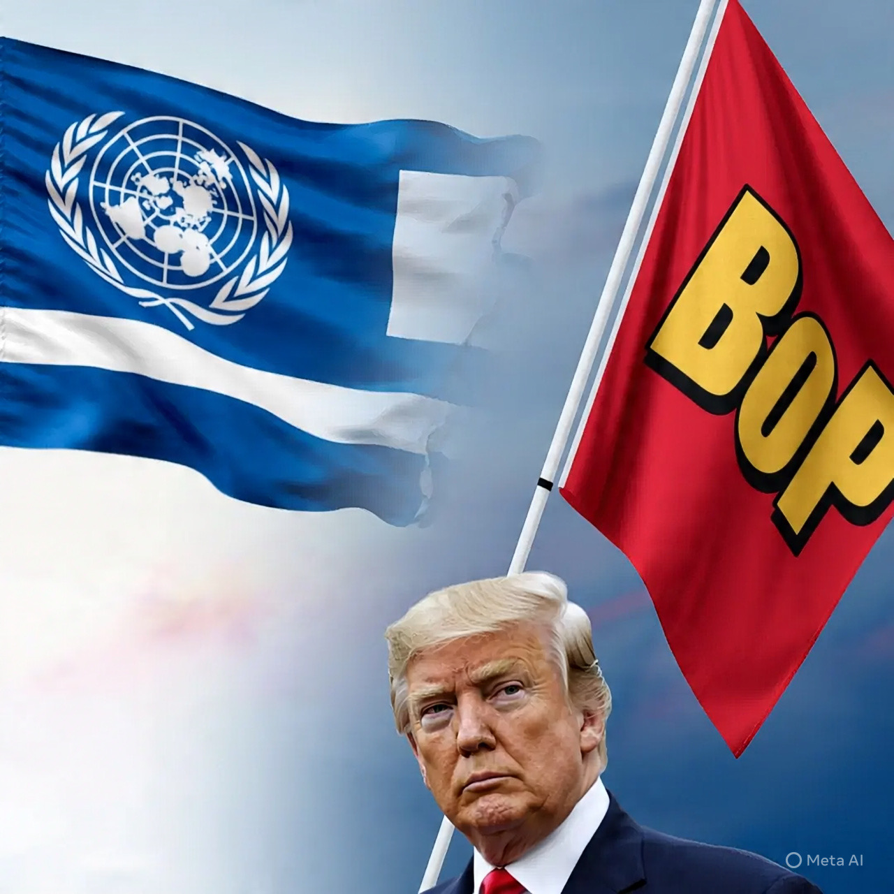

# Board of Peace: Analisis Akademik Terhadap Inisiatif Trump dan Implikasinya pada Tatanan Diplomasi Global

*Ilustrasi bendera PBB, BoP, dan Trump (pic: Meta AI).*

  
***Apakah BoP dirancang sebagai pengganti Perserikatan Bangsa-Bangsa (PBB) atau sekadar platform koordinasi alternatif dalam penyelesaian konflik internasional?***
  

Tulisan ini mengkaji “Board of Peace” (BoP) sebagai inisiatif diplomasi baru yang diperkenalkan oleh Presiden Amerika Serikat Donald Trump di World Economic Forum 2026 di Davos, Swiss. 

Fokus utama adalah apakah BoP dirancang sebagai pengganti Perserikatan Bangsa-Bangsa (PBB) atau sekadar platform koordinasi alternatif dalam penyelesaian konflik internasional—terutama konflik Gaza—serta bagaimana respons dan implikasi geopolitik dari pembentukan badan ini terhadap tatanan internasional saat ini.

## Pendahuluan

Pada 22 Januari 2026, Trump mengumumkan pembentukan Board of Peace, sebuah badan internasional yang diposisikan untuk terlibat dalam penyelesaian konflik global, awalnya fokus pada Gaza tetapi berambisi memiliki mandat lebih luas. 

Keanggotaan badan ini telah ditandatangani oleh sekitar 19 negara saat diluncurkan. Beberapa negara besar tradisional seperti Spanyol dan negara-negara Uni Eropa menolak bergabung dengan alasan mempertahankan sistem multilateral berbasis PBB. 

Indonesia termasuk di antara negara yang bergabung sebagai founding member dengan penandatanganan piagam BoP.  

## Metodologi 

Analisis ini menggunakan pendekatan kualitatif deskriptif melalui sumber berita terpercaya, dokumen piagam awal, dan pernyataan pemerintah. 

Metode ini bertujuan menafsirkan maksud dan orientasi organisasi baru dalam konteks hubungan internasional dan teori organisasi global (multilateral vs bilateral / minilateral).

## Kajian Teoretik

1. Board of Peace: Maksud dan Struktur

Board of Peace dikembangkan sebagai badan untuk mengawasi tahap transisi, stabilisasi, dan rekonstruksi pascakonflik (misalnya Gaza), dengan mandat awal yang disahkan oleh piagam internasional. 

Pendirinya adalah Presiden Trump, yang menjabat sebagai chairman dan memiliki wewenang besar dalam pengaturan anggota.  

Dalam konteks keanggotaannya, negara-negara diundang dan dapat menjadi anggota sementara selama tiga tahun. 

Status keanggotaan permanen diusulkan memerlukan kontribusi finansial besar (sekitar US$1 miliar atau setara), yang membuka debat etis dan struktural karena persyaratan ini hampir tidak ditemukan dalam organisasi multilateral tradisional.  

2.PBB vs Board of Peace: Perbandingan Tujuan dan Legitimasi

PBB, sejak berdirinya pasca-Perang Dunia II, berakar pada prinsip multilateral yang melibatkan partisipasi kolektif lebih dari 190 negara, dengan Dewan Keamanan, Majelis Umum, dan prinsip kesetaraan kedaulatan negara-negara anggotanya. 

PBB menjadi forum universal dalam penyelesaian konflik, pembangunan, hak asasi manusia, dan berbagai isu global lainnya.

Board of Peace, sementara itu, dibentuk dengan donasi tinggi dan struktur keanggotaan yang berbeda, yang menimbulkan pertanyaan: apakah ini suatu competitive alternative terhadap PBB atau sebuah badan komplementer dengan mandat spesifik terfokus? 

Menlu Indonesia menyatakan secara tegas bahwa BoP bukan ditujukan menggantikan PBB, tetapi merupakan ruang kerja sama untuk tujuan perdamaian dengan kemungkinan kolaborasi dengan organisasi internasional yang ada.  

## Interpretasi Kritik Global dan Tantangan Geopolitik

Beberapa kritik dari negara ⁣seperti Spanyol dan anggota Uni Eropa lainnya menekankan bahwa struktur BoP bisa mengabaikan prinsip multilateral dan hukum internasional yang dipegang PBB, terutama ketika posisi Palestina atau kekuatan veto tertentu dalam struktur belum jelas. 

Mereka melihat BoP berpotensi melemahkan peran PBB jika badan ini diposisikan sebagai rival.  

Pendekatan ini berbeda dengan mekanisme PBB yang berdasarkan resolusi Dewan Keamanan atau keputusan Majelis Umum yang melibatkan lebih banyak suara anggotanya, serta prinsip kesetaraan kedaulatan negara.

## Diskusi

1. Peran dan Posisi Indonesia

Keterlibatan Indonesia melalui penandatanganan piagam dipandang sebagai sinyal politik yang mendukung upaya rekonstruksi dan stabilisasi di kawasan konflik sambil tetap menegaskan dukungan terhadap solusi dua negara bagi Palestina. 

Ini menunjukkan Indonesia mencoba menyeimbangkan realitas geopolitik global dengan komitmen terhadap norma internasional.  

2. Apakah BoP Akan Menggantikan PBB?

Kesimpulan sementara: tidak dalam struktur formal saat ini.

BoP tampaknya lebih sebagai badan minilateral yang fokus pada pilar tertentu (rekonstruksi, stabilisasi) dan bukan sebagai lembaga universal dengan mandat luas seperti PBB. 

Pernyataan pemerintah dan banyak analis menekankan bahwa kolaborasi dengan PBB masih mungkin dan bahkan diharapkan pada area tertentu.  

Board of Peace merupakan fenomena baru dalam diplomasi internasional yang mencerminkan usaha inovatif untuk menyelesaikan konflik melalui badan alternatif, namun tidak secara eksplisit menggantikan PBB dalam struktur global. 

Keberadaannya membuka diskusi penting tentang:

• model baru kerja sama internasional,

• peran finansial besar dalam legitimasi organisasi,

• dan dinamika kekuatan antara negara besar serta negara lain dalam merumuskan solusi konflik.

  
**Referensi**

DetikNews. (2026, January 23). Menlu Sugiono: RI jadi founding member Dewan Perdamaian bentukan Trump. Detik.com.
https://news.detik.com/berita/d-8322420/menlu-sugiono-ri-jadi-founding-members-dewan-perdamaian

DetikNews. (2026, January 23). Menlu tegaskan Dewan Perdamaian bentukan Trump bukan gantikan PBB. Detik.com.
https://news.detik.com/berita/d-8322063/menlu-tegaskan-dewan-perdamaian-bentukan-trump-bukan-gantikan-pbb

Financial Times. (2026, January 22). Trump launches ‘Board of Peace’ as alternative global conflict forum. Financial Times.
https://www.ft.com/content/15d88de2-07e9-42c6-8001-afbc3a53b828

Reuters. (2026, January 23). Spain will not join Trump’s ‘Board of Peace,’ PM says. Reuters.
https://www.reuters.com/world/spain-will-not-join-trumps-board-peace-pm-says-2026-01-23/

Guardian News & Media. (2026, January 22). Trump administration unveils ‘Board of Peace’ amid criticism from allies. The Guardian.
https://www.theguardian.com/us-news/2026/jan/22/trump-administration-news-updates-today
