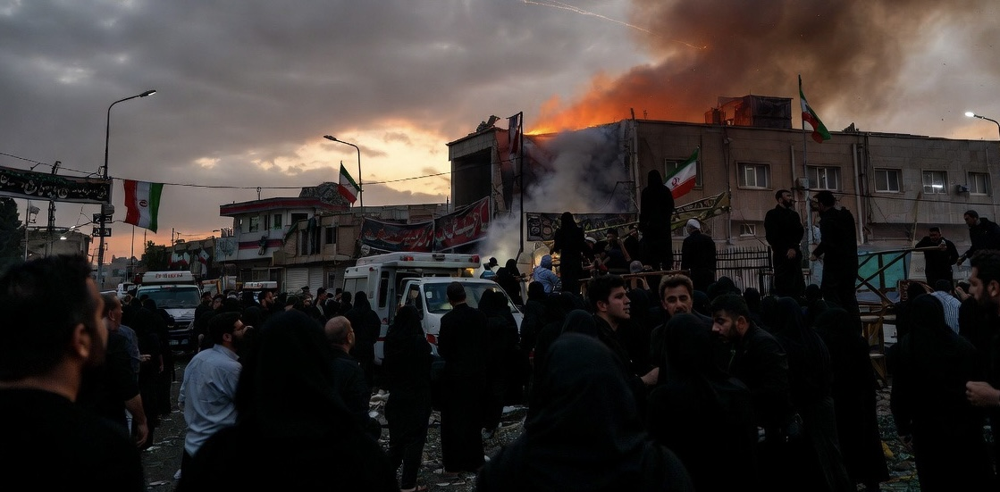

# Bom AS di Tengah Iran Berkabung: Mengapa Waktu Serangan Sama Pentingnya dengan Serangan Itu Sendiri?

*Ilustrasi (pic: Grok AI).*

  
***“Dalam perang modern, sasaran bukan hanya instalasi militer. Simbol, psikologi, dan momentum politik juga menjadi medan pertempuran.”***
  

Dalam hampir semua kebudayaan, masa berkabung nasional bukan sekadar ritual keagamaan. Ia adalah momen penyatuan identitas nasional, konsolidasi elite politik, dan pembentukan narasi tentang musuh.

Karena itu, tindakan militer yang terjadi pada periode tersebut hampir selalu memiliki dampak psikologis yang jauh melampaui kerusakan fisiknya.

Reuters dan AP melaporkan bahwa serangan AS dimulai ketika jutaan pelayat masih mengikuti rangkaian pemakaman nasional.

## Mengapa AS Tetap Menyerang?

Menurut penjelasan resmi pemerintah AS dan CENTCOM, serangan dilakukan sebagai balasan atas serangan Iran terhadap kapal-kapal dagang di Selat Hormuz yang dianggap melanggar gencatan senjata serta mengancam kebebasan navigasi internasional. 

Target yang diumumkan meliputi fasilitas pertahanan udara, lokasi peluncuran drone, dan aset militer lainnya.  

Artinya, dari perspektif Washington, waktu operasi ditentukan oleh pertimbangan keamanan dan respons militer, bukan oleh kalender berkabung Iran.

## Bagaimana Iran Melihatnya?

Dari perspektif Tehran, narasinya sangat berbeda.

Serangan yang berlangsung ketika jutaan warga masih berduka mudah dipersepsikan sebagai penghinaan terhadap martabat nasional, pelanggaran terhadap semangat deeskalasi, sekaligus bukti bahwa AS tidak menghormati momen kemanusiaan.

Dalam politik, persepsi publik sering kali sama kuatnya dengan fakta operasional. Karena itu, waktu serangan dapat menjadi alat mobilisasi opini domestik.

## Dimensi Psikologi Strategis

Dalam studi strategi modern dikenal gagasan bahwa timing is a weapon. Waktu pelaksanaan operasi dapat digunakan untuk mengejutkan lawan, mengganggu proses konsolidasi, atau mengirim pesan bahwa kemampuan militer tetap berjalan tanpa dipengaruhi momentum politik lawan.

Sebaliknya, pihak yang diserang dapat memanfaatkan waktu tersebut untuk memperkuat narasi bahwa negaranya sedang menjadi korban agresi.

Akibatnya, kedua pihak sama-sama memperoleh keuntungan naratif bagi audiensnya masing-masing.

## Dampak terhadap Diplomasi

Yang paling rentan justru bukan hanya hubungan AS-Iran. Melainkan kepercayaan terhadap proses diplomasi.

Ketika serangan terjadi di tengah masa berkabung, negosiasi menjadi semakin sulit karena tekanan opini publik meningkat, ruang kompromi elite politik menyempit, dan setiap konsesi berpotensi dianggap sebagai bentuk kelemahan.

Dalam konflik berkepanjangan, simbol sering kali lebih sulit dipulihkan daripada bangunan yang rusak.

Peristiwa ini menunjukkan satu kenyataan yang keras. Bahwa dalam teori hubungan internasional, perang tidak pernah berhenti hanya karena lawan sedang berduka.

Tetapi dalam diplomasi, memilih waktu juga merupakan sebuah pesan. Jika serangan dilakukan ketika lawan sedang berkabung, pesan yang dapat terbaca adalah: “Kami tidak akan membiarkan momentum emosional mengubah kalkulasi strategis kami.”

Sebaliknya, bagi masyarakat yang sedang berduka, pesan yang tertangkap bisa menjadi:“Bahkan saat kami menguburkan pemimpin kami, perang masih mengetuk pintu.”

Dua pesan itu lahir dari tindakan yang sama, tetapi dibaca dengan makna yang sangat berbeda.

Serangan pada masa berkabung nasional tidak otomatis mengubah legalitas suatu operasi militer menurut hukum internasional. 

Namun dari sudut komunikasi strategis dan psikologi politik, momen tersebut hampir pasti memperdalam luka kolektif, memperkuat narasi permusuhan, dan menyulitkan upaya membangun kembali kepercayaan.

Dalam konflik modern, yang dikenang masyarakat sering kali bukan hanya siapa yang menyerang, tetapi kapan serangan itu dilakukan.

  
**Referensi**

Reuters. (2026, July 8). US launches new strikes on Iran after reinstating oil sanctions over shipping attacks.  

Associated Press. (2026, July 8). Tehran targets Bahrain and Kuwait after US strikes.  

The Utility of Force. (2005). Penguin.

On War. (1832/1976 ed.). Princeton University Press.
