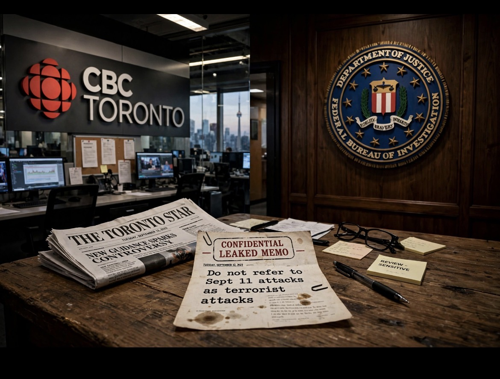

# CBC, 9/11, & Politik Kata: Siapa yang Berhak Menyebut “Teroris”?

*Ilustrasi (pic: Meta AI).*
  
***Kalau sebuah lembaga keamanan sampai ikut mengguncang meja karena media memilih satu kata, berarti kita sudah tidak sedang membahas kamus lagi. Kita sedang membahas kekuasaan***
  

Ini bukan kebijakan yang tiba-tiba lahir karena CBC “tidak tahu apa itu terorisme”. Editor-in-chief CBC Brodie Fenlon sebelumnya menjelaskan bahwa CBC tidak secara independen menetapkan kelompok tertentu sebagai teroris atau aksi tertentu sebagai terorisme, karena kata tersebut dianggap sarat makna politik, hukum, dan emosional.

Prinsipnya, report the act, attribute the label. Misalnya: “Pemerintah Kanada menyebut X sebagai organisasi teroris.” atau: “Polisi menggambarkan serangan itu sebagai aksi terorisme.” Bukan: “X adalah kelompok teroris.”

CBC mengatakan pendekatan ini sudah lama digunakan dan serupa dengan praktik BBC, AP, AFP, dan Reuters. 

Dan secara teori jurnalistik, ini bukan kebodohan, justru ada argumentasi epistemologis yang cukup kuat, bahwa “Teroris” bukan hanya deskripsi tindakan. Ia juga merupakan klasifikasi politik dan hukum.

Contohnya: “Seseorang menembak 20 orang.” adalah deskripsi empiris. Bandingkan dengan “Seseorang melakukan tindakan terorisme.” sudah memasukkan klasifikasi terhadap motif, tujuan, konteks, dan kerangka hukum.

Karena itu, atribusi bisa menjadi mekanisme untuk memisahkan fakta, interpretasi, serta klasifikasi. Dan ini bagus, tapi masalahnya muncul ketika prinsip tersebut diterapkan secara terlalu mekanis.

## Semua Label Diatribusikan, Bahasa Jurnalistik Bisa Menjadi Aneh?

Nah, di sinilah kasus 9/11 menjadi ujian ekstrem. Memo CBC yang bocor mengatakan: “Do not refer to the Sept. 11 attacks as terrorist attacks.”

Sebagai gantinya, pedoman tersebut menjelaskan peristiwa itu sebagai pembajakan pesawat yang kemudian menyebabkan pesawat jatuh di Washington, Pennsylvania dan Manhattan, serta penghancuran World Trade Center. 

Secara faktual kalimat itu benar. Tetapi secara komunikatif ia kehilangan satu informasi penting: mengapa pesawat tersebut dibajak dan digunakan untuk membunuh manusia secara massal?

Kalau wartawan mengatakan: “19 orang membajak empat pesawat dan menabrakkannya ke sasaran.”
pembaca memperoleh fakta.

Tetapi jika: “19 anggota al-Qaeda melakukan serangan teroris 9/11.” akan memberikan klasifikasi historis yang sudah didukung oleh investigasi, dokumentasi, pengadilan, dan konsensus institusional yang sangat luas.

Jadi ada perbedaan antara “Jangan buru-buru memberi label.” dan “Jangan pernah memberikan label meskipun bukti historisnya sudah sangat kuat.”

Yang pertama adalah kehati-hatian jurnalistik. Yang kedua bisa berubah menjadi fetisisme atribusi. Alias: “Maaf, pembaca, saya tidak bisa bilang api itu panas sebelum ada ahli yang mengatakan api itu panas.”

## Bagaimana Tentang Gaza ?

Kalau “terrorism” dianggap terlalu loaded sehingga harus diatribusikan, mengapa istilah itu sering muncul dengan cara berbeda ketika pelakunya adalah kelompok non-negara dibanding ketika kekerasan dilakukan negara?

Ini adalah persoalan symmetry of description. Misalnya secara hipotetis ada dua peristiwa:

Peristiwa A
Kelompok bersenjata menyerang pasar dan membunuh 50 warga sipil.

Media menulis: “A terrorist attack killed 50 civilians.”

Peristiwa B
Militer negara menyerang kawasan sipil dan membunuh 50 warga.

Media menulis: “An airstrike killed 50 civilians.”

Pertanyaan jurnalistiknya: Apakah perbedaan terminologi tersebut semata-mata karena perbedaan status hukum pelaku? Atau karena negara memiliki legitimasi institusional yang membuat kekerasan negara lebih sering dideskripsikan sebagai operasi militer, sementara kekerasan non-negara lebih cepat diberi label terorisme?

Nah! Ini pertanyaan yang sah. Tetapi jawabannya tidak boleh langsung: “Berarti media membela Israel.” Itu terlalu cepat. Yang harus kita periksa adalah aturan terminologinya diterapkan secara konsisten atau tidak.

Dan justru di sinilah kebijakan CBC menarik. Kalau prinsipnya memang CBC tidak menentukan sendiri siapa teroris, maka prinsip tersebut seharusnya berlaku kepada semua aktor, termasuk: Hamas, ISIS, al-Qaeda, kelompok ekstremis kanan, kelompok bersenjata lainnya, pemerintah, militer negara, dan aktor politik apa pun.

Konsistensi proseduralnya justru lebih penting daripada siapa yang sedang diberitakan.

## Terrorism: Istilah Hukum yang Rumit

Ini sering dilupakan dalam perdebatan media. Tidak ada satu definisi universal yang sepenuhnya identik tentang terorisme dalam hukum internasional.

Negara berbeda memiliki definisi berbeda. Kanada memiliki rezim hukum sendiri, Amerika memiliki definisi sendiri, PBB memiliki berbagai instrumen sektoral mengenai terorisme. Dan istilah terrorism juga beroperasi dalam tiga lapisan:

1. Lapisan deskriptif

Tindakan kekerasan yang sengaja menargetkan atau mengintimidasi masyarakat sipil.

2. Lapisan hukum

Apakah tindakan tersebut memenuhi unsur tindak pidana tertentu menurut hukum nasional/internasional?

3. Lapisan politik

Siapa yang diberi legitimasi untuk menyebut siapa sebagai teroris?

Lapisan ketiga inilah yang membuat istilah itu sangat powerful. Begitu seseorang diberi label “terrorist”, konsekuensinya bukan sekadar bahasa.

Bisa muncul pembekuan aset, larangan pendanaan, pembatasan perjalanan, kriminalisasi dukungan, operasi kontra-terorisme, legitimasi penggunaan kekuatan, juga perubahan persepsi publik.

Jadi CBC tidak sepenuhnya ngawur ketika mengatakan istilah itu mempunyai konsekuensi politik dan hukum.

## Bahaya Lain: Authority Laundering

Kalau media selalu berkata: “Pemerintah X menyebut mereka teroris.” media tampaknya netral. 

Tetapi sebenarnya media bisa melakukan sesuatu yang disebut authority laundering, yakni media tidak mengambil tanggung jawab atas label tersebut, tetapi tetap menyebarkan label melalui otoritas yang dipilihnya.

Contoh: “AS menyebut kelompok X sebagai teroris.” secara teknis sangat aman, tapi pembaca tetap menerima asosiasi bahwa X adalah teroris.

Jadi atribusi bukan berarti bebas dari framing. Ia hanya memindahkan sumber legitimasi.

Karena itu jurnalistik yang bagus tidak berhenti pada: “Siapa yang menyebutnya teroris?” Tetapi juga bertanya: “Apa buktinya?” “Apa definisinya?” “Apakah negara lain menggunakan klasifikasi berbeda?” “Apa konsekuensi hukum label tersebut?”

Nah, itu baru jurnalistik yang bernapas. 

## Lalu datanglah Kash Patel dan Plot Twist-nya

Pada 27 Agustus, FBI Director Kash Patel menyerang pedoman CBC secara terbuka dan memperingatkan bahwa lembaga Kanada yang tidak menolaknya tidak akan lagi dianggap sebagai “friend” oleh FBI. 

CBC kemudian pada 28 Agustus 2026 mengubah pedoman tersebut dan mengatakan bahwa atribusi langsung tidak lagi diperlukan ketika menggambarkan peristiwa historis 9/11 sebagai terorisme. 

Untuk peristiwa baru yang bermotif politik atau ideologis, CBC mengatakan mereka tetap akan menggunakan atribusi kepada pejabat dan ahli. 

Lalu datang laporan yang lebih menarik, The New York Times, dikutip berbagai media pada 18 September, melaporkan bahwa Patel kemudian sementara menghentikan sebagian kerja sama FBI dengan RCMP, termasuk pembatalan pertemuan. 

Tidak semua kerja sama berhenti dan lembaga AS lainnya tetap melakukan pertukaran intelijen dengan Kanada.  Tetapi ada konflik informasi penting, RCMP sendiri mengatakan hubungan dengan mitra AS tetap kuat dan tidak mengonfirmasi penghentian kerja sama. 

Ada pula laporan bahwa penyelidikan internal RCMP tidak menemukan indikasi penghentian intelligence sharing antara kedua kepolisian. 

Jadi formulasi ilmiahnya harus ada laporan dari pejabat anonim yang dikutip NYT bahwa sebagian kerja sama FBI–RCMP dihentikan sementara. FBI belum mengonfirmasi secara publik, sementara RCMP menekankan hubungan tetap kuat dan tidak mengonfirmasi adanya penghentian intelligence sharing.

Nah, ini jauh lebih menarik daripada “FBI memaksa CBC.” Karena yang pertama adalah fakta yang sedang diperdebatkan; yang kedua adalah kesimpulan kausal yang belum terbukti.

## Ironi Politik

CBC adalah media publik yang secara editorial independen. Sedangkan RCMP adalah lembaga penegak hukum Kanada. Mereka bukan organisasi yang sama.

Jadi kalau sebuah lembaga penegak hukum asing menghentikan kerja sama dengan kepolisian Kanada karena media publik Kanada memakai pedoman terminologi tertentu, kita masuk ke pertanyaan institusional yang jauh lebih serius: Seberapa jauh pemerintah asing boleh memengaruhi lingkungan informasi negara sekutunya melalui hubungan keamanan?

Ini bukan lagi cuma soal kata terrorist. Ini soal media independence. Kalau pola itu menjadi normal: Media mengatakan X , pemerintah asing tidak suka m, kerja sama keamanan terancam, lalu media mengubah terminologi. Maka secara struktural terbentuk sebuah insentif: “Jangan membuat sekutu keamanan marah.”

Padahal fungsi media justru bukan menjaga kenyamanan lembaga keamanan. Dan ini penting sekali untuk media publik.

## Jangan Pula Romantisasi CBC

CBC tidak otomatis menjadi pahlawan kebebasan pers hanya karena punya pedoman yang sophisticated.

Pedoman awalnya memang menimbulkan persoalan sendiri. Bayangkan keluarga korban 9/11 membaca: “Jangan sebut serangan 9/11 sebagai terrorist attack.” Mereka sangat mungkin bertanya: “Lalu apa yang harus kami sebut? Kecelakaan pesawat?” Padahal CBC sendiri tidak pernah mengatakan 9/11 adalah kecelakaan.

Masalahnya justru terletak pada komunikasi kebijakan. CBC kemudian mengakui bahwa pedoman tersebut menimbulkan “confusion”, kekhawatiran, kemarahan, dan rasa terluka, lalu mengubahnya untuk menghilangkan hambatan terhadap kejelasan sejarah. 

Jadi CBC menerapkan prinsip atribusi yang secara epistemik masuk akal terlalu kaku pada sebuah peristiwa historis yang bukti dan klasifikasinya sudah sangat mapan, sehingga prinsip kehati-hatian berubah menjadi masalah kejelasan.

Kalau aturan kehati-hatian dipakai untuk semua pihak, ia menjadi prinsip jurnalistik. Tetapi jika  hanya dipakai pada kelompok tertentu, ia menjadi bias terminologis. Dan inilah sebenarnya jantung persoalannya.

CBC mengubah aturan pada 28 Agustus. Laporan tentang penghentian sementara sebagian kerja sama FBI–RCMP muncul kemudian dan mengaitkannya dengan kontroversi tersebut. 

Tetapi bukti publik yang tersedia belum cukup untuk menyatakan bahwa “FBI memaksa CBC mencabut aturan.” CBC sendiri mengatakan perubahan itu merupakan keputusan editorial independen. 

Namun ada ironi yang jauh lebih besar, sebuah kata yang dianggap terlalu politis untuk dipakai media tanpa atribusi akhirnya justru memicu pertarungan politik antara media, lembaga keamanan, dan negara.

Jadi kata “terrorist” ternyata bukan cuma kata. Ia adalah granat semantik, kalau dilempar sembarangan, bisa melukai jurnalistik. Kalau terlalu takut menyentuhnya, bisa membuat fakta sejarah kehilangan nama.

Dan kalau sebuah lembaga keamanan sampai ikut mengguncang meja karena media memilih satu kata, berarti kita sudah tidak sedang membahas kamus lagi. Kita sedang membahas kekuasaan. 

  
**Referensi utama**: Associated Press, CBC changes editorial policy on 9/11; Canadian Press, CBC criticized for policy…; CBC News, How and why CBC News will adjust its 9/11 language guidance; serta laporan The New York Times mengenai hubungan FBI–RCMP, yang dikutip oleh beberapa media pada 18 September 2026. 
